# Place and construct a symmetric free-base porphine

Search **porphyrin** in Templates and place **Porphine (21H,23H)** once. The
editable free base has equal bond lengths, four regular five-rings, 120° meso
corners and two opposite inward N–H labels. The
[construction guide](../porphine-core.md) explains its chemical identity and
own-coordinate geometry. Contribution: @Ameyanagi in [PR #287](https://github.com/Ameyanagi/ReShiki/pull/287), under review.

## Find and place the core

The declared stack base `2811703d` has no porphine template. The historical
`51fa0991` app likewise returns no result for the same `porphyrin` search. The
candidate returns one template. Both search captures use an empty drawing at
100%, with presentation/F8 off.

| Historical search before                                                                                                                                              | Candidate search after                                                                                                                                       |
| --------------------------------------------------------------------------------------------------------------------------------------------------------------------- | ------------------------------------------------------------------------------------------------------------------------------------------------------------ |
| [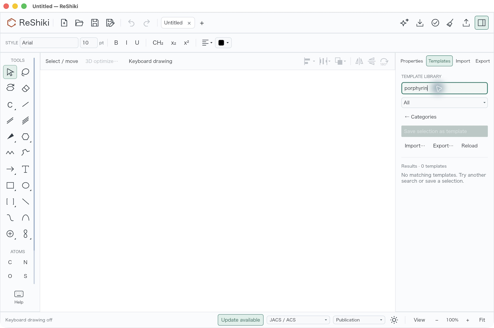](../images/porphine-core/template-search-before.jpg) | [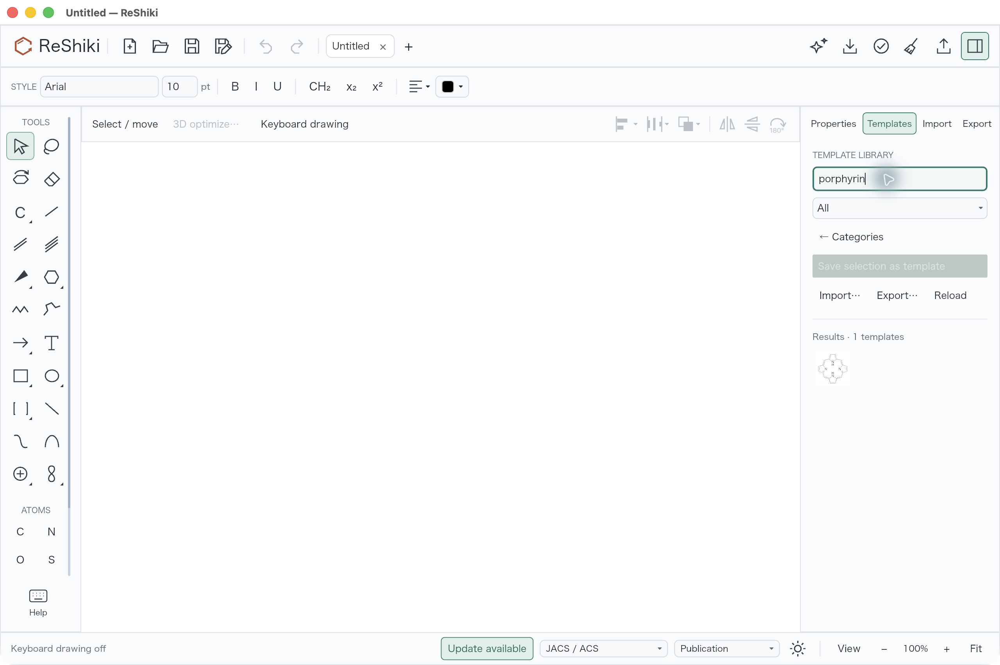](../images/porphine-core/template-search-after.jpg) |

Select the result and place it into a blank drawing. The actual
[placed native file](fixtures/porphine-core/porphine-placed-desktop.rsk) contains
24 atoms and 28 bonds, C20H14N4, two hydrogen-bond donors and two acceptors.
One Undo leaves the drawing empty; Redo restores every native field exactly.

[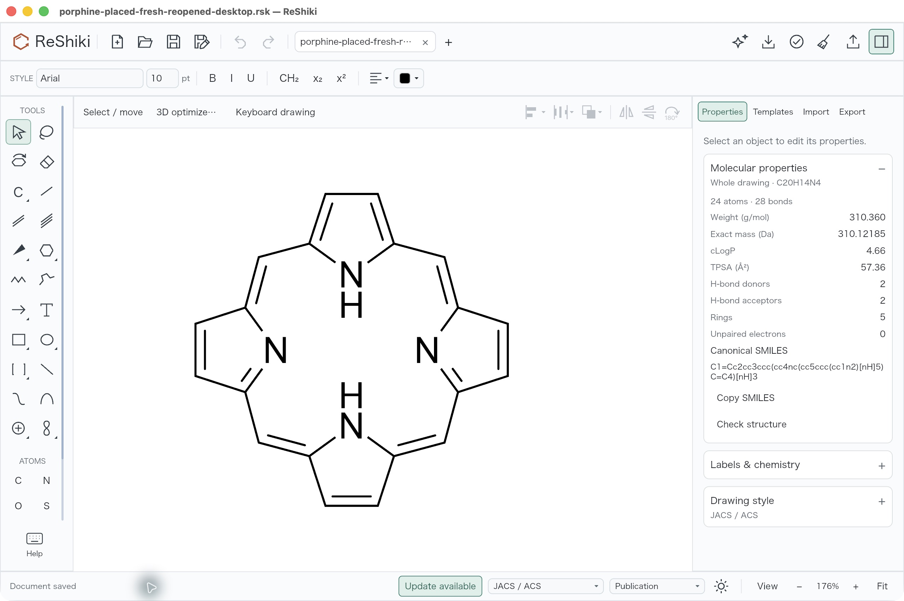](../images/porphine-core/placed-fresh-reopened.jpg)

The formula and chosen planar InChIKey `RKCAIXNGYQCCAL-CEVVSZFKSA-N` agree with
an independent JSON-to-V2000/RDKit oracle and the preserved application's CLI.
The unposed graph key `RKCAIXNGYQCCAL-UHFFFAOYSA-N` is separately recorded in the
catalog. Fourfold outline symmetry does not imply fourfold chemical symmetry
of the opposite N–H tautomer. [OPSIN's explicit name parsing](https://opsin.ch.cam.ac.uk/opsin/21H%2C23H-porphine.json)
and the [original ChemIDplus depositor record](https://pubchem.ncbi.nlm.nih.gov/substance/135024075)
are the identity references; standardized CID 66868 is not the exact-tautomer
reference for this drawing.

## Actual manual route from the supplied carbon seed

This desktop check starts from [source-seed.rsk](fixtures/porphine-core/source-seed.rsk),
a supplied carbon five-ring and meso arm. It does not measure construction from
an empty drawing or establish a speed advantage over the
[user's twelve-stage guide](https://note.com/budhalocyanine/n/n7fe04cbb8f4e).
The following are grouped operations, not a mouse/key count.

1. Select arm C4→C5 in **Reference: align / stretch**. Keep C4 fixed and set its
   length from 21.6 to 14.4 pt. Only C5 moves, along the original arbitrary axis.
2. Select all six atoms, reference C2→C3, and use **Pinned point** X=0/Y=0.
   Press **Horizontal**. The original edge is 17.30000061°; the
   [aligned save](fixtures/porphine-core/porphine-seed-aligned-desktop.rsk)
   has exactly the expected fixture coordinates. Carbon H caches hydrate when
   the drawing is checked; they are not chemical edits.
3. With the same pin, **Copy + rotate** 90° three times, using the newly selected
   copy each time. Actual saves contain 12 atoms/12 bonds after
   [one copy](fixtures/porphine-core/porphine-seed-copy-90-desktop.rsk) and
   [24/24 after three copies](fixtures/porphine-core/porphine-four-seeds-desktop.rsk).
   Every copied coordinate matches a quarter-turn sign swap about (0,0) exactly.
4. Draw four single closing links: 5–22, 26–28, 32–34, 38–1. The
   [closed carbon scaffold](fixtures/porphine-core/porphine-closed-carbon-scaffold-desktop.rsk)
   has 24 atoms/28 bonds with unchanged atom coordinates. Change inward atoms
   21, 27, 33 and 39 to N. Assign double bonds 1–2, 3–4, 23–24, 25–27,
   29–30, 31–32, 35–36, 34–39, 37–38, 5–22 and 26–28. The
   [manually constructed save](fixtures/porphine-core/porphine-manually-constructed-desktop.rsk)
   has the template's canonical SMILES and full InChIKey, with implicit N–H only
   at 21 and 33. All 28 core bonds remain 14.4 pt within f32 precision.
5. The supplied seed's lower N–H label inherits **Below**. Select N33 and set
   **Atom labels → Hydrogen position → Above**. The
   [inward-label save](fixtures/porphine-core/porphine-manually-constructed-inward-labels-desktop.rsk)
   differs only in that display field; geometry and chemistry are unchanged.

[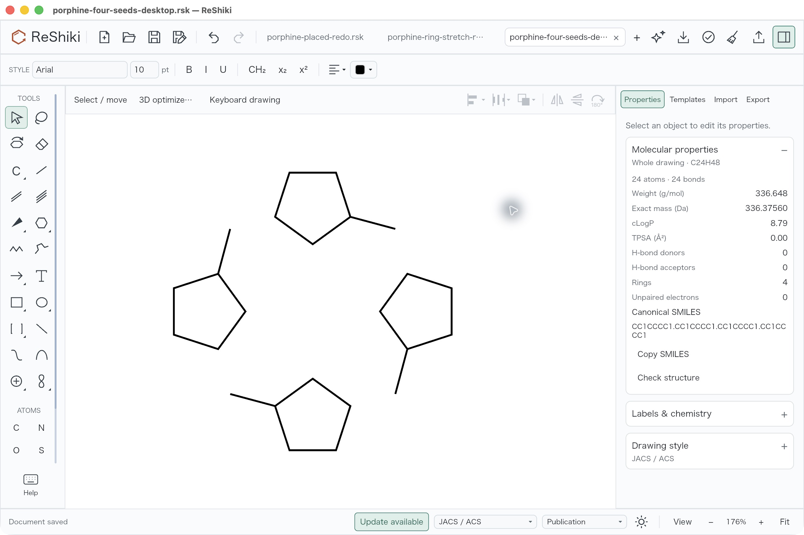](../images/porphine-core/four-rotated-seeds.jpg)

| Manual core with inherited lower label                                                                                                                                               | Lower label set inward                                                                                                                                                                                             |
| ------------------------------------------------------------------------------------------------------------------------------------------------------------------------------------ | ------------------------------------------------------------------------------------------------------------------------------------------------------------------------------------------------------------------ |
| [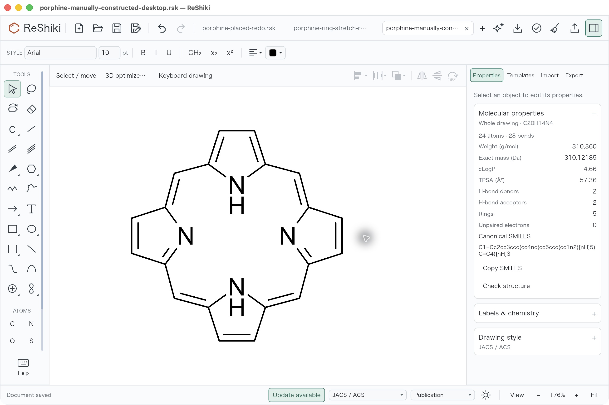](../images/porphine-core/manual-label-before.jpg) | [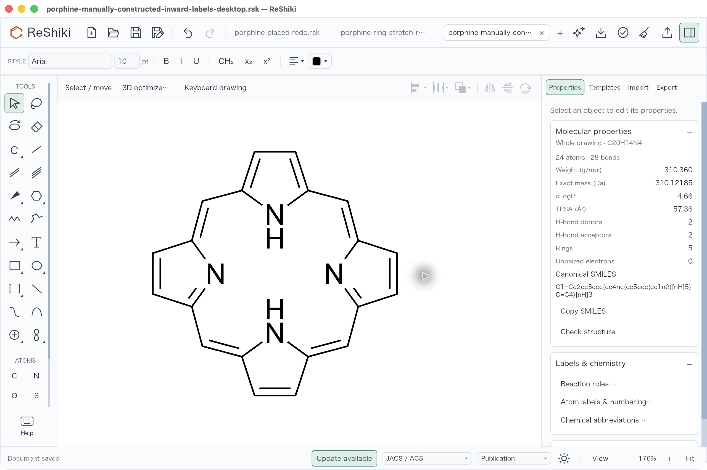](../images/porphine-core/manual-label-inward-after.jpg) |

Both manual label captures use 176%. Their inspector scroll positions differ;
this is a user-selected display adjustment within the candidate, not a baseline
bug comparison. These actual desktop operations supplement the
[renderer recipe](../../examples/porphine_core_qa.rs); fixture stages are not
five UI actions.

## Keep the macrocycle and phenyl ring rigid

Open [source-phenyl.rsk](fixtures/porphine-core/source-phenyl.rsk), an own one-meso-phenyl
example with 30 atoms/35 bonds and formula C26H18N4. Choose reference C5→C25,
**Connected fragment**, with reference start C5 fixed, then **Drag to stretch**.
The actual 152% desktop drag from screen (1250,750) to (1295,705) moved only
phenyl atoms 25–30 by approximately (+14.775924,−14.775924) drawing units.

| Before the candidate's drag                                                                                                                                                     | After the candidate's drag                                                                                                                                                                                          |
| ------------------------------------------------------------------------------------------------------------------------------------------------------------------------------- | ------------------------------------------------------------------------------------------------------------------------------------------------------------------------------------------------------------------- |
| [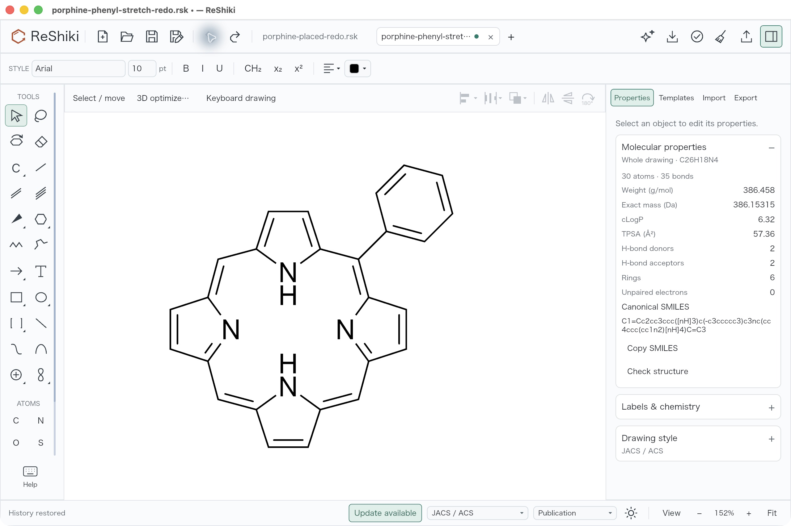](../images/porphine-core/phenyl-before.jpg) | [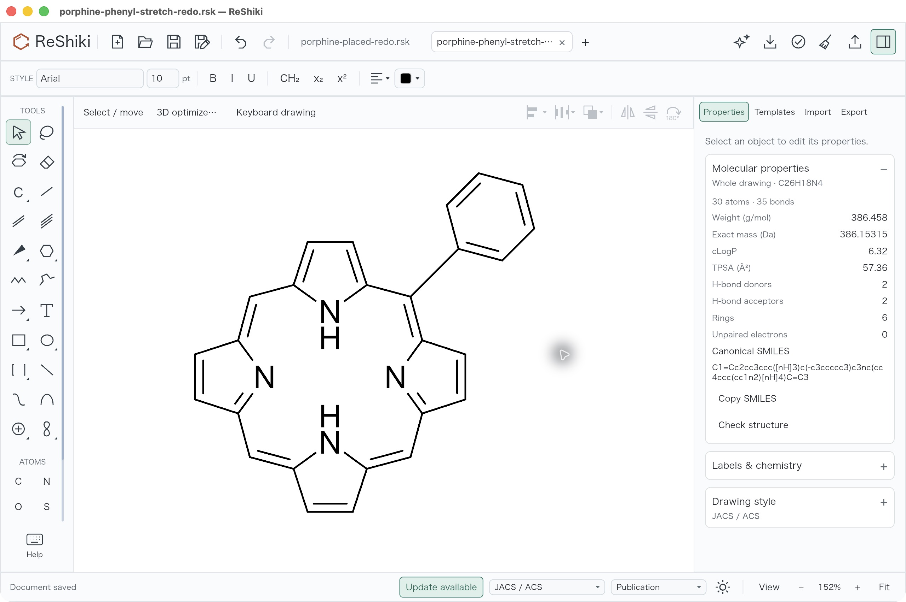](../images/porphine-core/phenyl-stretched-after.jpg) |

The [actual drag save](fixtures/porphine-core/porphine-phenyl-stretched-desktop.rsk)
has bridge length **21.56445045 pt**, distinct from the renderer's numeric
21.6 pt example. All 24 core atom fields and all bonds remain exact; the six
phenyl atoms translate rigidly within 0.000008 drawing unit. C26H18N4 and full
InChIKey `IIKNTCGCRNEFET-LQIRNWTPSA-N` persist through Undo/Redo and fresh reopen.
Both images use the same candidate at 152%; file names/status reflect history
checks rather than a different geometry.

| Bridge controls                                                                                                                                                                           | Ring-edge restriction                                                                                                                                                                                              |
| ----------------------------------------------------------------------------------------------------------------------------------------------------------------------------------------- | ------------------------------------------------------------------------------------------------------------------------------------------------------------------------------------------------------------------ |
| [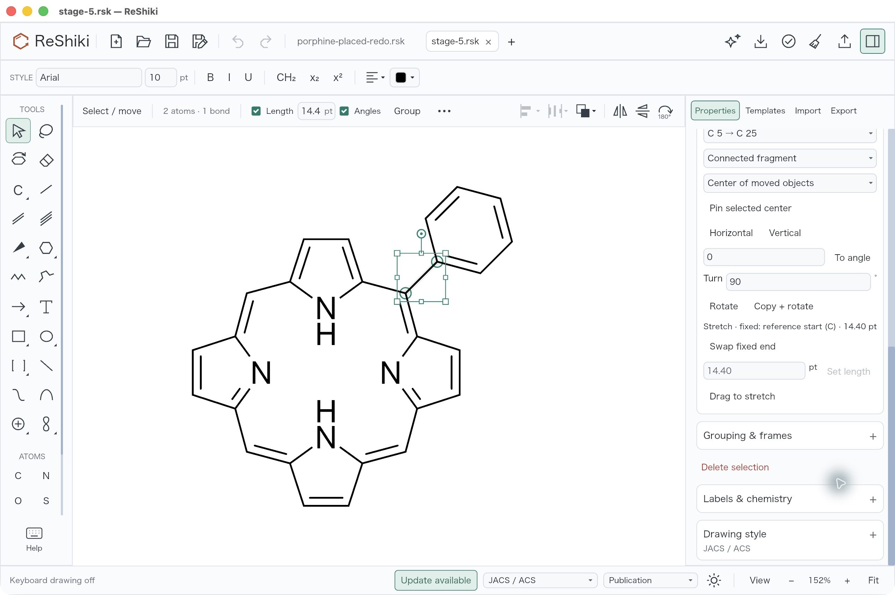](../images/porphine-core/phenyl-stretch-controls.jpg) | [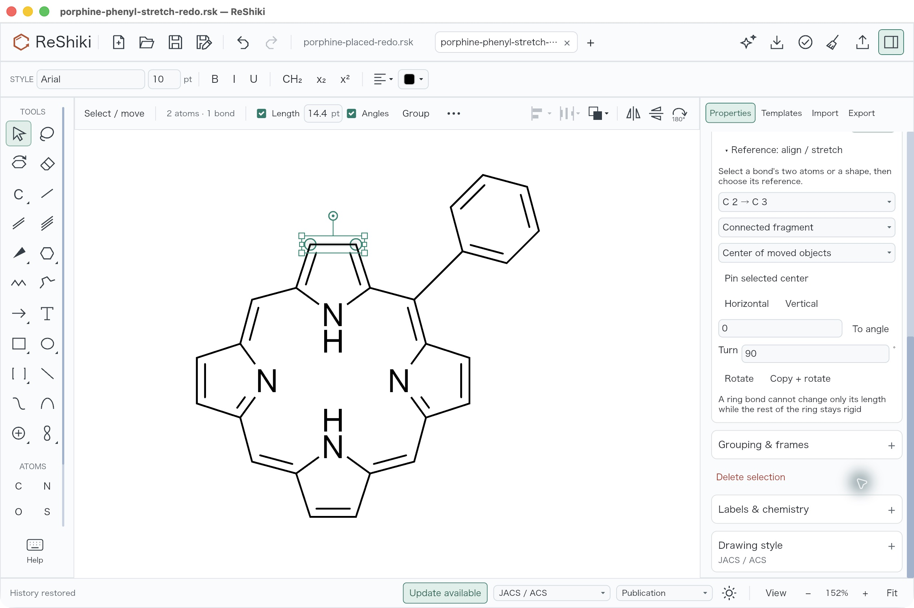](../images/porphine-core/ring-stretch-refused.jpg) |

Selecting ring C2→C3 exposes the restriction and no stretch action. The
[refusal save](fixtures/porphine-core/porphine-ring-stretch-refused-desktop.rsk)
is exactly equal to the preceding stretched drawing.

## Persistence, reference comparison and validation

A fresh process reopened the direct template, inward-label manual construction
and stretched phenyl saves. Every native field is equal to its original save;
Undo/Redo are disabled in the reopened windows. The direct and manual core use
176%, and the phenyl's fresh **Fit** uses 146%; Fit changes camera only.

| Manual construction after fresh reopen                                                                                                                                                                     | Stretched phenyl after fresh reopen                                                                                                                                                               |
| ---------------------------------------------------------------------------------------------------------------------------------------------------------------------------------------------------------- | ------------------------------------------------------------------------------------------------------------------------------------------------------------------------------------------------- |
| [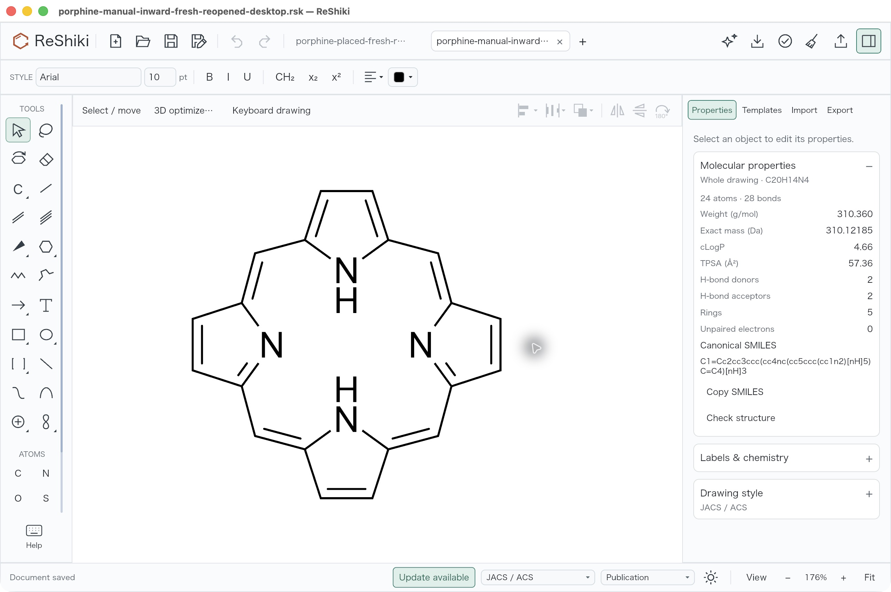](../images/porphine-core/manual-fresh-reopened.jpg) | [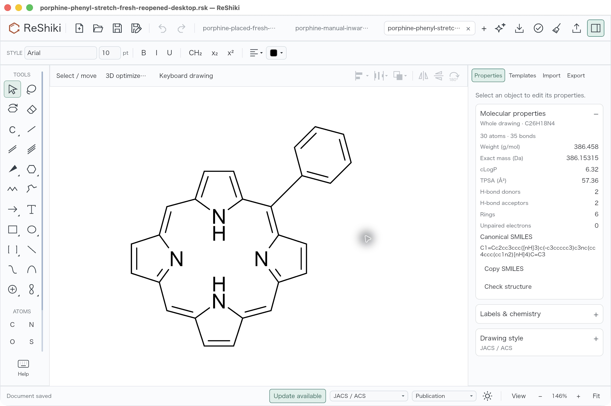](../images/porphine-core/phenyl-fresh-reopened.jpg) |

ChemDraw Prime 26's actual locked **Supramolecules** palette offered an
all-single-bond porphyrin-shaped scaffold with four inward N–H labels. Read-only
vendor-file graph inspection agrees with C20H36N4; this is different chemistry
from the chosen C20H14N4 free base. The installed official template help describes
orientation by dragging, but no such gesture or manual ChemDraw construction
was performed in this reference check. Vendor artwork, screenshots and
coordinates remain private and are not included in this contribution.

The [coordinate audit](fixtures/porphine-core/coordinate-checks.json) and
[standalone verifier](fixtures/porphine-core/verify_coordinates.py) use ordinary
JSON arithmetic with no application imports. The
[independent chemical receipts](fixtures/porphine-core/identity-oracles.json)
record RDKit and preserved signed-CLI agreement. The
[image/native provenance](../images/porphine-core/provenance.json) records exact
file hashes, the `3d58e6ca` source checkpoint and signed executable SHA256
`2bc9889b78d85970c23172b4e85b5ffafae3be969c1bdf53a4880b8925e4976d`.

All captures are unmodified native JPEGs on macOS 26.5.1 arm64, JACS/ACS
publication style, presentation/F8 off. Selection handles appear only in the
control examples. Public fixture tab counts, inspector scroll and status bars
vary. Source absence and chemical/geometry controls were retained before
implementation; later native comparisons used frozen apps. This docs/evidence
commit does not rebuild or change the preserved application.

Before desktop verification, focused core/valence/native and MOL/CDXML tests,
all nine template controls, icon inventory, model/engine/render construction,
workspace all-feature check, strict all-target/all-feature Clippy, formatting
and a fresh locked default build passed. Initial test-contract and example-label
cache corrections are retained in the build receipts; only final corrected
renderer figures were accepted. Full remote CI is pending publication.

The change supplies one chemically defined free-base template and demonstrates
editable construction and one meso attachment. Metal complexes, derivative
libraries, from-blank step counts and timing comparisons are not part of these
validated results.
