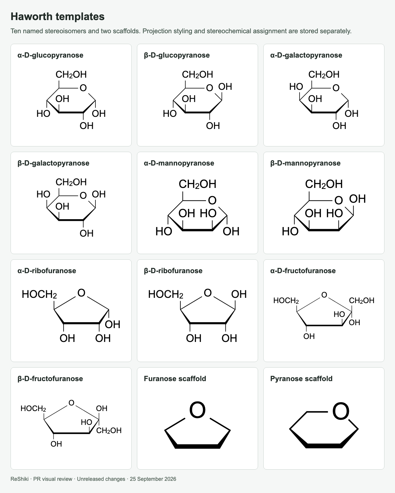
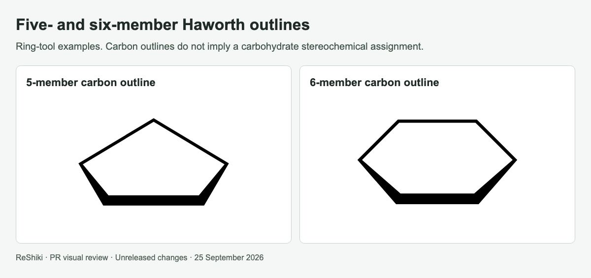

# Haworth projections

[PR #22](https://github.com/Ameyanagi/ReShiki/pull/22) · [All stacked changes](stack-22-30.md)

## Release-note caption

Draw Haworth projections using five- and six-member outlines and ten named carbohydrate stereoisomers.

## Evidence and limits

Feature examples from `c9b134b`. All 14 supplied drawings have editable-format regression fixtures. Projection appearance does not assign unspecified stereocenters. Native desktop verification and the bounded CDXML/CDX/MOL interchange checks are described in the PR.

## Images

### Haworth templates

### Five- and six-member Haworth outlines

## Reproduction

See [capture provenance and fixtures](visual-capture-provenance.md) for the source examples, comparison inputs, and capture method.
