# Drawing shortcuts and bond geometry

[PR #23](https://github.com/Ameyanagi/ReShiki/pull/23) · [All stacked changes](stack-22-30.md)

## Release-note caption

Use contextual atom, bond and ring shortcuts while preserving consistent attachment angles and bond junctions.

## Evidence and limits

The new-feature sheets cover each added contextual key and alias, including atom growth, ring attachment/fusion, bond styles and double-line placement. Selection transforms and Join have drawing examples; commands without drawing output have a reference sheet. Text inputs keep normal typing. The full local gallery contains 131 cases, with a further 27 focused bold-bond cases and optimized macOS keyboard checks.

Bold and triple comparisons use PR base `c9b134b` and head `e91bea9`. The angle, branch and sulfonyl defects were introduced and corrected within this PR: their before capture is the initial implementation `6da4783`, not the PR base. The examples show the output at this PR’s head; later label and circle-clearance refinements belong to subsequent PRs.

## Images

### Ring attachment follows the chain

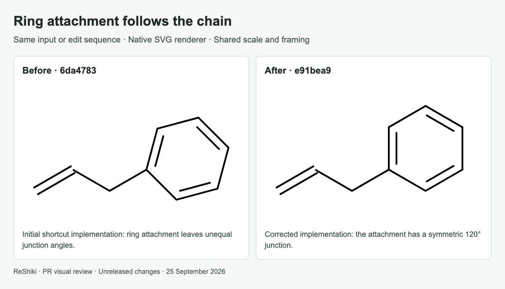

### Bold double-bond junctions

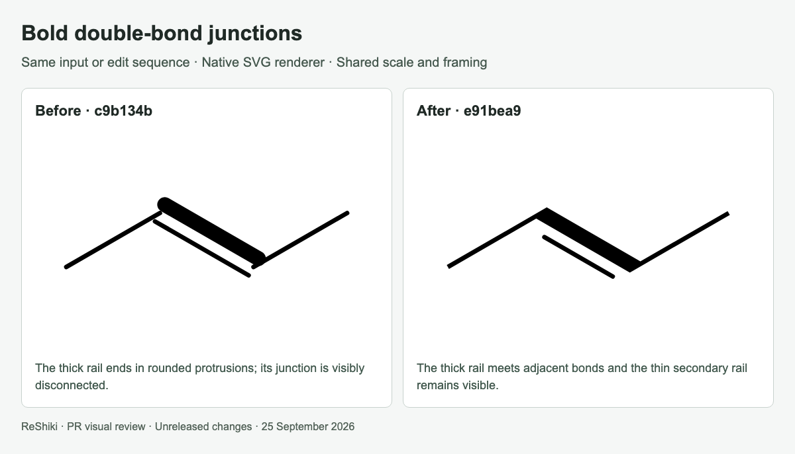

### Changing a chain bond to a triple bond

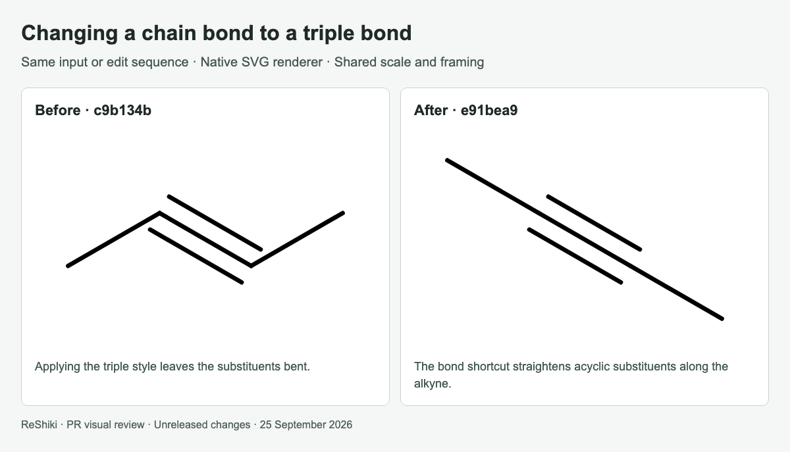

### Symmetric branch growth

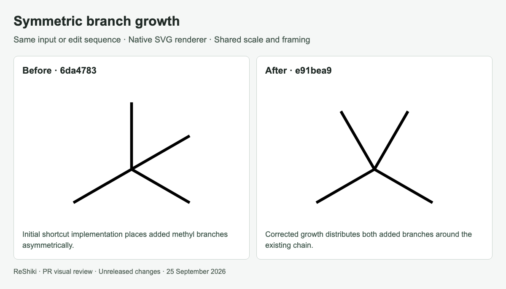

### Sulfonyl growth preserves the chain

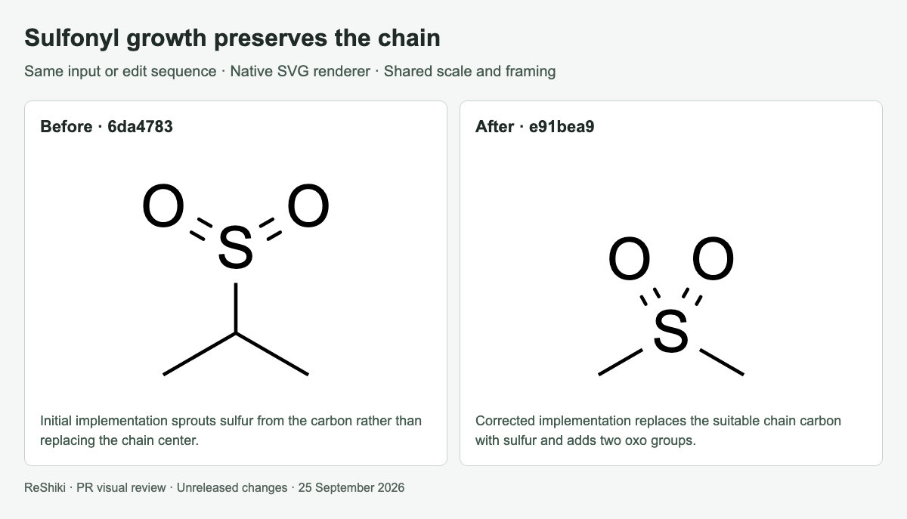

### Atom shortcuts

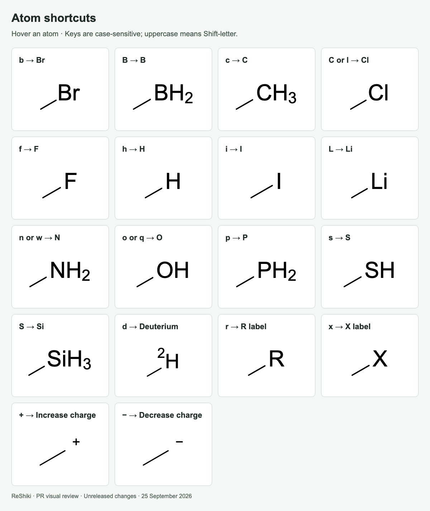

### Chemical group shortcuts

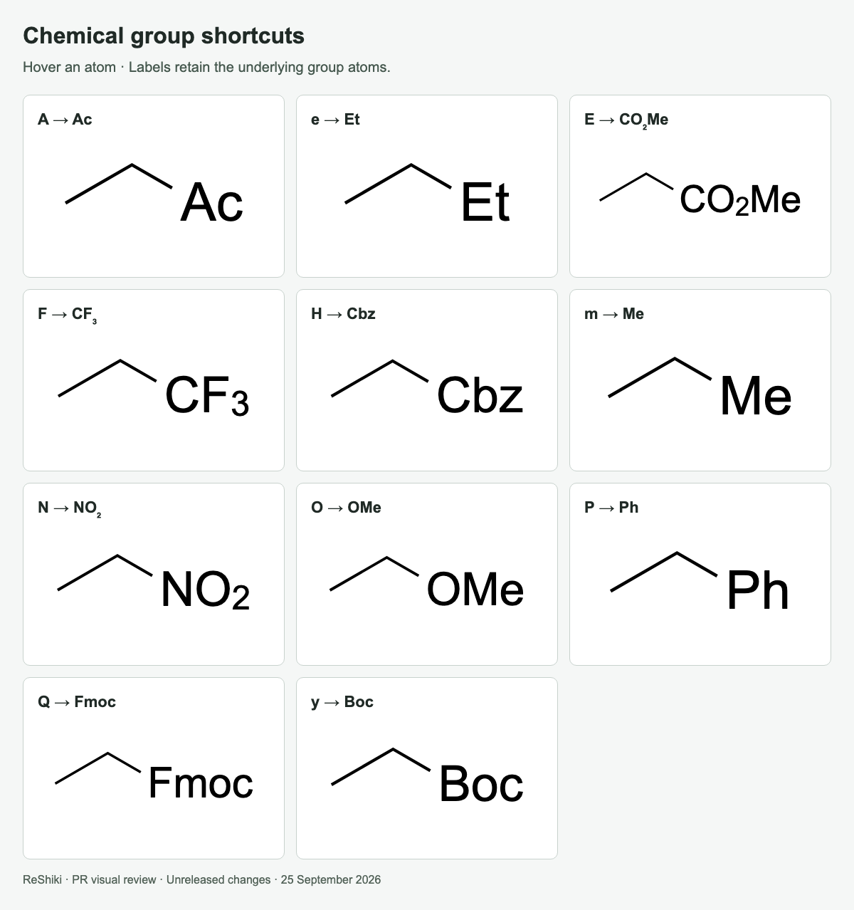

### Growth shortcuts · 1

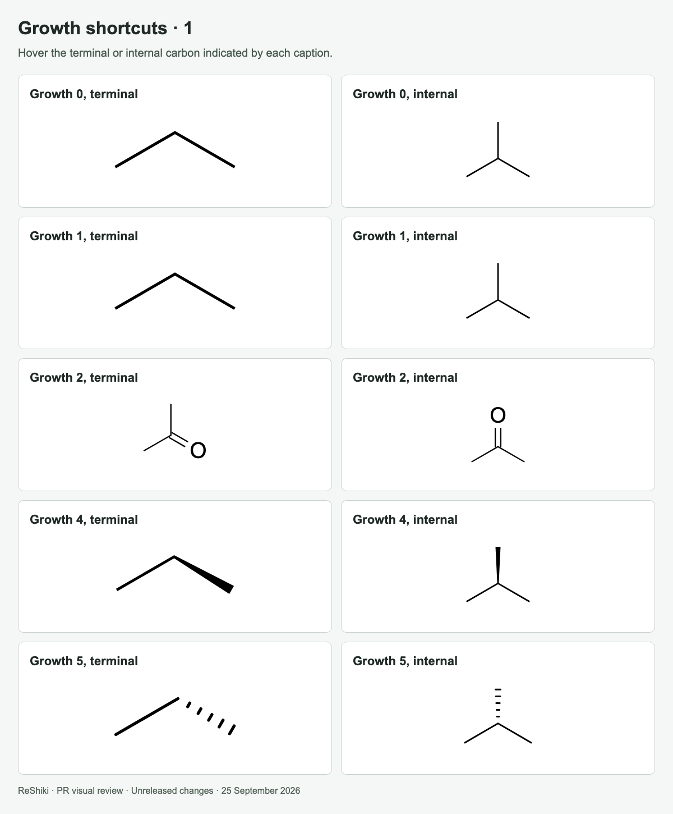

### Growth shortcuts · 2

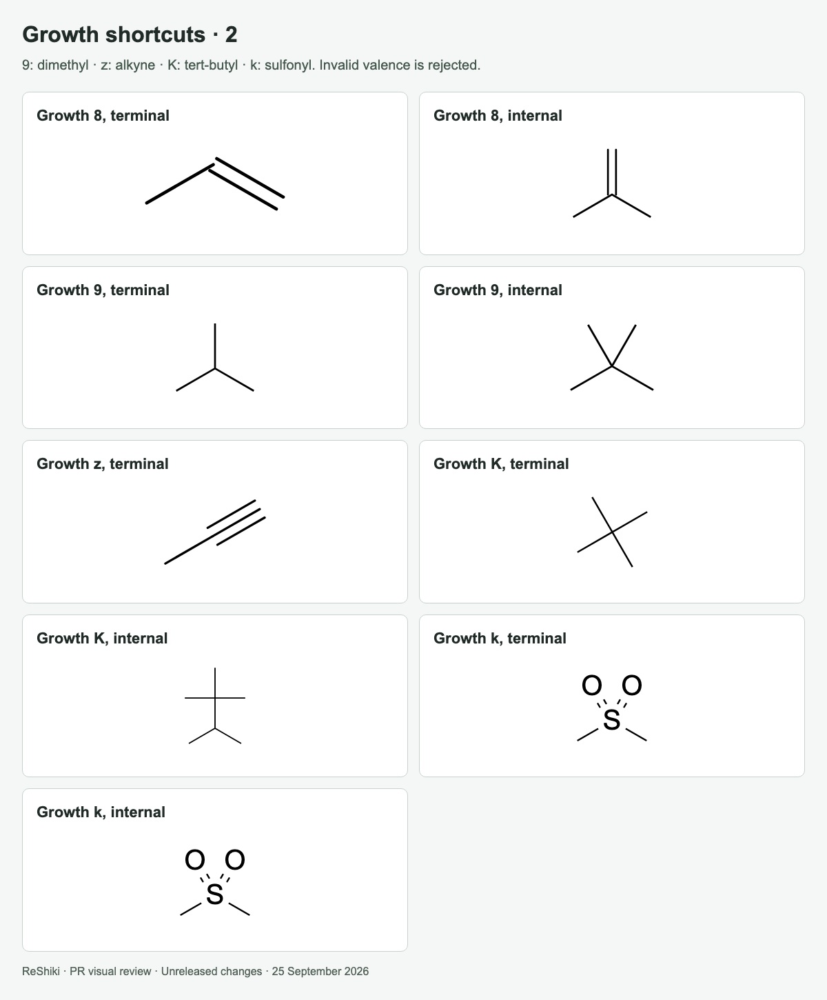

### Attach a ring at an atom

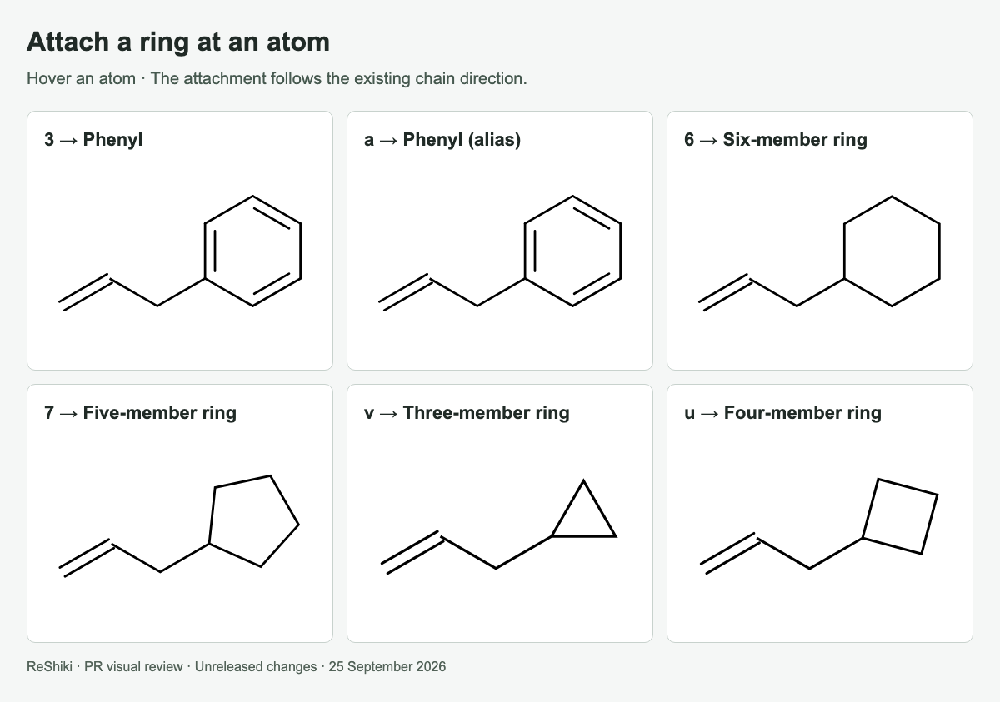

### Fuse a ring at a bond

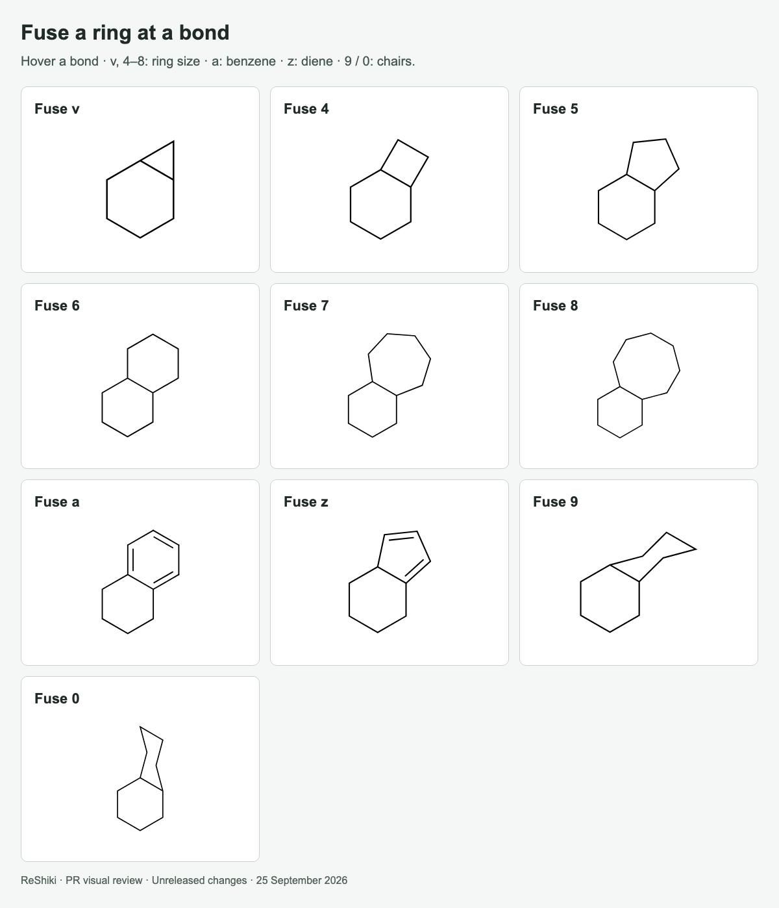

### Bond shortcuts

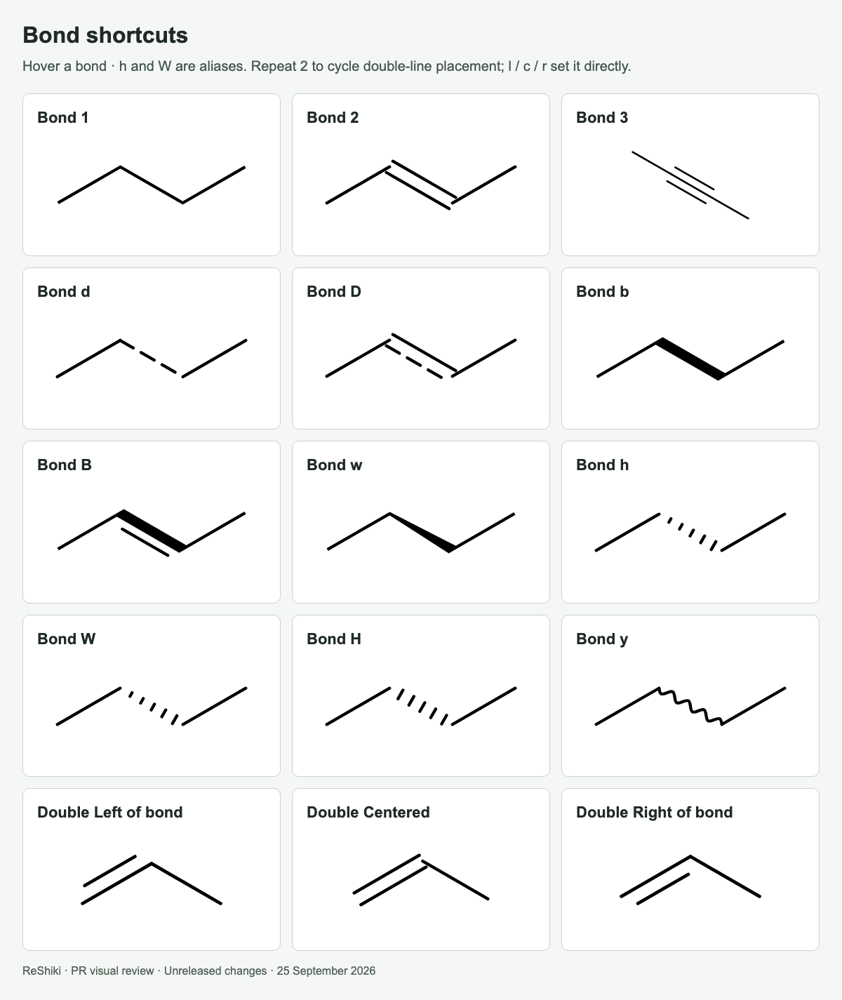

### Selection transforms, joining and labels

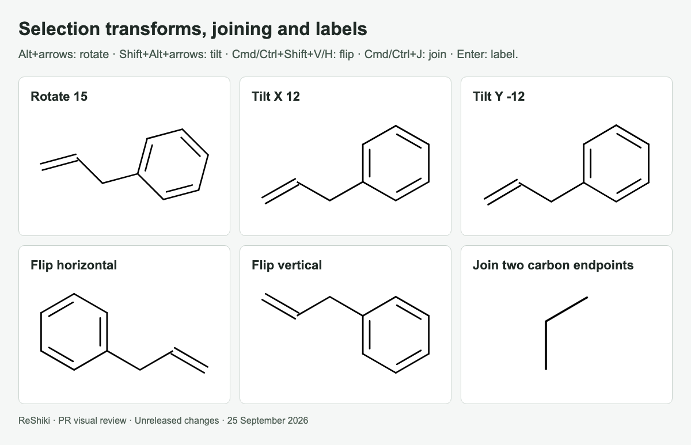

### Additional command shortcuts

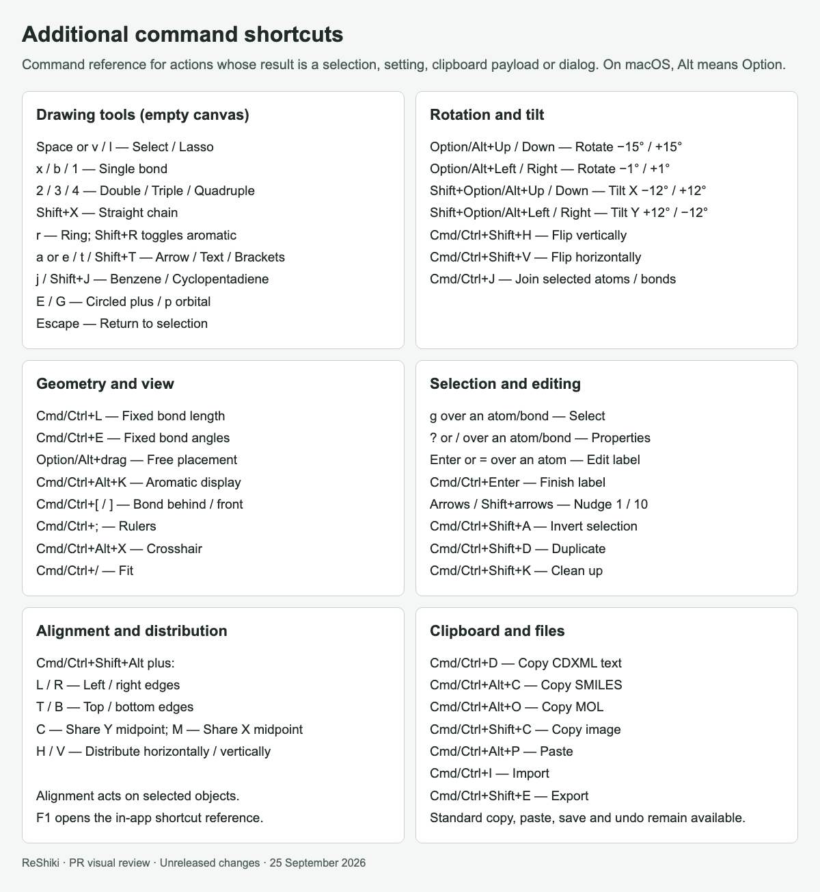

## Reproduction

See [capture provenance and fixtures](visual-capture-provenance.md) for the source examples, comparison inputs, and capture method.
