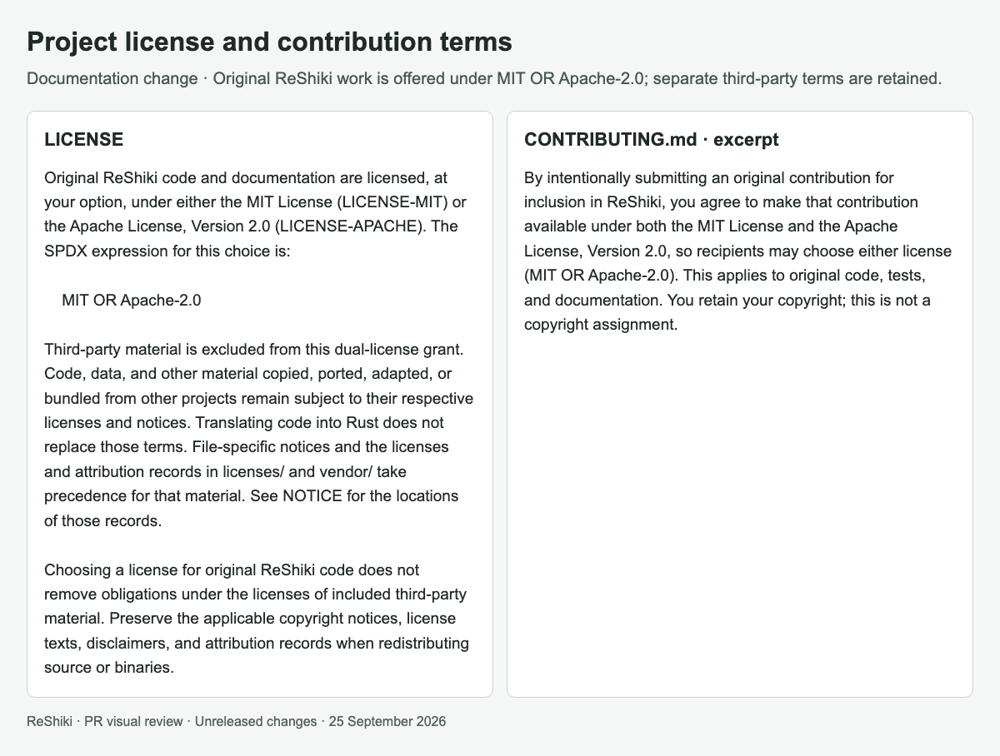

# Project and contribution licenses

[PR #24](https://github.com/Ameyanagi/ReShiki/pull/24) · [All stacked changes](stack-22-30.md)

## Release-note caption

Offer original ReShiki code and documentation under MIT OR Apache-2.0 while retaining third-party terms.

## Evidence and limits

This is a licensing and packaging change with no drawing-output difference. The image contains actual project-document excerpts from `004eaee`; it is documentation evidence, not an application screenshot. The contribution agreement and license checks accompany the project license files. No existing third-party code is represented as newly dual-licensed.

## Images

### Project license and contribution terms

## Reproduction

See [capture provenance and fixtures](visual-capture-provenance.md) for the source examples, comparison inputs, and capture method.
