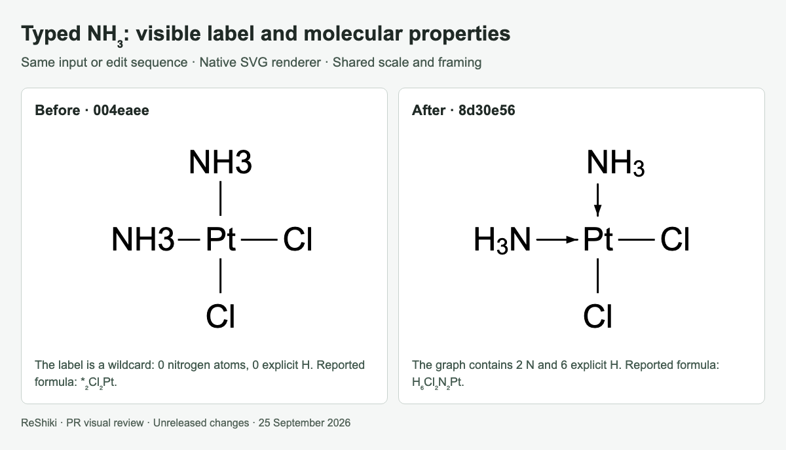
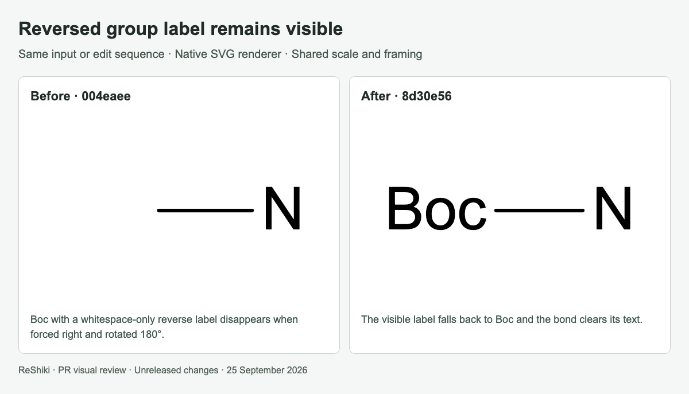
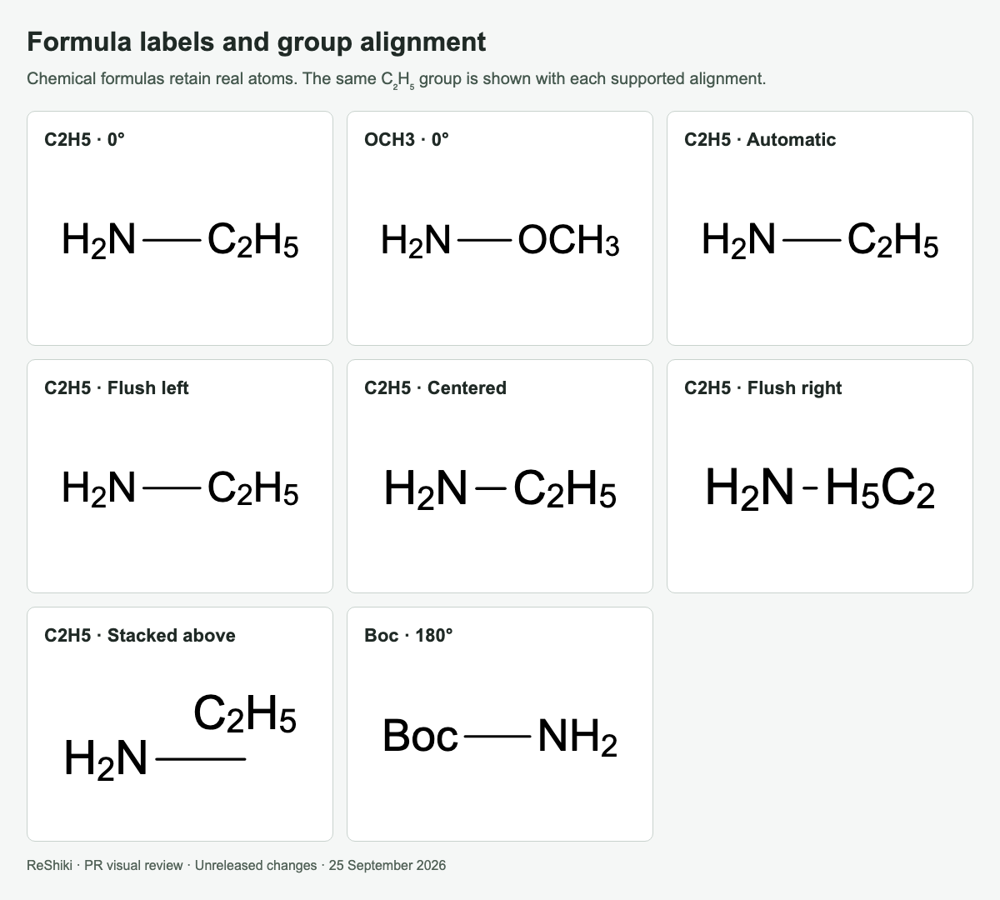
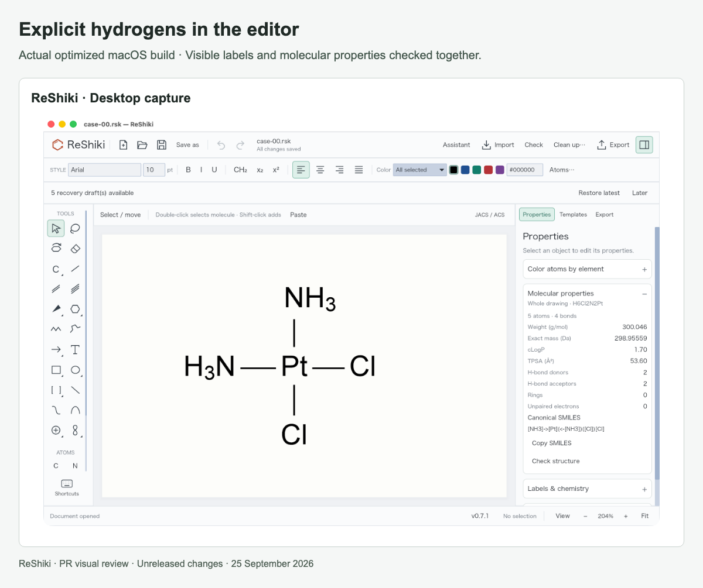

# Explicit hydrogens and chemical labels

[PR #25](https://github.com/Ameyanagi/ReShiki/pull/25) · [All stacked changes](stack-22-30.md)

## Release-note caption

Keep typed NH₃ as real nitrogen with explicit hydrogens, and preserve formula/group labels through alignment and rotation.

## Evidence and limits

The matched comparisons use base `004eaee` and head `8d30e56`. The NH₃ example runs analysis after typing both labels: the earlier parser stores wildcard labels and reports `*2Cl2Pt`; the new parser retains two N atoms and six explicit H and reports `H6Cl2N2Pt`. The new analysis also normalizes donor-to-metal coordination direction.

The disappearing-label fixture has a whitespace-only reverse label, forced right alignment and a 180° rotation. An empty reverse label already fell back correctly. Formula-label and alignment sheets show new supported entry behavior. Manual forced alignment can still crowd labels whose attachment positions are too close. Desktop checks cover editing, undo, group naming and molecular properties.

## Images

### Typed NH₃: visible label and molecular properties

### Reversed group label remains visible

### Formula labels and group alignment

### Explicit hydrogens in the editor

## Reproduction

See [capture provenance and fixtures](visual-capture-provenance.md) for the source examples, comparison inputs, and capture method.
