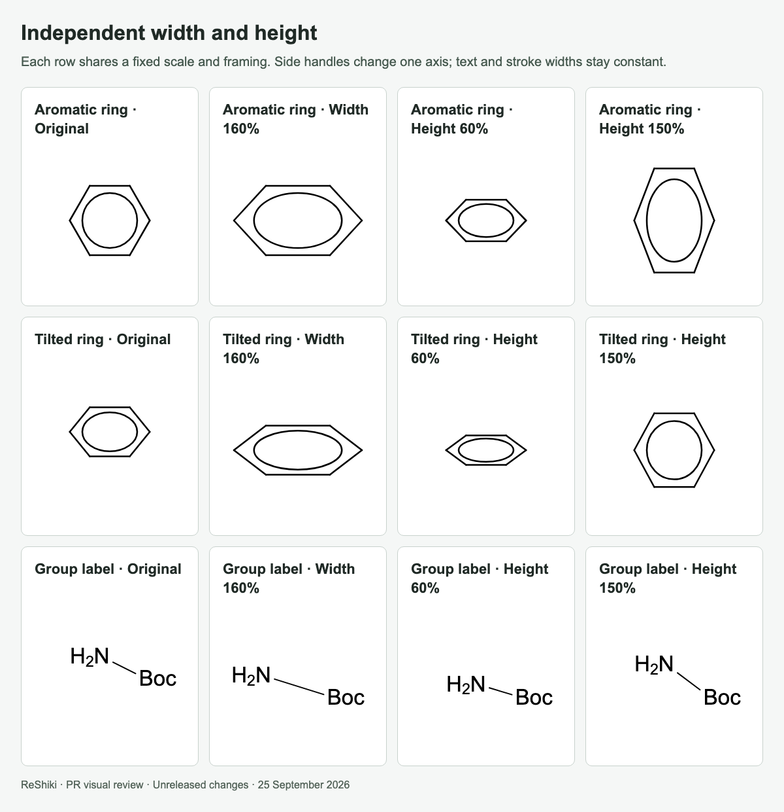
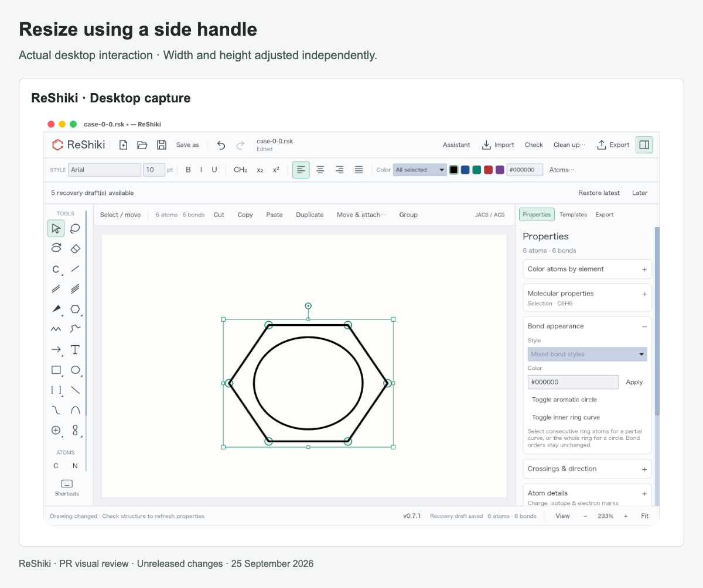

# Independent width and height

[PR #26](https://github.com/Ameyanagi/ReShiki/pull/26) · [All stacked changes](stack-22-30.md)

## Release-note caption

Resize a selected drawing horizontally or vertically using side handles while keeping text and stroke widths unchanged.

## Evidence and limits

New-feature examples from `75cac6d`. Each row uses one common SVG viewBox, so the apparent font and stroke sizes are directly comparable. Side-handle desktop checks verified fixed opposite edges and undo; corner handles retain proportional resize. Inner ring curves follow the affine transformation.

## Images

### Independent width and height

### Resize using a side handle

## Reproduction

See [capture provenance and fixtures](visual-capture-provenance.md) for the source examples, comparison inputs, and capture method.
