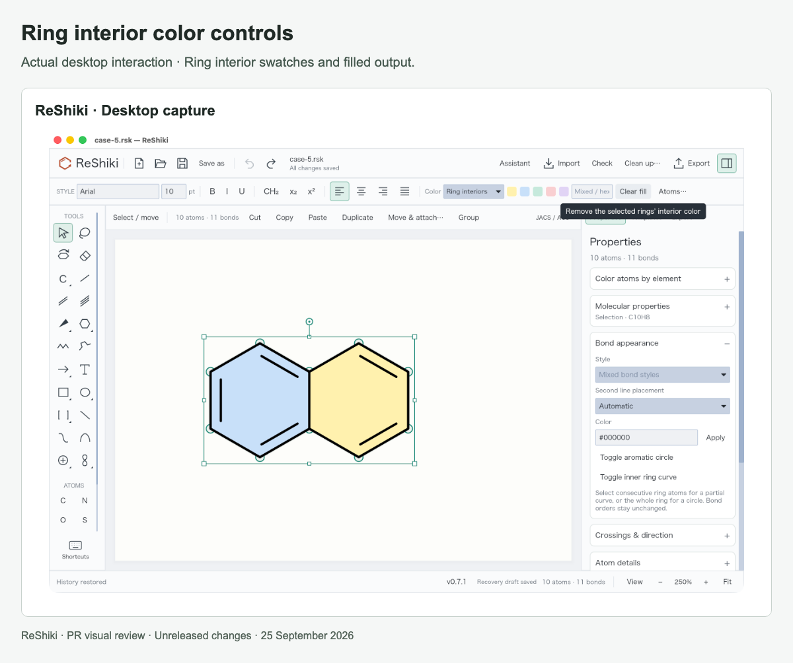

# Ring interior colors

[PR #27](https://github.com/Ameyanagi/ReShiki/pull/27) · [All stacked changes](stack-22-30.md)

## Release-note caption

Fill ring interiors with color and retain those fills through tilt, resize and supported exports.

## Evidence and limits

Feature examples from `22085e5`. The six cases include an aromatic ring, tilt, independent resize, a chair, glucose and fused rings. Desktop checks exercise Color → Ring interiors. Native and figure exports preserve the appearance; editable CDXML/CDX round trips retain the recognized ring-fill geometry. The fill does not change molecular composition.

## Images

### Ring interior colors

### Ring interior color controls

## Reproduction

See [capture provenance and fixtures](visual-capture-provenance.md) for the source examples, comparison inputs, and capture method.
