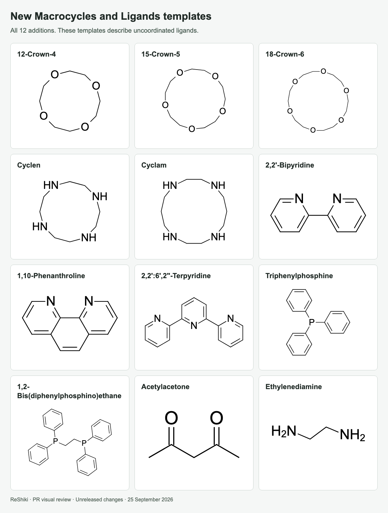
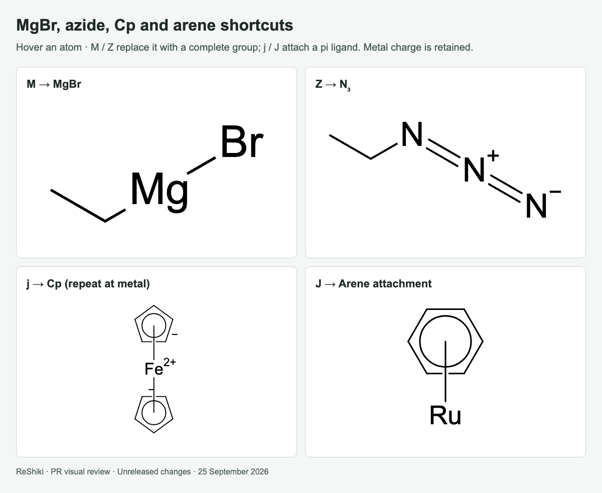
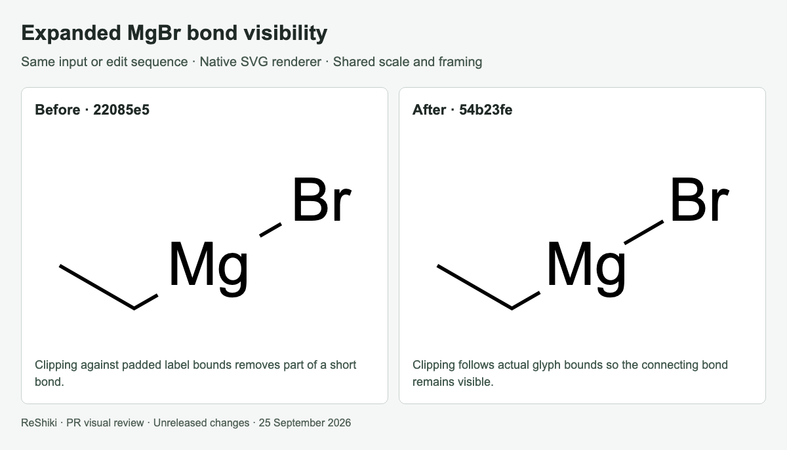
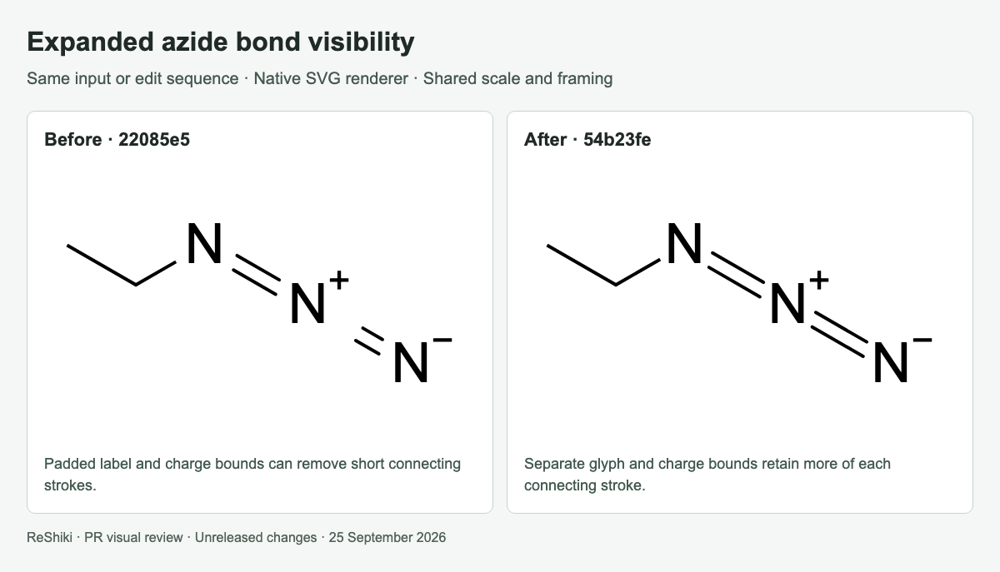
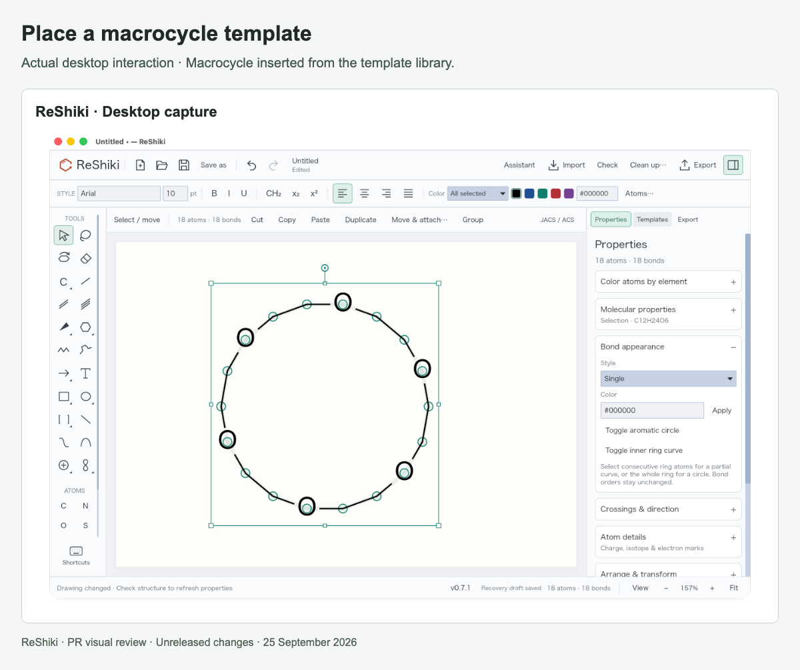

# Macrocycles, ligands and group shortcuts

[PR #28](https://github.com/Ameyanagi/ReShiki/pull/28) · [All stacked changes](stack-22-30.md)

## Release-note caption

Insert 12 new macrocycle/ligand templates and use M, Z, j and J for MgBr, azide, Cp and arene attachments.

## Evidence and limits

All 12 templates and all four added shortcuts are pictured. MgBr and azide are shown expanded to expose their atom graphs; their normal inserted labels can remain collapsed. Cp/arene contacts use attachment nodes and retain the metal’s charge. The template facts and sources are recorded in `assets/template-catalog.json`.

The bond-visibility comparisons render identical expanded-group inputs at base `22085e5` and head `54b23fe`: actual glyph/charge bounds preserve more of short connecting bonds. Native desktop checks cover template placement and each shortcut. Templates represent uncoordinated ligands; full coordination-valence validation remains limited. Circle-crossing clearance is handled separately in PR #29.

## Images

### New Macrocycles and Ligands templates

### MgBr, azide, Cp and arene shortcuts

### Expanded MgBr bond visibility

### Expanded azide bond visibility

### Place a macrocycle template

## Reproduction

See [capture provenance and fixtures](visual-capture-provenance.md) for the source examples, comparison inputs, and capture method.
