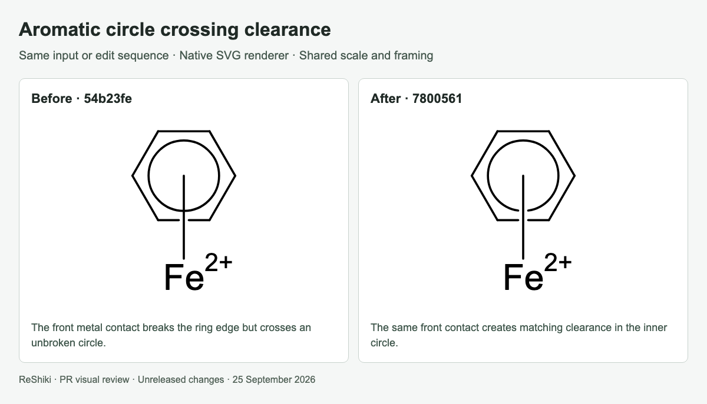
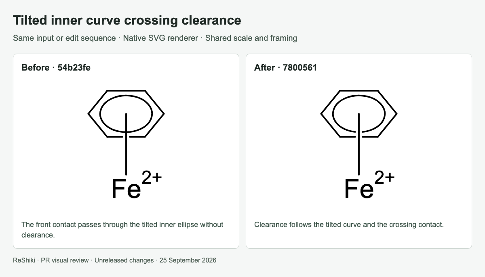
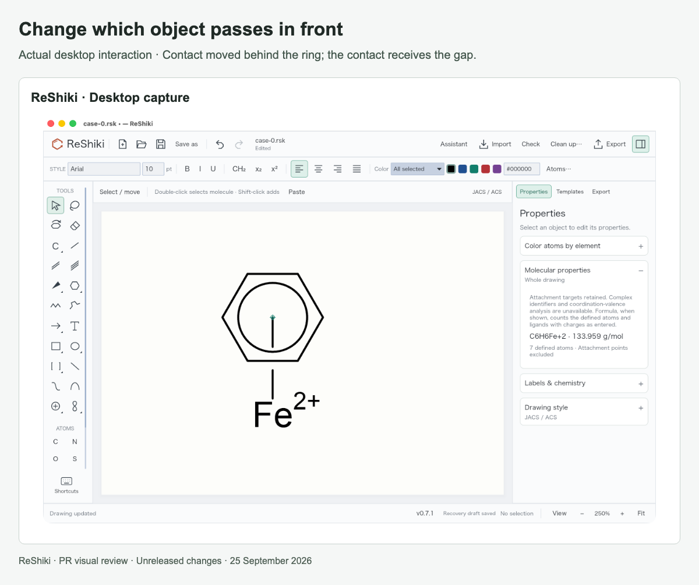

# Aromatic-circle crossing clearance

[PR #29](https://github.com/Ameyanagi/ReShiki/pull/29) · [All stacked changes](stack-22-30.md)

## Release-note caption

Give aromatic circles and tilted inner curves the same crossing clearance as ring bonds.

## Evidence and limits

Matched figure captures use base `54b23fe` and head `7800561` with identical drawings. The contact in front breaks the ring edge and inner curve consistently; moving it behind gives the gap to the contact instead. Tests also cover partial curves and transparent output. This changes editor/native/figure rendering; molecular CDXML/CDX circle writing is unchanged. The desktop capture uses the combined optimized stack, including the file-opening fix.

## Images

### Aromatic circle crossing clearance

### Tilted inner curve crossing clearance

### Change which object passes in front

## Reproduction

See [capture provenance and fixtures](visual-capture-provenance.md) for the source examples, comparison inputs, and capture method.
