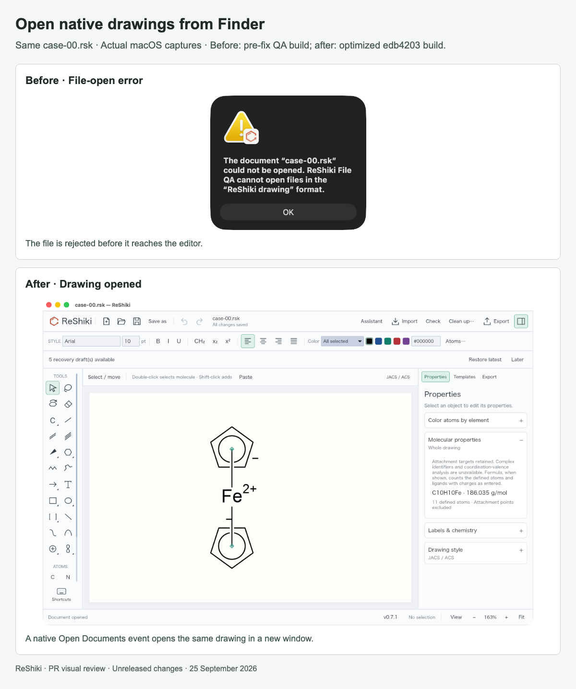

# Native drawing opening on macOS

[PR #30](https://github.com/Ameyanagi/ReShiki/pull/30) · [All stacked changes](stack-22-30.md)

## Release-note caption

Open native drawings from Finder and keep existing edited documents open in separate windows.

## Evidence and limits

Both screenshots use the same `case-00.rsk` via macOS document opening. Before is an actual pre-fix QA application with a native file-open alert; its exact commit was not recorded. After is the optimized `edb4203` build; PR head `16e456f` adds only the macOS idle-listener test correction. The error panel and full editor window are framed differently because the failure never displays the document.

Warm-open checks also retained an edited drawing while opening another file with spaces and Japanese characters. Descriptor, application-state and packaging tests cover malformed events, duplicate paths and native file metadata. No drawing-quality change is claimed by this file-opening comparison.

## Images

### Open native drawings from Finder

## Reproduction

See [capture provenance and fixtures](visual-capture-provenance.md) for the source examples, comparison inputs, and capture method.
