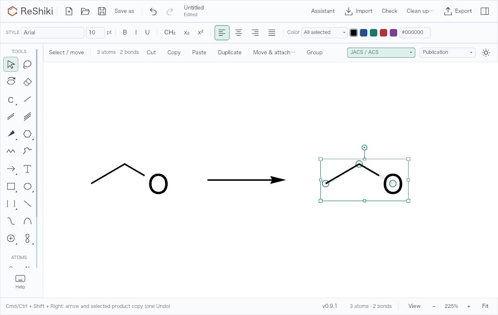
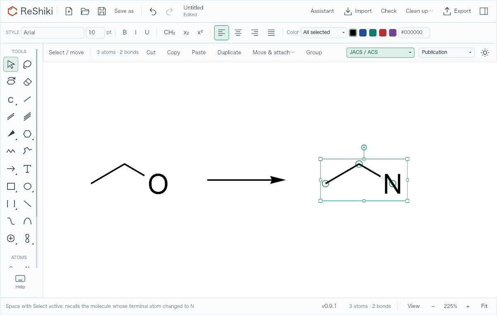

# Reaction and recent-molecule shortcuts

Part of [issue #61](https://github.com/Ameyanagi/ReShiki/issues/61). The canvas-position change is handled separately.

**Cmd/Ctrl+Shift+Right** adds a forward reaction arrow and duplicates the selected molecule on its right. The copy becomes the selection, ready for product edits or another reaction step. Partial atom or bond selections expand to complete chemical components. Molecular groups retain their captions and defined abbreviations; multiple selected components become separate reaction participants. Atom, bond, abbreviation, group and stereochemistry references are remapped by the existing document-copy operation. The original and copy have explicit reactant/product roles. Undo removes the arrow and copy together; Redo restores them.

The command needs a molecular selection without an existing arrow. It reports a nonmutating error if another molecule, caption, arrow or foreground graphic occupies the proposed destination; move that object or the source to make room. Graphics behind chemical structures do not block the command and remain unchanged. Repeated presses extend the scheme from each selected product copy. The shortcut uses Cmd on macOS and Ctrl on Windows/Linux; Shift is required, with no Alt/Option modifier or alternate letter key.

**Space**, with Select already active, selects the whole molecule affected by the latest molecular edit. It works after deselecting or clicking another object. Atom changes, bond changes, movement, abbreviation changes and ring fills count as edits; selection and caption edits do not. If one action changed several components, Space selects all components affected by that action rather than choosing one arbitrarily. A deleted molecule is not recalled. Undo and Redo restore the matching remembered edit, and loading another drawing clears the memory. With no remembered molecule, Space keeps the existing selection. It does not select unrelated captions or objects merely because they share a user-created group.

With another tool active, Space keeps its existing behavior of switching to Select; a second press recalls the molecule. Repeating Space with Select active leaves the selection unchanged. Shift+Space retains the existing tool-switch shortcut and does not recall a molecule. Focused text fields and open caption/atom-label drafts retain their normal typing and caret keys.

## Reproduce and validate

- Input: [editable starting molecule](fixtures/reaction-shortcuts-input.rsk). Open it, select an atom or double-click the molecule, and press **Cmd/Ctrl+Shift+Right**. [Resulting reaction drawing](fixtures/reaction-shortcuts-output.rsk) retains editable atoms and reaction data.
- Space example: on that product copy, change its terminal O to N; switch to Select, click empty canvas, then press **Space**. The whole product is selected.
- Base: `0ae0fb6a21c5e5c5b90ae66730458fda4ea2a20d` (`origin/main` at branch creation). Head: this PR's implementation. macOS ARM64, debug build, 1200 × 760 application renderer, PNG at 1×, Fit command with a 1080 × 560 canvas viewport (225% displayed zoom). Images are actual application renders; the status line labels each shortcut. No drawing retouching is applied.
- Regenerate both images and fixtures with `cargo test --bin reshiki molecule_shortcut_visual_evidence -- --ignored --nocapture`. This also exercises actual focused text-input widgets and verifies both key events are captured before global shortcut dispatch. Renderer evidence is distinct from a desktop interaction check.
- Focused regressions: `cargo test --bin reshiki molecule_shortcuts`. Coverage includes partial selections, multi-component groups, abbreviation references, reaction roles, destination collisions, native JSON round-trip, repeated reactions, one-step Undo/Redo, edit-context history, continuous gestures, invalid edits, file epochs, ordinary Space tool switching and text drafts.
- Desktop interaction review is pending the combined integration build; the images and widget checks above do not claim that review has completed.

Release caption: **Build reaction steps with Cmd/Ctrl+Shift+Right, and use Space in Select mode to return to the molecule you just edited.**
