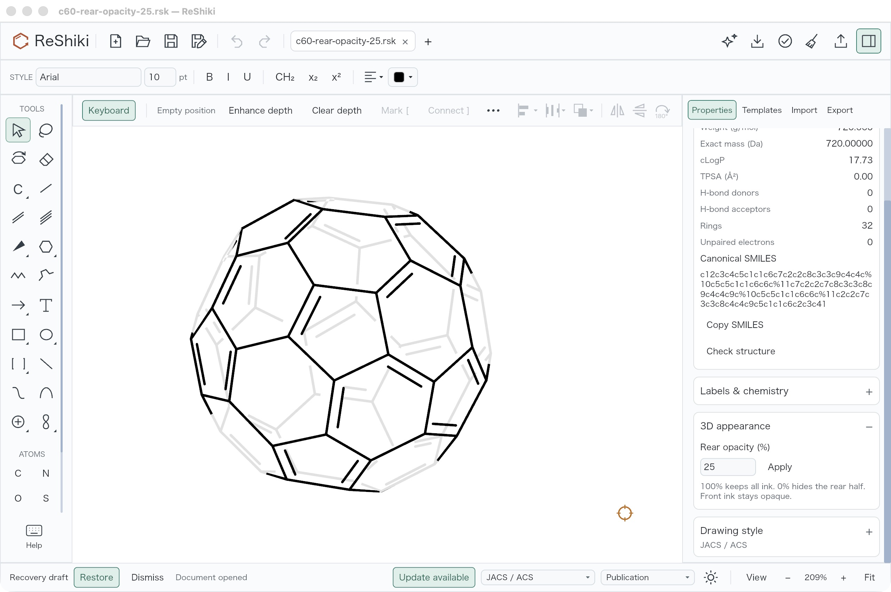
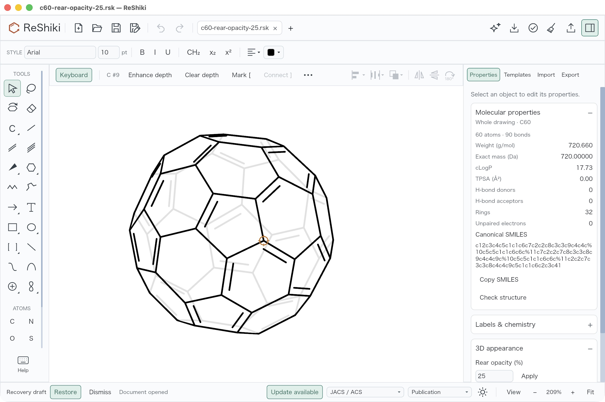
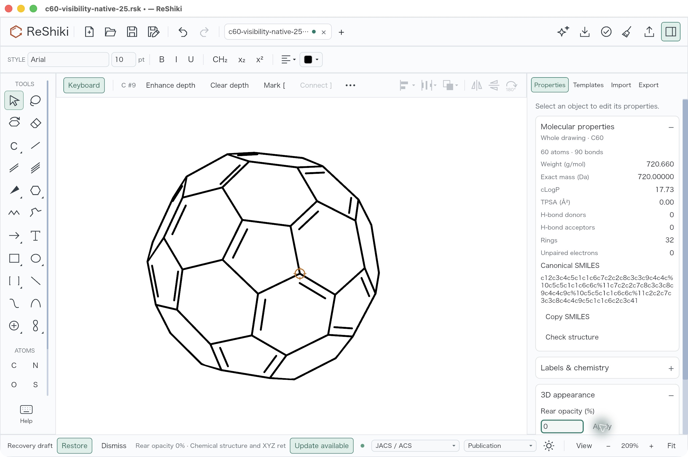
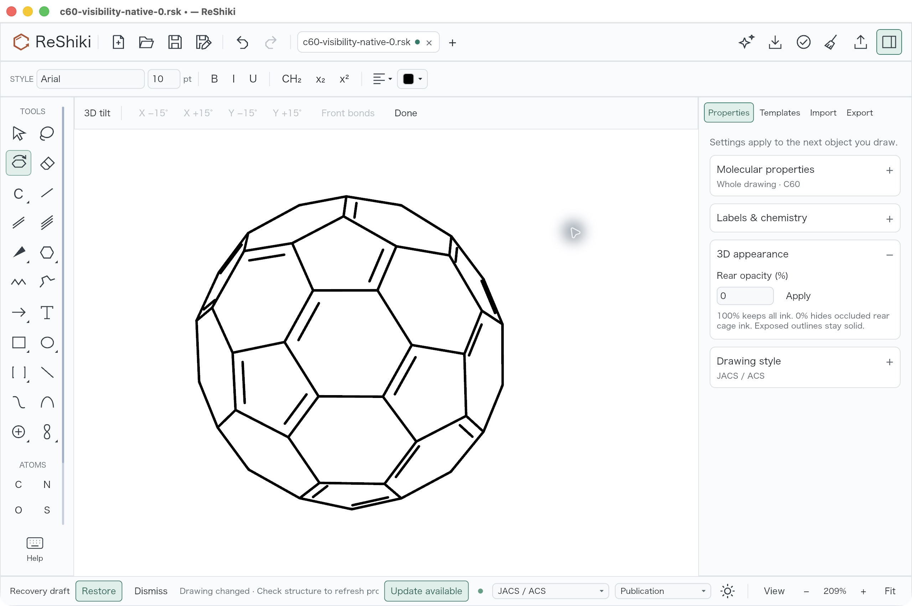
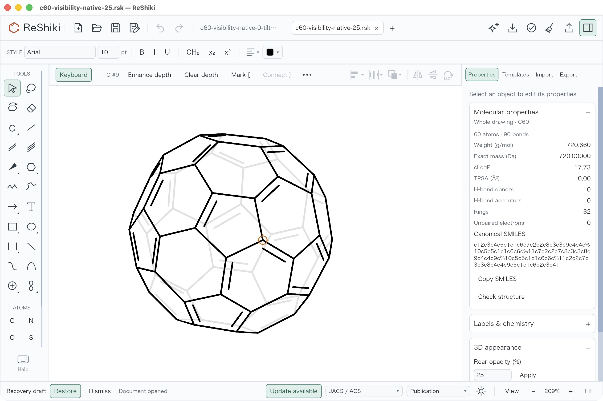
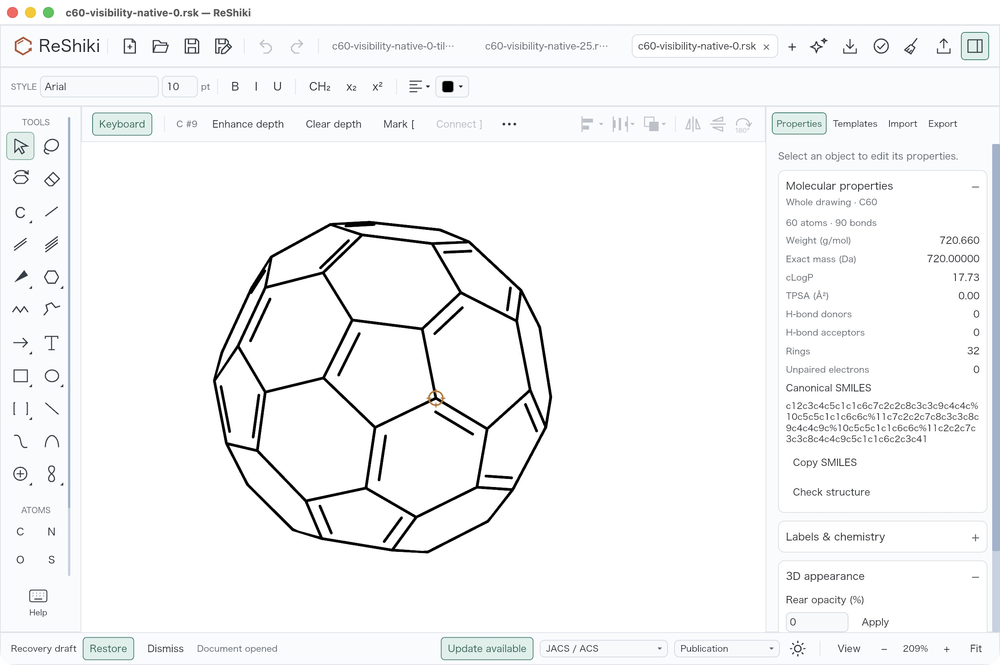
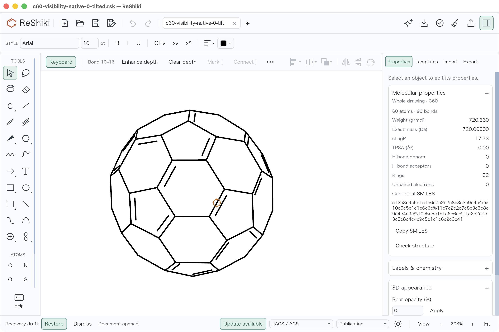

# Rear opacity keeps exposed cage outlines solid (under review)

The earlier rear-opacity implementation faded everything beyond a depth
midplane. On a projected C60 cage, that also faded parts of the visible outer
rim. The correction applies rear opacity to view-occluded cage surfaces and
projected ink, keeping exposed outlines solid as the molecule turns.

| Earlier implementation: 25%                                                                                                       | Corrected visibility: 25%                                                                                                         |
| --------------------------------------------------------------------------------------------------------------------------------- | --------------------------------------------------------------------------------------------------------------------------------- |
|  |  |

These are untouched 2560 × 1704 native JPEGs of the same
[25% drawing](../../tests/fixtures/rear-visibility-20261010/c60-visibility-native-25.rsk)
at 209% on macOS arm64, with a light canvas, JACS/ACS, Arial 10 pt and keyboard
drawing on. The molecule has no selection handles. Inspector scroll, keyboard
cursor, title, focus and footer state differ; the recovery banner was left
untouched. The before view uses the earlier implementation within PR #289,
compiled from `7ec621227bc6fd777d5918efb9b8b6443c207d8e`, signed executable
`4d35fe616bc9cb1388e4a6ec45312c65cc21aa6b67e42e17b077dd848fcc4043`.
It is not the PR's declared base. The corrected app was built from the frozen
13-file correction above `52fd95d6c537c9ae5c7c35a3da98cd63b48bfd74`;
its signed executable is
`bc9b3d61b3acb8c65e0b2ff1b6be2e0c3835ef9ebd097c1785f8210b28fb31f7`.
Original source, compiler, package and desktop receipts are retained in the
[evidence package](../../tests/fixtures/rear-visibility-20261010/README.md).

Use **Properties → 3D appearance → Rear opacity (%) → Apply**. At 25%,
occluded rear ink is faint; at 0%, it disappears while the exposed rim stays
solid. At 100%, the existing opaque rendering is preserved. Rotate with
**3D tilt** to recompute visibility from current retained XYZ, then clear the
selection to remove the temporary editing overlay.

| 0%                                                                                                                  | 0% after native 3D tilt                                                                                                                                |
| ------------------------------------------------------------------------------------------------------------------- | ------------------------------------------------------------------------------------------------------------------------------------------------------ |
|  |  |

ROOT checked 25% → 0%, one Undo to 25%, and one Redo to 0%, then saved separate
[0%](../../tests/fixtures/rear-visibility-20261010/c60-visibility-native-0.rsk)
and [tilted 0%](../../tests/fixtures/rear-visibility-20261010/c60-visibility-native-0-tilted.rsk)
native files. Changing opacity changes exactly one field; every atom, bond,
coordinate and chemical style remains identical. Tilt changes 180 coordinate
values—X, Y and depth for all 60 atoms—in a rigid −21.25° X then +35° Y rotation.
The original XYZ are rotated, not left unchanged. All 90 full bond records and
all noncoordinate atom, label and appearance fields remain exact; the maximum
90-bond distance drift is about 0.000011 document units from float rounding.

| Fresh process: 25%                                                                                                             | Fresh process: 0%                                                                                                      | Fresh process: tilted 0%                                                                                                                            |
| ------------------------------------------------------------------------------------------------------------------------------ | ---------------------------------------------------------------------------------------------------------------------- | --------------------------------------------------------------------------------------------------------------------------------------------------- |
|  |  |  |

ROOT reopened all three files in fresh verified process PID 24802. Each was
clean with Undo and Redo disabled, C60, 60 atoms and 90 bonds. The tilted file
automatically fits at **203%**; the unrotated views remain **209%**. These
persistence views are separate from the matched before/after pair. All seven
published screenshots are original bytes, without crop, resizing, retouching
or recompression.

The compiled record includes 17 model visibility/raster tests, five export
tests, three app/history tests and one separately executed native wgpu pixel
test: 26 named passes. The 17 model tests overlap the earlier full model run
of 175 passes and seven preexisting ignored tests; they are not extra unique
passes. Workspace all-target/all-feature check and strict Clippy, formatting
and whitespace checks passed. Signed CLI SVG/PNG/PDF checks separately verified
opaque exposed-rim samples and hidden-ink alpha. Earlier zero-test routes and
depfile-parser failures are explicitly excluded, retained in the original
compiled summary. This record does not claim a full workspace test-suite run
or future-head CI result.

Visibility uses conservatively validated closed cages and actual projected
ink. Open or invalid cages do not invent an occluding surface. Documented
geometry/query budgets fall back to opaque output when exceeded; their
preflight estimates are resource heuristics, not a formal per-operation bound
or proof for every molecule and pixel. Native version 22 retains opacity.
Chemical and editable external formats retain their documented appearance
limitations. At published head `dd26cae3`, the
[Windows print-alpha test failed](https://github.com/Ameyanagi/ReShiki/actions/runs/38017370974/job/114110577818):
its open-chain fixture expected fading on exposed ink. The test-only revision
uses the existing closed C60 cage to retain the partial-alpha/EMF-rejection
checks and separately tests opaque chain paint and vector EMF acceptance.
Actual Windows execution of the revised tests remains pending. The portable
verifier pins that single test-source delta while retaining the original
source/compiler/native receipts and every captured Mac shipping dependency.
It checks bytes and these three native graphs; it does not rerender screenshots
or prove pixel visibility.

Under review in [PR #289](https://github.com/Ameyanagi/ReShiki/pull/289),
contributed by @Ameyanagi. Reusable caption: **Rear opacity hides occluded cage
ink while keeping the exposed outline solid, including after 3D tilt.**
