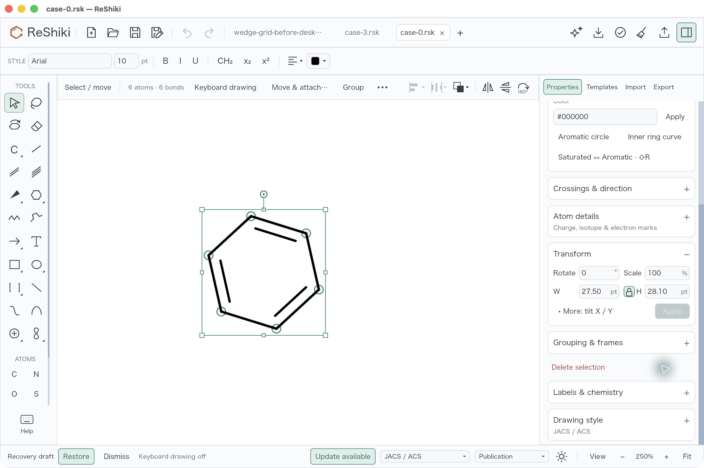
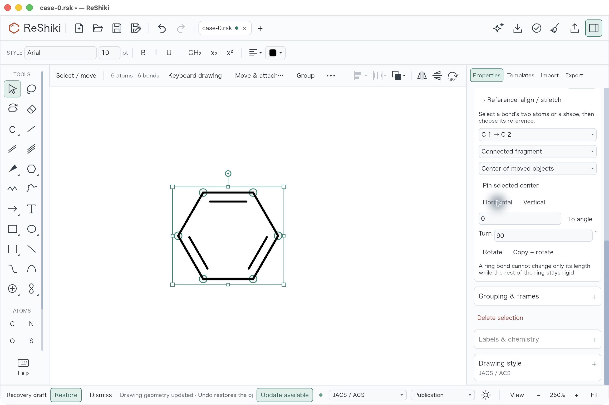
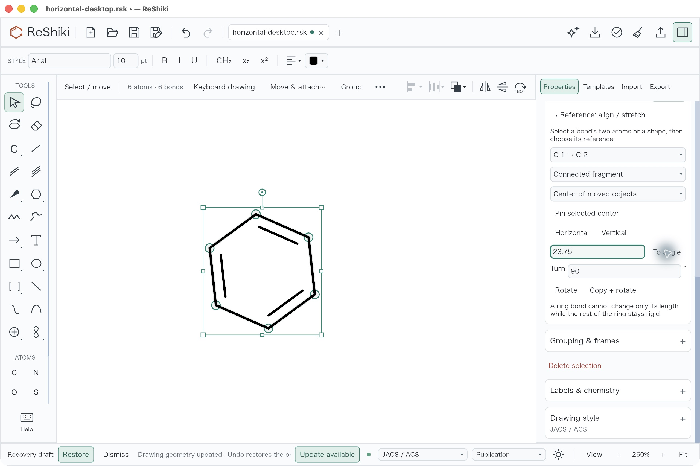
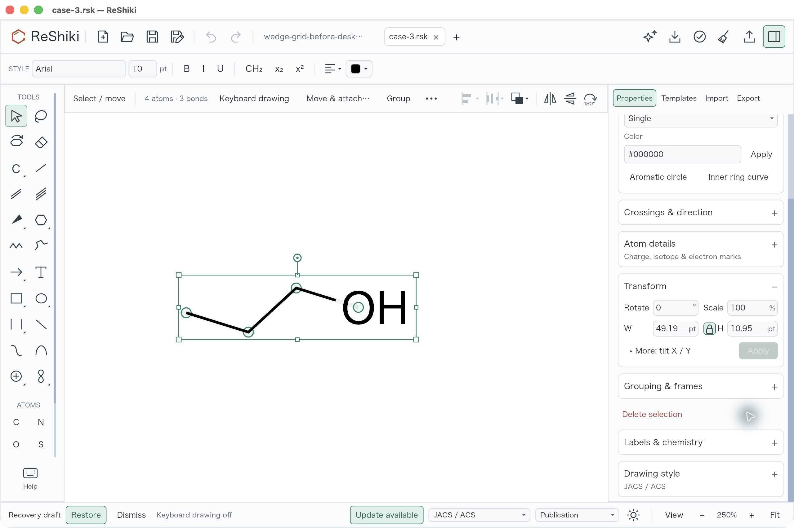
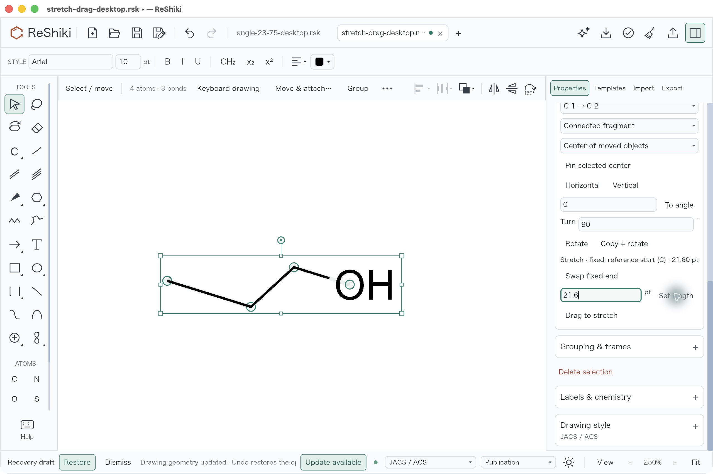
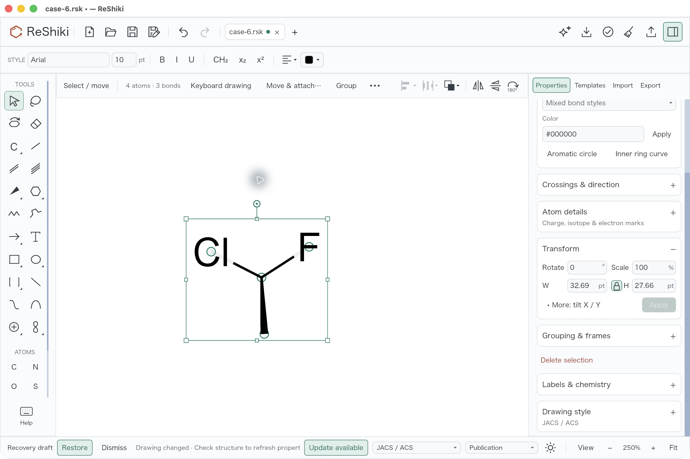
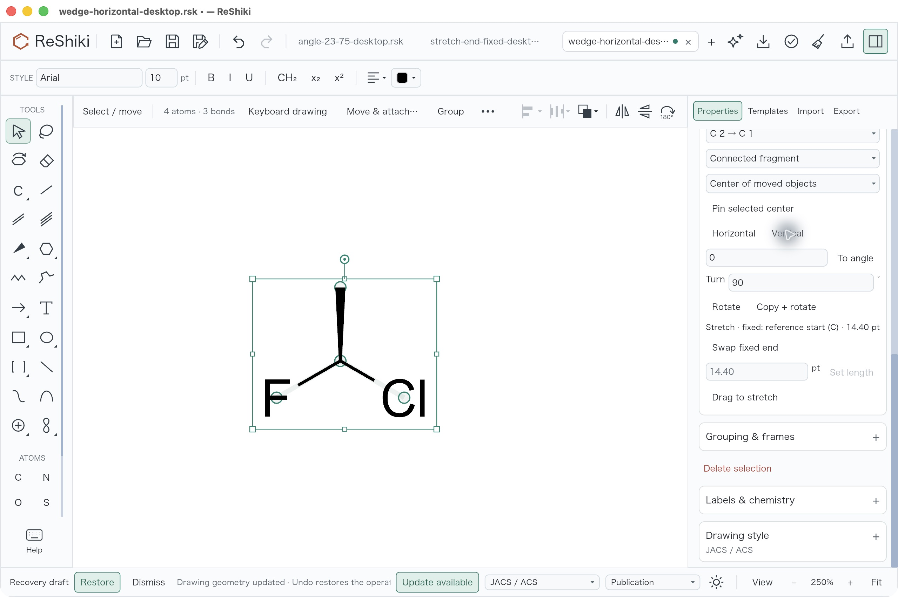
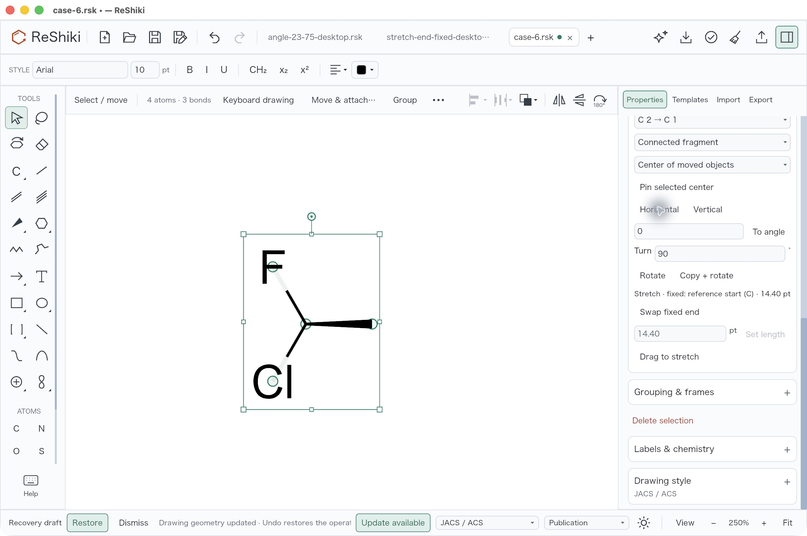

# Exact reference alignment and bond stretching

Align a bond or straight shape edge horizontally, vertically or to an arbitrary
directed angle, then rotate copies about a shared point. Stretch a bridge bond
along its original direction while keeping the moving branch rigid. The
[control guide](../reference-geometry.md) describes scope, pivots and restrictions.
This work is under review; the PR link will be added when published. Contribution:
@Ameyanagi.

Select a screenshot to inspect its controls at the original resolution.

## Real desktop controls

The baseline already has arbitrary relative rotation, free rotation handles and
Shift-snapped relative rotation. The new reference controls calculate the angle
needed to align the chosen edge exactly. In this benzene input, C1→C2 starts at
17.3°. **Horizontal** makes its endpoint Y coordinates equal; **To angle** sets
the directed edge to 23.75°.

| Existing controls at `51fa0991`                                                                                                                                                                        | Reference controls at `d04fb529`                                                                                                                                                                   |
| ------------------------------------------------------------------------------------------------------------------------------------------------------------------------------------------------------ | -------------------------------------------------------------------------------------------------------------------------------------------------------------------------------------------------- |
|  |  |

Open [ring-input.rsk](fixtures/reference-geometry/ring-input.rsk), select all six
atoms, then choose **Properties → Transform → Reference: align / stretch**,
**C1→C2**, **Connected fragment**, **Center of moved objects**. Press Horizontal,
then Vertical; Undo returns to Horizontal. Enter 23.75 and press To angle. Root
desktop verification confirmed that repeating To angle adds no document history:
one Undo returns to Horizontal and Redo restores the directed angle. Actual saves:
[Horizontal](fixtures/reference-geometry/ring-horizontal-desktop.rsk) and
[23.75°](fixtures/reference-geometry/ring-23-75-desktop.rsk).

## Change only a bridge length

The existing Length-off/Angles-on movement constraint uses a 15° grid. A retained
runtime regression established that a 17.3° axis becomes 15.000001° in that mode.
The new Stretch operation uses the original axis itself and projects pointer
motion onto it. The screenshots show the original whole-drawing controls and
the new deterministic length edit; they do not depict that source regression.

| Original branch and existing controls                                                                                                                                                                   | First bond set to 21.6 pt                                                                                                                                                                         |
| ------------------------------------------------------------------------------------------------------------------------------------------------------------------------------------------------------- | ------------------------------------------------------------------------------------------------------------------------------------------------------------------------------------------------- |
|  |  |

Open [branch-input.rsk](fixtures/reference-geometry/branch-input.rsk), select its
four atoms and choose C1→C2. With the reference start fixed, press Drag to stretch
and drag the moving endpoint off-axis. The actual desktop drag went from screen
(799,1070) to (900,1240), producing
[24.47894017 pt](fixtures/reference-geometry/branch-drag-desktop.rsk) while C1
stayed exactly at (0,0). One Undo restored the original 14.4 pt bond. Entering
21.6 and pressing Set length produced
[the numeric result](fixtures/reference-geometry/branch-21-6-desktop.rsk).
Undo, Swap fixed end, then Set length 21.6 produced
[the opposite fixed-end result](fixtures/reference-geometry/branch-end-fixed-desktop.rsk),
with C2, C3 and O4 unchanged. Each moving branch translates rigidly; no other bond
length or angle changes. Rings cannot use this single-edge rigid operation.

## Keep wedge direction and stereochemistry

A wedge is aligned using its ordered bond axis. This rotates the drawing in its
plane; it does not flatten a 3D projection. The original input is
`C[C@H](F)Cl`, with stored C2→C1 wedge taper and ccw neighbor order.

| Baseline manual rotation                                                                                                                                                                            | Exact Vertical reference alignment                                                                                                                                                                                |
| --------------------------------------------------------------------------------------------------------------------------------------------------------------------------------------------------- | ----------------------------------------------------------------------------------------------------------------------------------------------------------------------------------------------------------------- |
|  |  |

Open [stereo-input.rsk](fixtures/reference-geometry/stereo-input.rsk), select all
four atoms, and choose C2→C1. Horizontal and Vertical preserve all bonds, endpoint
order, wedge display, charges, explicit-H semantics and AtomStereo neighbors.
The [baseline manual drag](fixtures/reference-geometry/stereo-manual-rotation-before.rsk)
ended at 87.16944875°; it was free rotation, and is not evidence of grid snapping.
The new [Horizontal](fixtures/reference-geometry/stereo-horizontal-desktop.rsk)
and [Vertical](fixtures/reference-geometry/stereo-vertical-desktop.rsk) results
have axis errors below 0.000001°. Vertical chooses −90°, a valid nearest-axis
orientation. Root verified Undo back to Horizontal and Redo to Vertical.

## Evidence and limits

These are unmodified native JPEG captures on macOS 26.5.1 arm64, at 250% camera
zoom, F8/presentation off, JACS/ACS publication style. Selected handles appear
because the controls are the subject of the figures. Inspector scroll positions,
public fixture tab counts and status bars differ; drawing scale/style are the
same. The captures were collected later from separately frozen baseline
`51fa0991` and candidate `d04fb529` apps. Source confirmation, the failing old
constraint regression and baseline control were retained before implementation.
The baseline manual wedge drag and new exact command are different operations.

[Capture provenance](../images/reference-geometry/provenance.json) records image
and native-file hashes. The [independent coordinate audit](fixtures/reference-geometry/coordinate-checks.json)
checks the seven actual candidate saves: IDs and chemical fields unchanged,
rotation pivot drift below 0.000001 drawing unit, all-pair distance error below
0.000006, and rigid-branch residual below 0.000006. Decimal/f32 tolerances are
explicit. Carbon `label_h` caches hydrate to valid neutral valence values when
the uncomputed ring/branch inputs are checked; the stereo input and saves already
have identical explicit H, no_implicit and CIP R fields.

Model/app tests separately cover shared/pinned-center copies, incomplete/ring
rejection, native/MOL/CDXML stereo identity, tab/file ownership, and real canvas
preview/commit/cancellation events. Pinned-copy desktop interaction and Escape
during a held drag were not performed in this desktop session. The
[renderer example](../../examples/reference_geometry_qa.rs) supplies eight editable
cases, including quarter-turn copies; it is renderer evidence rather than a
claim of native interaction coverage. Strict Clippy, formatting, all-feature
check and the locked candidate build passed before these docs-only additions.
