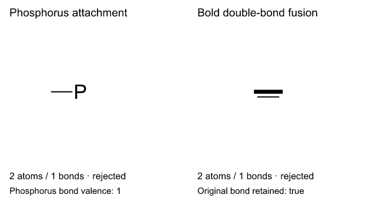
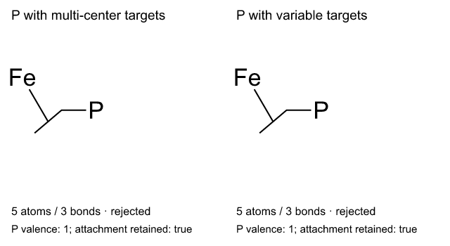
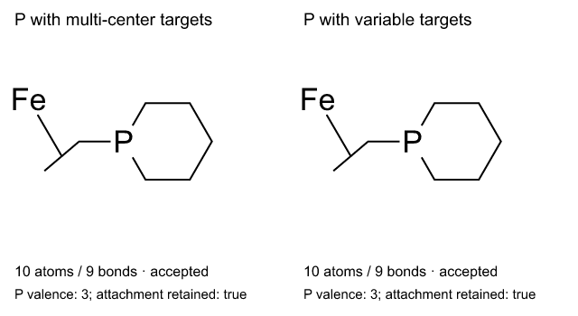
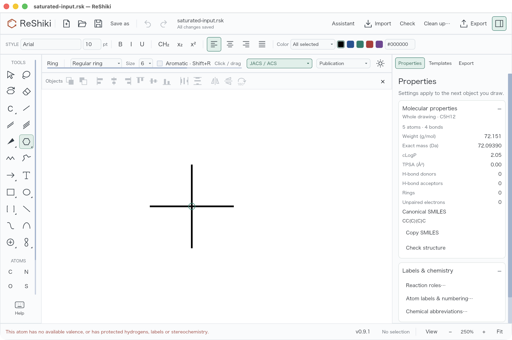
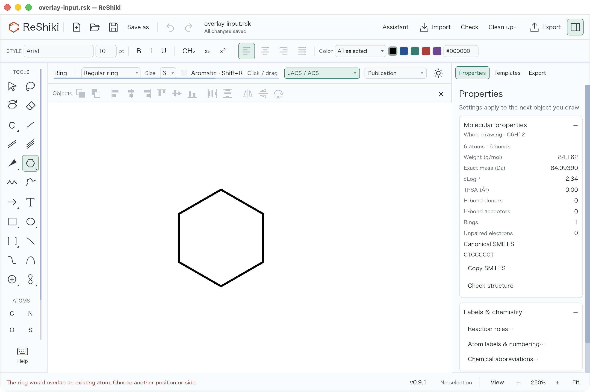

# Safe regular-ring placement

Regular rings now reject attachment sites that cannot accept their new bonds,
including saturated carbon, explicit hydrogens, abbreviations, and protected
stereochemistry. A new ring also rejects unshared vertices that coincide with an
existing atom. Rejection preserves the drawing, selection, and Undo/Redo history.

This addresses [#43](https://github.com/Ameyanagi/ReShiki/issues/43) and
[#44](https://github.com/Ameyanagi/ReShiki/issues/44). Ordinary atom sharing and
outward bond fusion remain available for rings of 3–8 atoms. Shared double bonds
keep their original order. Existing six-membered aromatic placement retains its
validated benzene planner.

The conservative overlap policy rejects the proposed placement; it does not
merge extra atoms. Proximity uses the existing aromatic planner's tolerance of
1/15 of the shared/generated bond length (with a 0.01 world-unit floor), independent
of canvas zoom. Explicit hydrogen counts, isotope/map labels, radicals, marks,
abbreviations, and affected stereo assignments are protected. Drawing-defined
wedge/hash stereochemistry is protected even before chemistry checking;
projection-only bonds are not treated as stereo assignments.

## Matched renderer evidence

Before:

After:

The three panels use the same input, action, framing, scale, style, and renderer.
Counts and carbon valences are measured from the actual result graph and placed
outside the application-rendered drawing. The overlaid-ring defect is mostly
invisible in the figure; its four coincident atom pairs are the important graph
measurement.

| Input and action                                                                                                            | Base result                                               | Fixed result                                             |
| --------------------------------------------------------------------------------------------------------------------------- | --------------------------------------------------------- | -------------------------------------------------------- |
| [Four-bond carbon](fixtures/regular-ring-safety/saturated-input.rsk): click the center with the regular six-ring tool       | 10 atoms / 10 bonds; central C valence 6                  | Rejected; original 5 atoms / 4 bonds; C valence 4        |
| [Explicit CH4](fixtures/regular-ring-safety/explicit-h-input.rsk): click the carbon with the same tool                      | 6 atoms / 6 bonds; total C valence 6 including explicit H | Rejected; original 1 atom / 0 bonds; total C valence 4   |
| [Cyclohexane](fixtures/regular-ring-safety/overlay-input.rsk): start at the first bond midpoint and drag to the ring center | 10 atoms / 11 bonds; 4 coincident pairs                   | Rejected; original 6 atoms / 6 bonds; 0 coincident pairs |

The defective saved graphs are retained as
[saturated-before.rsk](fixtures/regular-ring-safety/saturated-before.rsk),
[explicit-h-before.rsk](fixtures/regular-ring-safety/explicit-h-before.rsk), and
[overlay-before.rsk](fixtures/regular-ring-safety/overlay-before.rsk).
Fixed outputs equal the input documents byte-for-byte after serialization.

Capture provenance:

- Base: `0ae0fb6a21c5e5c5b90ae66730458fda4ea2a20d` (`origin/main`).
- Original implementation: `25c8159834b6eda691d2ccc1c39904dc2becf69c`.
  Renderer operation source (`src/editing.rs`) Git blob:
  `43163e31337efd1222188ecbc45a5c5bc0471680`.
- Platform/build: Apple Silicon macOS, Rust dev profile, native application SVG
  renderer rasterized with the same resvg dependency; captured 2026-09-29.
- Scale/framing: each 320 × 245 panel uses `viewBox="-110 -100 260 210"`;
  complete PNG is 960 × 350. Default publication drawing style, white background.
- Operation: `editing::ring_oriented`, ring size 6, `aromatic=false`, hit radius
  5 world units; atom cases click `(0, 0)` and overlap drags the first bond
  midpoint to `(0, 0)`.
- Generator: [regular_ring_safety_qa.rs](../../examples/regular_ring_safety_qa.rs),
  run unchanged against base and head. It also saves input/result `.rsk` files
  and prints graph counts, total first-carbon valence, and coincident pairs
  below 0.01 world units.

Reproduce with `cargo run --example regular_ring_safety_qa -- OUTPUT_DIRECTORY`.
Use the environment/helper configuration required by the developer guide. The
example is new in this PR; copy it unchanged into a base worktree for comparison.

## Valid attachment corrections from review

Neutral phosphorus uses the native strict allowed-valence check at the edited
atom, using its aromatic state and exact incident bond orders/directions. This restores one-bond P → three-bond P and three-bond P →
five-bond P attachments while rejecting a result above phosphorus's allowed
valence. Other atom capacities and the protected charge, explicit-H, and stereo
policies are unchanged. Unrelated chemistry and semantic attachment nodes in the
same connected drawing do not block the edit. The validation-only local graph
uses wildcard neighbors: native per-atom valence depends on the target's fields
and incident bonds, so no neighbor chemistry or attachment semantics need to be
converted. Aromatic half-bond contributions and dative donor/acceptor direction
remain intact; the graph is never used for identifiers or molecular properties.

Fusion accepts supported shared-bond appearances, including bold/dashed double
bonds and projection styles, while retaining the complete original bond. Invalid
order/display combinations, assigned stereochemistry, drawing-defined stereo,
overfilled carbon endpoints, and coincident vertices still reject atomically.

| Before review correction                                                                                                                                                       | After review correction                                                                                                                                                                       |
| ------------------------------------------------------------------------------------------------------------------------------------------------------------------------------ | --------------------------------------------------------------------------------------------------------------------------------------------------------------------------------------------- |
|  |  |

Inputs: [neutral phosphorus with one carbon bond](fixtures/regular-ring-safety/phosphorus-input.rsk)
and [bold double bond](fixtures/regular-ring-safety/styled-input.rsk).
Run `cargo run --example regular_ring_safety_qa -- OUTPUT_DIRECTORY --valid-attachments`.
The phosphorus gesture starts at `(0, 0)` toward `(80, 0)`; the double-bond gesture
starts at its midpoint `(0, 0)` toward `(0, 80)`. Both use a regular six-ring and
5-world-unit hit radius. Before, both operations reject with 2 atoms / 1 bond and
byte-identical inputs. After, phosphorus has 7 atoms / 7 bonds and bond valence 3;
the styled ring has 6 atoms / 6 bonds and an unchanged shared bond.

These are matched application-renderer examples, not native desktop screenshots.
The earlier source is `eea37c3cde643d519f4f9cb459b2b14fcc7b738a`, a prior version
within this PR, not its `main` base. The corrected source is
`befcf1460a50fe7fab02138615e57e590a419642`; its `src/editing.rs` blob is
`3aa53a944ac037c3739c428361d9c8c434fa348a`. Both use the same expanded
example harness, source drawings, default publication style, white background,
320 × 245 panel with `viewBox="-110 -100 260 210"`, and 640 × 350 PNG output.
Captured on Apple Silicon macOS 26.5.1 using Rust dev-profile application SVG
rendering and resvg on September 29, 2026. Only `src/editing.rs` differs in the
production renderer source for these two captures; it was rebuilt sequentially
and the corrected file restored byte-for-byte. Both unedited PNGs were inspected
for legibility and clipping. The native desktop checks below precede these two
corrections and are not claimed as desktop validation of the restored paths.

### Connected semantic attachments

The final follow-up fixes a false rejection when a multi-center or variable
attachment node belongs to the phosphorus atom's connected drawing. Both examples
retain the original attachment node, members, atoms, and bonds exactly.

| Before per-atom validation                                                                                                                                                        | After per-atom validation                                                                                                                                                   |
| --------------------------------------------------------------------------------------------------------------------------------------------------------------------------------- | --------------------------------------------------------------------------------------------------------------------------------------------------------------------------- |
|  |  |

Inputs: [multi-center targets](fixtures/regular-ring-safety/multi-center-input.rsk)
and [variable targets](fixtures/regular-ring-safety/variable-input.rsk).
Reproduce with `cargo run --example regular_ring_safety_qa -- OUTPUT_DIRECTORY --semantic-attachments`.
Both gestures start at P `(0, 0)` toward `(80, 0)`, regular six-ring,
5-world-unit hit radius. Before, both reject at 5 atoms / 3 bonds, P valence 1,
byte-identical to input. After, both accept at 10 atoms / 9 bonds, P valence 3,
with zero coincident atom pairs and unchanged attachment metadata.

These are matched application-renderer captures, not native desktop screenshots.
Before source: `4646df060b8bf4be56cddd4a79b179caa9b97c53` (`src/editing.rs` blob
`3aa53a944ac037c3739c428361d9c8c434fa348a`). After source: `387b803fc9550738bf7a371cbb0161681f10d028`
(`src/editing.rs` blob `257d7f3568d28d8bd7ad702689d8ca0b98d6eb2d`). The same expanded
harness was run before and after the source change, sequentially in the isolated
Cargo target. Platform: Apple Silicon macOS 26.5.1, Rust dev-profile application
SVG renderer and resvg, September 29, 2026. Default publication style, white
background, each panel 320 × 245 with `viewBox="-110 -100 260 210"`, whole PNG
640 × 350. Both unedited images were inspected for readability and clipping.
The native desktop evidence below predates this follow-up too.

Reusable caption: **Phosphorus ring attachment remains available beside semantic
attachment nodes, with native valence checks and the original attachment retained.**
Reuse [the after image](../images/regular-ring-safety/semantic-attachments-after.png).

## Native desktop interaction review

The same input fixtures were also exercised in the real macOS application with
Computer Use. These additional screenshots show rejection status and unchanged
whole-drawing counts in the Properties panel:

| Desktop action                                                                   | Observed result                                                                             |
| -------------------------------------------------------------------------------- | ------------------------------------------------------------------------------------------- |
| Open saturated input, select regular six-ring, click the central carbon          | Rejected; 5 atoms / 4 bonds; All changes saved                                              |
| Add a separate valid ring, Undo, click the saturated center, then Redo           | Rejection keeps Redo available; Redo restores the separate ring (11 atoms / 10 bonds total) |
| Open overlay input, drag the first bond midpoint toward the existing ring center | Rejected; 6 atoms / 6 bonds; All changes saved                                              |
| Drag the same edge outward, then Undo                                            | Valid fused ring appears; Undo restores the original cyclohexane                            |
| Open explicit-H input and click the CH4 carbon with the regular six-ring tool    | Rejected; 1 atom / 0 bonds; All changes saved                                               |

Desktop capture provenance: combined integration commit
`446331ec8ffdef3c852cccec8b13e2105d9e6737`, macOS 26.5.1 ARM64 debug build,
reported window setting 1280 × 820, Fit at 250%, optional object toolbar and
Properties panel visible. The unmodified PNG captures are 2560 × 1704 including
the native frame. This build combines the concurrent feature PRs, including this
PR's implementation `25c8159834b6eda691d2ccc1c39904dc2becf69c`; it is not a
standalone build of this PR. The matched base/head renderer comparison above is
separate. All nine before/rejection/valid-control desktop captures were inspected;
only the two useful rejection views are retained here to avoid duplicate images.
No native mid-drag snapshot was captured: preview/commit agreement is covered by
the automated canvas regression below.

## Validation

- Eleven graph regressions cover atom and bond endpoint capacity, protected
  state/explicit H, drawing-defined stereo versus projection, reaction membership,
  exact and nearby duplicate vertices, every supported ring size, shared double
  bonds, valid outward fusion, native save/reopen, and invalid geometry. Review
  regressions add neutral-P permitted/excess valence and styled shared-edge
  preservation versus invalid appearance or stereo, connected semantic attachments,
  directional dative bonds, and aromatic phosphorus.
- All fourteen existing aromatic-fusion regressions pass.
- App/input regressions cover rejected placement with selection/history/Redo
  preserved, valid placement as one Undo step, and matching drag preview/commit
  at zoom 0.5, 1, and 2.5, including neutral phosphorus and bold/dashed double
  bonds and a connected multi-center attachment (18 gesture cases total).
- Real desktop interaction checks pass for all three rejection cases, successful
  outward fusion, Undo, and preservation of Redo, with the combined-source
  provenance and preview-capture limitation recorded above.
- The review correction passed all 11 regular-ring graph tests, 14 aromatic-fusion
  tests, and both app/input regressions on macOS with the required native helper,
  isolated Cargo target, `CARGO_INCREMENTAL=0`, and one build job. Normal formatting,
  all-target/all-feature Clippy and Cargo check hooks passed. The documentation
  build verified local links/assets and all 750 palette colors.

Release caption: **Regular rings reject saturated/protected attachment sites and
coincident duplicate vertices without changing your drawing.** Reuse the after
image above with its alt text.
