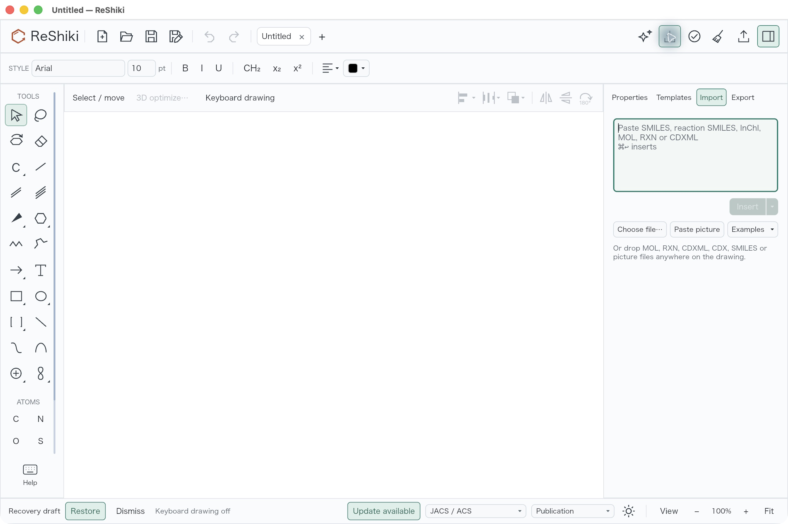
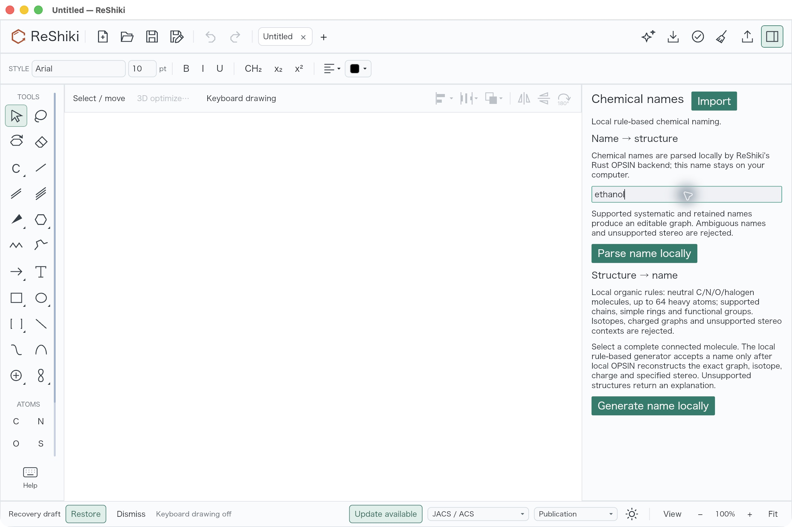
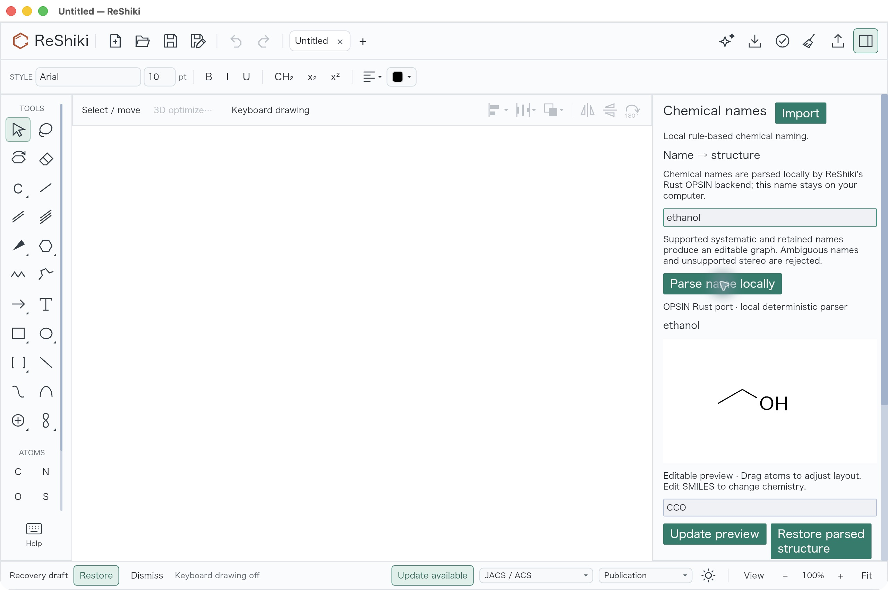
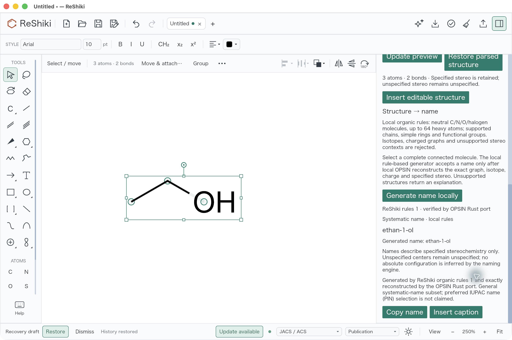
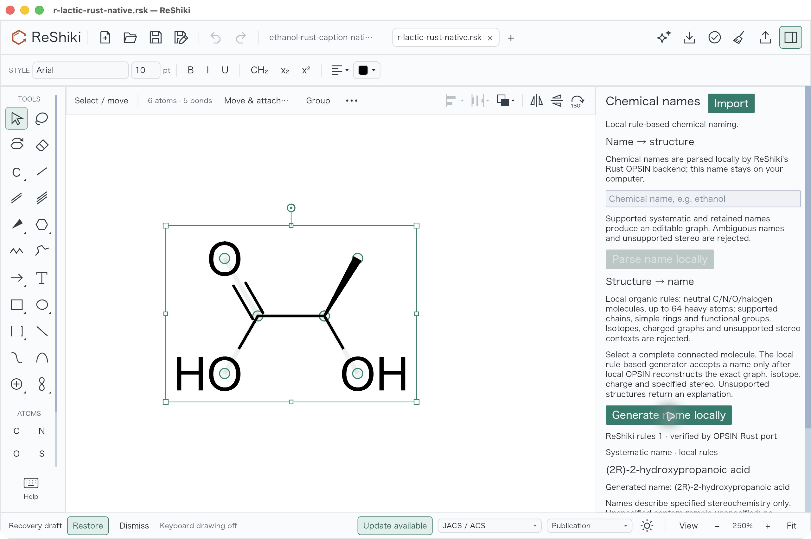

# Pure Rust chemical naming: native review

Under review; not included in ReShiki 0.11.0. This editor integration is
stacked on the separately licensed Rust parser in
[PR #291](https://github.com/Ameyanagi/ReShiki/pull/291). Both naming directions
run locally in the installed Rust executable, with no Java, JAR, Python parser
or naming API. The [guide](../chemical-naming-rust.md) states forward and
reverse coverage; comprehensive IUPAC or preferred-name selection is not
claimed.

## Preimplementation Import UI comparison

The source-verified comparison comes from the preserved Projection build at
`427d5f4e2bc05456213c0c98b6daa01351666bf2`, signed executable
`82a0047bd037f77f063233a284f9f7c7de79f36b1c1e98f6eb673ed514d389c0`.
Its five complete Import/app UI source paths are byte-identical to declared
parent `0e6e9009`; all 1,063 recorded source inputs match that build's source
commit. The older compilation proof is a fresh-compilation log, rather than
structured compiler `fresh:false` records. This is a separate drawing-feature
build, not an exact parent binary. Root copied its bundle byte for byte, changed
only bundle identity and signing metadata, and launched it as
`dev.reshiki.naming-baseline-verified` to avoid a shared-app-ID ambiguity. The
unique signed executable is
`17479a4b236b6df36ddab82087031315b78bd6fbf6e58de394558e0437d48c24`.
The package bridge binds both signatures. Root captured its empty Import
panel at 100% with no Chemical names entry; the earlier shared-ID capture is
preserved privately as supplemental and excluded from selected evidence.

| Source-verified earlier Import UI                                                                                                                             | Current Rust naming workflow before parsing                                                                                      |
| ------------------------------------------------------------------------------------------------------------------------------------------------------------- | -------------------------------------------------------------------------------------------------------------------------------- |
|  |  |

## Actual desktop checks

Root operated the unique signed macOS app through the native UI. Open
**Import → Chemical names…**, enter `ethanol`, and choose **Parse name locally**.
Review the editable CCO preview, scroll beside it, and choose **Insert editable
structure**. One Undo removes the whole molecule; Redo restores its three
atoms and two bonds. Select the complete molecule and choose **Generate name
locally** to obtain `ethan-1-ol`. **Insert caption** adds one annotation; one
Undo removes only that annotation, and Redo restores it.

Repeat with `(R)-lactic acid`: the result has six atoms, five bonds and canonical
`C[C@@H](O)C(=O)O`; reverse naming gives
`(2R)-2-hydroxypropanoic acid`. `(+)-lactic acid` rejects because optical
rotation alone does not establish absolute configuration. That rejection was
observed visually, with no editable preview or graph edit; a separate saved
pre/post JSON byte comparison is not claimed for that action.

Save the ethanol caption and R-lactic documents, quit the application, and
reopen them in a fresh process. The saved graph, caption and wedge remain;
Undo/Redo are disabled. Generating the R-lactic name again leaves document
history clean. The three actual native saves and accessibility snapshots are
in the [fixture package](../../tests/fixtures/chemical-naming-rust/README.md).
Its standard-library checker verifies topology, formula, explicit stereo and
the exact caption-only delta. A separate independent RDKit reconstruction
checks winding and wedge/coordinates without using cached CIP/H labels.

The 13 current-app screenshots and one unique preimplementation capture
(14 total) are untouched JPEG originals at 2560 × 1704. Captures use
light appearance, JACS/ACS, Arial 10, keyboard drawing off, initial preview
100% and inserted/reopened main drawing 250%. Selection handles are the
subject of complete-molecule naming checks; the sidebar is scrolled to show
the relevant controls. Fresh reopen recenters the camera without changing
native coordinates. The existing recovery footer was left untouched.
`ethanol-before-local-parse` shows the current workflow before parsing and
must not be described as a preimplementation build. The separate Import UI
baseline is documented by its own source-parity receipt.

## Source and verification scope

The checked app was built from exact parent
`0e6e9009ca2e8bfebe149c260fc5a2f484f7dfb9` plus the reviewed 34-path integration
patch SHA-256
`f237bcec9a3f63bf9ff40e3f4cc2404ef49d7d1d25a456a4860a69043f89e238`.
All 1,226 recorded inputs stayed byte-identical, all 17 owned compiler
artifacts were freshly compiled from this clean worktree, and all 191
inherited parser files matched their committed bytes. The source manifest's
omitted patch field is retained as `null`; a separate bridge binds the complete
patch without rewriting that original receipt.

| Artifact                         | SHA-256                                                            |
| -------------------------------- | ------------------------------------------------------------------ |
| Unsigned compiler output         | `f0b7108f0b0992b0d3363b0bff983fa0ba17375660a4f0910128b81569142c5c` |
| Ad-hoc signed desktop executable | `ef5948ea8c060ce2b7f77a927f45c4f28990052e0d33bb8da1feea98f0e8efd4` |
| Root native acceptance receipt   | `bd48a6bc4658d0b58c039ee5ea2b8d86d8a21c7666c3c1ad3902f3e97b061b2c` |

The unique bundle identifier is
`dev.reshiki.rust-naming-backend-verified`. Its packaged notices, sole native
executable and absence of JAR/class/JVM payloads were checked. Five authored
signed-worker examples pass with networking denied and an empty PATH, outside
the checkout; their largest measured resident size is 67,518,464 bytes.
That worker check is distinct from the actual desktop session, which was not
wrapped in network denial. GUI Cancel was not clicked.

Scoped checks pass: 22 naming tests covering 14 independent forward graph/stereo
references and 66 expected reverse names with exact reconstruction; nine
editor tests, two explicit headless renderer tests, nine process tests, six
unchanged shared API tests and two baseline graph tests. Strict app/process
Clippy, formatting, 15 license/notice tests and six release-target compilation
checks pass. The inherited parser separately passes 318 Java-free test
functions, 2,096 exact construction records across 27 families and 640 option
records. These are finite conformance checks, not universal naming coverage.

Two original fixture failures and their subsequent test-only readiness gates
are retained in the fixture package. Production time, memory, output and
cancellation limits were not relaxed, and the original timing causes were
not established. The trusted direct worker uses bounded allocation/process
memory, CPU and post-spawn deadlines. Unix RSS is polled for the leader; the
macOS startup observer acknowledgment has no separate hard timeout. Windows
creates the child inside a prelimited kill-on-close job. These limits do not
imply arbitrary hostile-subtree containment.

Published-head CI is still pending. Earlier API/Java prototype evidence stays
on its historical branch and does not validate this clean Rust integration.
The unrelated executor admission correction is excluded from this stack.

## Release-note material

Caption: Parse supported chemical names into editable structures and generate
verified local systematic names using Rust.

Reuse `docs/images/chemical-naming-rust/ethanol-local-parse-preview.jpg`.
Credit: @Ameyanagi; project creator and maintainer. Original app code and
documentation use MIT OR Apache-2.0; the upstream-derived parser retains
its separate MIT license and attribution in PR #291.
