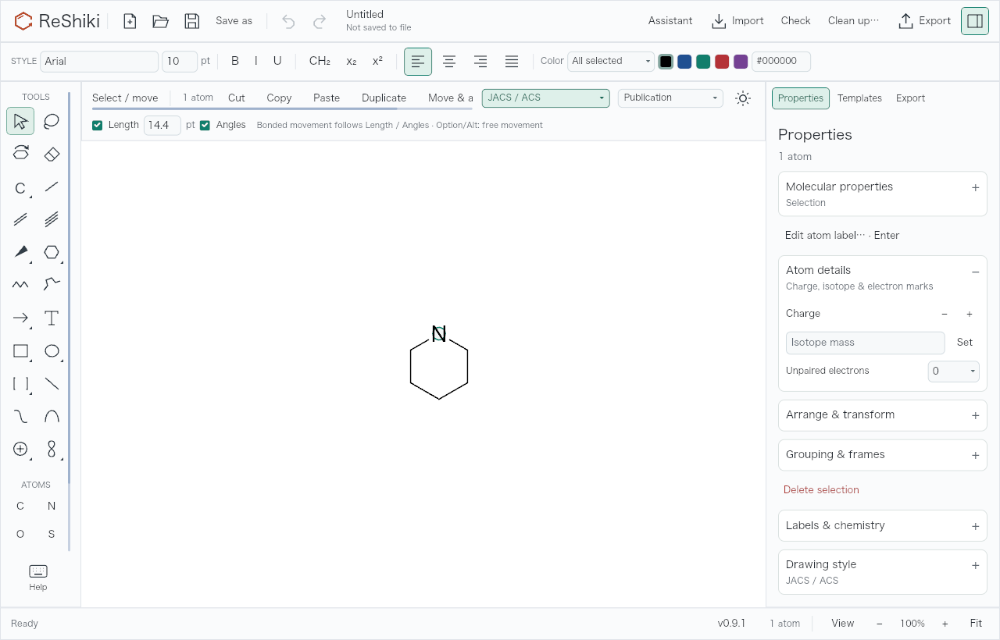
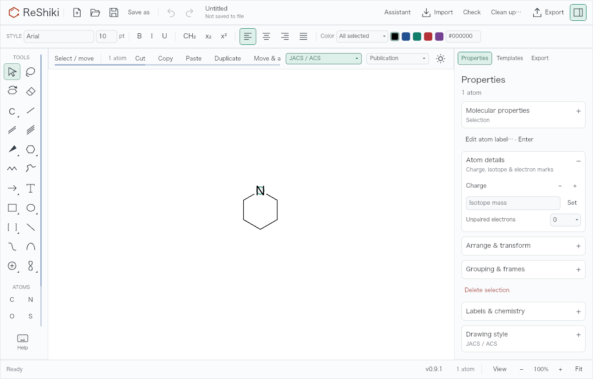
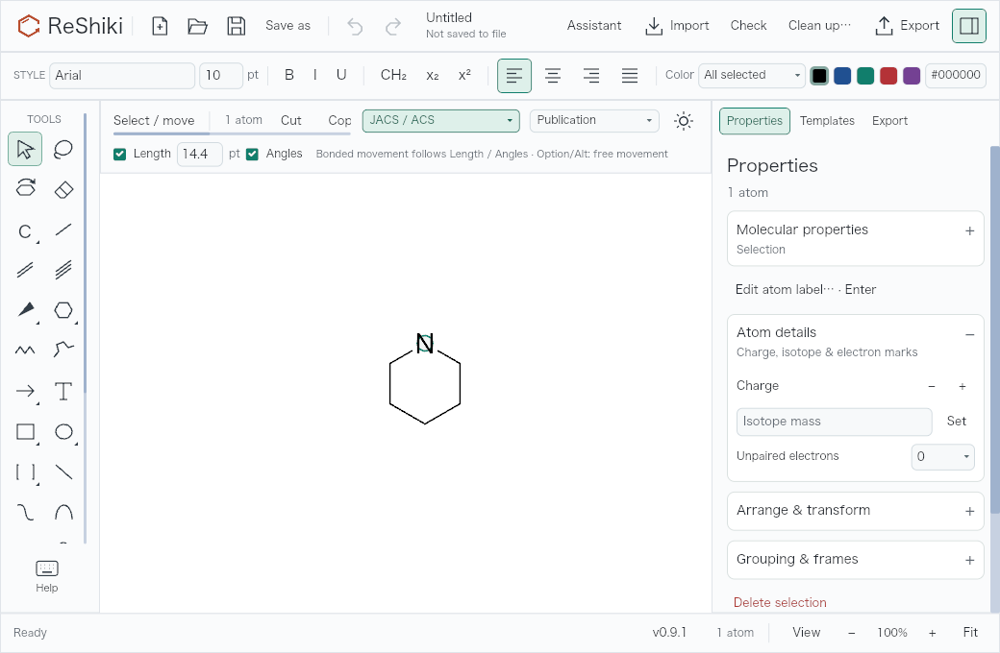
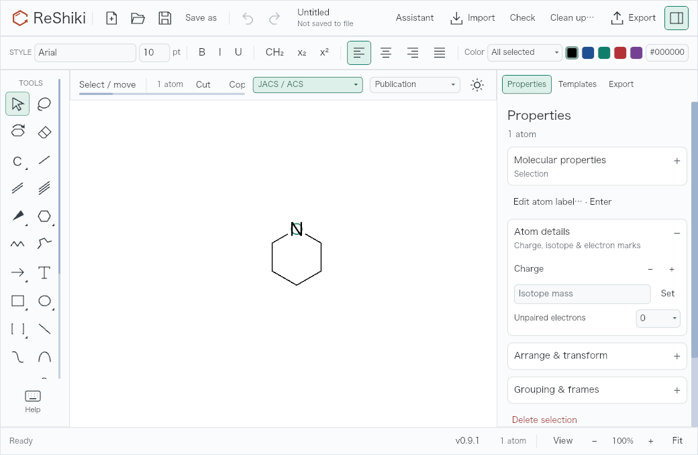
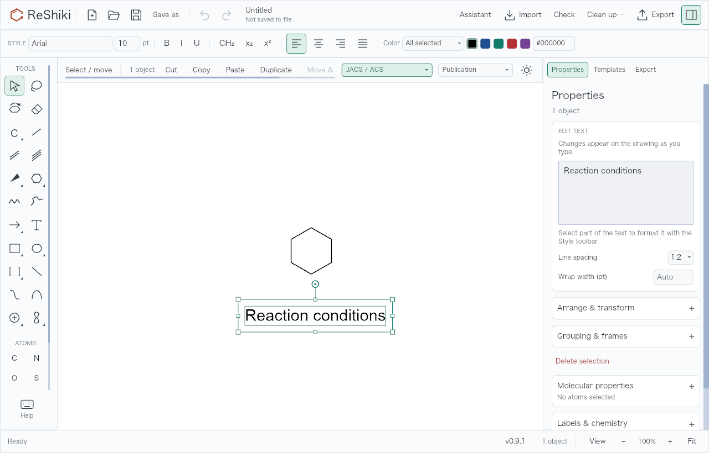
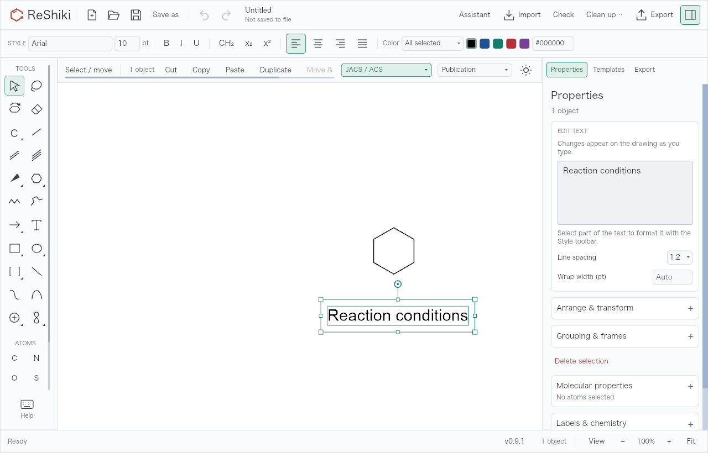

# Stable canvas during selection

Addresses the canvas-stability portion of [#61](https://github.com/Ameyanagi/ReShiki/issues/61).
Reaction duplication and Space-key selection are separate changes.

Selecting an atom with bonds to unselected atoms used to add another row of bond
constraints above the drawing. That resized and recentered the canvas between
clicks, moving the atom away from the pointer and preventing reliable molecule
selection. Those controls now share the existing horizontally scrolling context
row, whose height stays at 46 pixels. Page style and theme controls remain visible.

Selecting an arrow, caption, or graphic can also reveal the Properties inspector.
The camera now compensates for that automatic width change so the drawing stays
at the same screen coordinates. This automatic reveal does not trigger Fit.
Explicit inspector toggles, Fit, actual window resizes, manual pan, and zoom keep
their existing behavior.

## Reproduction and validation

- Open the [selection fixture](fixtures/selection-canvas.rsk), activate Select,
  and click its nitrogen atom.
- Click again at exactly the same position within the double-click interval.
  The complete molecule is selected and the target remains under the pointer.
- Repeat with the inspector hidden, at the 1040 × 680 minimum window size, and
  with a larger window. Selection controls can be scrolled horizontally.
- Open the [inspector fixture](fixtures/selection-inspector.rsk), hide the
  inspector, and select the caption. Properties opens while the drawing keeps
  its screen position.

The opt-in `selection_layout_and_double_click_regression` test sends actual
pointer events through the Iced application widget tree at 1040 × 680,
1280 × 820, and 1600 × 1000, at 0.7×, 1×, and 1.7× zoom, with the inspector
shown and hidden. It checks the canvas rectangle, clicked-atom screen position,
whole-molecule double-click selection, document immutability, and history.
Normal unit regressions cover inspector auto-reveal, inspector width changes,
preserved pan/zoom, and subsequent resize/refit behavior.

The isolated head run passed all 11 tests selected by:

```sh
cargo test --bin reshiki selection_ -- --include-ignored --nocapture --test-threads=1
```

This includes 18 actual widget-layout/double-click scenarios and two caption
auto-reveal scenarios. A separate baseline build ran the same capture harness
with `RESHIKI_CANVAS_QA_BASELINE=1`; baseline assertions deliberately allow the
known shifts. Both builds used separate Cargo targets with freshly compiled
ReShiki crates, `CARGO_INCREMENTAL=0`, and the bundled InChI helper.

Real desktop interaction and combined-feature integration checks are pending;
the widget input checks and renderer captures below do not replace them.

## Matched visual evidence

Base: `0ae0fb6` (`origin/main` at capture). The baseline contains only the added
test harness; its application code is unchanged. Head source: `ea8204ebde8ab6982ee897e7dc2ed9fe0c7d868e`. Captured on macOS 26.5.1, Apple Silicon, with the
debug Iced GPU application renderer. These are raw PNGs without window chrome,
at 100% drawing zoom, 1× output scale, initial camera center `(-20, 10)`, the default
JACS / ACS drawing style, Publication colors, and a light interface. Each pair
uses the same fixture, operation, viewport size, and rendering settings.

The nitrogen target moves from `(562, 412.2)` to `(562, 427.5)` on the base at
1280 × 820: a 15.3 px vertical jump. The head keeps it at `(562, 412.2)`.
At 1040 × 680, the base moves `(442, 342.2)` to `(442, 357.5)`; the head keeps
`(442, 342.2)`.

| Atom selection: before                                                                                                         | Atom selection: after                                                                                                          |
| ------------------------------------------------------------------------------------------------------------------------------ | ------------------------------------------------------------------------------------------------------------------------------ |
|  |  |
|                     |                          |

The caption target moves from `(592, 554.2)` to `(442, 554.2)` when the inspector
opens on the base: a 150 px horizontal jump. The head keeps `(592, 554.2)`.

| Automatic Properties: before                                                                                                       | Automatic Properties: after                                                                                                         |
| ---------------------------------------------------------------------------------------------------------------------------------- | ----------------------------------------------------------------------------------------------------------------------------------- |
|  |  |

The second click at the original nitrogen position misses the moved target on
the base; the head selects all six atoms:

| Double-click: before                                                                                                             | Double-click: after                                                                                                             |
| -------------------------------------------------------------------------------------------------------------------------------- | ------------------------------------------------------------------------------------------------------------------------------- |
|  |  |

## Release-note caption

Selecting atoms and opening object properties keeps the drawing steady, making
double-click molecule selection reliable.

Reusable image: `docs/images/selection-canvas/after-1280-double-click.png`.
