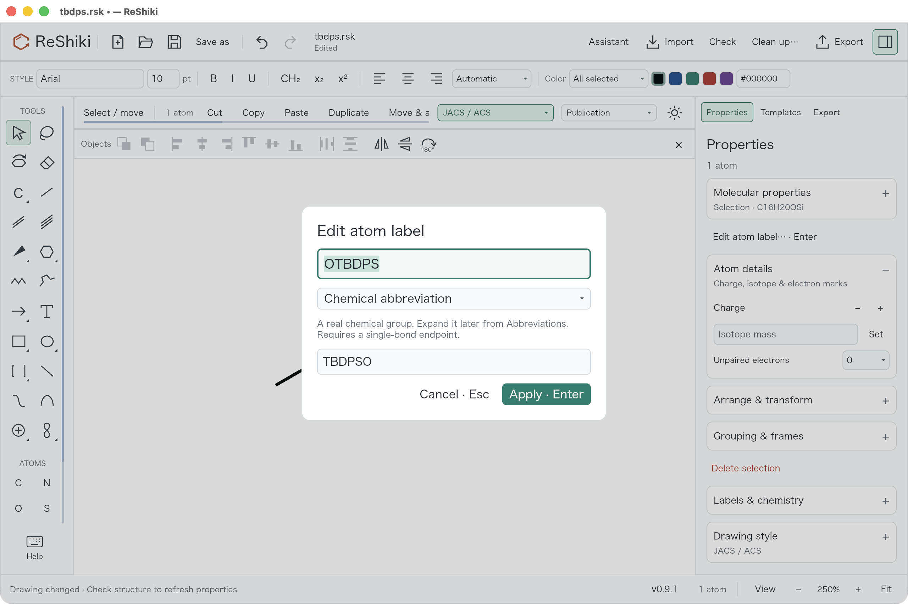
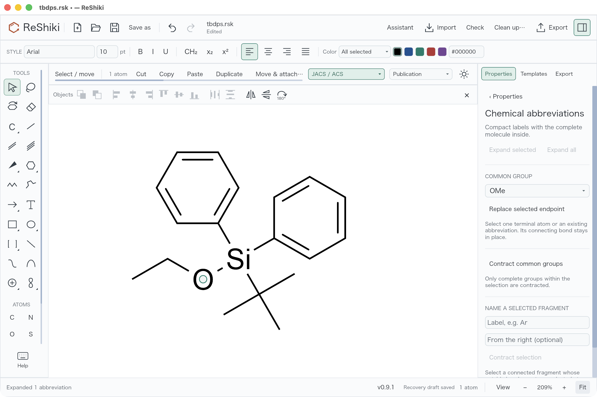

# Chemically defined TBDPS and OTBDPS

Entering **TBDPS** or **OTBDPS** at a single-bond endpoint now creates a real
protecting group. TBDPS attaches through Si and OTBDPS through O. Both are also
available in Properties → Chemical abbreviations. Expanding the label reveals
the two phenyl rings and tert-butyl group connected to silicon.


The image is unretouched output from the application renderer. The oxygen in
OTBDPS remains next to the external bond: the automatic label becomes TBDPSO
when the bond is on the right. All six drawings use the same default drawing
style and export settings; the captions are ordinary document annotations.

To reproduce, run:

```sh
cargo run --locked --example tbdps_qa -- artifacts/tbdps
```

The [fixture generator](../../examples/tbdps_qa.rs) imports `CCC`, replaces its
terminal atom using the same Automatic atom-label operation as the desktop,
reflects copies horizontally, and expands additional copies. It saves each
editable native drawing, SVGs, a combined PNG/SVG gallery, and property values.
The base is `0ae0fb6a21c5e5c5b90ae66730458fda4ea2a20d`; the image demonstrates
the new presets on macOS Apple Silicon, ReShiki 0.9.1, JACS / ACS style and
Arial 10 pt. The PNG is 5946 × 3902 pixels at 1200 dpi. It is a renderer export,
so canvas zoom does not apply. The relevant source is the PR head containing
this document and its image.

Desktop reproduction: open the generated `source.rsk`, select either terminal
carbon, press **Enter**, type **OTBDPS** in **Automatic** mode, and apply. Press
**Enter** again: the existing label must be identified as **Chemical
abbreviation**. Under Properties → Chemical abbreviations, expand the selected
group and inspect O–Si(phenyl)₂–tert-butyl. Undo expansion, then Undo replacement;
Redo both. Repeat with TBDPS and with the preset's **Replace selected endpoint**
action. The two group choices must appear in the preset list. Save/reopen the
native drawing to check that its label remains a chemical abbreviation.

Actual desktop checks passed using the combined integration build
`446331ec8ffdef3c852cccec8b13e2105d9e6737`, ReShiki 0.9.1 debug on macOS 26.5.1
arm64, with a 1280 × 820 window. From `CCC`, Enter → OTBDPS → Automatic → Apply,
then reopening Enter showed **Chemical abbreviation** and reverse label
**TBDPSO**. Expand selected revealed the C–O–Si connection; Undo restored the
collapsed group. Editing the endpoint to TBDPS and expanding revealed C–Si.
Both expanded native drawings were saved from the desktop. The initial view
was 250%; Fit produced 209% for expanded OTBDPS and 182% for expanded TBDPS.





These are unretouched screenshots. The object toolbar and other concurrent UI
changes visible here come from the combined test build. The molecular-properties
panel in the label dialog describes the selected group; the table below refers
to the entire molecule. Desktop verification covered entry, dialog reopening,
expansion, Undo, and saving. Save/reopen and exchange round trips are verified
separately by the automated tests.

The actual desktop-saved [OTBDPS drawing](../images/tbdps/desktop-otbdps-expanded.rsk)
contains 20 atoms including O–Si, while the
[TBDPS drawing](../images/tbdps/desktop-tbdps-expanded.rsk) contains 19 atoms and
no oxygen. Both are expanded, contain no wildcard atoms, and independently
reproduce the formula and InChIKey below through the pinned Python/RDKit worker.

The molecular checks use independently evaluated reference structures, rather
than relying on the appearance of the collapsed labels:

| Entry at a terminal atom of `CCC` | Attachment | Atoms after replacement | Formula   | InChIKey                    |
| --------------------------------- | ---------- | ----------------------- | --------- | --------------------------- |
| TBDPS                             | Si         | 19                      | C18H24Si  | VRAHOEXKDMDTPA-UHFFFAOYSA-N |
| OTBDPS                            | O          | 20                      | C18H24OSi | PJSWCLCQUIRIQP-UHFFFAOYSA-N |

The reference structures are `CC(C)(C)[Si](CC)(c1ccccc1)c1ccccc1` and
`CC(C)(C)[Si](OCC)(c1ccccc1)c1ccccc1`, evaluated with RDKit 2026.03.6.
The [regression tests](../../tests/tbdps_abbreviations.rs) independently inspect
Si's four connections, both six-carbon phenyl cycles, tert-butyl's three methyl
branches, and the sole outside attachment. They also check formula and InChIKey
through analysis, cleanup, CDXML/CDX, MOL, and SMILES exchange.

Native save/reopen and selection copy/paste keep the entire group. Undo/Redo
restores replacement, and expansion changes only the collapsed presentation.
CDXML/CDX keep editable group definitions and normalize reversed TBDPSO back to
OTBDPS. MOL and SMILES preserve the complete chemistry without promising the
collapsed presentation. Explicit Text label mode remains available for literal
dummy labels.

Adding the two reference definitions required refreshing the source provenance
of the complete aromatic-response fixtures. The
[three successful capture jobs](https://github.com/Ameyanagi/ReShiki/actions/runs/36483821568)
retained every saved request and response byte-for-byte; only capture metadata
and the abbreviation source hash changed. New preset geometry was independently
captured on all five supported reference ABIs; see
[geometry provenance](../../tests/abbreviation_geometry.md).

Release-note caption: **Enter TBDPS or OTBDPS as real protecting groups,
preserving chemistry when expanding, saving, and exchanging drawings.**
