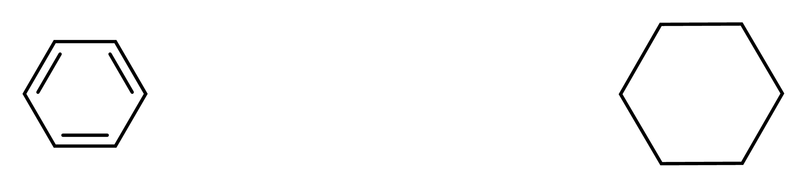
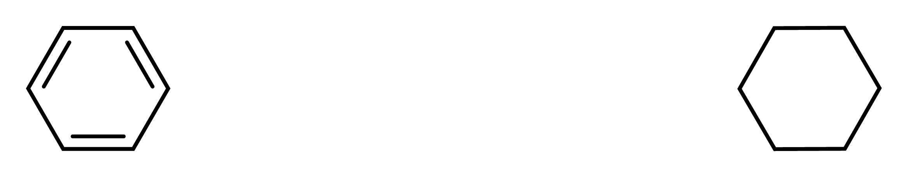

# Built-in templates follow the active journal size

After changing an ACS drawing to Nature, a newly placed built-in template
kept its ACS geometry. Free built-in insertion now uses the active drawing
style's nominal bond length. Choosing the template before or after the style
change gives the same result. Preview and commit use the same placement route.

Personal templates retain their saved geometry and independent captions or
graphics. Toolbar ring presets already use the active size. Existing atom
connections, atom sharing, bond fusion and Move & attach retain their geometry,
scoring and error behavior. This fix does not separately resize earlier objects;
the journal command retains its established document-formatting behavior.

This is an intentional behavior fix, separate from the behavior-preserving
refactors: production source grows by **55 physical lines** (59 before integration with the canvas borrowing cleanup). Focused tests and
optional renderer evidence add 756 lines, including their test-only wiring.
The actual canvas hover tests account for 290 of those lines.

## Matched before and after

The left Benzene was inserted in ACS and changed to Nature by the existing
journal command. The right Cyclohexane was then inserted from the built-in
library in empty space. Before the fix, its bonds remain approximately 42 world
units; after the fix, they match the Nature nominal size of approximately
31.496584 world units.

**Before — a new free built-in ring retains ACS size in the Nature drawing.**



**After — the new built-in ring follows the active Nature size.**



These are unmodified application PNG exports, copied directly from the actual
capture. Both use 1200 dpi. The original sizes are 2394 × 561 and 2334 × 456
pixels; the displayed widths are exactly one third of each source width. This
keeps the same pixel scale instead of fitting the two figures to equal widths.
Export bounds shrink with the corrected structure, so the framing differs.
The images are renderer evidence, not native desktop screenshots.

## Reproduction and source provenance

The [ACS reference fixture](fixtures/template-journal-size-acs-reference.rsk)
is the unmodified captured starting document. Open it, choose built-in
Cyclohexane in Templates, apply Nature from the Drawing style journal dropdown,
and insert in empty space on the right. Repeat with the style change before the
template choice. The fixture and both PNGs are original capture bytes; no
geometry, image scaling, cropping or redraw was applied to the saved files.

The opt-in [application harness](../../src/app/template_style_evidence.rs) uses
actual `App::update` messages for journal changes, library selection, connection
mode, toolbar selection and canvas edits. It inserts the reference at (-160, 0),
then free templates at (160, 0) with direction (195, 60). Camera zoom is 1; exported
physical scale is independent of camera zoom. SVG and PNG use the production
`export::figure` renderer. Both template-selection timings produced identical
final PNG, SVG and native-document bytes within each revision, so only one pair
is published.

Captures ran on the same macOS 26.5.1 arm64 host using the unoptimized Cargo test
profile, the same installed fonts and empty default feature selection. The
baseline production source is
`81ca82101061ecc201545a3cae8d8257f03254d3`, with only the identical evidence
harness and test-module registration added for capture. The recorded baseline
diff SHA-256 is
`0b2a15cb0321baa9a5cb0224bfa121d588538975ba482d3832f44f231f9031a8`.

The validated candidate is the combined working tree at that same HEAD plus
recorded diff SHA-256
`2bc3fc12476961ce044f74470c6b70a75dccbbc6f7c5bb51ce1088a40ce6fb1c`.
The harness source SHA-256 is identical on both sides:
`7d78ace3170232dd8bb5672e0a5ba52ba4e1f3980ad2c4b3c0e926e41fce5cb4`.
The candidate was explicitly rebuilt after a shared-target cache reuse was
detected. Only the corrected candidate capture is used here: the baseline
and rebuilt candidate each passed the ignored evidence test, with 540 and 546
other tests filtered out, respectively. The discarded cached candidate is not
evidence for this fix.

To regenerate one revision's complete capture in its matching source tree:

```sh
RESHIKI_TEMPLATE_STYLE_EVIDENCE_DIR=/tmp/template-style-evidence \
  cargo test --locked --bin reshiki \
  app::template_style_evidence::capture_template_style_renderer_evidence \
  -- --ignored --exact --nocapture --test-threads=1
```

The harness writes seven cases at three phases each, as PNG, SVG and native
JSON, plus a manifest containing actual style, selected IDs, bond lengths and
PNG dimensions/DPI. Use separate output directories and explicitly rebuild each
revision when sharing a Cargo target directory.

## Actual geometry and control parity

The following ranges come from the captured native documents and manifest,
not measurements inferred from the images. Float variation reflects the
existing rotation and translation arithmetic.

| Measurement                            | Baseline                             | Corrected candidate             |
| -------------------------------------- | ------------------------------------ | ------------------------------- |
| Existing Nature Benzene, all six bonds | 31.49658203125                       | 31.49658203125                  |
| Newly inserted Cyclohexane, six bonds  | 41.99999237060547–42.000003814697266 | 31.4965763092041–31.49658203125 |
| Journal nominal Nature bond length     | 31.496583938598633                   | 31.496583938598633              |

All five controls are byte-identical across revisions for PNG, SVG and native
documents at all three capture phases: **45 unchanged artifacts**.

| Control                                        | Result                                                          |
| ---------------------------------------------- | --------------------------------------------------------------- |
| ACS free built-in insertion                    | Existing ACS size and rendering are unchanged.                  |
| Personal ACS template inserted into Nature     | Saved ring geometry and caption are unchanged.                  |
| Connect with a bond at an existing Nature atom | Connection geometry and native result are unchanged.            |
| Fuse along a Nature bond                       | Fusion geometry and native result are unchanged.                |
| Chair A toolbar ring in Nature                 | Its existing Nature-sized geometry and rendering are unchanged. |

Each case verifies undo and redo through the App dispatcher. Connection and
fusion additionally assert their distinct atom/bond-count changes, preventing
an accidental free-placement fallback from passing as attachment evidence.
The four focused template-style integration tests passed, covering all five
journal styles, authored chair/Haworth projections, attachments with exact
serialized results, personal artwork, toolbar size and invalid-input atomicity.
The application regression compares the committed document with the pure
`Template::place` result and checks undo/redo. It does not execute the canvas
hover-preview branch. The existing template history and template-drag
cancellation regressions also passed in the recorded combined test runs. These
are local focused results, not a full-suite or cross-platform claim.

Published-byte SHA-256 values:

- Before PNG: `2f53265aa35a7ea5783a5cae89f29624f95345e87be6cf6cac2e13fc879a07d1`
- After PNG: `ce97ad660fc63eb9a15b72109e48be2192d292e3052b0e9e71d22cc24b2f4cc7`
- ACS reference fixture: `978539961782461de235eaddf593e6d1ae7cd8d3f0840d45426350ad4f466216`

## Actual canvas hover draw proof

The focused [canvas tests](../../src/canvas/template_style_tests.rs) execute
`MoleculeCanvas::update` with a cursor-movement event, then the actual
`MoleculeCanvas::draw` hover branch and a headless screenshot. The expected
Nature template is a personal copy of the authored Cyclohexane whose atom x/y
coordinates are multiplied manually by the Nature/ACS nominal bond-length
ratio. Each reference bond is independently checked against the Nature nominal
world length. No placement or transform helper computes the expected geometry.
This avoids using `Template::place` as the geometry oracle for its own preview.

The comparison uses a 640 × 400 canvas at zoom 2 for free insertion and zoom 1
for attachment. It requires nonblank drawing and compares exact RGBA pixels in
the top 352 rows, excluding only the bottom status notice. The attachment oracle
is a frozen set of 12 atom coordinates and 13 bond edges copied from the baseline
native result, rendered without a template placement input and with matching
preview tint/selection. Its source capture,
`attached_nature_control-after_insert.reshiki`, has SHA-256
`d2a40700e3879ac7df7b08dd5b186452375b3ab4b0aab6f901c6f73bb812329f`.

The identical test module ran on baseline and candidate through an adapter that
only borrows the source document or template; it does not size either one.
Its SHA-256 is
`7a33a7c7234d5a9b7d861029aa200964730038ea74ae95dd996aa15a27dd01d1`.
Both tests are opt-in because they require a real headless renderer. The commands
below executed them: **no test was skipped**. Renderer initialization fails the
test if the requested backend is unavailable.

| Source and backend                 | Nature hover pixels versus independent reference | ACS/personal/attachment control test |
| ---------------------------------- | ------------------------------------------------ | ------------------------------------ |
| Baseline, WGPU                     | Fails: 8,302 different pixels                    | Pass                                 |
| Baseline, TinySkia                 | Fails: 8,504 different pixels                    | Pass                                 |
| Standalone corrected fix, WGPU     | Pass: zero different pixels                      | Pass                                 |
| Standalone corrected fix, TinySkia | Pass: zero different pixels                      | Pass                                 |
| Integrated corrected source, WGPU  | Pass: zero different pixels                      | Pass                                 |

Baseline actual/reference ink bounds are 186 × 164 / 144 × 128 pixels on both
backends. Corrected actual/reference bounds are both 144 × 128. These bounds
include the canvas selection aids; the failure is the exact drawing-pixel
comparison, not an assumed image-width threshold. Equality is checked within
each backend, without assuming WGPU and TinySkia produce identical pixels.

The separate control test compares ACS built-in/personal pixels exactly,
checks that the personal ACS template retains its size in Nature (ink extents
within two pixels of the ACS drawing, allowing journal stroke-width changes),
and compares attached hover pixels exactly with the frozen baseline geometry.
It passes even on the unfixed baseline, so the Nature failure is isolated from
the controls.

Recorded hover-test source provenance:

- Baseline production HEAD: `81ca82101061ecc201545a3cae8d8257f03254d3`,
  with QA additions only; recorded diff SHA-256
  `7764d9bf91462aca283486f6c6cd5c1bdbbc5efa3a11484a5f1981e403b42a58`.
- Standalone candidate HEAD: `c03556166f3ad9154628c782238399e163c7b602`,
  plus the test module and registration; recorded diff SHA-256
  `666f0f4c6440e270baf166208e799f4a0d7c4ebd7318f4e1f9e57a7cbd7f4602`.
- Integrated candidate: baseline HEAD plus recorded diff SHA-256
  `93fb06e28e827d7c9f8d8c6963b523bbb878ab0163cc27d4ad8bf794adbb57a5`.

Local command/provenance receipts and logs are
`template-hover-baseline-wgpu-fixed`, `template-hover-candidate-wgpu`,
`template-hover-baseline-tiny-enabled`,
`template-hover-candidate-tiny-enabled` and
`template-hover-integrated-wgpu` (each has `.json` and `.log`). They record the
renderer name and the expected baseline failure or two candidate passes.
Earlier attempts without the TinySkia feature and an initial assertion about
ink extents are excluded from this proof.

Run the two actual draw tests with WGPU:

```sh
RESHIKI_PERF_RENDERER=wgpu \
  cargo test --locked --bin reshiki canvas::template_style_tests:: \
  -- --ignored --nocapture --test-threads=1
```

Run the same tests with TinySkia, explicitly enabling that backend:

```sh
RESHIKI_PERF_RENDERER=tiny-skia \
  cargo test --locked --features iced/tiny-skia --bin reshiki \
  canvas::template_style_tests:: -- --ignored --nocapture --test-threads=1
```

The failing baseline test is
`canvas::template_style_tests::nature_builtin_hover_matches_independent_scaled_geometry`;
the independently passing control is
`canvas::template_style_tests::acs_personal_and_attached_hover_keep_legacy_geometry`.
These checks cover actual canvas hover rendering; the app unit regression above
still checks only committed placement and history.

## Native desktop verification

Candidate native checks completed on macOS 26.5.1 arm64 at **100% zoom**
through CUA in the isolated application
`dev.reshiki.editor.template-qa-20261004`. The actual application binary SHA-256
is `e9d67bed48074567c395777241bfb454353498802e263a7e0b2dc09ba07deb02`,
with source patch SHA-256
`2bc3fc12476961ce044f74470c6b70a75dccbbc6f7c5bb51ce1088a40ce6fb1c`.
The local build provenance is recorded in `template-desktop-build.json`; the QA
application used an isolated data directory.

The first check selected Cyclohexane while the document was in ACS, applied
Nature through the bottom journal dropdown, and committed the template in
empty space with the pointer. Escape ended the tool. Native UI Undo visibly
removed the inserted ring and Redo restored it. The actual document was saved
through the native dialog as `template-before-style-native.rsk`.
The second check started a new ACS document, applied Nature through the dropdown
before choosing Cyclohexane in the library, committed in empty space with the
pointer, and saved `template-after-style-native.rsk` through the dialog.

The saved documents contain 12 atoms/12 bonds and 6 atoms/6 bonds, respectively.
Every native bond length is in the range
31.496579999999994–31.496581374963544 world units. In the first document, the
existing reference ring and inserted ring have identical six-bond length
sequences. These values are calculated from the actual saved coordinates and
recorded in `template-desktop-results.json`. The saved-document SHA-256 values
are `f970b605bec33628f41c4d0811496961adda8e903ec0ba72bf2802b6fd1a7a21`
and `ca30d1ee0121d2019f5ee2a4bd0f17d4303e2f7071bd08d68d46bf09512b01ad`,
respectively.

The native checks establish candidate menu/library ordering, pointer insertion
and the first case's UI undo/redo. Native screenshots were observed during CUA
but were not saved or published; the unmodified renderer pair above remains
the published visual evidence. No standalone hover-movement API was available,
so native transient-hover appearance was **not independently verified** by
pointer interaction. The actual draw tests above separately verify canvas hover
routing and pixels against independent geometry, while the app unit regression
checks committed placement and history. Native baseline interaction and
cross-platform desktop checks are not claimed.

Reusable release caption: Built-in templates placed in empty space now follow
the current journal drawing size while personal templates keep their saved size.
