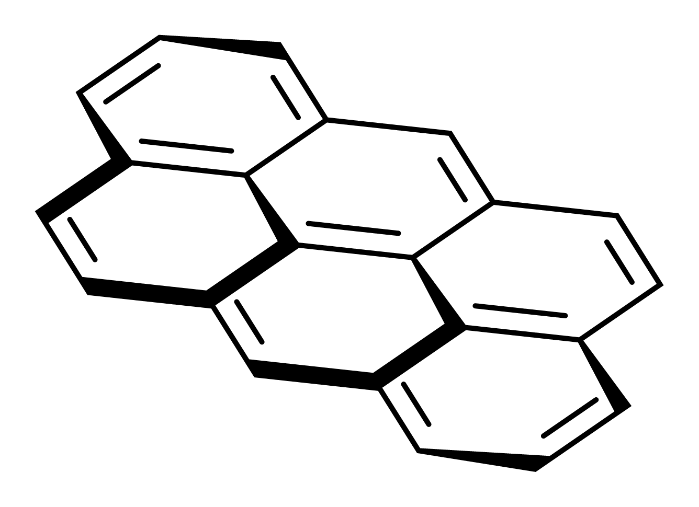
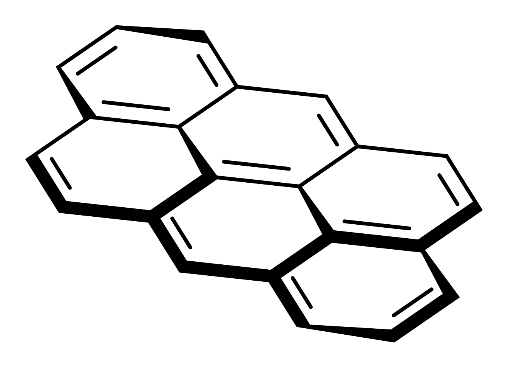

# Double-bond emphasis during 3D tilt

By @Ameyanagi in [PR #84](https://github.com/Ameyanagi/ReShiki/pull/84); draft.

**Emphasize front bonds** previously skipped double bonds. Subsequent tilts also
excluded them when finding connected perspective outlines. A tilted fused-ring
drawing therefore had thick foreground single bonds beside thin double bonds.

The command now includes double bonds. A foreground double bond uses the existing
bold-double appearance: a bold main stroke and a thin second stroke. Its midpoint
depth determines emphasis, which returns to plain when the bond moves behind the
drawing's middle plane. Further tilts include double bonds in the connected
outline without swapping their endpoints, double-bond placement or E/Z references.
Dashed secondary strokes and ordinary stereochemical wedges are preserved.

For a drawing emphasized with an older build, select the structure and apply
**Emphasize front bonds** once to include its previously unmarked double bonds.

Before:

After:

These are exports from the shared drawing renderer using the reported 22-atom,
27-bond fixture, with the same coordinates and bond orders.

The established CDX/CDXML bold-double representation retains the two-stroke
appearance without inventing tetrahedral stereochemistry. Native ReShiki
files/clipboard retain projection depth; the external formats retain the 2D
drawing appearance. Existing restrictions on other unsupported perspective
styles remain.

Regression checks cover foreground/background changes, inverse tilts, native
round trips, editable clipboard payloads, CDX/CDXML appearance and chemical
identity, including an E/Z-defined alkene. The original attachment-warning
correction and this fix are separate commits in the draft PR.

The macOS release run passed 262 library, bond, projection, crossing and clipboard
tests (two unrelated cases ignored). All five projection/exchange tests also
passed on Windows. The rebuilt macOS app passed the actual **Emphasize front
bonds**, further X tilt, Undo and Copy workflow. The live ChemDraw paste attempt
was blocked by a dialog inaccessible to the computer-control tool; no completed
ChemDraw desktop round trip is claimed for this follow-up.
