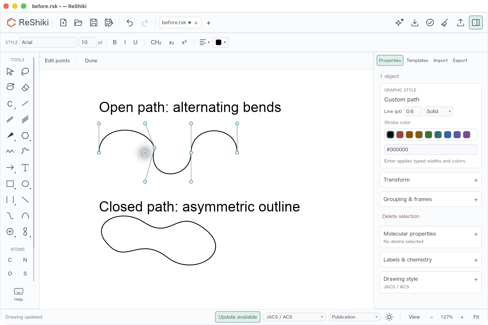
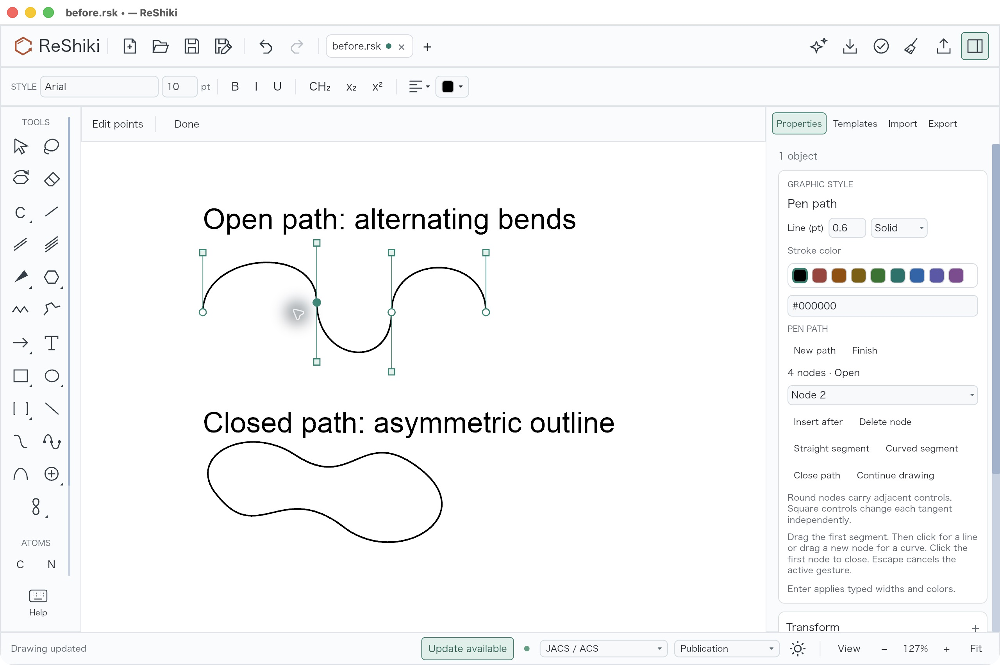
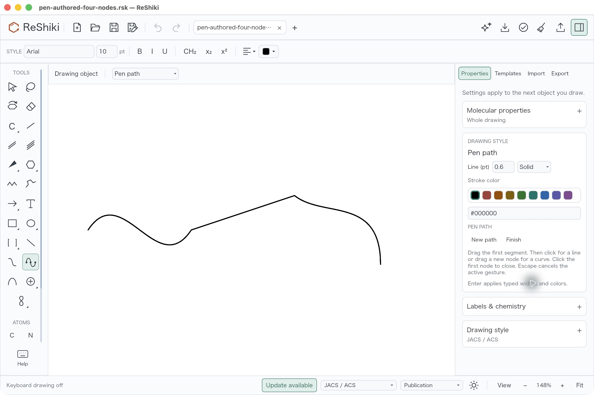
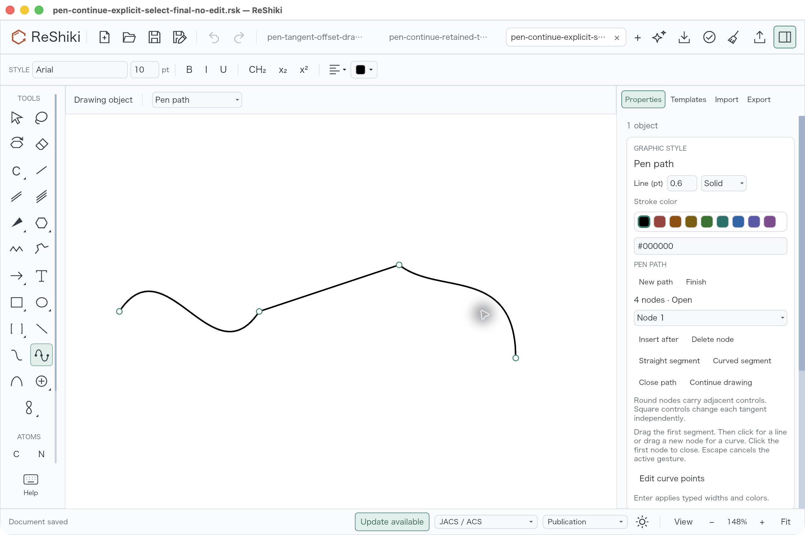
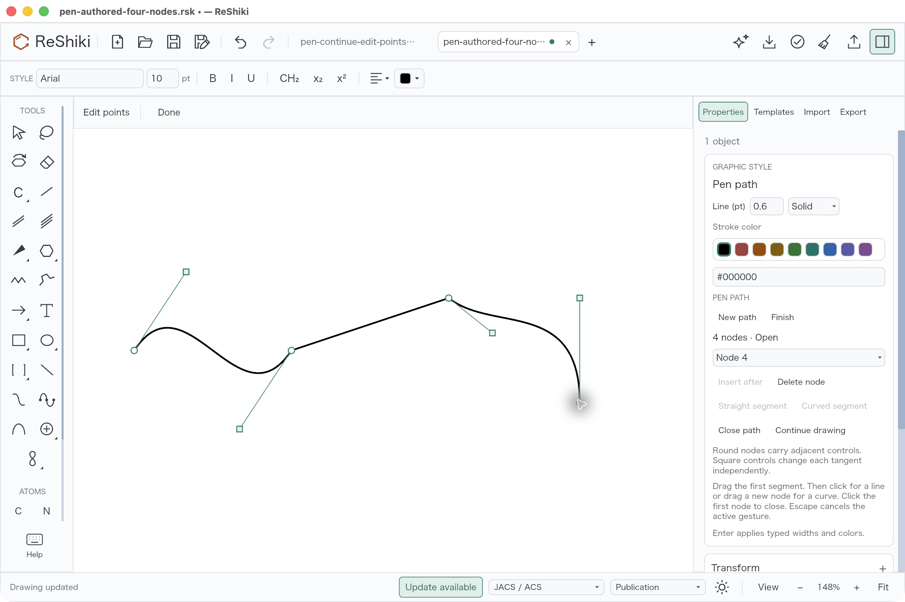
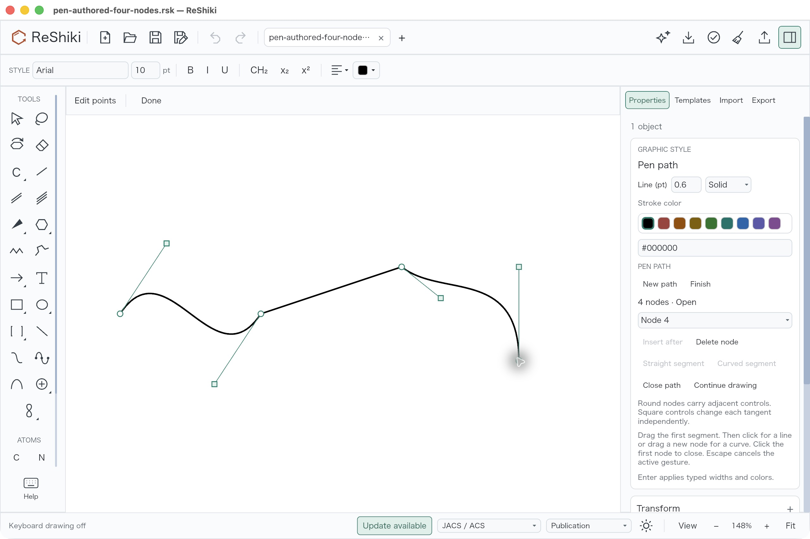
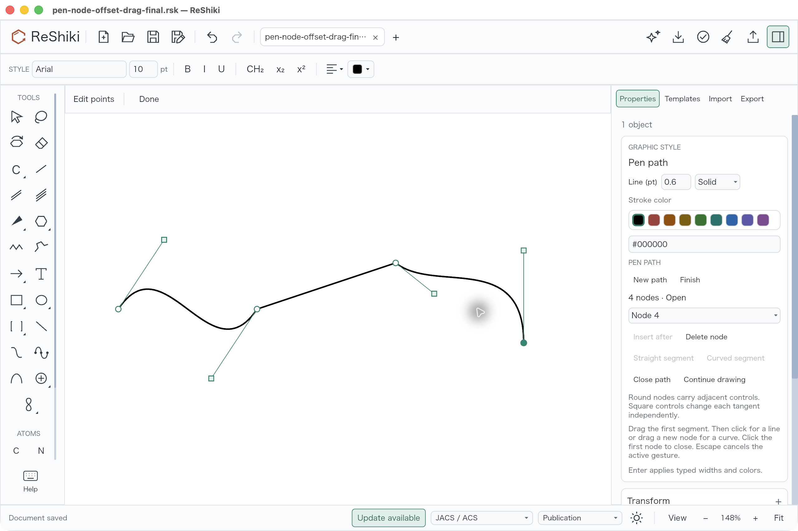
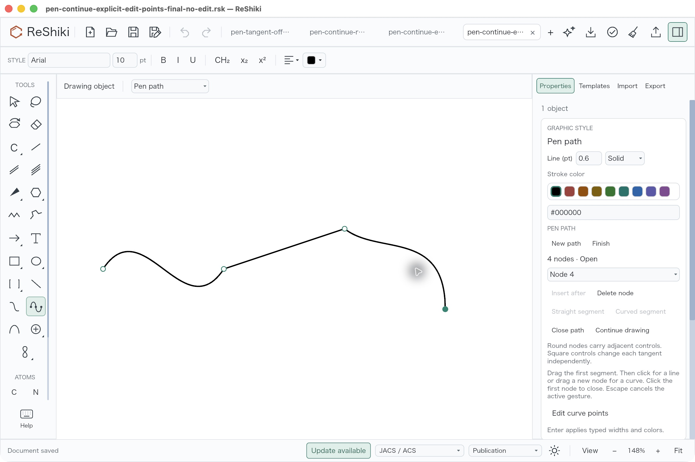
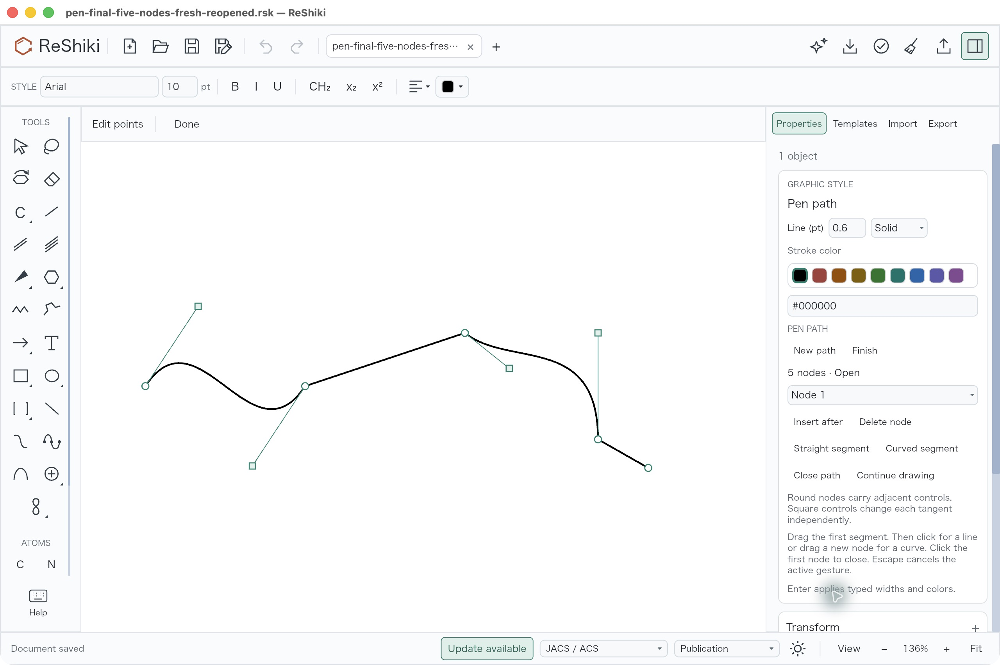

# Connected pen paths and direct node editing

Under review in [PR #288](https://github.com/Ameyanagi/ReShiki/pull/288) for [issue #67](https://github.com/Ameyanagi/ReShiki/issues/67),
contributed by @Ameyanagi. Stacked on
[mechanism-arrow curvature, PR #276](https://github.com/Ameyanagi/ReShiki/pull/276),
branch `feat/mechanism-curve-controls`, base `5e68c9b4`. This work remains
unreleased until review, merge and release.

Draw one connected path with straight and cubic segments. Drag the first
segment, click for a line, or drag a new node to set a curve. **Finish** ends
authoring; click the first node or use **Close path** to close the outline.
In **Edit curve points**, round nodes carry their adjacent tangents and square
controls adjust one tangent independently. Properties offers **Insert after**,
**Delete node**, **Straight segment**, **Curved segment**, **Open path** and
**Continue drawing**. A stationary handle click selects without changing the
path; a drag preserves the initial grab offset. Continue retains the selected
open path from both Select and Edit Points. Existing Escape cancels a gesture;
completed segments and edits each create one Undo step. No key binding is added.

## Matched visible fixes

These are untouched 2560 × 1704 JPEGs captured from native ReShiki on macOS
26.5.1 arm64, light theme, JACS/ACS style and 0.6pt black paths. No image was
cropped, resized, recompressed or retouched for publication. Selection controls
are shown where they are the subject; the finished view above is deselected.

| Problem                                                            | Before                                                                                                                                                                    | After                                                                                                                                               |
| ------------------------------------------------------------------ | ------------------------------------------------------------------------------------------------------------------------------------------------------------------------- | --------------------------------------------------------------------------------------------------------------------------------------------------- |
| An interior node leaves its adjacent tangent controls behind, 127% |                                                  |  |
| Continue clears the selected path, 148%                            |                       |      |
| A stationary near-node click creates an edit, 148%                 |  |              |

The node-transport comparison uses the same
[original two-path fixture](../../tests/fixtures/tunable-pen-lines-67/before.rsk)
and the same interior-node drag. The base desktop source is the earlier
Curves production `477b97f4`, whose relevant production behavior is unchanged at
the declared `5e68c9b4` base. The after image is historical Pen source `a7301867`,
signed binary `6209ab6c…`; this pair demonstrates tangent transport and the new
controls. The stored node delta is (19.736046, −9.872604). Both neighboring
controls move by that delta; other points and the closed outline stay fixed.

The Continue and click defects were found and fixed within this Pen PR. Their
before images are earlier Pen implementations, **not the declared stack base**.
Continue before is `a7301867`/`6209ab6c…`; click before is
`01b81dc8`/`9e5a517f…`. Their after images use final source
`2b3fdb40`/`b630b1ff…`. Both start from the exact same
[four-node native input](../../tests/fixtures/tunable-pen-lines-67/pen-authored-four-nodes.rsk),
148% framing and F8 off. The Continue before has one tab and after has three;
click before has two tabs and after one. Saved titles, selected-node choice and
status text also differ. The earlier Continue run selected Node 3; the explicit
Select after has the default Node 1 choice. Continue appends at the path end in
both cases. These UI differences do not change the input or canvas geometry.

In the earlier click save, Node 4 became (182.95792,3.8988686) and its incoming
control (182.95792,−96.101135). Final click saves retain the exact original
(183,4) node and (183,−96) control. The Undo state and native values establish
this small defect more clearly than its subpixel drawing displacement.

All published images were inspected at displayed size for legibility, clipping
and unrelated private content. Original pointer feedback remains in the
selected views. Only the active verified path is used as evidence; other
fixture tabs are incidental capture state.

## Actual authoring, clicks, drags and continuation

The original four-node path was authored in the desktop Pen tool at
`a7301867`: drag (600,900) → (900,900), click (1200,800), then drag
(1450,1000) → (1450,1200). Native Save As records exactly one graphic, id 1,
with `[move,cubic,line,cubic]`. One Undo removes the last node and one Redo
restores the complete native bytes. Native Insert/Delete, Straight/Curved and
Close/Open actions were also exercised; their original saves are retained in
[the fixture directory](../../tests/fixtures/tunable-pen-lines-67/README.md).
Those historical actions are not relabeled as final-build executions.

Final `b630b1ff…` desktop checks use that same original four-node input at 148%:

| Action                                                                                           | Native result                                                                                                  |
| ------------------------------------------------------------------------------------------------ | -------------------------------------------------------------------------------------------------------------- |
| Edit Points, click Node 4 at (1640,1140), release without moving                                 | Selects Node 4, no new history step; saved bytes equal the original.                                           |
| Click its square tangent control without moving                                                  | Selects the control, no additional history; saved bytes equal the original.                                    |
| Node drag by screen displacement (+40,−40)                                                       | Only Node 4 and its incoming control translate by approximately (+13.48618,−13.48618) world units.             |
| Square tangent drag by screen displacement (+40,−40)                                             | Only that control moves; all nodes and the other controls stay fixed.                                          |
| Explicitly choose Select, select the path, Continue, then click (1800,1140)                      | Adds one line to (236.90263,3.8988686), keeping the original graphic id 1 and all four earlier nodes/controls. |
| Explicitly choose Edit Points, select Node 4 without moving it, Continue, then click (1780,1220) | Adds one line to (230.15955,30.871231), keeping the same path and its original geometry.                       |

Every drag or append above has actual Save As, one Undo and one Redo readbacks.
Undo is raw-byte equal to the original four-node input; Redo is raw-byte equal
to its corresponding edited save. Both Continue actions themselves save the
original bytes before appending. The initial stationary node click has Undo
and Redo disabled. The tangent click was checked after existing Undo/Redo and
adds no further history, rather than claiming that earlier history disappeared.

This explicit Edit Points capture has four tabs.

A fresh process reopened the explicit Edit Points five-node save and exposed
five editable round nodes and square tangents. Undo and Redo were disabled.
The Save As readback is raw-byte equal to the appended file. This persistence
view fits at 136%, with one tab; it is a separate reopening check, not a matched
148% before/after image.

All final native drawing fixtures contain one path graphic and no molecular
atoms, bonds, arrows, annotations or groups. The independent native audit
compares every serialized field, not just node counts or screenshots. Chemical
graph preservation is additionally covered by app tests with an unrelated
C–O graph. The compact [evidence manifest](tunable-pen-lines-evidence.json)
records public fixture and image hashes, audit results and build provenance.
The [independent receipt](tunable-pen-lines-audit.json) records 5,094 passing
assertions. Its public JSON is formatting-only relative to the original receipt
at `22eea450`: every parsed value and assertion remains unchanged. The formatted
public receipt has SHA256 `694e9495bb66e4a11cd26050c295ad878d4e00f982a4bed1bc0341ba55b46fd2`; the retained original receipt has
`1d4f4d3a20aceb882bc5fb9369be58419f83abff8b79b525ca6562958b500d1a`. The compact manifest distinguishes these hashes.
The [archival checker](tunable-pen-lines-audit.py) remains byte for byte unchanged
with its original scratch-environment paths. It is an audit record, not a
portable checkout/CI command. Its excluded-trial metadata does not turn the
private exploratory files into published evidence.

## Validation and build provenance

At `a7301867`, locked workspace/all-target/all-feature check, strict Clippy,
formatting, eight model Path tests, nineteen selected app tests (six Pen tests),
two opt-in native-widget/keyboard tests, two Pen interchange/export tests, six
generic graphics tests and seven ordinary arc tests passed. They cover exact
cubic insertion, adjacent/closed-seam tangent transport, independent controls,
affine/depth preservation, atomic edge-on rejection, common preview/commit,
Escape, supported CDXML/CDX precision, native reopening and PNG/SVG/PDF output.

Continue source `01b81dc8` passed five app Path tests, the actual native Continue
activation test from both tools, the existing Pen button/keyboard activation
test and four agent headless tests with current native-version 20 envelopes.
Scoped app check, strict Clippy and formatting passed.

Final source `2b3fdb40` passed three canvas tests, seven app Path tests and the
existing generic Curve/closed-path/ordinary Arc pointer guard: eleven tests.
The new cases prove exact stationary-click preservation, grab-offset drags,
preview/commit equality, one Undo/Redo, unchanged chemistry and retained tilted
frames. Edge-on clicks select without error; real drags remain atomic and give
the rotate-before-editing explanation on release. Scoped all-feature app check,
strict Clippy `-D warnings`, formatting and diff checks passed.

The final default-feature debug app was rebuilt after refreshing all 1,072 own
tracked Rust/manifest/lock/build input mtimes without changing their bytes.
Fifteen own compiler artifacts report `fresh:false`; thirteen compilation
receipt lines identify this worktree's source. The preserved final bundle has:

- Compiled source: `2b3fdb4043fb7f4315f5c116a93194652ca09d17`.
- Signed binary SHA256: `b630b1ff119a681d82b35f0a64c20cda92e364d11e70a71f816a8ee9a9e8ed6c`.
- Raw binary SHA256: `fabda5f1b91ffafcc60ddfc7b2c560e45cc31efc3612c19d9bfbf7bb9b4ee1f0`.
- Source-input aggregate SHA256: `ac1539ac33b7ab32cdc3c5b44933dd29118f703b3f9aaeb0b217661c5ff734bb`.
- Unique bundle identifier: `dev.reshiki.pen-handles-final-verified`.
- Ad-hoc development signing; deep/strict codesign and signed CLI info passed.

The later ordinary merge `e10c876f` brings the current Curves `5e68c9b4` parent:
test-only `reference/native_aromatic.rs`, its provenance document and two exact
historical-source archives. All Pen production/test files remain unchanged.
One of the 1,072 recorded inputs, the reference test, differs after that merge;
the app receipt remains tied to 2b3f and is not relabeled as e10c. The archive
bytes were verified against their original 51fa sources. Full CI and the updated
reference-guard replay remain pending; this document does not claim execution
of that guard or native Windows/Linux validation.

## Scope and reuse

Pen reuses existing native Path commands; the inherited native version remains 20. One continuous subpath supports authoring and node operations. Imported
compound paths retain generic point editing. Continuous freehand tracing is
not implemented. Ordinary circular/elliptical arc presets and endpoint/sweep
controls remain available. Supported editable CDXML/CDX retains path geometry;
unsupported arrowed/doubled/shaded path exchange and dotted editable CDXML return
explicit errors. Mechanism endpoint attachments remain a separate feature.

Release caption: **Draw connected pen paths, adjust nodes and tangents, and
continue the same object without unintended edits.**
Reusable image: `docs/images/tunable-pen-lines/pen-final-continued-clean.jpg`.
Original code, drawing fixtures and ReShiki screenshots are contributed under
MIT OR Apache-2.0. No vendor artwork or third-party source was added.
