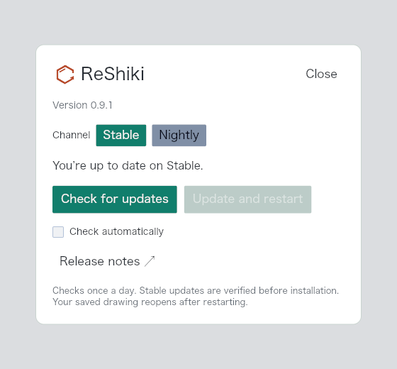

# Stable and Nightly update channels

The existing **Check for updates** window now has a saved **Stable / Nightly** choice. Stable remains the default. Changing channels checks immediately, preserves the automatic-check preference, and clears results from the previous channel.

Stable offers the verified **Update and restart** flow. Nightly offers **Download portable ↗**, which opens the ZIP or tar.gz matching the current operating system and architecture. Nightlies are unsigned portable builds, installed manually; they cannot enter the signed stable installer. Keep the extracted contents together and retain a stable installation when testing.

Within either channel, only newer versions are offered. A switch between an installed stable and nightly version offers the selected channel even if its semantic version is lower: stable `0.9.1` can find `0.9.1-nightly.20260929.36501221724.1`, and a nightly can return to the latest stable. Daily success caches and hourly failure caches are separate by channel; manual checks bypass them. Results from an earlier request cannot replace a later channel selection.

## Evidence




These are unmodified 560 × 520 PNG captures of the actual application update-dialog renderer, not desktop screenshots. Run `cargo test --locked --bin reshiki app::updates::tests::update_channels_headless_snapshot -- --ignored --nocapture` to reproduce them under `artifacts/update-channel-qa/`. The fixture uses an empty drawing, installed version `0.9.1`, stable `0.9.1`, and the published nightly `0.9.1-nightly.20260929.36501221724.1`; automatic checks are off. The same capture also covers dark appearance. The isolated dialog is rendered at 1×; canvas zoom does not apply.

Base: `60718b3c305e76a4a13f07df4c4a909807ef35c9` (`origin/main`). Source head: `3457f4a9813a76368766637725a90e28e1b9ea49`. Platform/build: macOS 26.5.1 arm64, debug Rust application, Iced headless renderer. The renderer captures were visually inspected in light and dark appearance. No installation was performed for these images.

## Real desktop interaction

A separate check used the isolated **ReShiki Update Channels QA.app**, built from the same source, on macOS 26.5.1 arm64 in light appearance. Its own application data directory contained the older Boolean `false` automatic-check preference and no channel setting. The update window opened on Stable with automatic checking still disabled. Selecting Nightly fetched `0.9.1-nightly.20260929.36501221724.1`, and **Download portable ↗** downloaded the matching `macos-arm64.zip` (20,174,044 bytes). Its SHA-256 matched the published release checksum:

```text
f83b9a68fc86cf9319c05d52ff3f8c9d0031f57df32a3d296239904d13cbf02c
```

Quitting and reopening the QA app preserved Nightly and the automatic-check opt-out. Selecting Stable performed a fresh check and showed “You’re up to date on Stable.” The dialog was unclipped, with the download button on one line. No in-app installation was exercised; existing user profiles and drawings were unchanged. Returning from an installed nightly to an older stable version is covered by the version-comparison tests.

## Validation

Targeted checks cover stable and nightly metadata filtering, numeric nightly ordering, cross-channel switches, all six nightly package URLs, channel-specific cache reuse and manual bypass, old Boolean preference compatibility, persistent channel selection, stale responses, automatic-check opt-out, and rejection of nightlies by the stable installer. Existing unsaved-drawing, assistant, atom-label, checksum, and install rollback tests pass. The targeted library group passed 10 tests; the app group passed 6 including the renderer capture. An opt-in live check also found stable `0.9.1` and the published nightly. Rust formatting, all-target/all-feature Clippy with warnings denied, Cargo check, documentation checks, and the documentation build passed; the build verified 6,618 local links/assets and 750 downloadable palette colors. The signed-DMG installation test was not run.

## Release-note material

Caption: Choose Stable or Nightly in Check for updates; stable updates retain verified installation, while nightly builds download as portable archives for manual installation.

Reuse `docs/images/update-channel/nightly.png`. The image shows a renderer fixture with automatic checking disabled; it does not demonstrate downloading or installation.
