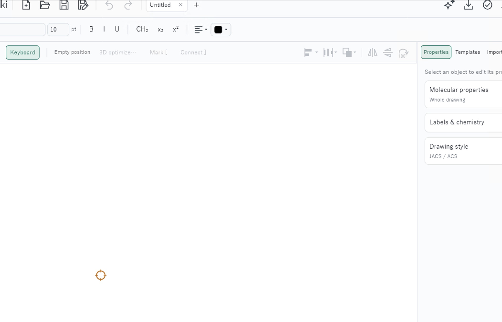
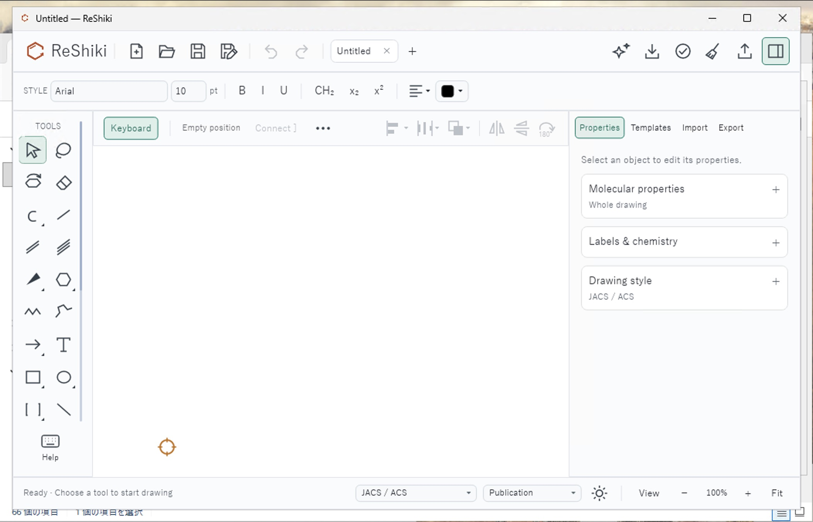
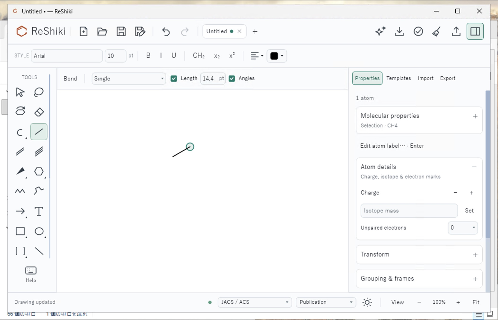
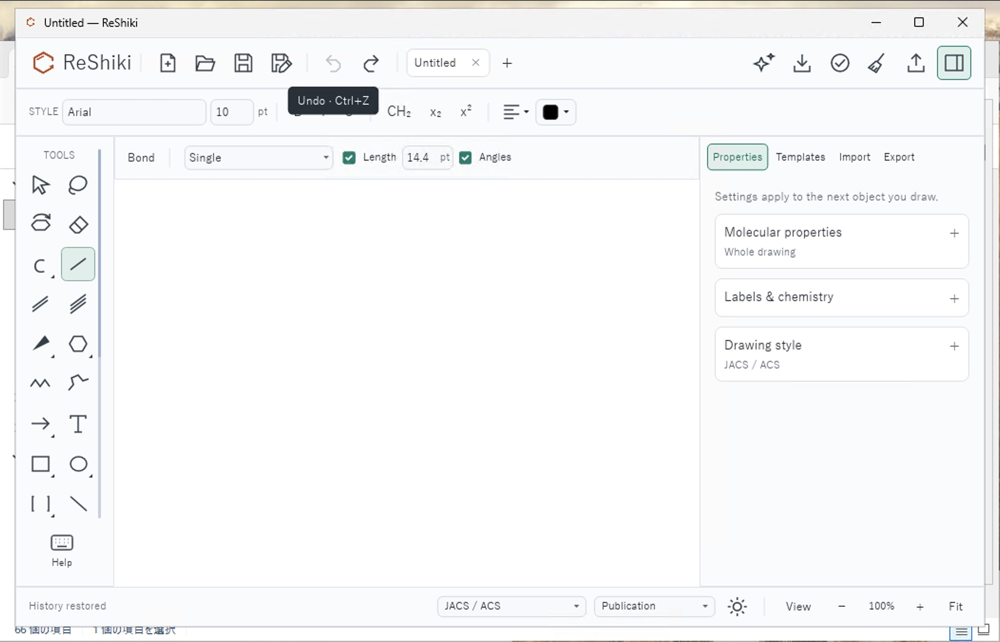

# Windows window fitting (#108)

Under review in [draft PR #273](https://github.com/Ameyanagi/ReShiki/pull/273).
Recorded native checks cover the 100% DPI small work area and mouse history;
the remaining native matrix below is still pending.

The Windows editor now fits its initial decorated window inside the selected
monitor's work area. It keeps the normal DPI scale and preferred 1280 × 820
logical client size when those dimensions fit. On smaller work areas, it lowers
both the initial size and the 1040 × 680 logical minimum as needed.

The hidden HWND supplies its actual physical client/frame bounds, work area and
per-window DPI. The fit reserves an eight-logical-pixel margin, changes size and
minimum constraints through Iced, and places the outer frame using physical
screen coordinates. Accessibility installation and initial visibility wait for
the fit. A DPI change fits the current window without resetting it to the
preferred startup size. Negative monitor origins and side taskbars are covered.

## Reproduction and evidence

Base: `51fa0991`. The unchanged source requests 1280 × 820 logical pixels.
At the issue's reported 200% scale, that is a 2560 × 1640 physical client on a
2256 × 1504 screen, already too large before adding window decorations. This
source-derived witness confirms the size defect; it is not a desktop screenshot
or a measurement of the reporter's taskbar/frame dimensions.

The regression test also models a 2256 × 1408 work area with 32 × 78 physical
decoration pixels at 192 DPI. The fitted logical client is 1096 × 649 and the
minimum is 1040 × 649. These frame/taskbar values are test inputs, not measured
values from the issue.

The unchanged Windows executable is retained separately from the candidate:
SHA-256 `135779960a15c17bac51e00c614600422531a30b90480d6cb1ba8de5b795e51d`.
Both use Rust/Cargo 1.99.0, the x64 MSVC toolchain, no incremental compilation,
and dev-profile debug information disabled. Baseline `--graphics-info` reports
Microsoft Basic Render Driver/DX12, a CPU device and automatic `tiny-skia`.
Candidate SHA-256:
`b38cac810f799fca1b2ae4e841d4d042c7f01709ef888fbe3feac9d8fbf195ed`.
Its recorded production source is `7cab2287`; the evidence and probe correction
below do not change application code or either preserved executable.

### Actual initial-launch comparison

| Unchanged baseline, fresh empty editor                                                                                          | Candidate, fresh empty editor                                                                                              |
| ------------------------------------------------------------------------------------------------------------------------------- | -------------------------------------------------------------------------------------------------------------------------- |
|  |  |

These are actual Windows desktop captures of separate fresh task profiles and
the same untitled, empty drawing. Both original screenshots are 2104 × 1504
host-side pixels. Both public images use exactly the same crop
`[0, 56, 2104, 1408]`, giving 2104 × 1352 pixels and excluding the RDP frame and
desktop taskbar. The decoded screenshot pixels are unchanged: no resize,
annotation or retouching. The candidate reveals a generic Explorer status area
behind its smaller window; no private filename, account or document tab is
included. Pointer and toolbar state are visible.

The baseline image is PID 9464's initial launch **before** any viewport cycle.
The candidate image is PID 10884's initial blank editor before drawing.
The baseline's numeric window measurement was taken later after temporarily
enlarging and restoring the RDP viewport to reach its console. It is explicitly
separate from the initial image; unchanged initial bounds are not claimed.
[Capture hashes and crop provenance](../images/windows-window-fit/capture-provenance.json)
and [native measured results](../images/windows-window-fit/measured-results.json)
retain that distinction. Absolute executable/profile paths are omitted from
the public measurement record; relative artifact labels replace them.

## Validation

Completed on Windows 11 build 26200:

- `cargo +1.99.0 build --locked --bin reshiki`: passed.
- `cargo +1.99.0 test --locked --bin reshiki window_fit:: -- --nocapture`:
  six tests passed. Coverage includes the reported 200% overflow, roomy and small
  work areas, 100–250% DPI including fractional scales, decorated outer bounds,
  lowered minimums, negative origins, side taskbars, DPI changes, and rejection
  of invalid measurements.
- `cargo +1.99.0 clippy --locked --bin reshiki -- -D warnings` and
  `cargo +1.99.0 clippy --locked -p reshiki-windows --lib -- -D warnings`:
  passed.
- Formatting and diff whitespace checks passed.

### Native small-work-area check

An actual Windows 11 build 26200 interactive-session probe on 2026-10-10 verifies
the preserved candidate from `7cab2287` at 100% DPI. Its executable hash matches
the candidate above. The editor has a visible title bar, footer and panels.
Its saved read-only probe records:

| Measurement       | Native Windows guest value                     |
| ----------------- | ---------------------------------------------- |
| DPI / scale       | 96 / 1.0                                       |
| Monitor           | 1052 × 724 physical pixels                     |
| Monitor work area | 1052 × 676 physical pixels                     |
| Decorated window  | (8, 8)–(1044, 668), 1036 × 660 physical pixels |
| Client            | 1020 × 621 physical and logical pixels         |
| Fits work area    | True; independently recomputed                 |
| Clearance         | Eight physical pixels on every edge            |

The RDP client viewport was 2104 × 1504; that host-side dimension is not the
Windows guest monitor measurement. This is native small-work-area evidence at
100%, not a measured 200% or 250% DPI result. The probe does not record a window
title; screenshots establish visible title and controls separately. The source
witness and policy-test dimensions above remain distinct from these native
measurements.

The later baseline probe, explicitly labeled `afterviewportcycle`, records the
same 96 DPI, 1052 × 724 monitor and 1052 × 676 work area. Its outer rectangle is
(-8, -8)–(1060, 732), or 1068 × 740 pixels, with a 1052 × 701 client and
`FitsWorkArea=false`. The queried outer bounds exceed the work area by eight
pixels on the left/top/right and 56 pixels at the bottom. These are **post-cycle**
bounds, not the original 1280 × 820 logical size requested by the source. The
probe does not record maximized/window-placement state. The exact original
launch/probe hashes and timestamps are retained in the public measured results;
their hashes identify the privately preserved original receipt bytes, not the
separate redacted public JSON.

### Actual mouse drawing and Undo

| Candidate after mouse drawing                                                                                                    | Candidate after two mouse Undo clicks                                                                                                       |
| -------------------------------------------------------------------------------------------------------------------------------- | ------------------------------------------------------------------------------------------------------------------------------------------- |
|  |  |

Root exercised the visible drawing tool and clicked the header Undo control
twice, returning to an empty unmodified drawing. The selected drawing controls,
atom highlight, status and Undo tooltip are interaction evidence. This checks
mouse drawing/history and reachable controls; it does not claim the full menu,
resize or DPI-change matrix.

### Remaining native acceptance

The initial-launch images and separately timed native measurements above cover
the 100% DPI small desktop. Full resize/minimum, menu and DPI-change interaction
remains pending, as do native 200% and 250% physical-DPI checks. This PR remains
draft; the source witness and policy tests do not complete that matrix.

| Native case                                 | Status                                                                                             |
| ------------------------------------------- | -------------------------------------------------------------------------------------------------- |
| 100% DPI, small work area                   | Initial images, candidate fit, separate post-cycle baseline bounds and mouse drawing/Undo recorded |
| 200% DPI (192 DPI), reported display        | Pending actual work-area/frame measurements and interaction                                        |
| 250% DPI (240 DPI), small logical work area | Pending actual work-area/frame measurements and interaction                                        |
| Roomy 100% desktop                          | Pending preferred-size and minimum interaction                                                     |
| DPI change or move to another-DPI monitor   | Pending containment, UI scale, accessibility and resize check                                      |

### Separate startup and probe observations

One second launch of the unchanged baseline displayed `0xc0000142`
([`STATUS_DLL_INIT_FAILED`](https://learn.microsoft.com/en-us/openspecs/windows_protocols/ms-erref/596a1078-e883-4972-9bbc-49e60bebca55)). A focused Windows event confirms that status but
does not identify a DLL or establish a cause. It is not accepted as window-size
comparison evidence and is not attributed to the sizing fix. A later retry of
the same preserved baseline succeeded in the actual GUI and supplied the
initial before image above. The transient failed launch is retained separately;
its cause remains unidentified.

The original read-only probe also exposed a Windows PowerShell 5.1 comma-array
arithmetic error while constructing `ClientLogical`. Parenthesizing each
division fixes that measurement harness. The exact original expression
reproduces the error, and three corrected pure arithmetic cases at
125%, 200% and 250% pass with zero parser errors. Original scripts and console
evidence are preserved; no application rebuild or sizing-code change was made
for this probe correction.

Capture a fresh, unmaximized empty editor for each executable at the same
resolution, scale, taskbar configuration, renderer settings and framing. First
use 200% DPI where the original window overflows; also check a small logical
work area such as a 1024 × 768 desktop and a roomy 100% desktop. Record the actual
work area rather than assuming the full monitor is available. Close one build
before starting the other and use separate clean data directories.

Run this read-only probe in the same interactive session as the editor:

```powershell
powershell -NoProfile -File scripts/probe_windows_window.ps1 -EditorProcessId <PID> -SourceCommit <COMMIT>
```

Retain its executable hash, DPI, physical outer/client/work bounds and
`FitsWorkArea` result alongside each screenshot. The fixed outer frame must
fit the work area, including decorations; all window controls must be reachable.
Resize down to the lowered minimum, open menus and perform a drawing operation.
When another DPI is available, change DPI or move to that monitor and recheck
containment, UI scale, accessibility and resizing. A same-DPI work-area change
alone is not currently a fit trigger.

Release-note caption: “The Windows editor now fits smaller and high-DPI desktop
work areas while preserving the normal UI scale.”

Image alt text: “The same Windows desktop before and after fitting the ReShiki
window: the fixed window and its controls stay inside the available work area.”
Reusable images: [initial before](../images/windows-window-fit/before.png),
[initial after](../images/windows-window-fit/after.png),
[mouse drawing](../images/windows-window-fit/drawing.png) and
[Undo](../images/windows-window-fit/undo.png). They demonstrate the recorded
100% small-desktop case; native higher-DPI and full interaction acceptance
remains pending.
