# Local chemical naming desktop review

This page preserves the broader original `aaa6f9b7` / signed `1c7d…` desktop
review. The later process corrections, completed cross-platform CI and fresh
signed `062b…` desktop smoke are documented in the
[current-source supplemental review](changes/local-chemical-naming.md).
Earlier captures and build receipts are not relabeled as the corrected app.

Both naming directions run locally: embedded OPSIN 2.9.0 parses names, and
original Rust rules generate names within the declared organic subset, followed
by exact local OPSIN reconstruction. Java 11+ HotSpot is an installed prerequisite.
There is no naming API, network fallback or general synonym database. See the
[coverage and runtime guide](chemical-naming.md); preferred IUPAC name (PIN)
selection is not claimed.

The actual macOS arm64 application was reviewed on 2026-10-10 Japan time
(2026-10-09 UTC). Reviewed source:
`aaa6f9b791d0c256603e83ee96f0c232dfdf2c00`; signed executable SHA256:
`1c7d39e208a86f6cab7c4db9da9b48e2b28438f363cbe206f07a01b4ca6f61f1`.
The unique **ReShiki Local Naming Verified.app** was launched through the desktop
using its absolute path. Kernel executable-path/SHA receipts establish which
app ran. All 19 own compiler artifacts across 16 packages were freshly compiled
from this worktree before copying and signing the app; signature verification
passed. Later `74fbcac3` and `e7bc9156` commits change only the CI helper-path
expression and canonical Java selector; the reviewed application is unchanged.

Declared PR base: `51fa0991da2507bb00b27c1b420e807468de6423`.
The before image comes from a historical preserved signed baseline, SHA256
`493a0cb49f79f76ae2ee0716a690c20ce3981f15f701c0a9651552addaa8bf95`, with its
own kernel path/hash receipt. No fresh compiler receipt correlates that baseline
binary with the declared base; the exact-source build proof applies to the local
candidate above. The [older HTTP prototype review](chemical-naming-visual-review.md)
is historical only and does not validate this implementation.

## Local name parsing and insertion

| Preserved baseline: Import has no chemical-name workflow                                                                                                | New local workflow: ethanol is parsed into an editable preview                                                                                       |
| ------------------------------------------------------------------------------------------------------------------------------------------------------- | ---------------------------------------------------------------------------------------------------------------------------------------------------- |
| 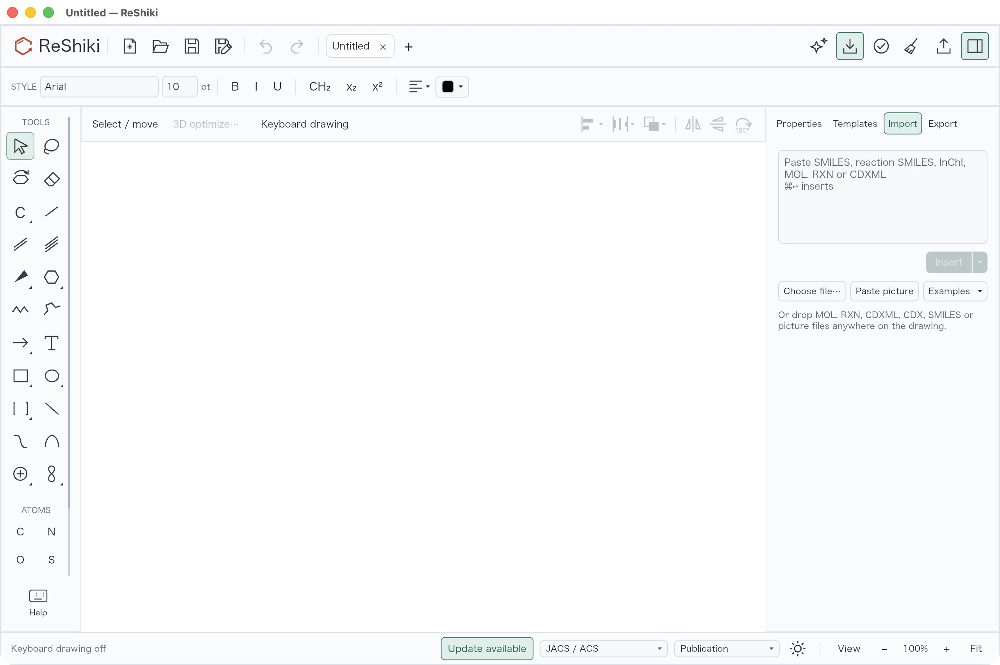 | 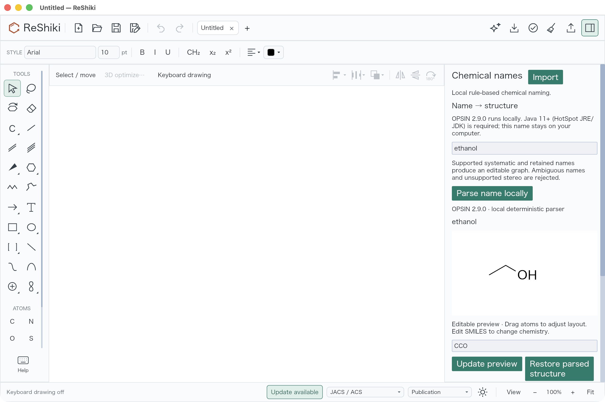 |

Open **Import → Chemical names…**, enter `ethanol`, and choose **Parse name
locally**. The preview is `CCO`, three atoms and two bonds; the main drawing
stays empty until **Insert editable structure**. Scroll in the panel margin to
reach that action. Actual scrolled insertion passed.

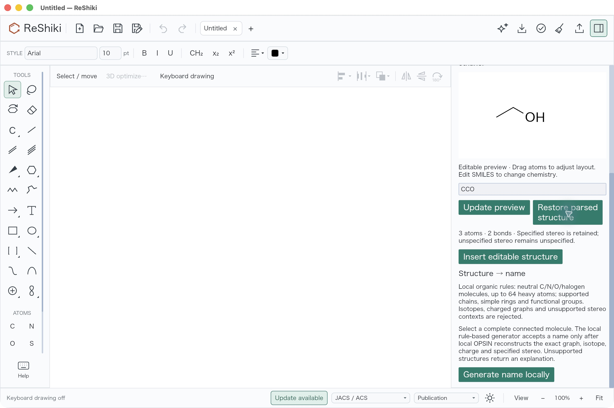

All captures use JACS / ACS, Arial 10 pt and keyboard drawing disabled. The
baseline and both ethanol preview captures are at 100% document zoom. The new
Names inspector is 340 logical pixels wide versus the baseline's 300, with
different scroll positions. These are new-workflow examples, not matched images
of a rendering correction. The preview has its own fitted camera.

Ordinary wheel input inside the editable preview pans its camera;
Command/Control-wheel zooms. A review pan moved ethanol outside the preview
without changing its graph. **Restore parsed structure** recentered it; the
captures above show the restored preview. Use the header/margin to scroll the
outer panel.

| Insertion: complete editable graph                                                                                                                  | One Undo: main drawing empty again                                                                                                 |
| --------------------------------------------------------------------------------------------------------------------------------------------------- | ---------------------------------------------------------------------------------------------------------------------------------- |
| 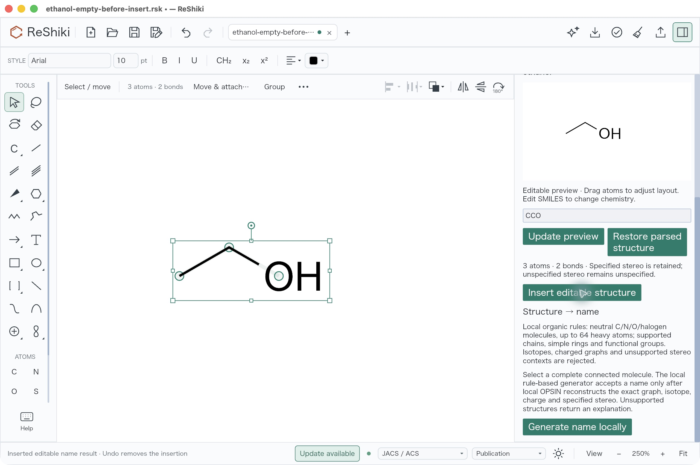 | 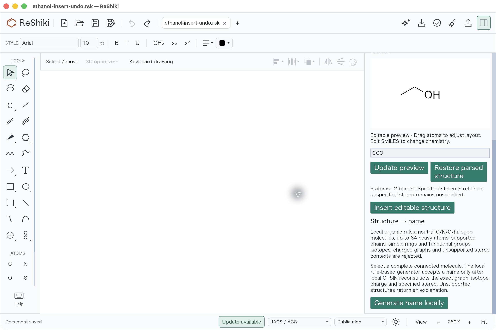 |

Insertion/Redo fitted the document to 250%. Selection handles intentionally show
the complete inserted graph. Save As snapshots prove that insertion Undo restores
the exact empty native file, and Redo restores the exact inserted file, including
positions and every chemical field. These comparisons do not rely on appearance.

## Local structure naming and captions

Select the complete `CCO` graph and choose **Generate name locally**. The actual
result is `ethan-1-ol`, labeled **ReShiki rules 1 · verified by local OPSIN 2.9.0**.
The panel states the supported domain and does not claim general PIN selection.

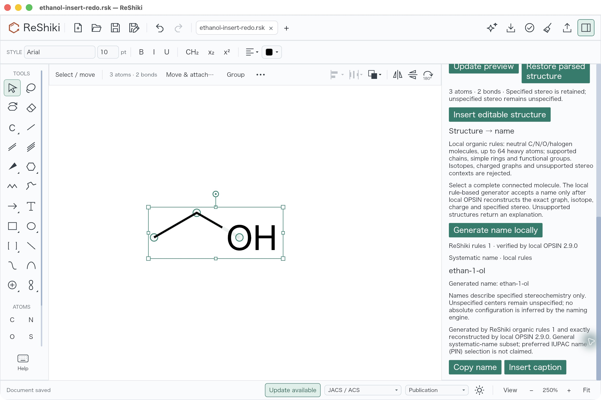

Choose **Insert caption**. One annotation containing `ethan-1-ol` is added without
changing any other native field. One Undo removes only that caption; Redo restores
the exact caption snapshot. The result is marked previous after the drawing
changes, requiring regeneration before another caption insertion.

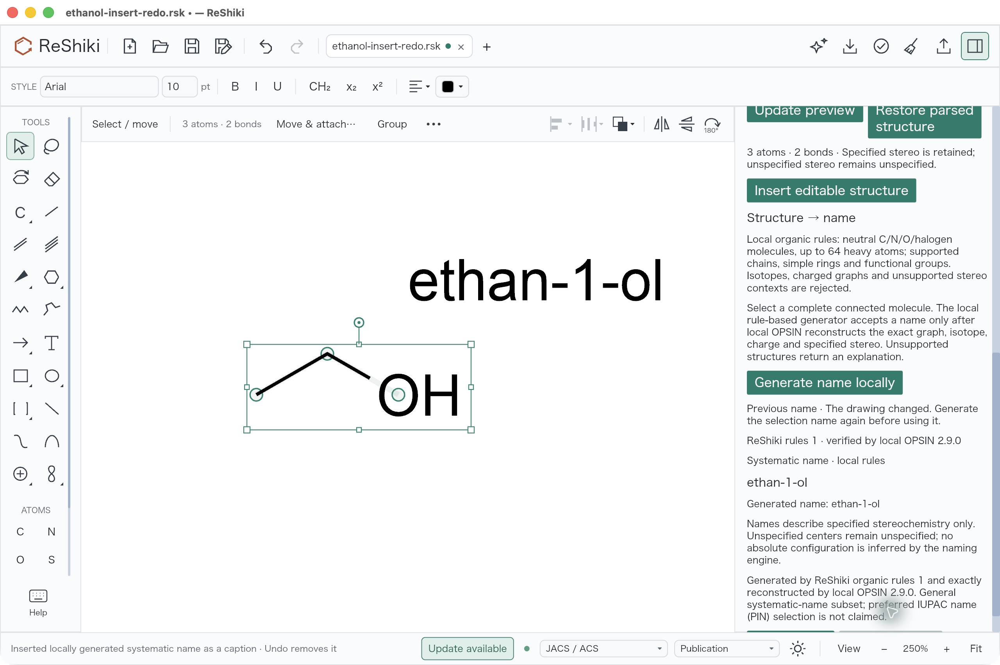

## Specified stereo and explicit rejection

In a new tab, parse `(R)-lactic acid`. The actual native preview is
`C[C@@H](O)C(=O)O`, six atoms and five bonds, with specified R stereo. Insert it,
select the complete molecule, and generate its local systematic name:
`(2R)-2-hydroxypropanoic acid`.

| Local R-lactic preview, main drawing still empty at 100%                                                                                | Complete selected graph and local systematic result at 250%                                                                                      |
| --------------------------------------------------------------------------------------------------------------------------------------- | ------------------------------------------------------------------------------------------------------------------------------------------------ |
| 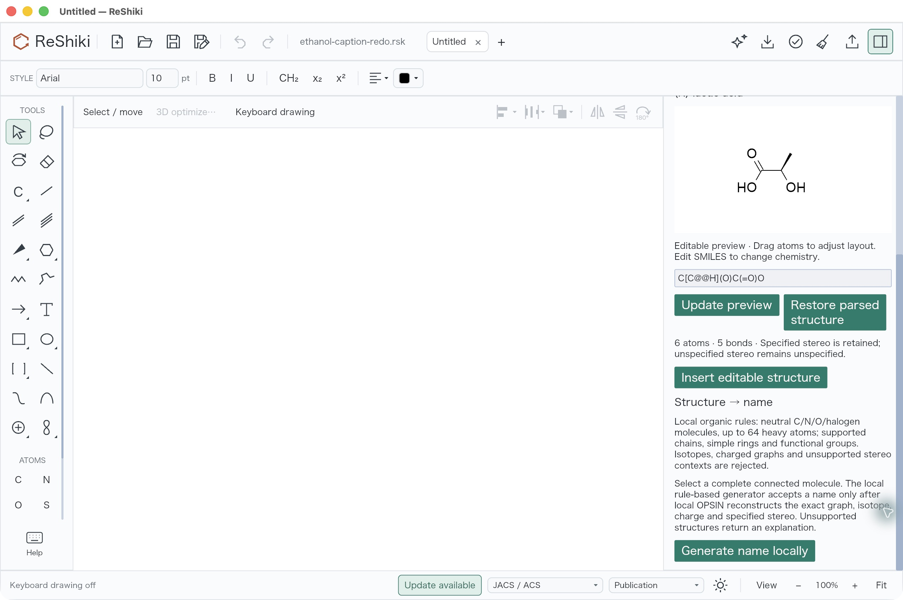 | 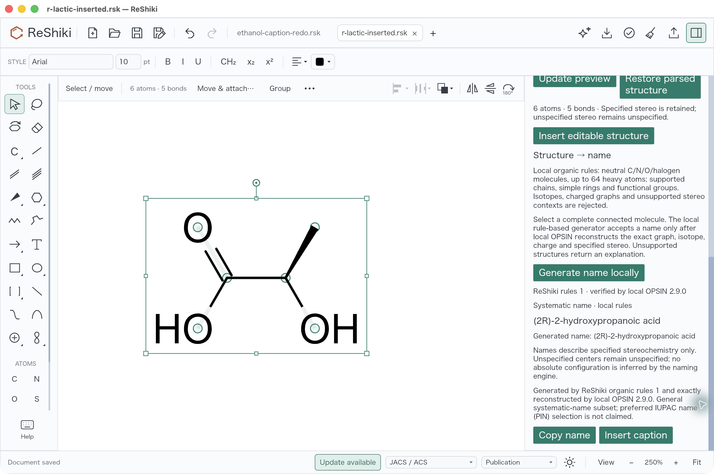 |

Then enter `(+)-lactic acid` and parse it. The app rejects
`STEREOCHEMISTRY_IGNORED`: optical rotation alone cannot assign absolute stereo.
It publishes no preview/Insert action for that input. The saved native drawing is
byte-identical to the previously inserted R-lactic graph.

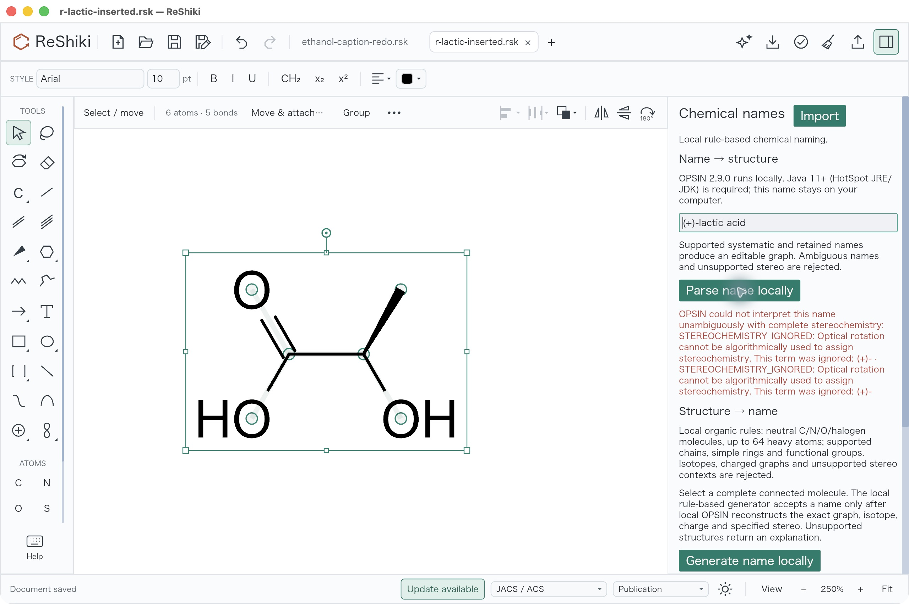

## Fresh-process reopening and native evidence

The reviewer quit the app, confirmed no ReShiki process remained, then relaunched
the exact unique signed app through the desktop. Open and Save As of the R-lactic
and ethanol-caption files retained identical original native bytes. Undo/Redo
were disabled in this fresh process. Properties show `C3H6O3` and
`C[C@@H](O)C(=O)O` for R-lactic, and `C2H6O` / `CCO` for ethanol.

| R-lactic acid reopened with specified stereo                                                                                                                  | Local ethanol caption reopened with no selection handles                                                                                  |
| ------------------------------------------------------------------------------------------------------------------------------------------------------------- | ----------------------------------------------------------------------------------------------------------------------------------------- |
| 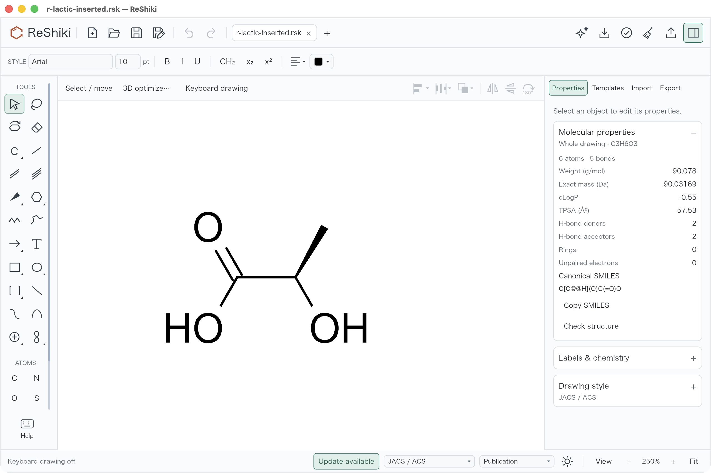 | 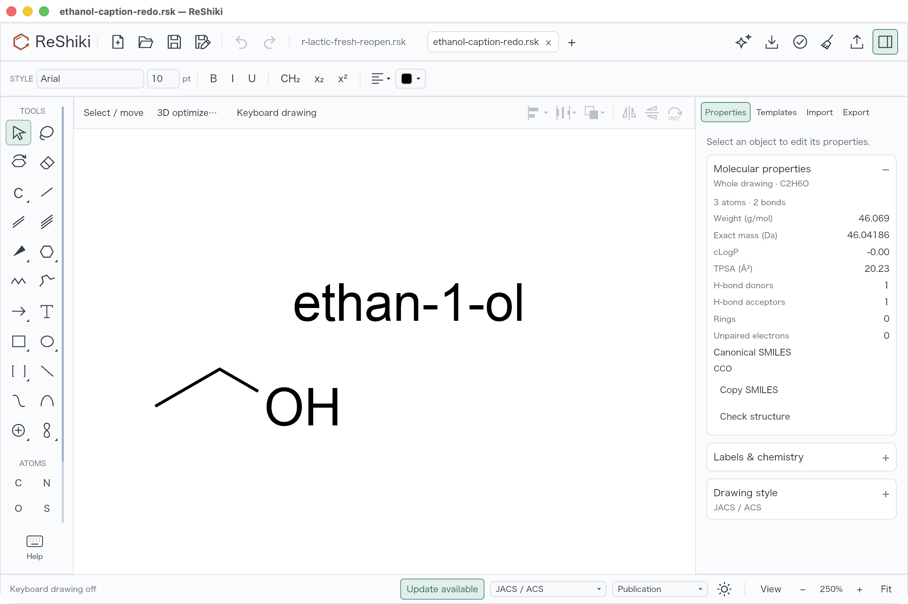 |

The shared application bundle ID surfaced recovery UI during review; the reviewer
dismissed it using the observed footer. No source fixture was modified. Only the
local candidate ran for these after checks. GUI **Cancel** was not clicked;
cancellation/drop/permit recovery claims come from the separately executed
compiled process and state tests.

The [native fixture package](../tests/fixtures/chemical-naming/local/README.md)
contains all 11 original Save As files and a [SHA256/provenance manifest](../tests/fixtures/chemical-naming/local/provenance.json)
for all 12 original JPEG screenshots and the native files. A portable
[stdlib-only verifier](../scripts/verify_chemical_naming_desktop.py) checks hashes,
four raw history/rejection/reopen equality groups, independently expected
connectivity/H/stereo, and the one-caption-only native delta:

```sh
python3 scripts/verify_chemical_naming_desktop.py
```

The [independent saved-native QA receipt](../tests/fixtures/chemical-naming/local/independent-desktop-qa.md)
confirms the four byte-equality groups and single-caption-only delta. Exact signed
native CLI analysis under network denial returns ethanol `CCO` / `C2H6O` and
R-lactic `C[C@@H](O)C(=O)O` / `C3H6O3`. Every nonempty saved graph independently
matches its reference in RDKit 2026.03.6. Native tetrahedral winding/neighbor
parity and separate wedge/coordinate reconstruction both assign lactic atom 2
as R, ignoring cached CIP and hydrogen labels. This audit checked files and
headless outputs; it did not replay GUI actions. RDKit is a maintainer validation
tool, not an application dependency.

Independent expected-name/permutation cases, actual local parser reconstruction,
strict rejection, six-target process compilation and the full workspace suite
are recorded in the [guide](chemical-naming.md#reproducible-validation).
The macOS naming/process checks were run with networking explicitly denied.
Actual desktop interaction verifies the local UI; it does not replace the
network-denied tests or establish other-platform runtime behavior. The later
[current-source review](changes/local-chemical-naming.md) records completed
native Java CI, retained earlier failures and its separate fresh desktop smoke.

Release caption: Parse supported chemical names into editable structures and
generate local systematic names for supported organic graphs, with specified
stereo checks and one-step Undo.

All screenshots are original unretouched native JPEGs; no cropping, recompression
or annotation was applied. All 12 images were visually inspected. Controlled
chemical test data and original evidence are contributed under MIT OR Apache-2.0;
the pinned OPSIN/dependency notices retain their separate upstream licenses.
