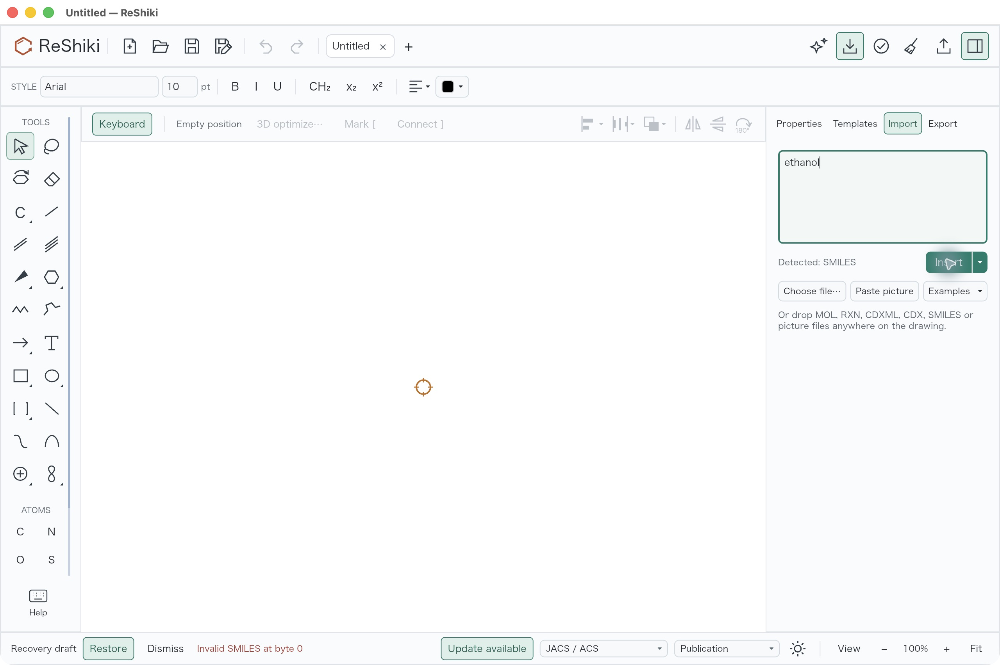
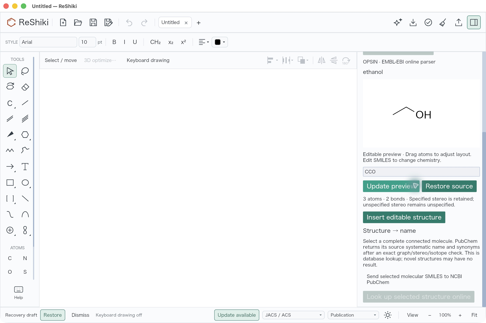
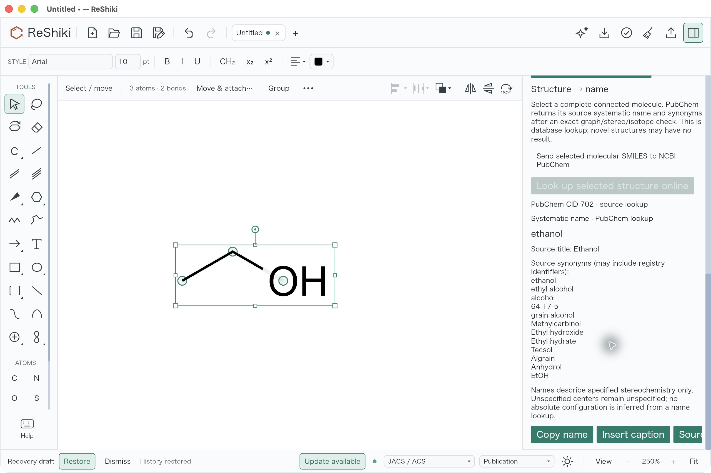

# Historical chemical naming desktop review

**Superseded prototype evidence.** These captures validate the earlier HTTP implementation only. The user subsequently required both directions to be local and rule based. The current offline revision removes OPSIN HTTP and PubChem naming paths; its [separate local desktop review](chemical-naming-local-visual-review.md) records the current native validation and screenshots. These original captures are retained as chronology, not proof of the local revision.

Before source: `51fa0991da2507bb00b27c1b420e807468de6423`.
Reviewed application source: `8529b3fc17699d5b4003300e7fe4b463bf121f8a`.
Platform: macOS arm64, locked debug bundles, native screenshots taken on 2026-10-09.
Signed candidate executable SHA256: `467aaeb6b71a18a51946b831bdc5546f389f2e53f1469665a78356f667af7ce5`.
All local workspace crates were rebuilt from this worktree before preserving the candidate;
`codesign --verify --deep --strict` passed.

| Before                                                                                       | New name-to-structure workflow                                                                                                |
| -------------------------------------------------------------------------------------------- | ----------------------------------------------------------------------------------------------------------------------------- |
|  |  |

Both captures start with a blank JACS / ACS drawing at 100% document zoom and default 10 pt labels. Before: keyboard drawing is enabled; type `ethanol` into Import and press Insert; the app reports invalid SMILES at byte zero. After: keyboard drawing is disabled with F8; choose Chemical names, select OPSIN, enter `ethanol`, explicitly permit sending the name, and Resolve. The Names inspector is wider (340 rather than 300 logical pixels), and its preview capture is scrolled to show the source, editable SMILES and insertion action. The document remains blank until insertion. This is a new workflow comparison; panel width, scroll position and keyboard state differ.

The final actual desktop replay inserted the scrolled preview, removed the complete structure with one Undo, restored it with Redo, then selected all three atoms and two bonds. Separate consent sent `CCO` to PubChem. The first request in this final replay returned CID 702, systematic name ethanol, source title and synonyms. Each request cleared its send consent.

The reverse capture is at 250% after insertion/Redo fit the document, with keyboard drawing disabled. Selection handles intentionally demonstrate the complete graph required by this lookup. The native result was saved through the desktop Save As command as [ethanol-desktop-final.rsk](../tests/fixtures/chemical-naming/ethanol-desktop-final.rsk). It contains exactly three atoms, two single bonds and no annotations, arrows, graphics or groups. Analysis through the exact signed candidate reports valid `CCO`, formula `C2H6O` and InChIKey `LFQSCWFLJHTTHZ-UHFFFAOYSA-N`, without warnings. The lookup is a source database lookup and may have no result for a novel graph; it is not an offline general IUPAC generator.

Earlier review at `f4487a57f1134cc805764910666fe2687ca1f249` also verified caption insertion and its single Undo step before saving [ethanol-desktop.rsk](../tests/fixtures/chemical-naming/ethanol-desktop.rsk). That review required three explicit PubChem requests after two temporary Bad Gateway responses; there were no automatic retries. The final source retains the same caption behavior and adds the stale-preview correction described below. These earlier checks are retained as review chronology, rather than attributed to the final capture.

Desktop review found and fixed a preview mouse-coordinate leak after inspector scrolling and missing native action semantics. Independent review also found that a pending local rebuild could overwrite newer SMILES input. Editing the text now invalidates that older local job while preserving the current preview; insertion remains blocked until the latest text is rebuilt. All ten focused app tests passed, including actual renderer accessibility and scrolled Insert routing, both Update/Restore typing races, native insertion/Undo/Redo/save and stereo/isotope/charge identity checks. The locked native build, strict targeted Clippy and formatting checks passed. Full workspace integration checks remain separate.

Release caption: Resolve chemical names into editable native structures, or look up a selected molecule's source systematic name and synonyms with explicit online consent and exact chemical-identity checks.

All three screenshots are original, unretouched native JPEG captures; their original image bytes are preserved. Structures are controlled chemical test data; service attribution and scope are described in [chemical-naming.md](chemical-naming.md).
