# Coordination attachment: native desktop validation

**Under review**, addressing [#246](https://github.com/Ameyanagi/ReShiki/issues/246).
Contribution: @Ameyanagi, project creator and maintainer. The
[coordination guide](fragment-joining.md#coordination-contacts-in-place) describes
the supported donor/metal endpoints, keyboard action and interchange limits.

Connect donor atoms to metals in place, including chelate closure, while
retaining charge, hydrogens and donor→metal direction. Projection-tip styling
is a separate drawing operation; it does not assign complex stereochemistry.

## Provenance and capture conditions

The preserved macOS arm64 applications compare baseline
`51fa0991da2507bb00b27c1b420e807468de6423` with candidate
`8fbf166cb9daad908d743cce71e6c6d73a819a47`. The candidate is a locked development
build with no default features, preserved and ad-hoc signed independently of
the shared Cargo target. Its signed executable SHA-256 is
`77654ac99707cf6e1fc46a4ccc1bd3e10db97d802827873864a4a6973c2f2611`.
The [bundle receipt](fixtures/coordination/bundle-provenance.json) and
[source receipt](fixtures/coordination/final-source.json) record the exact source
commit, 1,065 source entrypoints and content hash. A packaging audit checked the
preserved signed executable hash again; no new build was performed.

Before implementation, a retained model/keyboard harness against unchanged
baseline modules confirmed Co3+ covalent capacity zero, ordinary joining and
keyboard rejection, and no document mutation. Its
[output](fixtures/coordination/baseline.txt) is the initial behavior confirmation.
The frozen-application native desktop comparisons below were replayed **after**
implementation, on 2026-10-09; they are not described as pre-edit screenshots.
Later documentation/evidence commits do not change the tested executable.

All new ReShiki captures are untouched **2560 × 1704 JPEGs**, at **221%**,
JACS / ACS and Arial 10 pt, without drawing export, crop or retouching. F8 is off
except the explicitly labeled keyboard controls. The baseline error retains its
Move & attach panel; the corresponding candidate success shows whole-drawing
Properties. Some later captures have additional tabs, modified-state indicators
or deliberate selection controls. Native JSON checks below establish chemical
and coordinate preservation separately from those UI differences. Earlier
recovery-banner Dismiss affected memory only; fresh-process captures retain the
banner, and no recovery draft files were deleted.

The [capture receipt](fixtures/coordination/capture-provenance.json) records the
original image hashes/dimensions and new native-fixture hashes. Every image was
inspected for legibility and unrelated/private content before packaging.

## Ordinary rejection and the matching donor-10 contact

Open the same [original native drawing](../tests/fixtures/coordination/co-en3-before.rsk)
in each application. It contains Co1 with charge +3 and three complete NCCN
ligands: **13 atoms, nine covalent bonds, C6H24CoN6+3**.

In the baseline, the operator initially selected upper donor 13 on the canvas,
but ordinary Move & attach's preview chose **Atom 10** as its source anchor.
Clicking Co1 gave **no available valence**; Escape left the original unchanged
with no Undo entry. This distinction is visible in the panel and matters when
matching the candidate: the candidate replay starts from a fresh original and
explicitly adds **donor 10 → Co1** using **Coordinate in place…**.

| Baseline: ordinary Connect, panel anchor 10, rejected | Candidate: explicit donor 10 → Co1 succeeds |
| --- | --- |
| 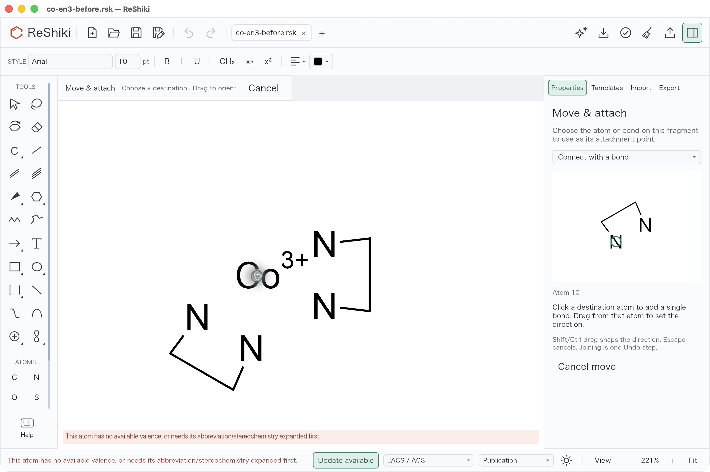 | 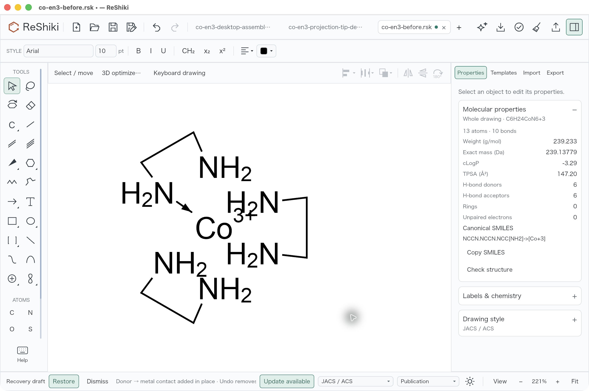 |

The [one-contact native save](../tests/fixtures/coordination/co-en3-one-contact-desktop.rsk)
contains exactly one new directed order-5 bond, **10 → 1**, with plain dative
appearance and no stereo. The independent
[one-contact audit](fixtures/coordination/desktop-one-contact-independent-audit.json)
confirms all 13 atom IDs, XYZ and every non-derived atom field exactly match the
input; the original nine covalent bond records are unchanged. All coordinates
are finite. Co charge +3 and all six nitrogen H2 labels remain unchanged.

Only the six carbon-derived H-label cache values refresh from 0 to 2, at IDs
3/4/7/8/11/12. Those caches are distinct from the unchanged `explicit_h`,
`no_implicit`, charge, isotope, aromatic and stereo fields. See the model's
[derived-label refresh](../crates/model/src/atom_labels/refresh.rs). The same
cache update occurs in the complete desktop assembly and is not extra hydrogen
atom insertion.

## Complete chelates, duplicate no-op, Undo/Redo and reopen

A separate fresh original was assembled with contacts from donors
**13, 10, 2, 5, 6 and 9** to Co1, in that order. The second contact, 10 → 1,
closes a chelate already in the same connected component; atoms stay in place.
The result has **13 atoms and 15 bonds**, retaining all three NCCN skeletons,
six NH2 donors and C6H24CoN6+3.

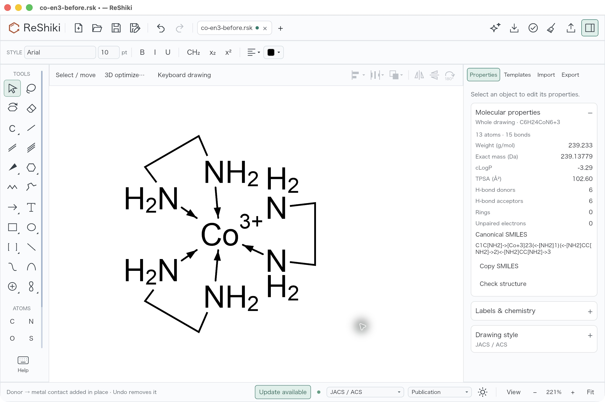

Repeating 13 → 1 made no edit. One header **Undo** then removed the previous
actual contact, changing 15 bonds to 14; this proves the duplicate did not add
another Undo entry. **Redo** restored 15 bonds. Save As produced
[co-en3-desktop-assembled.rsk](../tests/fixtures/coordination/co-en3-desktop-assembled.rsk).

| Saved desktop assembly | Reopened in a fresh process |
| --- | --- |
| 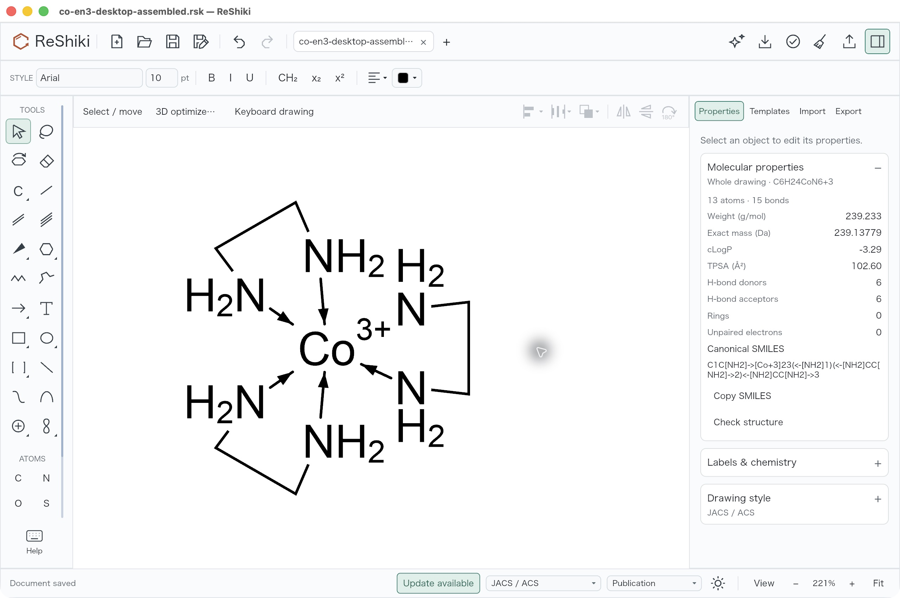 | 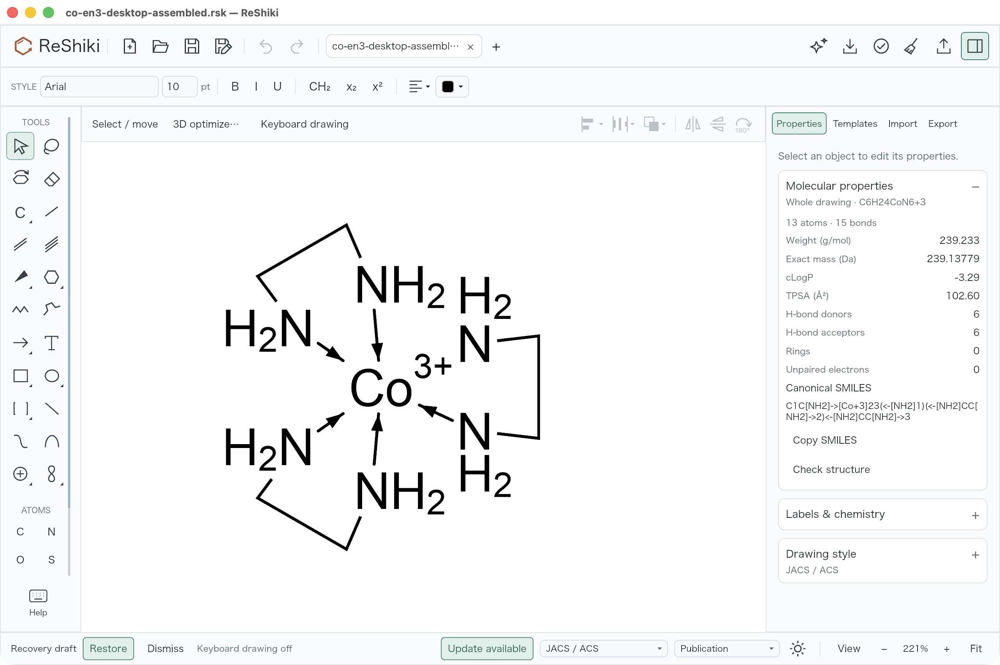 |

The retained [independent audit](fixtures/coordination/desktop-native-independent-audit.json)
confirms that all six new bonds are directed order 5 from donors
2/5/6/9/10/13 to metal 1. All atom IDs, XYZ and chemical metadata are unchanged
apart from the derived carbon-label cache noted above; all original covalent
bond records are exact. The fresh reopened file has a clean title and Undo
disabled, so persistence is demonstrated independently of the prior process's
editing history.

## Marked keyboard donor: [ and } versus ordinary ]

On another fresh original in the **candidate**, activate donor N5 with F8 on,
enter **[** to mark it, click Co1, and enter **]**. Ordinary Connect rejects the
covalent operation without creating an Undo entry. Entering **}** then adds
the directed **5 → 1** contact, with one actual Undo step. On a US keyboard,
**}** is Shift+]; other keyboard layouts must produce the **}** character.
The labeled **Mark [**, **Connect ]** and **Coordinate }** controls show the
donor/metal target context. These are two controls in the candidate application,
not a frozen-base keyboard screenshot comparison.

| Candidate ordinary ] rejects covalent attachment | Candidate } adds the marked donor contact |
| --- | --- |
| 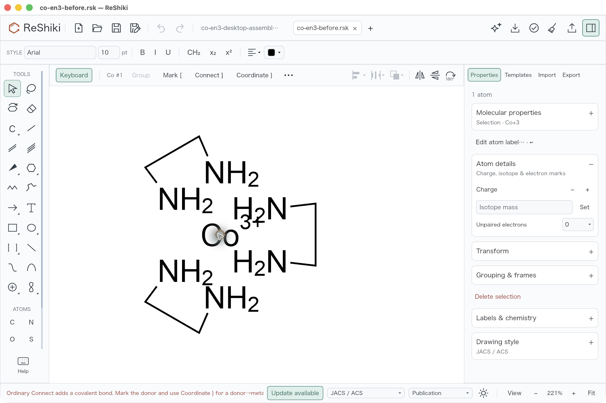 | 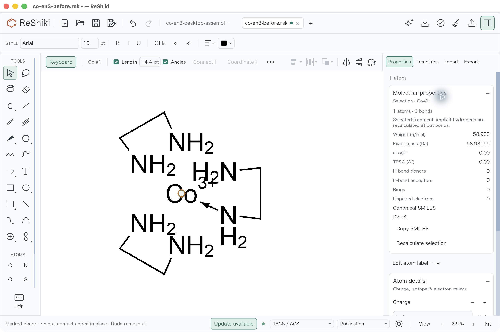 |

The success inspector above is **Selection · Co+3 · 1 atom · 0 bonds**; those
numbers are not the complete drawing. After clearing selection and turning F8
off, the separate whole-drawing view reports **13 atoms, 10 bonds and the same
C6H24CoN6+3 formula**. The native result is
[co-en3-keyboard-desktop.rsk](../tests/fixtures/coordination/co-en3-keyboard-desktop.rsk).

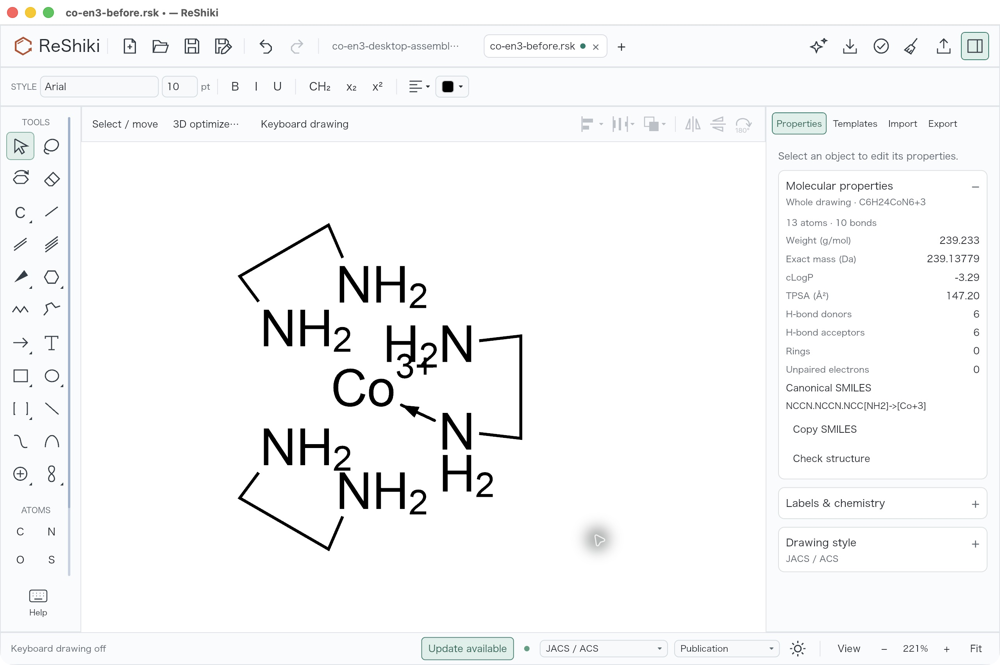

## Projection tip changes paint, not donor direction

Open the existing single-complex
[co-en3-both-tips.rsk](../tests/fixtures/coordination/co-en3-both-tips.rsk),
**13 atoms/15 bonds**, at 221% with F8 off. Solid and hashed projection paint can
be narrowed at donor or metal while chemical donor→Co direction remains fixed.
This is not the external two-complex, 26-atom CDXML fixture.

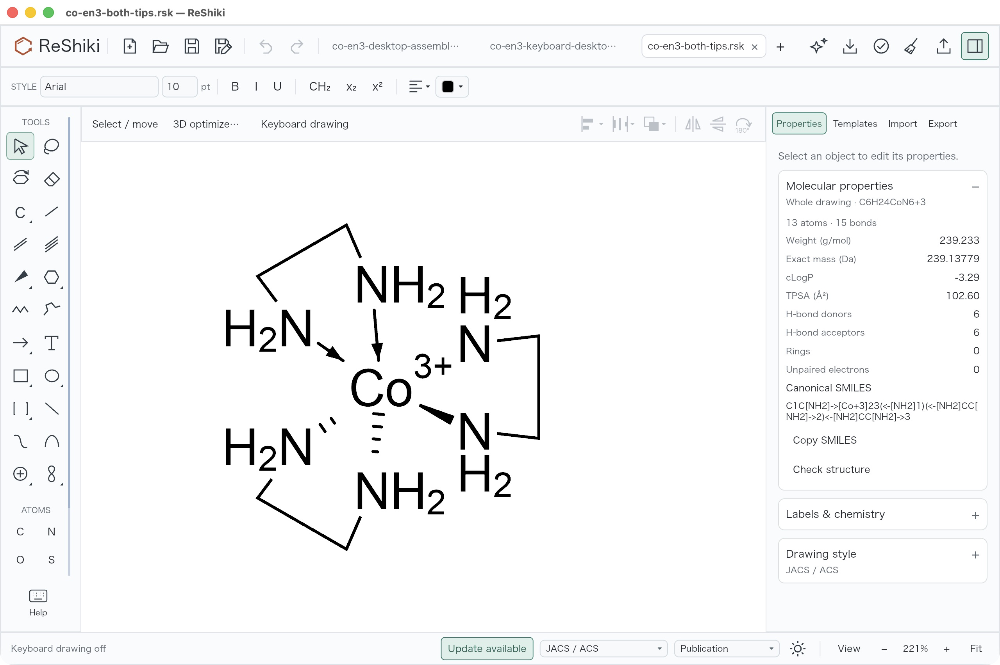

Select the solid projected **5 → 1** bond and choose **Reverse projection tip**
under Crossings & direction. The selected-bond capture deliberately shows this
control and selection handles. Save As produced
[co-en3-projection-tip-desktop.rsk](../tests/fixtures/coordination/co-en3-projection-tip-desktop.rsk),
then a fresh process reopened it with a clean title and Undo disabled.

| Reverse projection tip on the selected bond | Saved result reopened, selection cleared |
| --- | --- |
| 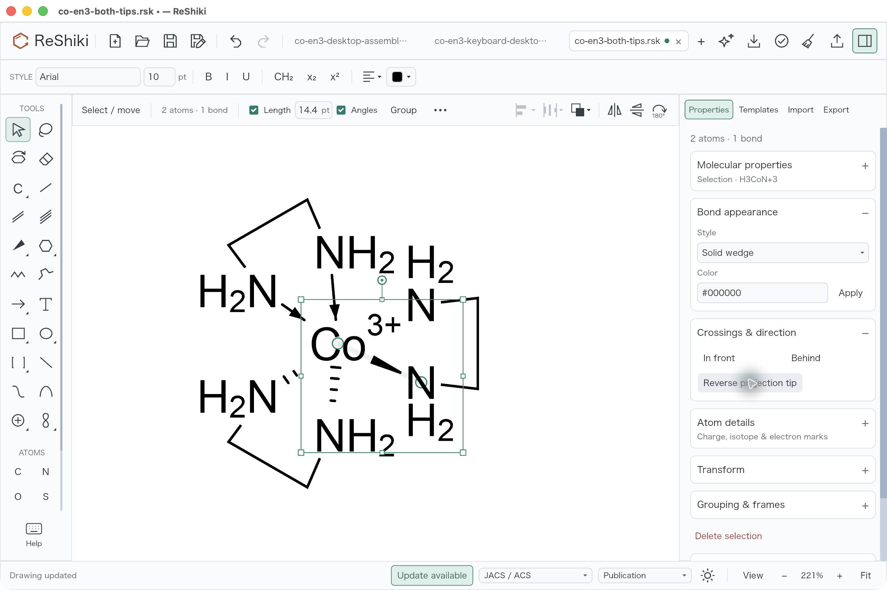 | 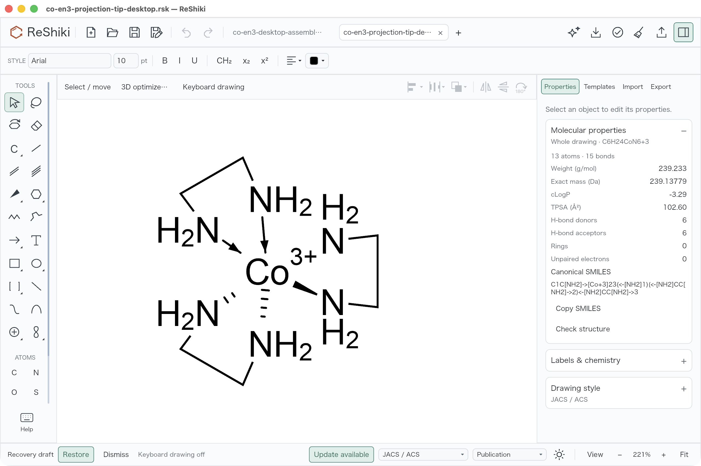 |

The native audit compares the before and saved documents: only bond array
index 10's `display` changes from **`wedge_end` to `wedge`**. Its endpoints stay
**a = 5, b = 1**, order stays **5**, all atoms and all other bond fields stay
exact, and no chemical stereo is assigned. Appearance alone is not used to
prove these invariants.

## External ChemDraw reference and interchange limits

The original authored
[paired CDXML source](../tests/fixtures/coordination/co-en3-external-source.cdxml)
contains **two** complete complexes, **26 atoms and 30 bonds**, with twelve
donor→Co dative contacts. It asks for opposite Begin/End projection styles.
Actual ChemDraw **26.0.0.6599** displays dative arrows rather than that paint:

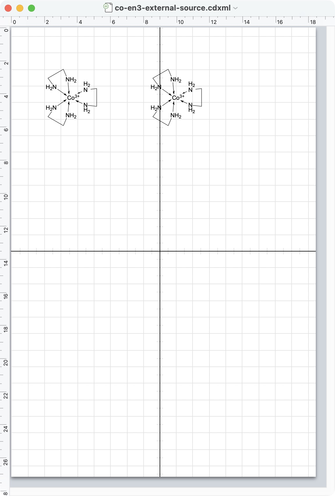

This unchanged reference JPEG is 1150 × 1700, with ChemDraw's own page framing;
its original `.png` filename contained JPEG bytes, so packaging only renames
the extension. It is a separate external reference, not a matched ReShiki scale
comparison. The actual
[ChemDraw Save As roundtrip](../tests/fixtures/coordination/co-en3-chemdraw-roundtrip.cdxml)
retains all 26 atoms, 30 bonds, twelve directed dative B→E contacts, Co charge
+3 and all N H2 values, but removes every dative projection `Display` attribute.
The [XML contract check](fixtures/coordination/xml-reference-contract.txt)
records that measured distinction. No external projection-paint fidelity is
claimed.

Native and ReShiki CDXML/CDX roundtrips retain supported direction and projection
attributes. Export warns about ChemDraw redraw/paint loss. MOL V3000 type 9
retains directed dative chemistry but omits projection paint with a warning.
Earlier VERSION 19 parsers accept a plain dative control and safely reject the
new end-tip styles as unsupported appearance; the
[retained executable control](fixtures/coordination/older-v19-projection-refusal.txt)
demonstrates refusal, rather than silent endpoint reversal or covalent stereo.
Use native ReShiki or figure export when projection paint must remain faithful.

## Recorded checks and scope

At the tested source, full model tests passed **137**, with seven existing
opt-in cases ignored; full IO passed **95**, with five opt-in cases ignored,
using the built own-source app as InChI helper. App joining passed **7** and
keyboard passed **18**, with one opt-in renderer case ignored. Strict all-target
app/model/IO Clippy, formatting, diff checks and the locked app build passed.
The IO Begin/End style matrix was additionally rechecked with focused tests and
strict Clippy. Tests cover donor graph/H/charge/stereo, same-component closure,
duplicate/Escape/Undo, solid/hashed/hollow tips at each endpoint, tapered render
geometry, crossing clearance, clipboard and supported format roundtrips.

The preserved executable analyzed the complete native fixture as valid,
**C6H24CoN6+3**, and rendered the projection figure. Its InChI/InChIKey fields
are empty for this coordination graph, so they are not used as identity proof.
Native interaction checks above are macOS only and were not timed with a
stopwatch. No source/test code, existing fixture bytes, solver run or new Cargo
build changed during this documentation packaging. Original fixtures and
captured evidence are identified in the fixture README; existing component
notices remain in [NOTICE](../NOTICE).
