# Drawing-tool defaults review

Under review in [PR #277](https://github.com/Ameyanagi/ReShiki/pull/277) for
[#250](https://github.com/Ameyanagi/ReShiki/issues/250),
[#90](https://github.com/Ameyanagi/ReShiki/issues/90) and
[#249](https://github.com/Ameyanagi/ReShiki/issues/249). Original contributions:
@Ameyanagi. This review compares `main` base
`51fa0991da2507bb00b27c1b420e807468de6423` with implementation
`812273150976ef18d1184e102a70b1e5ee7df21a`.

## Result

The Straight chain icon now shows a conventional four-carbon, three-bond
zigzag. The Snaking icon and tool hints explain steering and retracing. This
changes the explanation and icon geometry, while retaining chain behavior.

Orbitals have an explicit **Snap to atoms** control, independent of chemical
symbol attachment. Hold **Option/Alt** while placing a new orbital to bypass
snapping temporarily. Its preview identifies the chosen atom or free node.
Transparent clearance around visible atom-label ink keeps labels readable in
front and back layers, without moving atoms or the orbital's node and axis.
Clicking a revealed atom label selects that atom; ordinary filled graphics
retain their existing selection behavior.

Click-created lone pairs and bars now sit near visible atom ink and avoid
nearby labels, bonds and existing atom marks. The default gap scales with the
owner's font size. Explicitly dragged offsets and previously saved marks are
preserved; very crowded drawings may still need manual positioning.

## Capture provenance

The retained baseline application uses `51fa0991`. The reviewed native macOS
arm64 debug candidate was built from `81227315` on 2026-10-09. All 1,064 tracked
Rust/Cargo entrypoints in its worktree had their mtimes refreshed before the
checks and build, with content hashes unchanged. This forced workspace crates
to compile from that worktree while retaining third-party dependency caches.
The preserved application passed `codesign --verify --deep --strict`.

Signed executable SHA-256:
`ecb6bfb989e196edc959e23a2a95298945456023d2aacdc5d9c02683609078c8`.

Raw executable SHA-256:
`25fe8206c35ff87884911522b799579ef5cb1459511a12196e6a4f8ff9da0dc0`.

All published captures and exports retain the original bytes: no crops,
resizing, annotations or retouching. The native desktop captures are JPEG
encoded by the capture provider and published with `.jpg` filenames.
Renderer exports are PNG. The [evidence manifest](../tests/fixtures/drawing-tool-defaults/evidence-provenance.json)
records hashes, encoding and dimensions. The full scratch galleries and
application bundles are kept outside Git.

## Chain icons and explanations — #250

| Before                                                                                                                     | After                                                                                                                              |
| -------------------------------------------------------------------------------------------------------------------------- | ---------------------------------------------------------------------------------------------------------------------------------- |
| 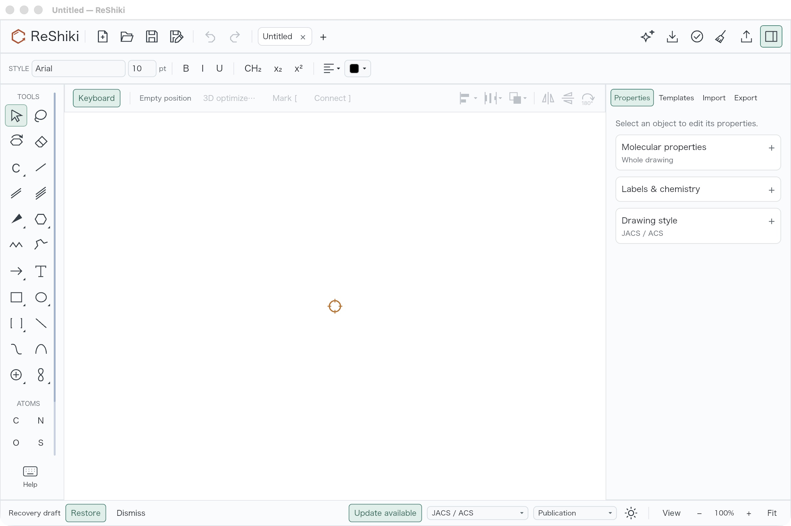 | 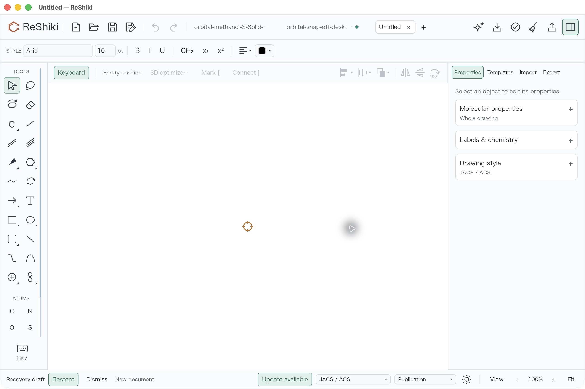 |

Both captures use a new blank document, light UI, Arial 10pt, JACS/ACS style,
100% zoom, keyboard drawing on and the same full-window dimensions. The
baseline has one public tab and an inactive window title bar; the candidate
has three public tabs and an active title bar. Pointer location differs. The
paired orbital captures below also show the chain icons in matching light
and dark UIs.

The left chain button shows three regular bonds. The adjacent Snaking button
shows a zigzag and curved steering arrow. Select or hover each button to read
the corresponding regular-growth or steering/retracing hint. The existing
uppercase **X** shortcut selects Straight; no new chain shortcut is introduced.

| Straight settings                                                                                                                | Snaking settings                                                                                                             |
| -------------------------------------------------------------------------------------------------------------------------------- | ---------------------------------------------------------------------------------------------------------------------------- |
| 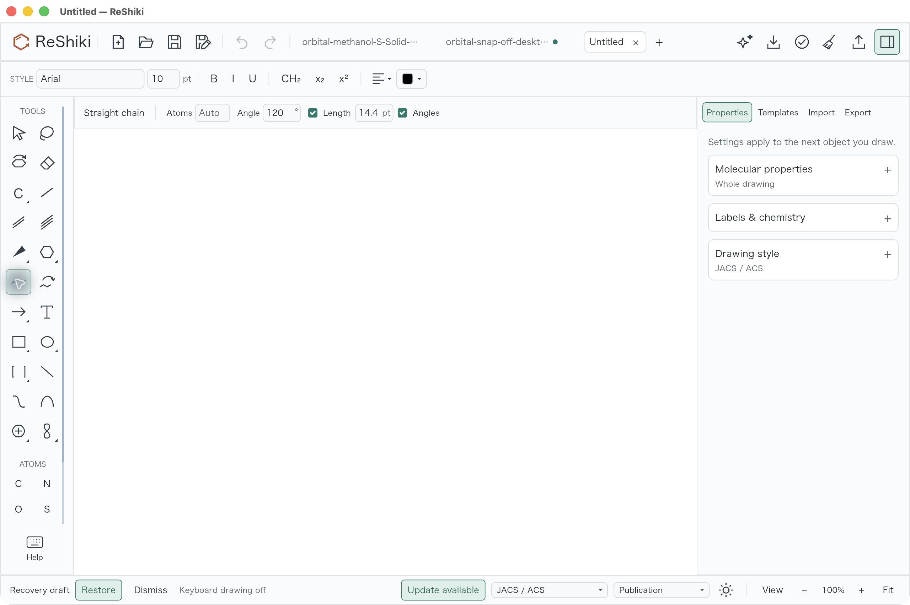 | 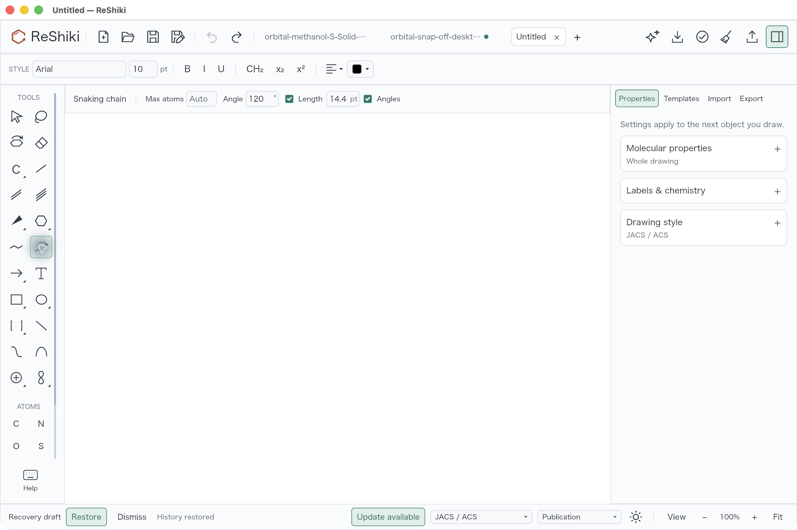 |

The native review selected both tools and observed the Snaking guidance,
“Steer while dragging · Retrace to shorten.” A Straight drag from (650, 800)
to (950, 800) produced five atoms and four regular 120° zigzag bonds; one
Undo restored the blank drawing. The review did not execute a Snaking
steering/retracing drag. The screenshots show actual selected-tool controls;
they do not claim a captured chain drawing.

## Orbital label readability — #90

| Actual native desktop before                                                                                                                | Actual native desktop after                                                                                                                          |
| ------------------------------------------------------------------------------------------------------------------------------------------- | ---------------------------------------------------------------------------------------------------------------------------------------------------- |
| 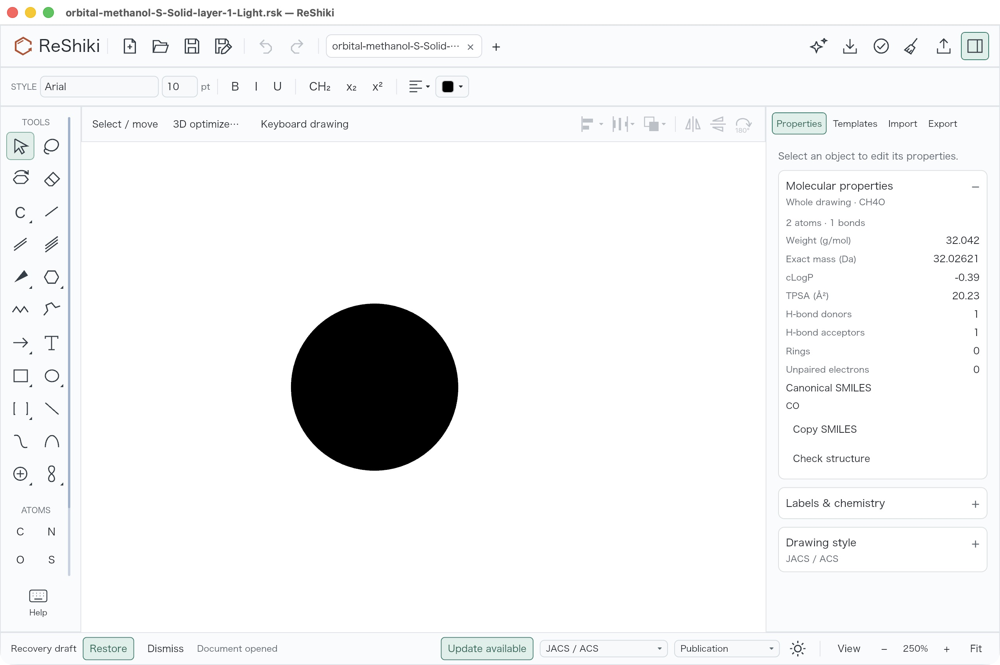 | 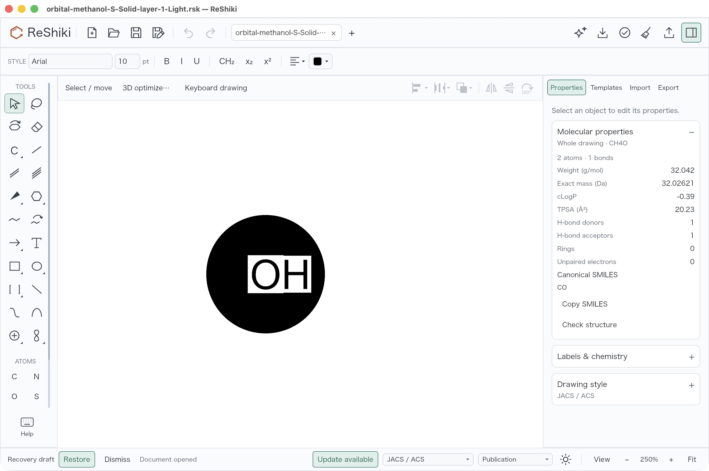                 |
| 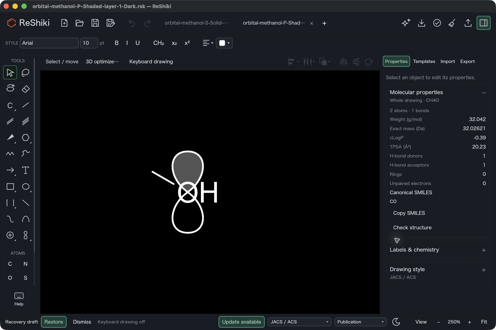            | 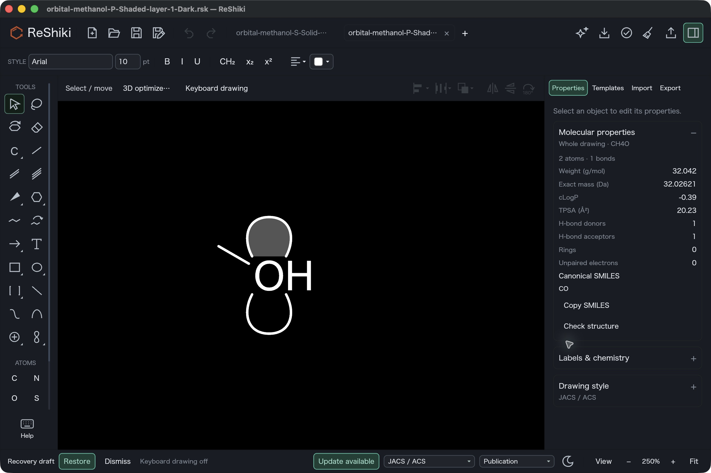 |

Open the frozen solid-s/light or gray-p/dark fixture in each build. Use 250%
zoom, F8 off, Arial 10pt, JACS/ACS style, the same camera and visible whole-drawing
Properties. Deselect before capture. Both solid-s screenshots have one public
tab; both dark-p screenshots have two. The 2560 × 1704 full-window views match
input, framing, scale, theme and Properties; pointer locations and transient
status text differ. The panels independently show CH4O, two atoms, one bond
and CO. The input files remain unchanged, including the orbital frame.

### Application exports

The same frozen methanol drawings were exported by the baseline and candidate
applications using `--cli convert INPUT -o OUTPUT --receipt` at the default
1200 dpi. Both applications receive identical native input bytes. Canvas
backgrounds, physical figure scale and tight content bounds match within each
pair. The solid s example is 624 × 624 pixels; all p examples are 527 × 624.
These are application-rendered exports, not desktop interaction captures.

| Original input and phase                | Before                                                                                                                                  | After                                                                                                                                             |
| --------------------------------------- | --------------------------------------------------------------------------------------------------------------------------------------- | ------------------------------------------------------------------------------------------------------------------------------------------------- |
| Solid s, back layer, light background   | 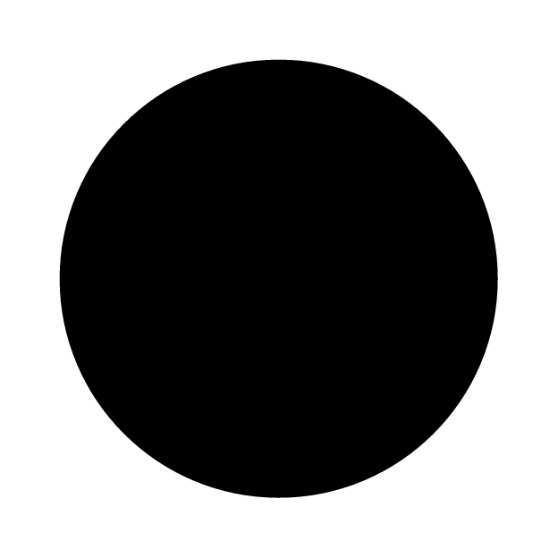   | 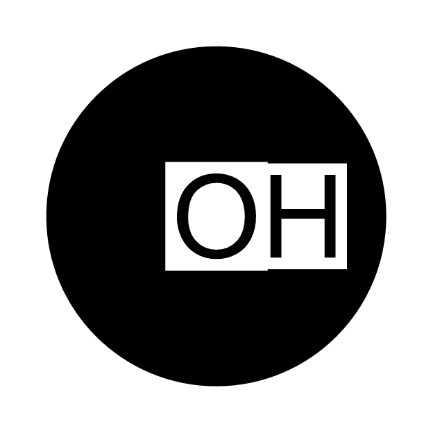                     |
| Solid p, front layer, light background  | 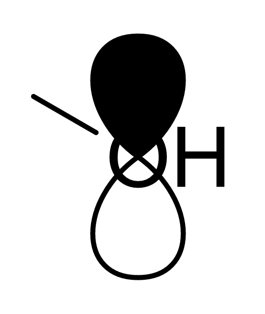       | 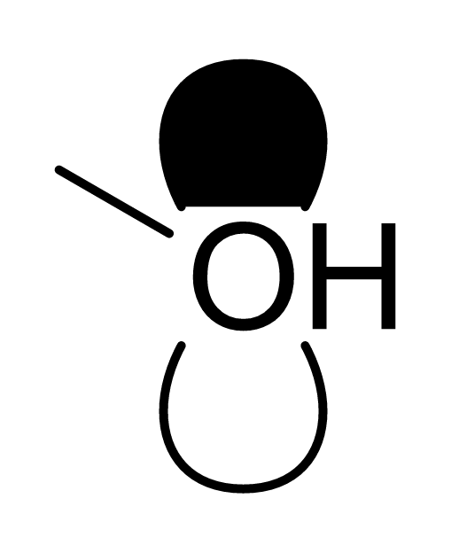             |
| Gray p, back layer, dark background     | 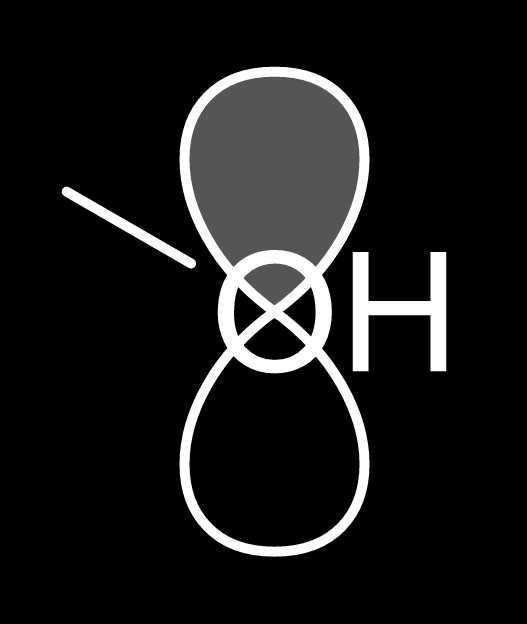      | 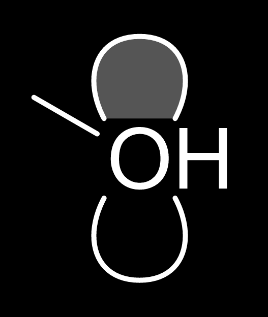 |
| Outline p, front layer, dark background | 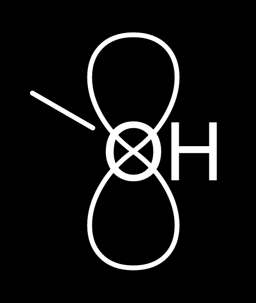 | 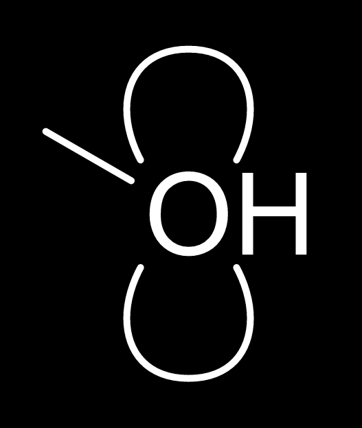      |

Each [native fixture](../tests/fixtures/drawing-tool-defaults/) contains the
same atoms, bond and orbital frame in both builds. The clearance removes orbital
fill and original outline portions from label ink bounds; it introduces no
background-colored objects or strokes. Unrelated orbital portions and geometry
remain unchanged. The s example still covers part of the adjacent bond; this
change specifically protects visible atom labels.

### Placement controls and modifiers

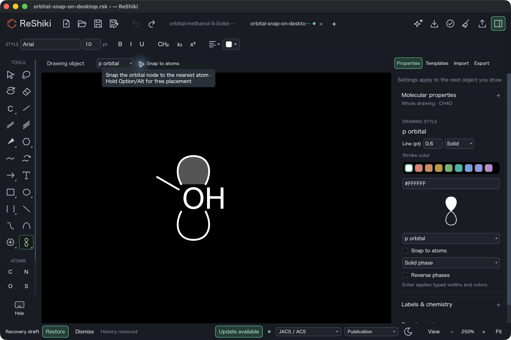

This actual native screenshot is the command reference for the new
**Option/Alt** bypass in the orbital-node target context. It shows the context
and Properties controls both off and the hover hint naming the modifier.
It was captured after Undo; it is not a captured held-Option drag.

| Target context               | Action                                                                           | Result                                                                                                                                 |
| ---------------------------- | -------------------------------------------------------------------------------- | -------------------------------------------------------------------------------------------------------------------------------------- |
| Near an atom                 | Leave **Snap to atoms** on; click or drag an orbital node inside the snap radius | The nearest atom is named and marked with a green target ring; release uses the previewed node.                                        |
| Near an atom                 | Hold **Option** on macOS, **Alt** on Windows/Linux                               | Free placement at the requested pointer position, even inside the atom snap radius. This is one modifier with platform-specific names. |
| Empty canvas or near an atom | Turn **Snap to atoms** off                                                       | The requested node is used. Chemical-symbol attachment remains independent.                                                            |
| Dragging an orbital          | Hold **Shift**                                                                   | The existing 15° direction constraint is retained and agrees between preview and release. **Option/Alt** can be combined with it.      |

The choice persists when switching tools in the current document. **New**
restores snapping. Orbitals remain drawing objects; group them with a molecule
when they should move together. The preference does not retroactively move
existing orbital nodes.

Actual native review started with the dark-p input, selected p orbitals with
snapping initially on, and dragged from (988, 992) to (988, 1240). Native Save
As and one Undo were exercised. Turning the context checkbox off mirrored
Properties; the same drag and Save As were repeated, then undone. The saved
new node is `(0, 0)` with snapping on and `(3.8168068, 0)` with it off. Both
release endpoints agree within `1e-5` world units. The original orbital and
atom/bond graph remain exact, excluding only the computed C hydrogen cache
refresh documented in the property record. The actual canvas-event regression
separately verifies temporary Option/Alt bypass, its combination with Shift,
and preview/release equality at three zooms.

## Click-added lone pairs — #249

| Before: one click on methanol O                                                                                                             | After: the same click and camera                                                                                                                 |
| ------------------------------------------------------------------------------------------------------------------------------------------- | ------------------------------------------------------------------------------------------------------------------------------------------------ |
| 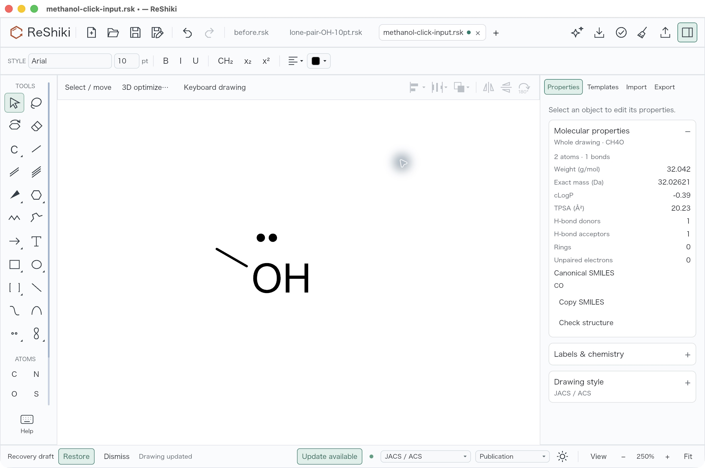 |  |

Open [methanol-click-input.rsk](../tests/fixtures/drawing-tool-defaults/methanol-click-input.rsk)
in each application. Keep F8 keyboard drawing off, JACS/ACS style, Arial 10pt,
light background, the Properties panel visible and the same 250% camera. Choose
**Lone pair** from **Chemical symbols**, click O once at desktop coordinate
(968, 1012), then deselect on blank canvas at (1460, 590). The actual native
review confirmed that one **Undo** removes the new mark and **Redo** restores
it. After capture, the candidate drawing was saved through native **Save As**
as [methanol-click-after-desktop.rsk](../tests/fixtures/drawing-tool-defaults/methanol-click-after-desktop.rsk).

The two full-window captures are 2560 × 1704 pixels. The before application has
three public fixture tabs open; the after application has one. Pointer position
also differs. The active input, drawing camera, scale, font, style and Properties
panel match; no selection handles remain.

### Molecular data and stored offset

The actual Properties panels show **CH4O**, **2 atoms**, **1 bond** and canonical
SMILES **CO** both before and after. Weight, exact mass, cLogP, TPSA, donor,
acceptor, ring and unpaired-electron values also match. The separate
[property comparison](../tests/fixtures/drawing-tool-defaults/properties-comparison.json)
records those values and native-file checks.

The saved native graph preserves atom IDs, elements and positions, explicit
hydrogen/implicit-hydrogen settings, charge, isotope, radicals, stereochemistry,
aromatic state and all bond fields. Object collections and native version 19
also match. O gains exactly one annotation, with offset `(0, -15.906372)` world
units, angle `0°` and no size override. It exactly matches the tested candidate
model replay. The computed skeletal-C `label_h` cache refreshes from 0 to 3;
the oxygen cache remains 1. This cache update is disclosed separately from
the unchanged chemical graph.

At 10pt, the retained baseline click replay placed the mark center 29.166668
world units from O; the candidate places it 15.906372 world units away. These
are atom-center offsets, not measured dot-to-glyph gaps or a numerical match
to another application. The new default clearance is 0.07 times the owner's
font size, with collision checks against actual rendered chemical ink. The
nearest owner glyph anchors the initial candidate, so auxiliary hydrogen,
isotope or charge labels do not pull the pair away from the heteroatom.

Installed ChemDraw primary help, `Chemical Annotations.htm` lines 381–406,
confirmed atom-drag attachment, retained relative offsets and the optional bar.
A native oxygen scratch confirmed a 10pt default. Its floating tool palettes
were not exposed to the automation interface, so a direct ChemDraw lone-pair
click and numerical default distance were unavailable. No ChemDraw screenshot,
artwork or help text is bundled, and no numerical equivalence is claimed.

## Validation and limits

At implementation `81227315`, 27 focused tests passed: nine scientific model
tests, seven application graphics tests, two actual canvas preview/release
tests, one visible-label hit test, one New-default test and seven scientific
native/chemistry/vector/raster integration tests. Retained baseline and
candidate renderer replay checks also passed.

The checks cover all seven orbital shapes, all three phases, both layers,
light/dark backgrounds and black/blue ink; visible H/isotope/charge glyphs;
unchanged molecular data and orbital frames; truly transparent fill/stroke
clearance; exact vectors distant from labels; snapping on/off and modifiers;
ordinary-graphic hit precedence; fonts at 8/10/18/30pt; repeated lone pairs,
explicit hydrogen positions, plain/wedge/hash bonds; stored/manual offsets;
preview/release equality at three zooms; New/tool switching and Undo/Redo;
native reopening and editable CDXML/CDX round trips. A manually positioned
lone-pair fixture produces byte-identical before/after PNG exports.

Model, IO and app all-target Clippy with `-D warnings`, whole-workspace format
and diff checks, the locked native build and codesign verification passed.
The pre-existing `block v0.1.6` future-incompatibility notice remains. Checks
were scoped and serialized through the shared build queue with commit hooks
disabled; this record does not claim a full-workspace integration run or a
GitHub CI result.

SVG/PDF/PNG and editable CDXML/CDX share the clearance geometry. External
CDXML/CDX import can apply a minimum 0.1pt stroke to fill-only vectors, expanding
an edge by at most 0.05pt on reimport; clearance padding remains positive.
Existing symbol-exchange restrictions remain, including native/vector-only
bars and unsupported per-symbol overrides. Windows EMF execution was not
performed in this macOS review.

## Reusable captions and attribution

- **Chain tools:** Chain-tool icons show a conventional four-carbon zigzag and
  a steering gesture, with clearer hints for regular and snaking drawing.
- **Orbitals:** An explicit atom-snapping control and Option/Alt bypass make
  orbital placement predictable; transparent label clearance keeps atoms
  readable without moving the orbital.
- **Lone pairs:** Click-added lone pairs sit closer to visible atom labels and
  avoid nearby chemical ink; manual and previously saved offsets stay exact.

Original code, tests, fixtures, documentation and ReShiki captures are offered
under `MIT OR Apache-2.0` according to [CONTRIBUTING](../CONTRIBUTING.md).
ChemDraw behavior was observed as a reference only. No third-party code, data
or artwork was copied or bundled. Credit @Ameyanagi; preserve under-review
status until the PR merges.
