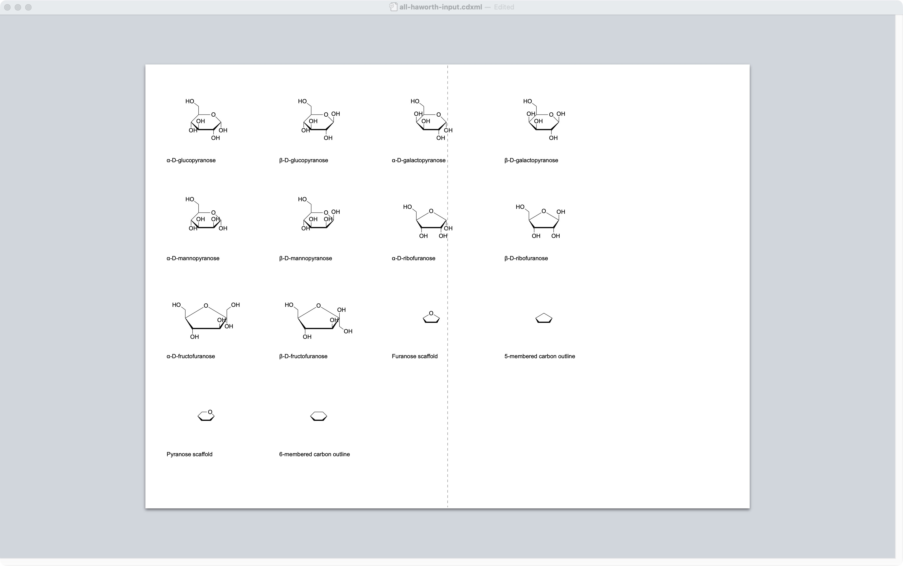
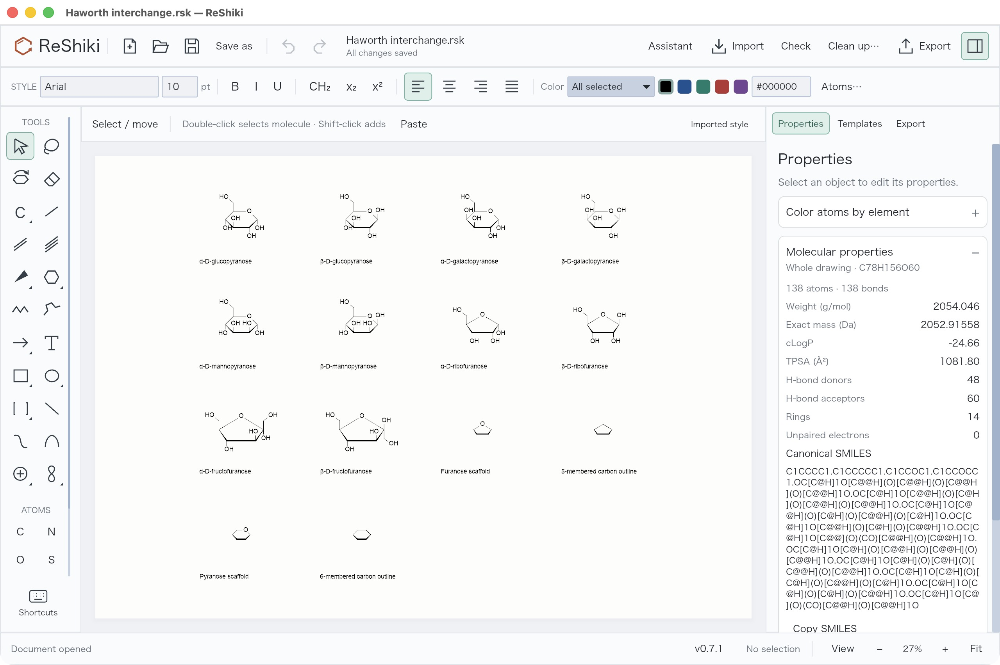

# Haworth interchange with ChemDraw

The reference set covers **all 14 supplied Haworth drawings**: α/β D-glucopyranose, D-galactopyranose, D-mannopyranose, D-ribofuranose and D-fructofuranose; the furanose and pyranose oxygen scaffolds; and five/six-member carbon outlines. These are the complete current ReShiki set, not every possible carbohydrate stereoisomer.

Each structure was opened and saved by **ChemDraw 26.0.0.6599 for macOS** on September 24, 2026. Its Save As, Export and Copy As menus were inspected through the desktop interface. Native automation then repeated the same export operations for every structure.



## Complete file-format coverage

**26 formats × 14 structures = 364 generated files.** The full corpus, capture manifest, checksums and browsable gallery are generated in `artifacts/haworth-interchange/corpus/`. Small CDXML/CDX/MOL reference files are checked into [the regression fixture directory](../tests/fixtures/haworth-interchange/README.md); the full corpus is deliberately excluded from Git.

| ChemDraw file formats                                     | Results for all 14 structures                                                       |
| --------------------------------------------------------- | ----------------------------------------------------------------------------------- |
| ChemDraw XML, ChemDraw, ChemDraw Stationery, ChemDraw 3.x | Saved and reopened; chemical identities matched                                     |
| PDF with ChemDraw's default embedded CDXML                | Saved and reopened as editable structures; identities matched                       |
| GIF, BMP, JPEG, PNG, TIFF, EPS                            | Saved and reopened as artwork; no editable molecular graph                          |
| TGF, ISIS/Sketch, CML, Connection Table                   | Saved and reopened; identities matched                                              |
| MOL, SDF, RDF — default and V2000 variants of each        | Saved and reopened; identities matched                                              |
| MSI ChemNote, SMD 4.2                                     | Saved and reopened; identities matched                                              |
| RXN — default and V2000                                   | Saved and reopened as single-reactant test containers; reactant identities matched  |
| SVG                                                       | Saved and rendered as figures; this ChemDraw version did not open them as documents |

A standalone molecule cannot be saved as RXN without a reaction arrow. All 28 such attempts produced ChemDraw's “No reaction center was found” error. Separate test containers add an arrow and retain the molecule as a single reactant. They assert **no chemical transformation or product**. ReShiki's reaction importer still requires both a reactant and a product; these containers test ChemDraw's format output, not that application workflow.

The default MOL/SDF/RDF/RXN files generated here use V3000. Older drawing and connection-table formats are reference outputs, not newly implemented ReShiki importers. The successful ChemDraw checks establish interoperability for this corpus, not universal support for every feature in each format. PDF editability depends on its embedded CDXML; ordinary PDFs are figures.

## Clipboard coverage

For every structure, captured **SMILES, SLN, InChI, InChI Key, CDXML Text, MOL Text, MOL V2000 Text and PNG**: 112 successful Copy As operations. All pasteboard representations are retained with their type names and hashes. The two remaining menu choices, **3MF (Ball and Stick)** and **3MF (Stick)**, were disabled for all 14 two-dimensional drawings. No 3MF files are claimed.

## What changed in ReShiki

- Styled CDXML/CDX export now accepts the supplied Haworth convention when its visible substituents agree with the explicitly stored configuration. Ordinary rotations, translations and reversing the bold bond's endpoint order remain supported.
- ChemDraw CDXML/CDX import recognizes the bold front edge, the two wedges that widen toward it, the five/six-member ring and its up/down substituents. It retains these edges as perspective styling and reconstructs explicit atom stereochemistry.
- ChemDraw-authored 2D MOL import retains the original bond directions long enough to recognize the same convention. ChemDraw serializes the bold edge as another wedge in MOL; ordinary stereobond perception alone assigned the wrong stereoisomers in the original imports.
- Inconsistent stereochemistry, collapsed or distorted rings and ambiguous substituent directions remain rejected by styled editable export. The change does not enable arbitrary perspective drawings or automatic sugar recognition.

All **56 reference imports** (14 drawings × CDXML, CDX, V2000 MOL and V3000 MOL) retain the expected molecular identities. All **28 new ReShiki CDXML/CDX exports** were reopened and resaved by ChemDraw; its SMILES agreed with the reference identities, including expanded atoms behind contracted CH₂OH labels. The ten sugar identities also match the independently recorded [PubChem references](../assets/haworth-sugars.json).

The recognizer is bounded, uses checked access and adds no `unsafe`, `unwrap()` or `expect()` calls. Tests cover all reference files, repeat interchange, rotations, translations, endpoint reversal, contradictory stored configurations, distorted geometry, degenerate rings and stale CIP caches. Existing ordinary bond, molecular parser and drawing-exchange tests also run.



## File-format findings

ChemDraw writes `Geometry`, `BondOrdering` and cached `AS` descriptors into its CDXML. Its documented [geometry convention](https://chemapps.stolaf.edu/iupac/cdx/sdk/properties/Atom_Geometry.htm) describes tetrahedral bond order and says positioned drawings must supply the appropriate visible bonds. Its [CIP property documentation](https://chemapps.stolaf.edu/iupac/cdx/sdk/properties/Atom_CIPStereochemistry.htm) explains that `AS` values can survive unchanged until a structure is edited. ReShiki therefore does not accept cached R/S letters as proof of a configuration; the tests include altered cache values.

Compatibility testing uses original generated structures, native application exports and published format documentation.

## Reproduce the study

ChemDraw must be installed on macOS, with desktop automation permissions available. Close other ChemDraw documents before running the capture; it opens and closes its own files and uses the clipboard.

```sh
cargo run --locked --example haworth_qa -- artifacts/haworth-qa
uv run --locked python scripts/chemdraw_haworth_corpus.py
mkdir -p artifacts/haworth-interchange/tools
swiftc scripts/chemdraw_capture_clipboard.swift -o artifacts/haworth-interchange/tools/capture-clipboard
uv run --locked python scripts/chemdraw_haworth_verify.py reactions
uv run --locked python scripts/chemdraw_haworth_verify.py clipboard
uv run --locked python scripts/chemdraw_haworth_verify.py reopen
cargo run --locked --example haworth_interchange -- artifacts/haworth-interchange/corpus
uv run --locked python scripts/chemdraw_haworth_verify.py reshiki
uv run --locked python scripts/chemdraw_haworth_report.py
open artifacts/haworth-interchange/corpus/index.html
```

Run these steps sequentially: a single ChemDraw instance owns the desktop and clipboard, and the verification steps update one manifest. `scripts/chemdraw_haworth_report.py` also produces an input gallery for inspecting the fourteen drawings together in ChemDraw. The Rust example imports a ChemDraw-saved `all-haworth-chemdraw.cdxml` gallery when present and creates `Haworth interchange.rsk` for ReShiki.
