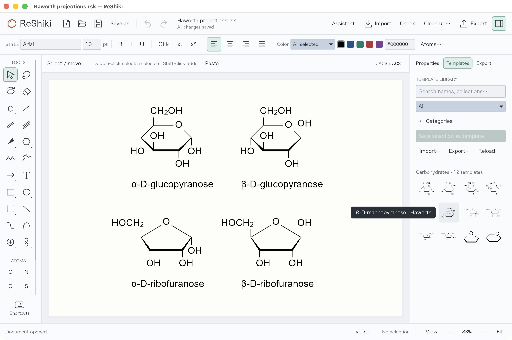
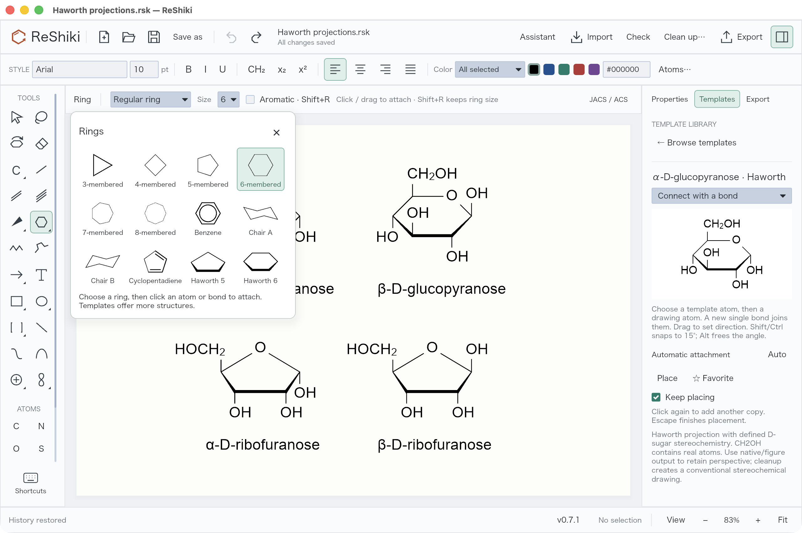
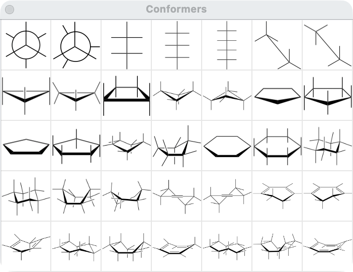

# Haworth projections

Haworth projections are available as editable ring outlines and chemically defined carbohydrate templates.

## Draw a ring or place a sugar

- Open the ring palette and choose **Haworth 5** or **Haworth 6** for a carbon ring outline. Click to place it; drag to rotate it. The front edge is bold and the two adjoining sides taper toward the back.
- Open **Templates → Carbohydrates** for oxygen-containing furanose/pyranose scaffolds and the α/β forms of D-glucopyranose, D-galactopyranose, D-mannopyranose, D-ribofuranose and D-fructofuranose. Search also accepts `Haworth`, `glucose`, `ribose`, `alpha` and `beta`.
- Choose a template and click empty space to place it. **Escape** returns to Select. Placement, bond appearance changes and Undo/Redo use the existing editor controls.

The sugar templates contain real carbon and oxygen atoms. **CH₂OH** is a contracted two-atom fragment, so atom counts, formulas and molecular identifiers include its hidden atoms. Left-facing groups use **HOCH₂** to keep the attachment on carbon. Expand a group with the usual abbreviation controls when individual atoms need editing.

## Chemistry and appearance

The ten named sugars have explicit tetrahedral configurations, including the anomeric center. Their formulas and standard InChIKeys are checked against independent [PubChem records](../assets/haworth-sugars.json). The ring's bold and tapered edges describe perspective; changing those edges' appearance does not erase or create stereochemistry.

Blank ring outlines and oxygen scaffolds have **no assigned stereochemistry**. Adding substituents to a scaffold does not automatically infer a carbohydrate configuration. Moving an OH label above or below a ring also does not switch the stored anomer; choose the corresponding α/β template for that change. Automatic Fischer/Haworth conversion, arbitrary sugar recognition, L-sugar templates and glycoside assembly are not included.

The conventions follow the [IUPAC Haworth drawing recommendations](https://iupac.qmul.ac.uk/drawing/stereo.html#ST-1.9). This is a drawing projection, not an energy-minimized three-dimensional conformation. Cleanup can replace it with an ordinary stereochemical layout.

## Save, copy and exchange

| Output                        | Retained information                                                                                       |
| ----------------------------- | ---------------------------------------------------------------------------------------------------------- |
| Native `.rsk`                 | Editable atoms, contracted groups, configurations and perspective styling                                  |
| SVG, PNG, PDF and figure copy | Visible Haworth appearance                                                                                 |
| MOL / isomeric SMILES         | Molecular connectivity and defined stereochemistry; MOL uses conventional stereo bonds and expanded groups |
| CDXML / CDX                   | Export currently rejects styled perspective edges rather than silently changing their meaning              |

Drawing MOL exports mark defined tetrahedral configurations as absolute. Without this flag, ChemDraw may place them in a relative `&1` stereo group. The low-level reference writer retains RDKit's default output for compatibility tests; the application writer sets the flag. See [RDKit's chiral-flag semantics](https://rdkit.org/docs/cppapi/MolFileStereochem_8h_source.html).

## Verification

Computer-use checks against **ChemDraw 26.0.0.6599 on macOS**, September 24, 2026:

- Opened ChemDraw's **Conformers** and **Hexoses** palettes, placed its five/six-member projection examples and inspected the front-edge geometry and substituent directions. The comparison below shows ChemDraw's own Conformers palette.
- Opened all ten ReShiki sugar MOL exports in ChemDraw, selected each molecule and copied its SMILES from ChemDraw's clipboard. All ten standard InChIKeys matched their independent PubChem records. The captured outputs are retained in [haworth-chemdraw.json](../tests/fixtures/haworth-chemdraw.json).
- The first MOL check exposed unwanted `&1` relative-stereo labels. Repeating the import after setting the absolute flag removed those labels. This checks chemical interchange; the MOL file does not preserve the exact Haworth artwork.
- In the optimized ReShiki desktop build, browsed the 12 carbohydrate templates, placed α-D-glucopyranose, checked one-step Undo/Redo, and placed a five-member Haworth outline with formula C₅H₁₀.

Automated checks cover all ten PubChem identities, α/β distinctions, substituent directions, actual CH₂OH atoms, five/six-member ring closure, rotation, copy/remapping, native round trips, molecular and figure exports, absolute MOL flags, perspective edge styling and editor Undo/Redo.

`cargo run --locked --example haworth_qa -- artifacts/haworth-qa` generates editable examples and exchange files for desktop checks. Generated output remains outside the tracked source tree.
