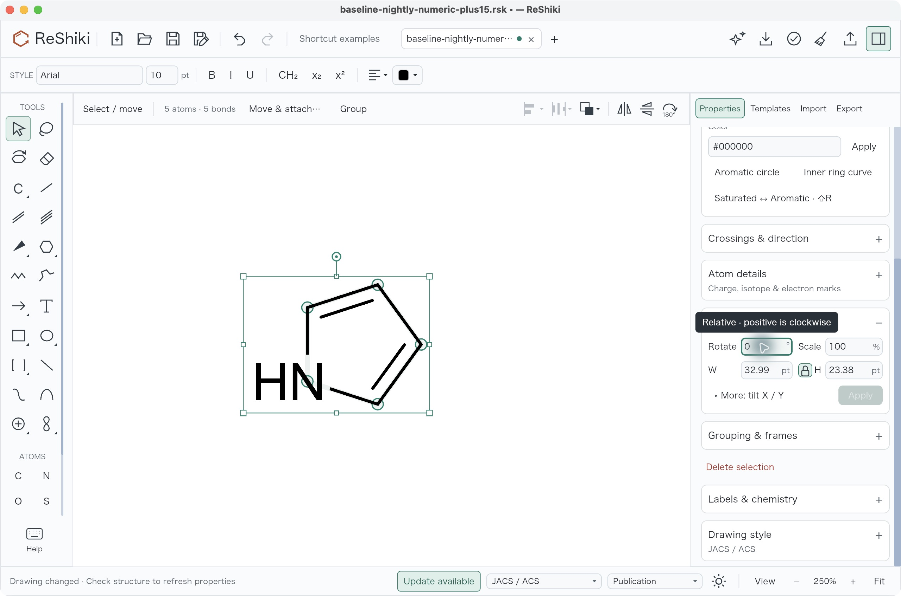
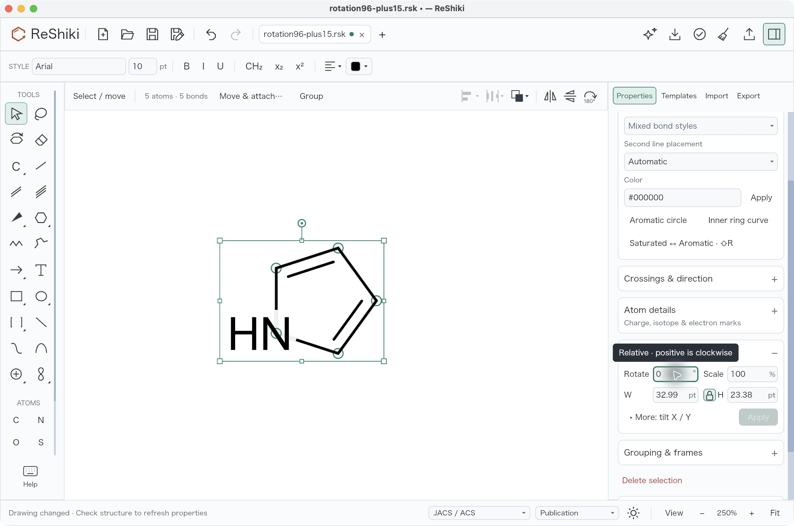
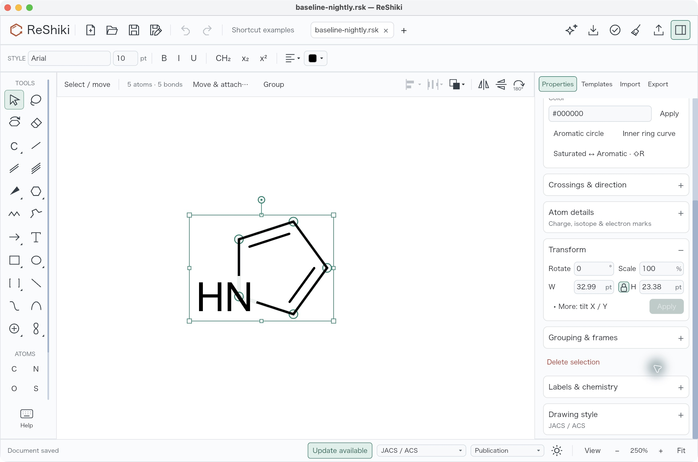
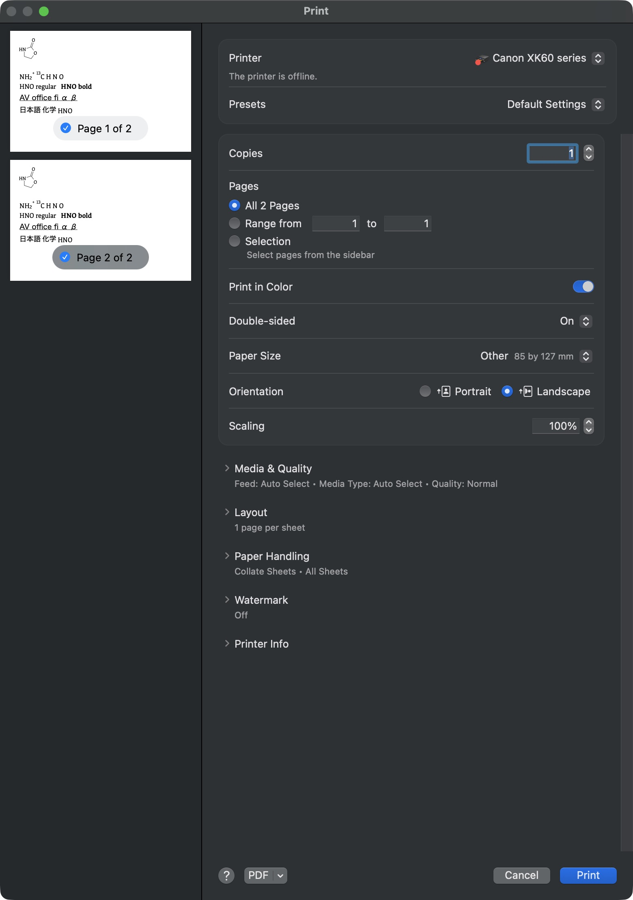
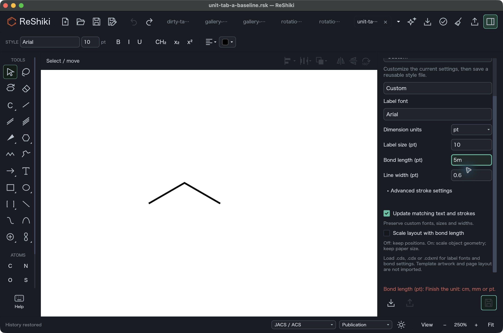
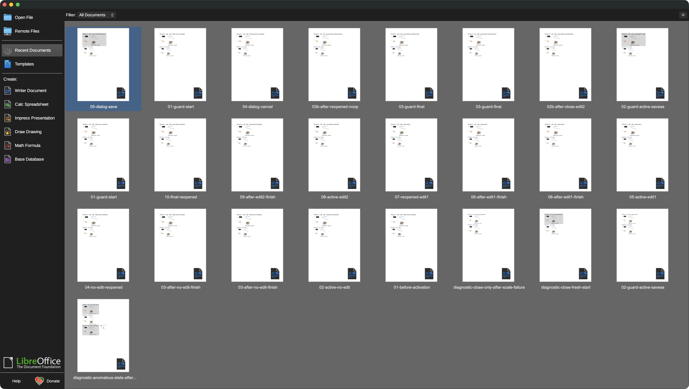
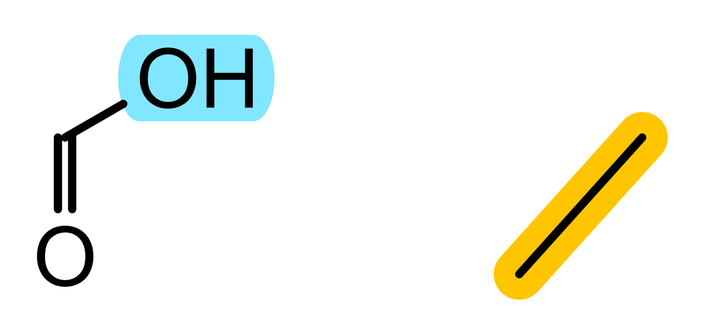
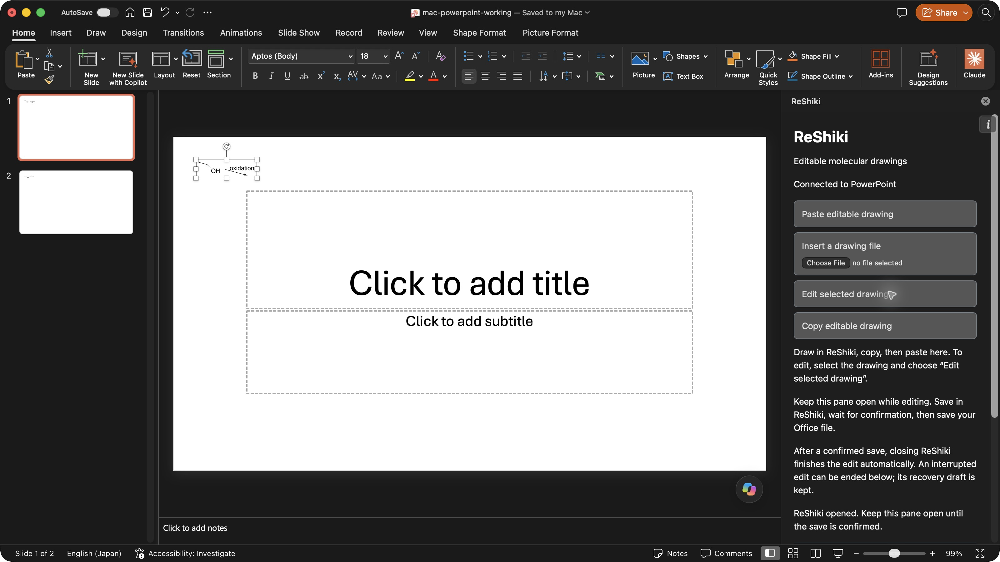
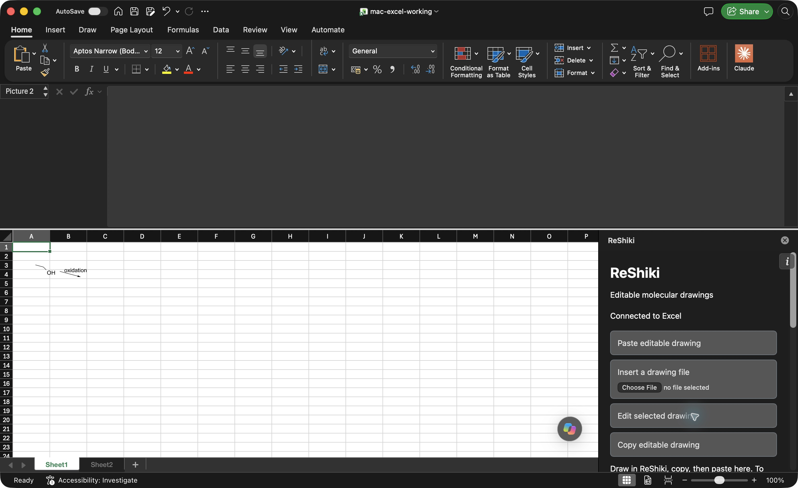

# PR problem and result images

Original images used in the explanations for PR111–127. Click an image to inspect it at full size. Historical source labels are retained; these captures do not certify the current PR heads.

[PR index](https://github.com/Ameyanagi/ReShiki/pull/126) · [Manifest and hashes](manifest.json) · [Earlier native gallery](../pr-review-2026-10-04/README.md)

## PR112: pr112-before-inverse-da5751d.jpg

Original signed nightly da5751d, native macOS: selected pyrrole after numeric +15° then −15°. Saved positions retain maximum 0.8769130283627893 drawing-coordinate error.

Not pixel-aligned with the fixed candidate capture; use saved-coordinate measurements. Screenshot precedes Save As, so its title still names the plus15 file and shows the dirty marker. The saved inverse result is pinned separately.

## PR112: pr112-after-inverse-483e70b.jpg

Historical fixed candidate 483e70b / QA e533928, native macOS: +15° was saved and reopened, then −15° applied. Maximum saved-coordinate error is 0.000004472135952447042.

Historical candidate, not current PR112 head. Viewport and panel scroll differ from the original nightly capture. Core inverse-rotation result only; separate focused-arrow interaction acceptance was incomplete on this older candidate.

## PR112: pr112-original-start-da5751d.jpg

Original signed nightly da5751d, native macOS: selected pyrrole before the numeric rotations.

## PR113: pr113-after-native-print-dialog-783b154.jpg

Historical source 783b154 / QA eeb3d67, native macOS direct print-worker replay: all two pages at 100% scale.

After-state illustration only, not a before/failure comparison. Does not prove safe construction or invalid-PDF rejection. Original parent application Print completion remains unproved. Printer model/status is visible in the native dialog; root should review before publication.

## PR115: pr115-pending-unit-input-483e70b.jpg

Historical source 483e70b / QA e533928, native macOS: the first tab retains an unfinished 5m bond-length entry in a pt-era draft.

This is a fixed-build workflow state, not evidence of the old points-only editor. The complete recorded sequence changes the preferred unit to mm in a second tab before the first tab finishes its pending entry.

## PR118: pr118-before-silent-close-macos-1c714ca.jpg

Native Writer returned to Start Center without a fresh Save/Discard/Cancel choice after the second accepted edit.

P2 prior Save then intended final Cancel branch, ordinary CmdW. Screenshot shows no document/choice; saved-file inspection separately confirms only edit 1 persisted. No failing-document reopen was performed. Compare to C03 below only with disclosed scenario/build difference.

## PR122: pr122-highlight-renderer-0893e11.png

Cyan highlight behind OH and yellow highlight behind a bond, with molecular ink visible.

Original exported PNG recorded for historical 0893e11; not a desktop screenshot or matched bug comparison. Contains transparency; original bytes must be preserved.

[Fixture source and notices](https://github.com/Ameyanagi/ReShiki/blob/783b154d6232f960146396c1dc7b594924191895/tests/fixtures/structure-highlights/README.md). Provenance does not infer rightsholder permission or relicense vendor material.

## PR127: pr127-powerpoint-host-updated-macos-6ca2ec2.jpg

PowerPoint for Mac after actual acknowledged native edit; preview updated. Source6ca2ec2/nativecc17; syntheticfixture only; status below fold not claimed visible.

Workflow after-state; paired host-before images and actual acknowledgement/save/reopen evidence are described in PR127. Not all-platform Office acceptance.

## PR127: pr127-excel-host-updated-macos-6ca2ec2.jpg

Excel for Mac after actual acknowledged native edit; preview updated. Source6ca2ec2/nativecc17; syntheticfixture only; status below fold not claimed visible.

Workflow after-state; paired host-before images and actual acknowledgement/save/reopen evidence are described in PR127. Not all-platform Office acceptance.

## Rotation measurements

[Saved-coordinate comparison](pr112-native-rotation-measurements.json) records the original inverse-rotation drift and historical fixed result. Viewports differ, so use document coordinates for the numerical comparison.
