# Native screenshots for PR review

These are original screenshots from the recorded native test builds. Each caption identifies the observed route and its limits. They illustrate reviewable behavior; they do not replace the platform acceptance records in the linked PRs.

## PR #112: pr112-transform-applied-macos-783b154

Historical native macOS capture from production source 783b154 (QA eeb3d67): selected pyrrole after the paired transform applies, with upright atom label and the transform controls visible. This is an after-state illustration; it is not a new capture of the current stacked PR or Windows Alt-arrow acceptance.

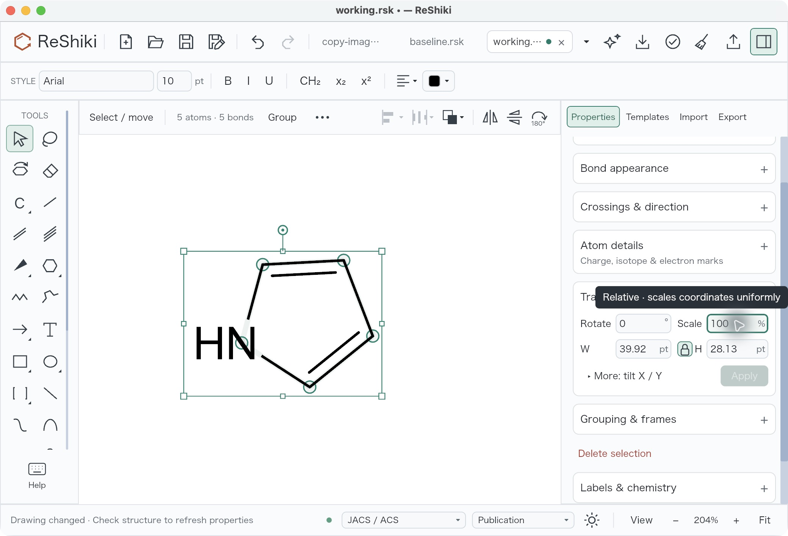

SHA-256: `574db211a26bd625199a1d38932ec55a24b59480b8f9211f4a075652cca86fda`

## PR #115: pr115-units-mm-macos-483e70b

Historical native macOS capture from production source 483e70b (QA e533928): after tab A commits its local draft, the style editor displays millimetres with a 5 mm bond-length draft. The accepted two-tab sequence checked unit adoption without mutating the document; this image is not a new current-head capture or a drawing-rescale claim.

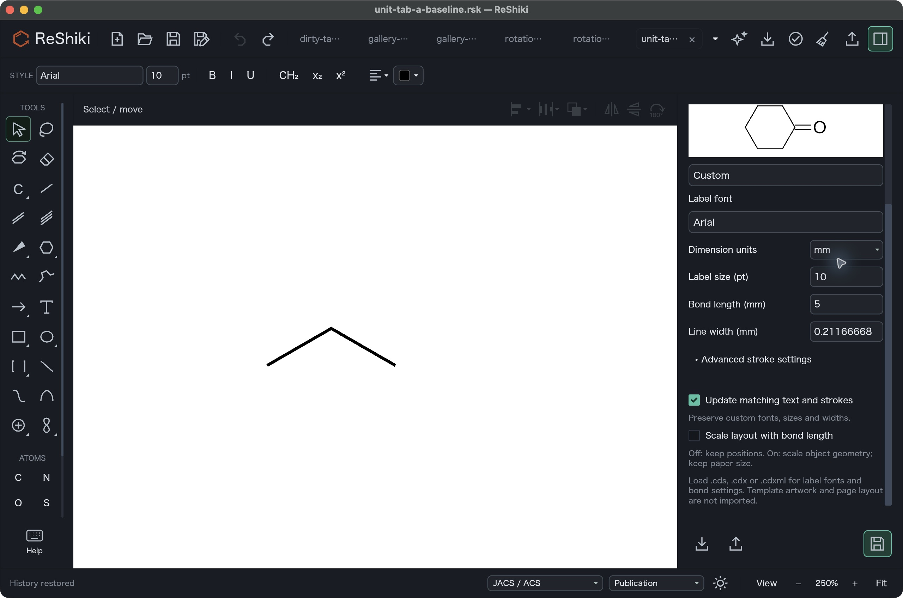

SHA-256: `a09bc5252a96a78f53b5c67ff5968845ec737919ade5961fdfbdfef657d61b8b`

## PR #119: pr119-editable-paste-macos-783b154

Historical native macOS capture from production source 783b154 (QA eeb3d67): the native ReShiki-to-ReShiki editable paste completed and selected objects are visible. This illustrates that bounded native route; it does not establish GNOME, Sway, X11, Office, or post-exit clipboard persistence.

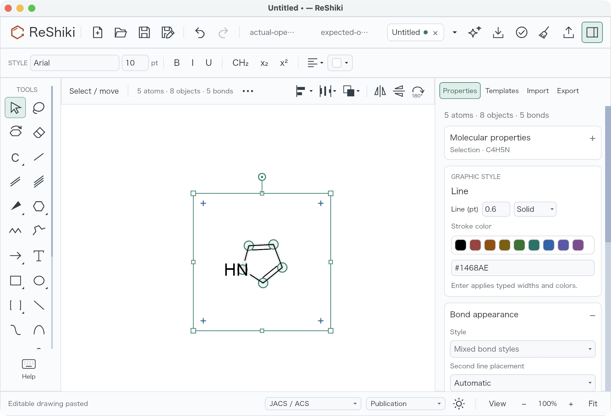

SHA-256: `e16f855164a16577a980e1d87ede593f199b76d6dfbfcc79d026433a55ff82a8`

## PR #123: pr123-cascade-macos-483e70b

Historical native macOS capture from production source 483e70b (QA e533928): the context-menu parent and Arrange & transform child are visible together. This illustrates native menu layout, not timing measurements, all input routes, or a new current-head capture.

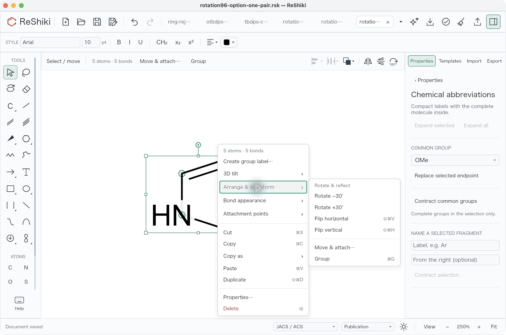

SHA-256: `1bc73db03d696e02486b92ef8563e7ee05dfa118b2ff5e222458fc1e4adb5176`

## PR #122: pr122-tbdps-contracted-macos-483e70b

Historical native macOS capture from production source 483e70b (QA e533928): the protected group is contracted to TBDPS. This is a representative native label after-state; it does not establish every highlight, font, exchange, or current-head route.

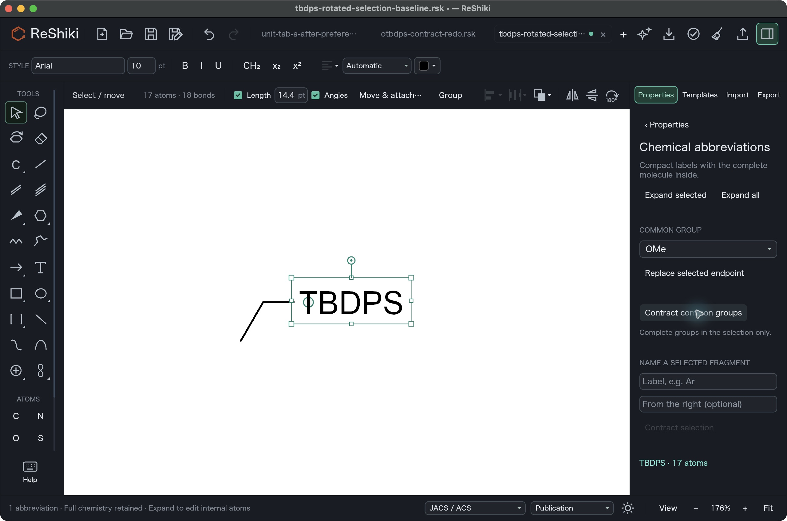

SHA-256: `1a35822f5c17161ecbdfd09a1b581e1096a96169e597b2a4fc4cd2210b0c5844`

## PR #118: pr118-close-choice-macos-308d841

Accepted C03 native macOS LibreOffice capture using extension 308d841 and ReShiki cc17b7a: a fresh window-scoped close choice after native Quit. The original reduced composite has a white region; the accepted receipt also inspected accessibility labels. This is document-window consent, not global Quit consent.

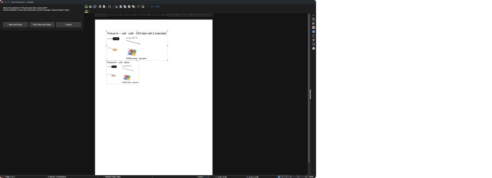

SHA-256: `79e3afae6134dd896ebb9353af460631cc4ceb4027adab30892201e9e9b561ea`

## PR #118: pr118-reopened-macos-308d841

Accepted C03 native macOS LibreOffice capture using extension 308d841 and ReShiki cc17b7a: the saved document reopened with the latest Fixture A caption and host text, alongside unchanged Fixture B. The accepted packet separately verifies embedded native data and scale; this image does not establish other operating systems.

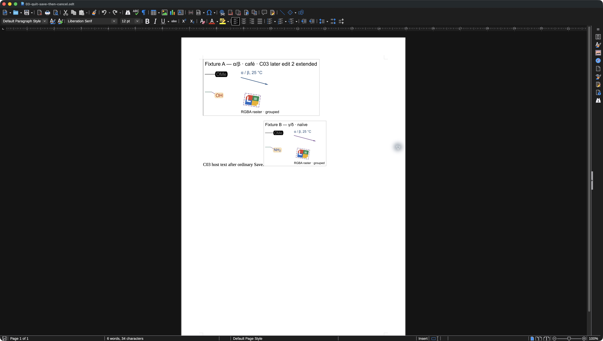

SHA-256: `209f3d3b0471ae7867328557a48bb69e617a1c2caf80de75f569cb428f709e30`

## PR #121: pr121-ring-tool-macos-783b154

Historical native macOS capture from production source 783b154 (QA eeb3d67), 1040×680 content points at 204% zoom: Regular ring / Size 6 is selected and a six-membered ring has been placed. This illustrates the resulting tool and canvas state; it does not establish Shift+3–8 key routing, atom-target behavior, or a new current-head execution.

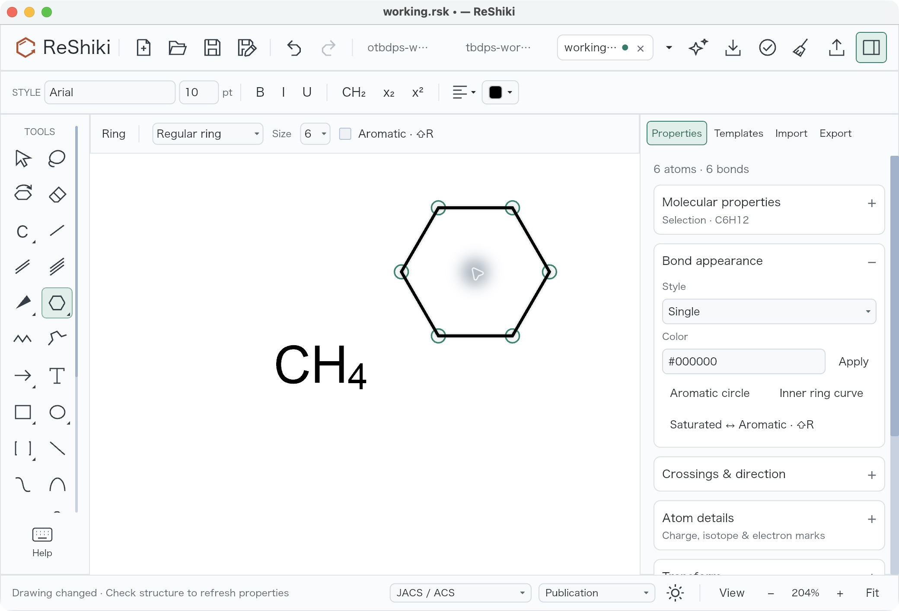

SHA-256: `c6ecaa391f8015bd3a6151e4c18a4190117933c307d385603231f80ba28ad7cf`

## PR #127: pr127-word-launch-failure-macos-d8f426f

Native Microsoft Word on macOS with the Office companion from canonical d8f426f: the task pane rejected Word’s launch URL with Invalid request URL. This is the original failure before the Office launch-query fix.

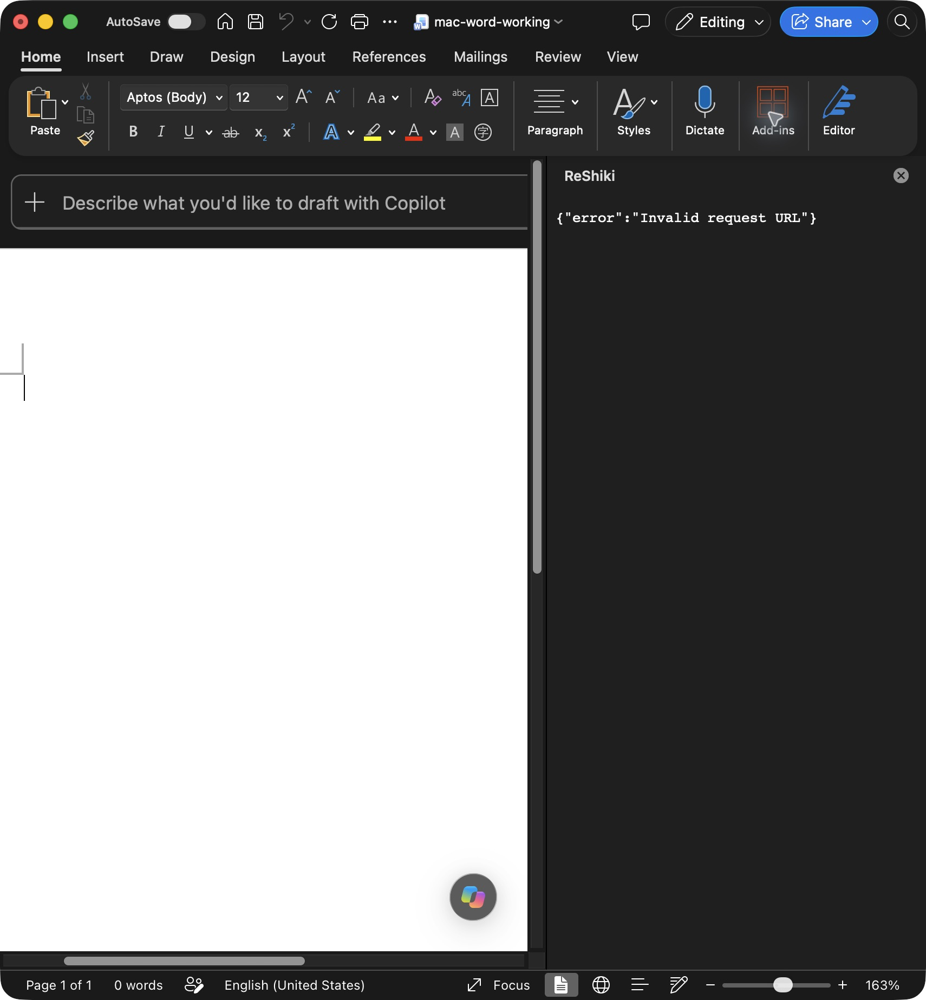

SHA-256: `a070466c6943247aef3e700ffb1b8ab4e525047a53248990328f7b928b7abc6e`

## PR #127: pr127-word-connected-macos-6ca2ec2

Native Microsoft Word on macOS after companion fix 6ca2ec2 (public aggregate 9a5d830): the task pane displays Connected to Word and its drawing controls. This proves task-pane connection only. Drawing insertion, editing, save/reopen, recovery, and other Office hosts require separate acceptance.

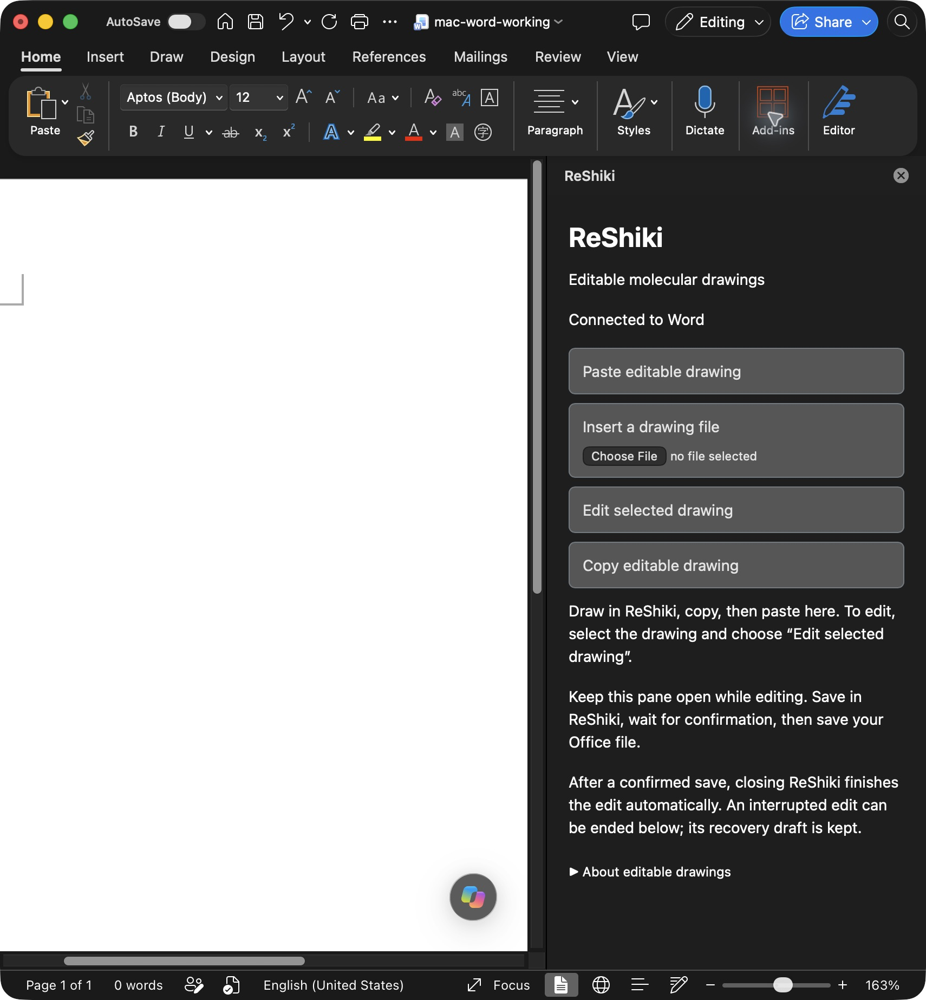

SHA-256: `77bd3732c8d043fb8ba1d1d4e6fd93c8bcdb9a76983c43e1dfe3ffae53dad382`

## PR #127: pr127-powerpoint-reopened-macos-6ca2ec2

Native PowerPoint 16.113.3 on macOS, Office source 6ca2ec2 and ReShiki package cc17b7a. PowerPoint for Mac: the saved test deck reopened with drawing A and the ReShiki task pane connected. Baseline host UI before native edit; drawing B is on slide 2. Does not by itself prove native payload or ACK. The saved-package inspection remains REVIEW_REQUIRED; these images do not establish the full Office acceptance matrix.

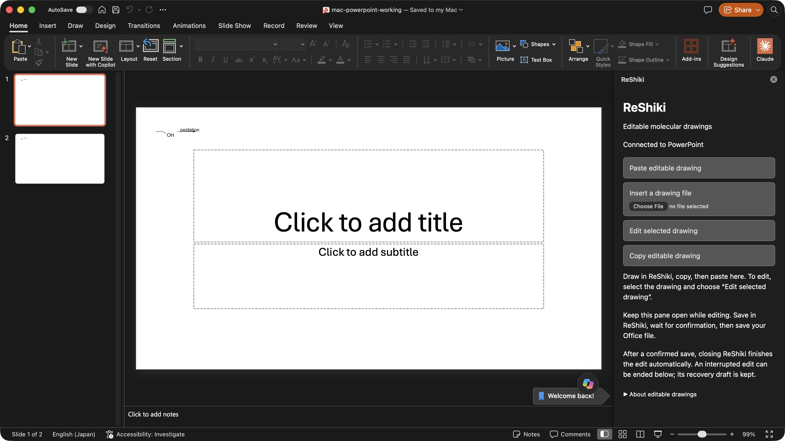

SHA-256: `62e167907e93e2a32677fb5f382bb73723ac13fdd2d51dc213eaa48873213809`

## PR #127: pr127-powerpoint-ack-confirmed-macos-6ca2ec2

Native PowerPoint 16.113.3 on macOS, Office source 6ca2ec2 and ReShiki package cc17b7a. PowerPoint edit session: ReShiki shows the rotated drawing with a clean tab and “Drawing updated in Office” after the actual host acknowledged the save. Original native UI capture tied to PowerPoint session 173c4489-73c2-48e9-8e0f-64dd093eee14 by the sealed receipt. Host save/reopen and B checks are separate recorded evidence. The saved-package inspection remains REVIEW_REQUIRED; these images do not establish the full Office acceptance matrix.

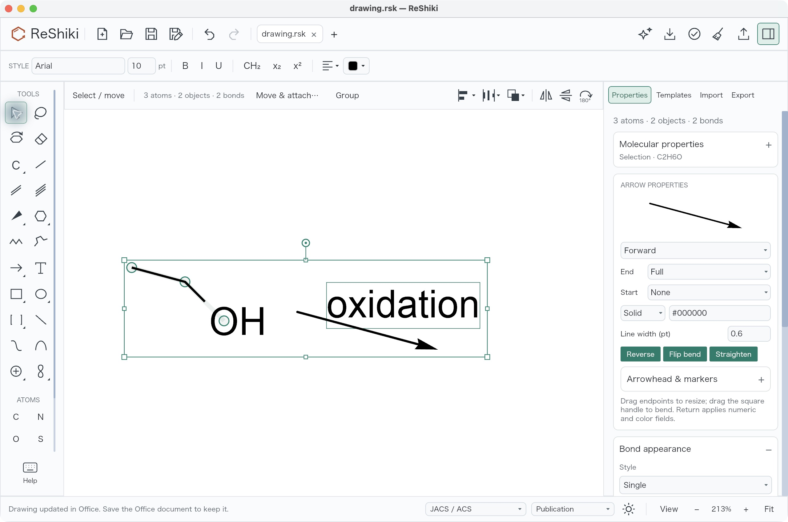

SHA-256: `8c77da0926b08f9b49eb169ad052f62b1fef0b957bf73a80d2d4cfc68f4a7346`

## PR #127: pr127-excel-reopened-macos-6ca2ec2

Native Excel 16.113.3 on macOS, Office source 6ca2ec2 and ReShiki package cc17b7a. Excel for Mac: the saved test workbook reopened on Sheet1 with drawing A and the ReShiki task pane connected. Baseline host UI before native edit; drawing B is on Sheet2. Does not by itself prove native payload or ACK. The saved-package inspection remains REVIEW_REQUIRED; these images do not establish the full Office acceptance matrix.

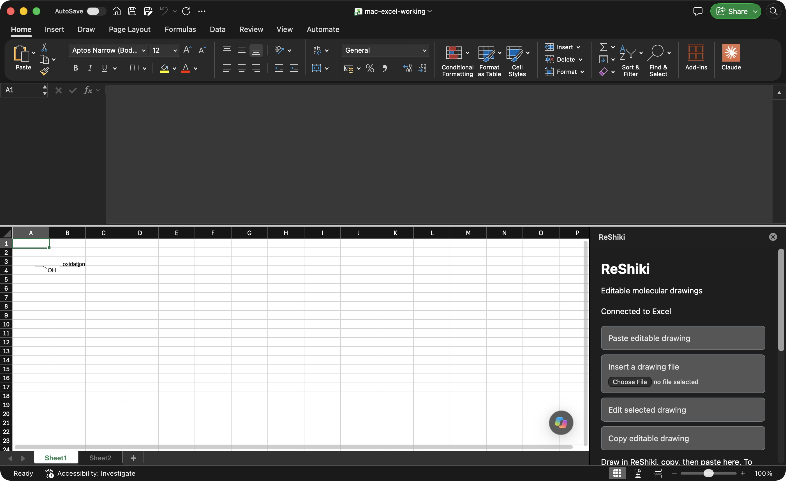

SHA-256: `e6e37176bbf42081b2c5826f06233e1b81bff89e356424515f299490f8e5bc6c`

## PR #127: pr127-excel-ack-confirmed-macos-6ca2ec2

Native Excel 16.113.3 on macOS, Office source 6ca2ec2 and ReShiki package cc17b7a. Excel edit session: ReShiki shows the rotated drawing with a clean tab and “Drawing updated in Office” after the actual host acknowledged the save. Original native UI capture tied to Excel session 7c6c0365-193d-41bd-8818-bccc67830d8c by the sealed receipt. Host save/reopen and B checks are separate recorded evidence. The saved-package inspection remains REVIEW_REQUIRED; these images do not establish the full Office acceptance matrix.

SHA-256: `c1ac7cd1b29460c3c91bd69c6e044b995e6076730fdd2cd54b730ef8ac344cb2`

## PR #127: Before: Word rejects the edit

Native Word edit session with Office source 6ca2ec2 and ReShiki package cc17b7a. The edited drawing remains dirty (green dot beside the tab name); the red status retains the recovery draft after Word rejected save-back. The actual rejection is recorded in the accompanying native test receipt. The visible temporary path belongs to this synthetic test. This screenshot does not identify the rejection’s cause.

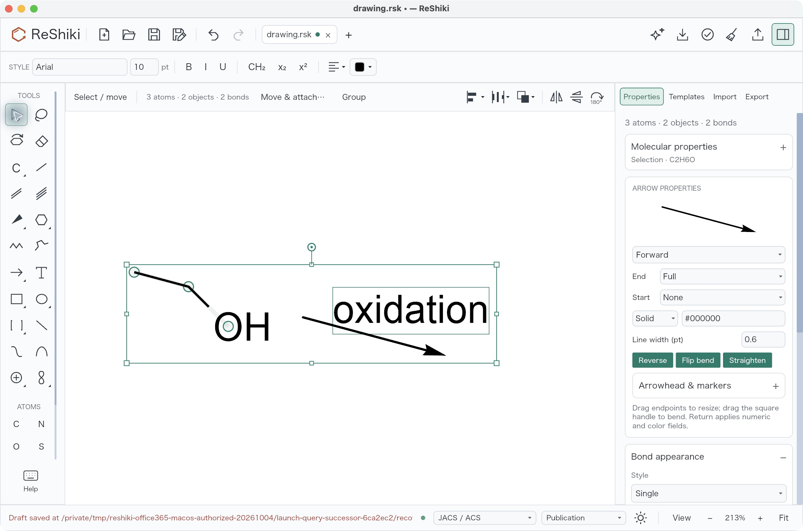

SHA-256: `359e25df47e245c937e40e04f11caea7ad092690e4c187776aacc4b76ab44ce1`

## PR #127: After: Word acknowledges the edit

Native Word edit session with Office source 2fb8f3a and the same ReShiki package cc17b7a. The same synthetic drawing was rotated 15 degrees. Word accepted the update: ReShiki shows a clean tab and “Drawing updated in Office. Save the Office document to keep it.” The saved document was then closed and reopened, and Edit selected drawing restored exactly the acknowledged native data.

SHA-256: `34a20831cf22cf1d5b18cbd508a6f8e7beabd7da0d2412c28d72cf1918a944b0`

## PR #127: Result: the saved Word document reopens with the edit

Microsoft Word 16.113.3 for Mac after the confirmed update, document save, close and reopen, using Office source 2fb8f3a and ReShiki package cc17b7a. Drawing A retains the update. This is a one-object result: a separate second insertion still rolled back. Word resampled the embedded preview, so exact preview fidelity and the complete A/B acceptance matrix remain open.

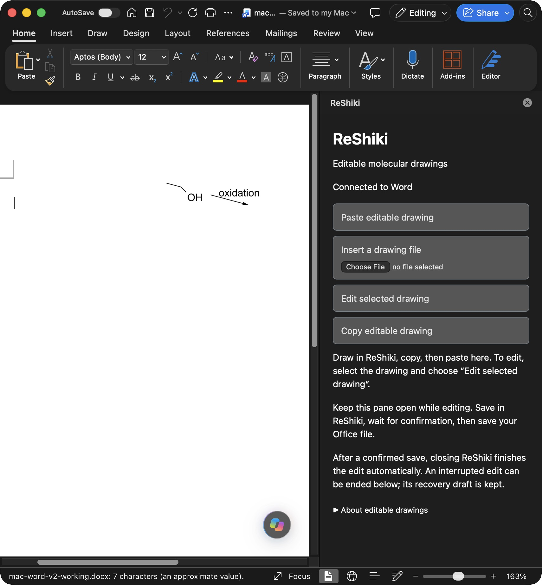

SHA-256: `bf0f29a94153eaba33659da9ab3971dcbeb75bfe5708493260ed94133e24ce89`
