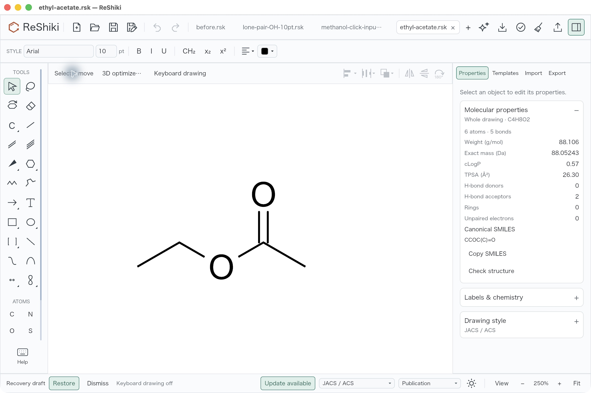
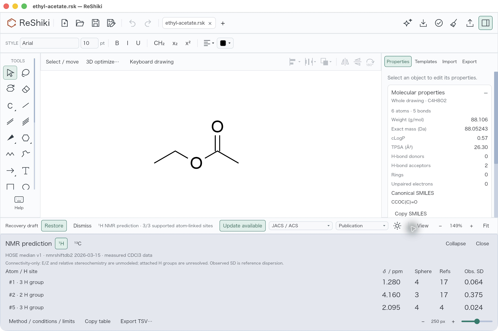
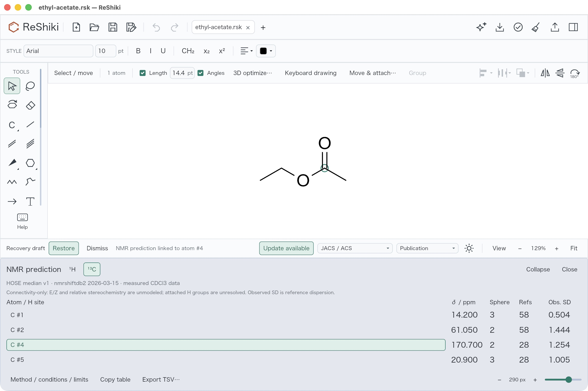
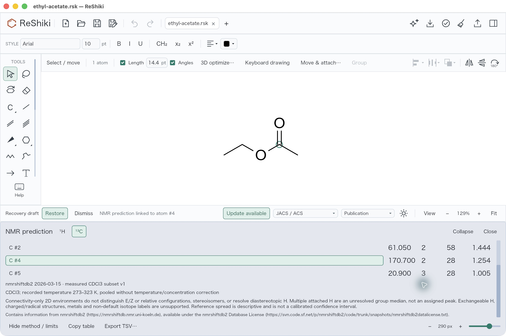

# Offline NMR desktop review

The baseline has molecular properties but no NMR workflow. This feature predicts atom-linked ¹H parent-group medians and ¹³C shifts from a locally bundled measured-reference index. It does not generate a simulated spectrum or assigned multiplets.

## Capture and reproduction

- Platform: macOS arm64, default-feature debug source builds, Rust 1.99.0; native ReShiki app reviewed through computer use.
- Baseline source: `51fa0991da2507bb00b27c1b420e807468de6423`.
- Candidate production source: `c3d1676c9c5598a6bfb144cc4ff49527f08752ee`.
- Signed candidate executable SHA-256: `7e891f6bfbb835fb33376af71c0c2c0c2c452eaefc5ffd0dda5be88c45eae8ca`.
- Input: [ethyl-acetate.rsk](../tests/fixtures/nmr/ethyl-acetate.rsk), original drawing; C4H8O2, six atoms, five bonds, canonical SMILES `CCOC(C)=O`.
- Open the input, turn keyboard drawing off with F8, and expand Properties → Molecular properties. In the candidate, choose Predict NMR…; switch ¹H/¹³C, click a site, adjust panel height, and export TSV.
- All screenshots are original desktop captures without retouching. They show the same input and JACS / ACS Publication style. The baseline uses 250% zoom and includes three other scratch tabs. Opening the new bottom panel automatically fits the canvas: the proton example uses 149% at 250 logical-pixel panel height. The carbon example uses 129% at 290 logical-pixel panel height, with the inspector hidden and carbonyl atom #4 selected. These are new-feature workflow examples, not matched-scale rendering comparisons.

## Observed results

The final candidate displays ¹H values 1.280, 4.160 and 2.095 ppm, and ¹³C values 14.200, 61.050, 170.700 and 20.900 ppm, matching the native acceptance fixture. Clicking carbon site #4 selects the actual carbonyl atom. Accessible height buttons change the requested height by 20 logical pixels and all four carbon rows fit at 290. Collapse and reopen preserve results. Native Export TSV… produces [the recorded desktop export](../tests/fixtures/nmr/ethyl-acetate-carbon-desktop.tsv), with four real tab-separated rows and full source, conditions, attribution and limitations.

The earlier functional candidate, using identical prediction code, also passed a geometry-only drag (results retained), chemical C→N edit (results cleared and Copy/Export disabled), and Undo of the chemical edit. Final-source tests cover these invalidation gates and document isolation. The final desktop pass verifies the added native control metadata and accessible height controls.

The six chemistry, eleven IO and three app tests passed, including native renderer/action metadata at 940×620 and 1280×820, 256 ring-graph permutations, bundled-data predictions and unsupported cases. Scoped strict Clippy, generator checks, Python lint/type checks, formatting, app build and bundle signature verification passed. All 1,069 own-worktree tracked Rust/Cargo entrypoints were refreshed before final compilation; source content hashes remained unchanged, preventing shared-target cache reuse from another feature worktree.

## Scientific scope and provenance

See [the user guide](nmr-prediction.md), [data provenance and license](../data/nmr/README.md), and [held-out report](../data/nmr/validation.json). The original spherical encoder uses radii 2–4, longest supported radius first, median fallback, and at least two independent molecular connectivity groups. It pools stereoisomers and does not resolve diastereotopic H; multiple attached H represent an unresolved parent group. Reference SD is observed dispersion, not a calibrated confidence interval.

Only neutral supported organic graphs up to 128 atoms and recorded CDCl3 measurements at 273–323 K are included. Exchangeable H, ions, radicals, metals and non-default isotope labels are unsupported. Sparse environments remain without numerical values. Held-out errors come from the same source release, not an independently acquired cohort: ¹H group-median MAE 0.307 ppm at 92.53% coverage; ¹³C MAE 2.047 ppm at 60.22% coverage. The paper’s published accuracy is not claimed.
