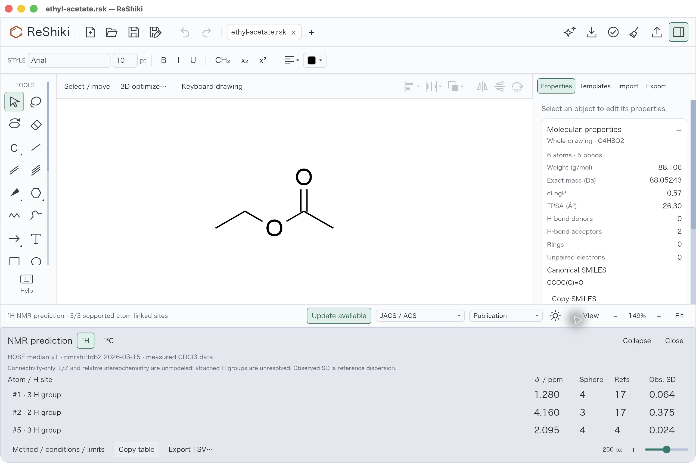
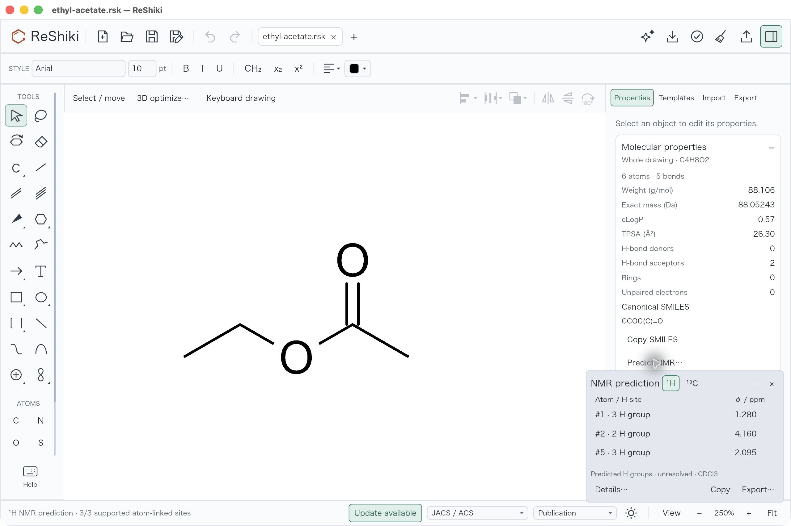
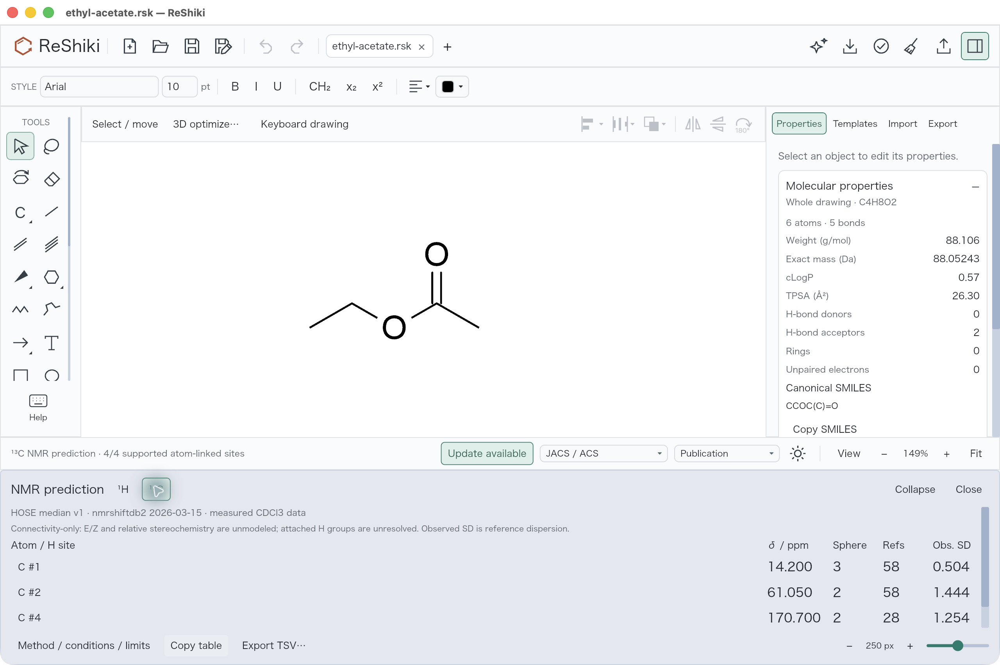
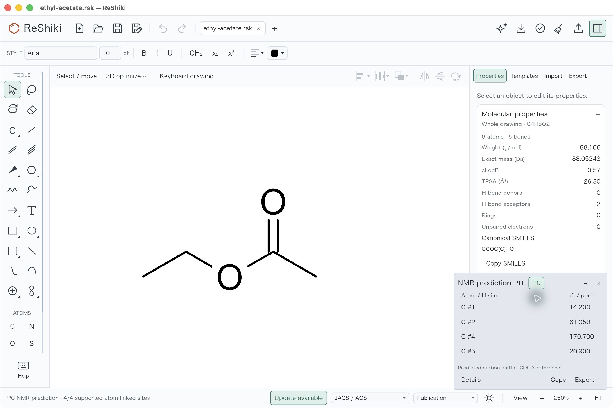
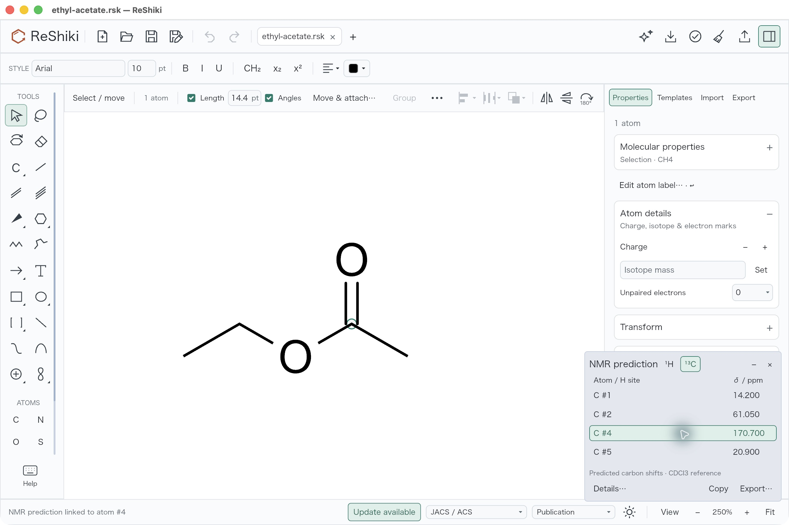
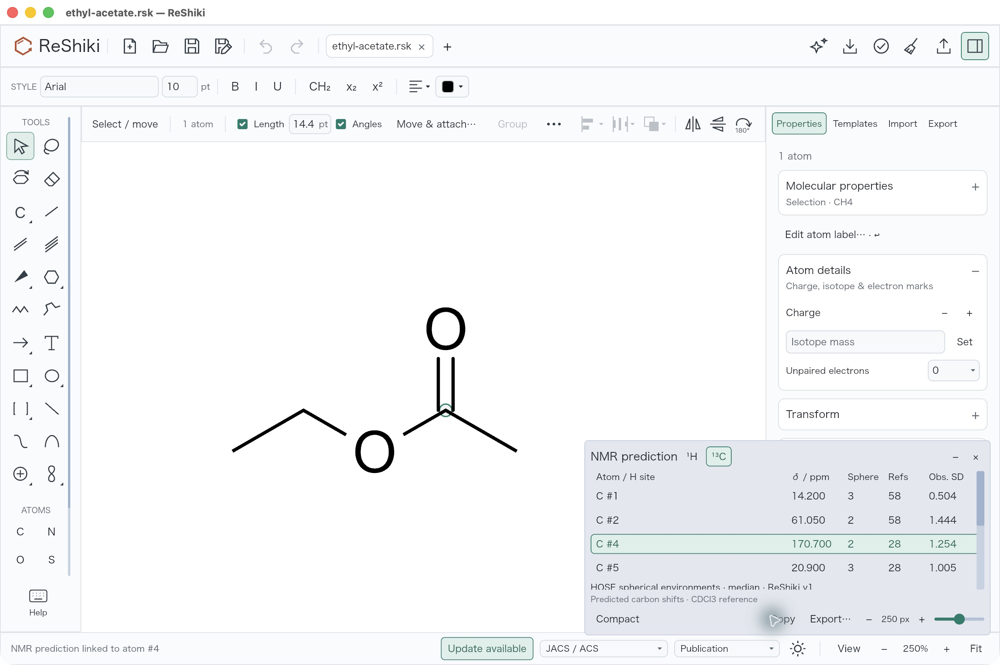
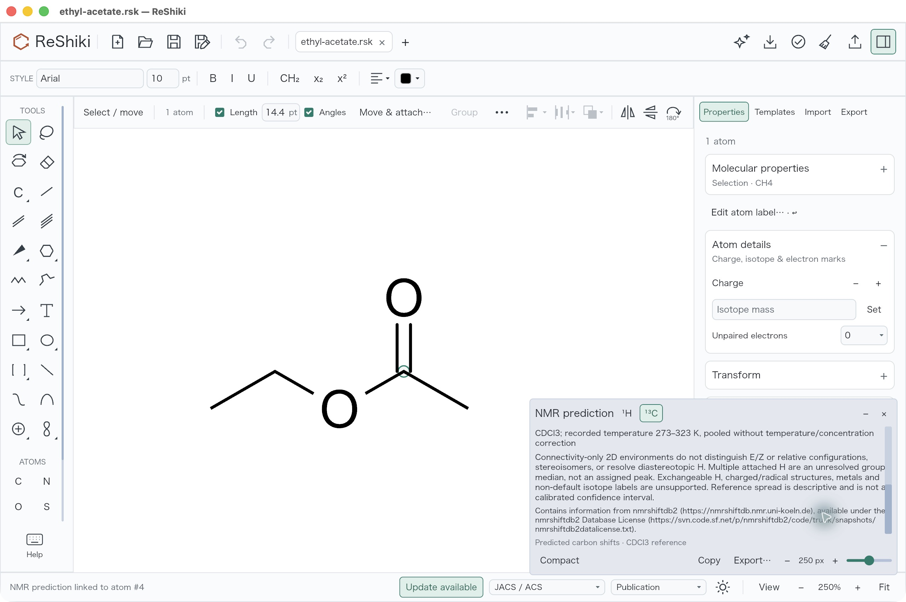
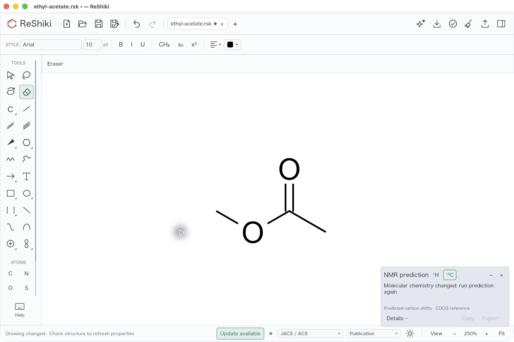
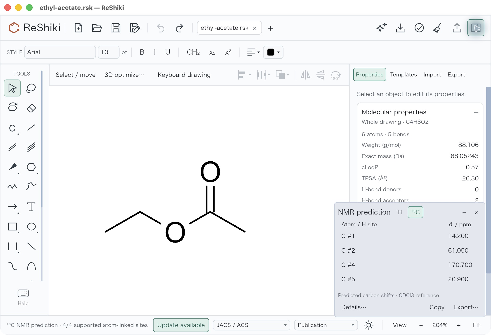
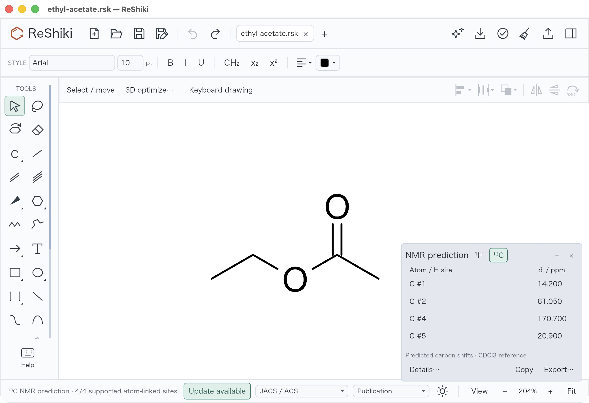

# Offline NMR desktop review

Offline NMR prediction opens atom-linked ¹H parent-group medians and ¹³C shifts in a compact nonmodal palette. The drawing keeps its viewport and camera; reference columns and method information expand on demand. Native review of the compact revision is complete. [PR #272](https://github.com/Ameyanagi/ReShiki/pull/272) remains under review.

## Matched native before and after

User review rejected the previous full-width dock because it consumed too much drawing space. These original JPEG captures compare that dock at production source `c3d1676c9c5598a6bfb144cc4ff49527f08752ee` with the compact palette at `b85119828444eec36189134c93e8d1d4918fe343`. Both use the unchanged [ethyl-acetate fixture](../tests/fixtures/nmr/ethyl-acetate.rsk), JACS / ACS Publication style, keyboard drawing off, Properties visible, and a 1280×820 logical content window (2560×1704 physical capture including the title bar).

The drawing starts at 250%. Opening the old 250-pixel dock shrinks the drawing viewport and automatically refits it to 149%. Opening the compact palette retains 250% and the original drawing viewport. The resulting molecular scale difference is the observed consequence of opening prediction, not an independently adjusted comparison scale. The compact palette is 320 logical pixels wide; this fixture's default heights are 214 pixels for H and 244 for C. It anchors at the right edge, over the inspector region, keeping the centered drawing clear.

| Previous proton dock: 149%                                                                | Compact proton palette: 250%                                                              |
| ----------------------------------------------------------------------------------------- | ----------------------------------------------------------------------------------------- |
|  |  |

| Previous carbon dock: 149%                                                                           | Compact carbon palette: 250%                                                          |
| ---------------------------------------------------------------------------------------------------- | ------------------------------------------------------------------------------------- |
|  |  |

All four compact carbon rows are visible without scrolling: atom #1 14.200, #2 61.050, #4 170.700 and #5 20.900 ppm. The three H-group medians remain 1.280, 4.160 and 2.095 ppm. This UI revision leaves the prediction engine, measured index and export unchanged.

## Native interaction examples

Clicking row **C #4** selects the original carbonyl atom. Undo remains disabled because selection does not edit the drawing.

**Details…** expands the reference columns and scrollable method information. Native review exercised the expanded height buttons from 250 to 270 and back to 250 pixels, then scrolled through method, conditions, limitations and attribution. The drawing remained at 250%. **Compact** returns to the small view.

Hide/Show retained all four carbon results. Closing and reopening returned to the compact layout with ¹³C selected. Wheel input in empty palette padding and a press/drag/release ending outside the palette left the drawing camera at 250% and Undo disabled. Drawing outside the palette remained active: selecting all six atoms and moving them by 40 pixels retained the four results, and Undo restored the geometry.

A real chemical edit, erasing carbon #1, cleared the rows and disabled Copy/Export. Undo followed by choosing ¹³C restored all four predictions.

Native **Copy** was clicked; clipboard contents were not read back. Native **Export…** produced four real tab-separated carbon rows, byte-identical to the [original desktop acceptance export](../tests/fixtures/nmr/ethyl-acetate-carbon-desktop.tsv), including source, conditions, limitations and attribution. Its SHA-256 is `23464aba142911f3fb3c635069f4bc8f2a8c0028934c6925d3065c036058b876`.

## Native minimum window

The existing application minimum is 1040×680 logical content pixels. macOS clamps smaller resize attempts to that size; these captures are 2080×1424 physical pixels including the 32-logical-pixel title bar. All four carbon rows fit with Properties shown and hidden. The displayed 204% zoom here results from resizing the window, rather than from opening prediction. The smaller 940×620 size is covered by renderer tests only.

| Inspector shown                                                                                          | Inspector hidden                                                                                             |
| -------------------------------------------------------------------------------------------------------- | ------------------------------------------------------------------------------------------------------------ |
|  |  |

## Source, evidence and reproduction

The reviewed macOS arm64 default-feature debug bundle is the separately preserved `ReShiki NMR Compact.app`, signed executable SHA-256 `9d29f842dfb72748ba931332a7ce37e43183a6155a07b3a260118df9a5c42321`. See the [exact build and validation record](nmr-compact-validation.md) and [capture/artifact hash manifest](nmr-compact-native-evidence.json). Every image above preserves the original JPEG/JFIF desktop bytes without cropping, retouching or re-encoding.

To reproduce, open the unchanged fixture, turn keyboard drawing off with F8, choose JACS / ACS Publication and Fit, expand Properties → Molecular properties, then choose **Predict NMR…**. Compare H and C with the inspector visible before exercising selection, Details…, height, scrolling, hide/show, close/reopen and export. Test palette padding and outside drawing input, then restore the graph after geometry and chemistry edits.

The [final native saved drawing](evidence/nmr/ethyl-acetate-compact-desktop-final.rsk) is clean, with six atoms, five bonds, C4H8O2, original atom IDs and original positions. The [independent comparison](evidence/nmr/compact-desktop-independent-check.json) verifies source atom fields and positions, bond endpoints/order/display, neutral defaults and derived H. Existing serialization adds default fields and omits the fixture-only bond ID keys. This saved artifact proves graph restoration; it does not claim persistence of NMR results.

## ChemDraw reference limit

The installed ChemDraw 26.0.0.6599 was inspected through its About and Structure menus and is Prime. [Revvity's support record](https://support.revvitysignals.com/hc/en-us/articles/4408233427220-ChemDraw-ChemNMR-options-do-not-appear-in-the-Structure-menu) confirms that Prime lacks ChemNMR. The bundled official help, `Content/MyImport/ChemNMR.htm`, section **NMR Shifts**, describes selecting a structure and opening predicted shifts with annotated molecular information and a line spectrum in a separate window. This manual supports separating prediction results from the drawing layout. No live ChemNMR results window was available, so no visual match is claimed. ReShiki shows linked shifts without a simulated spectrum or assigned multiplets.

## Historical functional evidence

The earlier baseline without NMR used source `51fa0991da2507bb00b27c1b420e807468de6423`. The original dock candidate used `c3d1676c9c5598a6bfb144cc4ff49527f08752ee`, signed executable SHA-256 `7e891f6bfbb835fb33376af71c0c2c0c2c452eaefc5ffd0dda5be88c45eae8ca`. Its original [baseline](images/nmr/before.jpg), [proton](images/nmr/proton.jpg), [carbon selection](images/nmr/carbon.jpg) and [method](images/nmr/conditions.jpg) captures remain unchanged as historical functional evidence. They use different panel heights/inspector states and are not the matched comparison above. The old dock is superseded by the compact implementation for UI review.

## Scientific scope and provenance

See [the user guide](nmr-prediction.md), [data provenance and license](../data/nmr/README.md), and [held-out report](../data/nmr/validation.json). The original spherical encoder uses radii 2–4, longest supported radius first, median fallback, and at least two independent molecular connectivity groups. It pools stereoisomers and does not resolve diastereotopic H; multiple attached H represent an unresolved parent group. Reference SD is observed dispersion, not a calibrated confidence interval.

Only neutral supported organic graphs up to 128 atoms and recorded CDCl3 measurements at 273–323 K are included. Exchangeable H, ions, radicals, metals and non-default isotope labels are unsupported. Sparse environments remain without numerical values. Held-out errors come from the same source release, not an independently acquired cohort: ¹H group-median MAE 0.307 ppm at 92.53% coverage; ¹³C MAE 2.047 ppm at 60.22% coverage. The paper’s published accuracy is not claimed.
