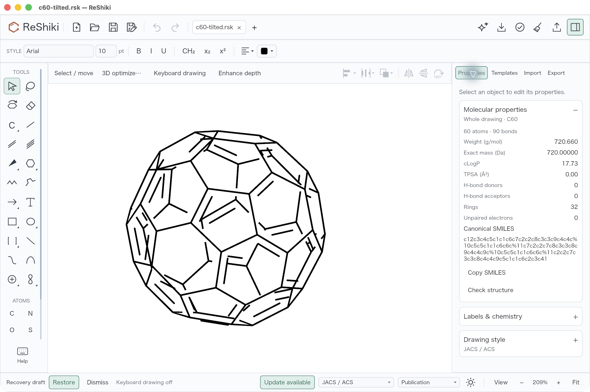
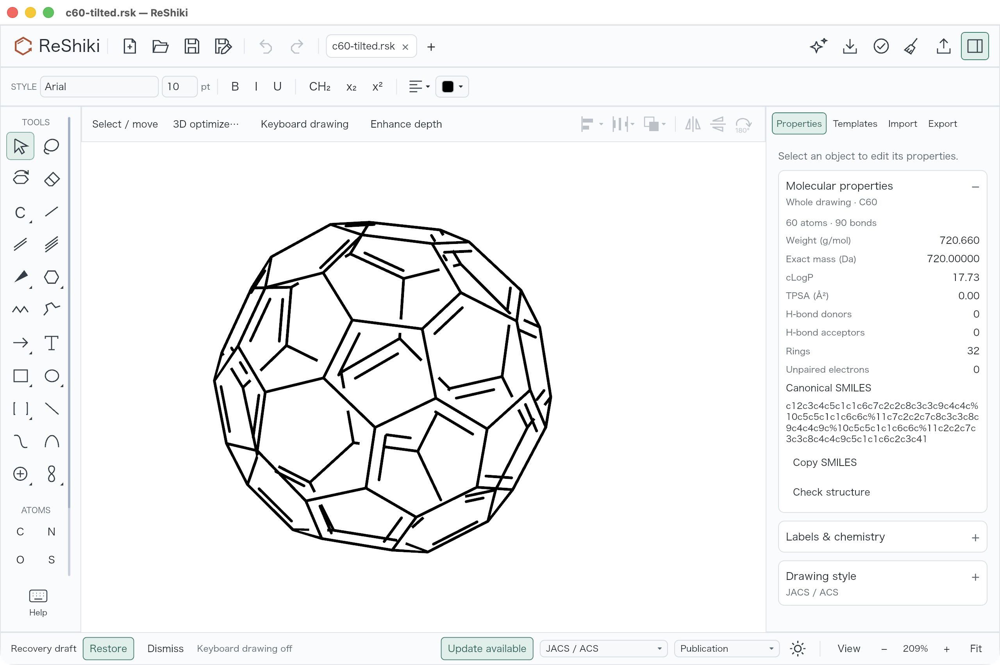
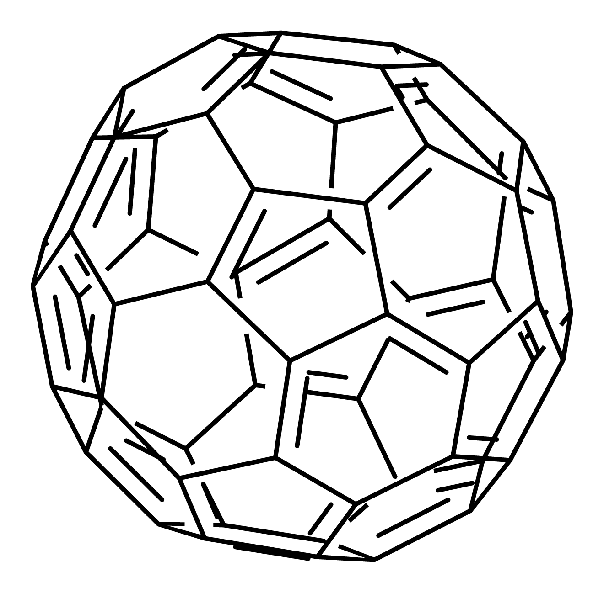
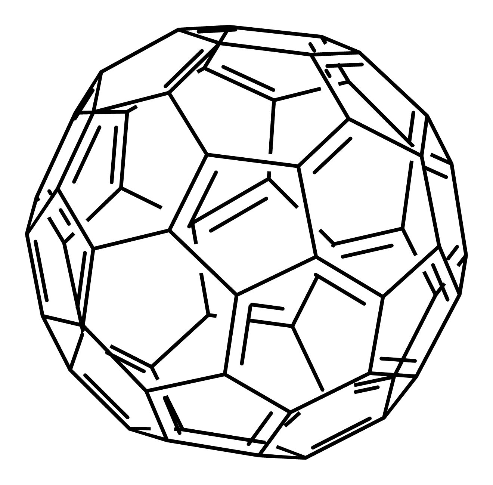

# Projected double-bond desktop review

Automatic secondary strokes previously used a constant screen-normal gap even when a ring retained tilted XYZ coordinates. The inset could protrude outside a projected fullerene face and failed to foreshorten with that face. The shared renderer now projects a local XYZ edge/centroid tangent and clips the secondary stroke inside the projected face, accounting for stroke width. A collapsed inset is omitted while the primary backbone remains.

| Before                                                                                                               | After                                                                                                                                   |
| -------------------------------------------------------------------------------------------------------------------- | --------------------------------------------------------------------------------------------------------------------------------------- |
|  |  |

Actual desktop captures: macOS arm64 locked debug apps; baseline `51fa0991da2507bb00b27c1b420e807468de6423`, application source `427d5f4e2bc05456213c0c98b6daa01351666bf2`, 2026-10-09. Open the same [C60 fixture](../tests/fixtures/projected-double-bonds/c60.rsk), disable keyboard drawing with F8, clear selection, show Properties and use 209% zoom. The input was optimized once and rotated 28° about X then 32° about Y before either capture; do not optimize again between captures. Both views show C60, 60 atoms and 90 bonds with identical values. Window, drawing style, canvas position and scale match; the mouse pointer position differs.

| PNG export before                                                      | PNG export after                                                     |
| ---------------------------------------------------------------------- | -------------------------------------------------------------------- |
|  |  |

The raw PNG exports use the same input and default style at 1200 dpi. C60 framing matches exactly, with SVG viewBox `-116.143654 -113.03334 230.9384 227.00122`. Neither screenshots nor exports were retouched. Ten frozen inputs were exported in PNG, SVG and PDF: C60/C70 front and tilted, plus planar/tilted/edge-on benzene and naphthalene. Other automatic export bounds can shrink when protruding ink disappears. Ordinary planar SVG controls are byte-identical.

[Complete cage property reports](../tests/fixtures/projected-double-bonds/properties-comparison.json) compare all returned fields before and after and are exactly equal. Frozen molecular coordinates and chemical data remain unchanged.

Seven focused regressions and the full model suite passed (138 passed, seven existing optional parity tests ignored), with strict all-target/all-feature model Clippy, workspace formatting, locked native app build and codesign verification. The focused cases cover containment, foreshortening, storage-order/bond-reversal invariance, edge-on collapse, search limits and conservative unsupported-geometry fallback.

This applies to automatic order-2/7 secondary strokes. Explicit placement keeps its established behavior. Search is bounded to 24 ring atoms and 4096 visits. Warped C70 faces use a local tangent approximation within a 0.2 mean-edge residual gate; this does not flatten the molecule or establish a global plane. Unsupported or missing face geometry retains the existing 2D fallback. Windows EMF was not run in this macOS validation.

Release caption: Tilted fullerene double bonds follow their local ring faces, with foreshortened spacing and clean inset strokes.

Original screenshots and chemical test data are offered under MIT OR Apache-2.0. Fixture provenance is in [the fixture README](../tests/fixtures/projected-double-bonds/README.md).
