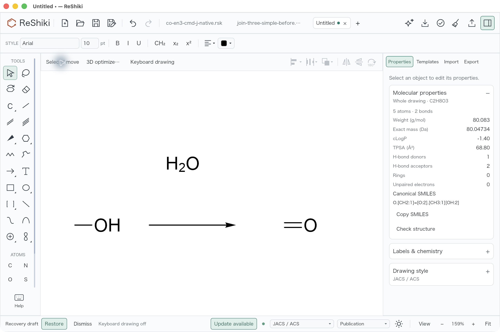
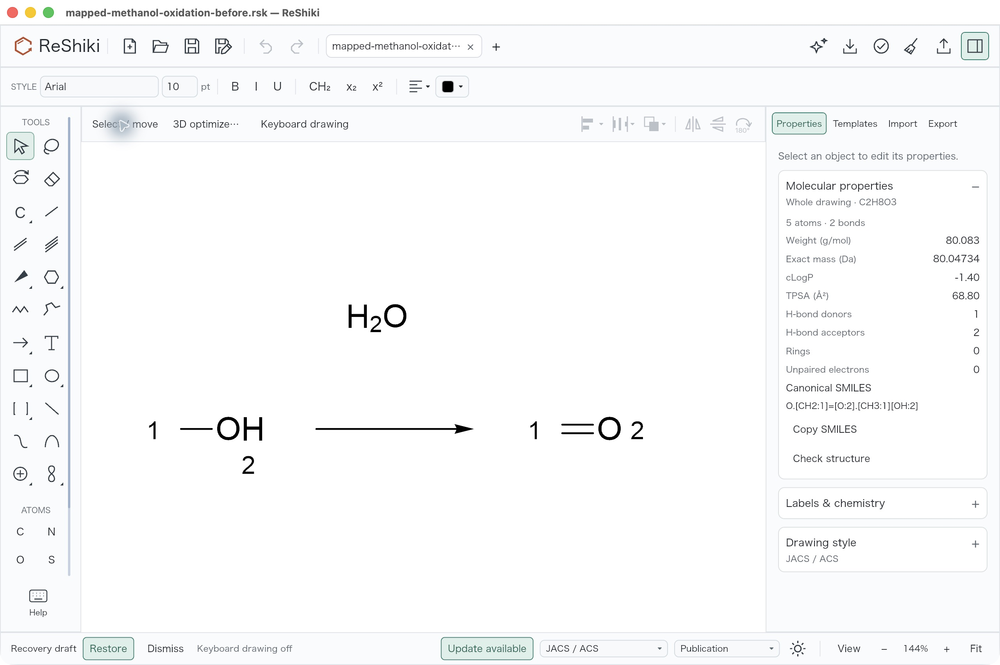
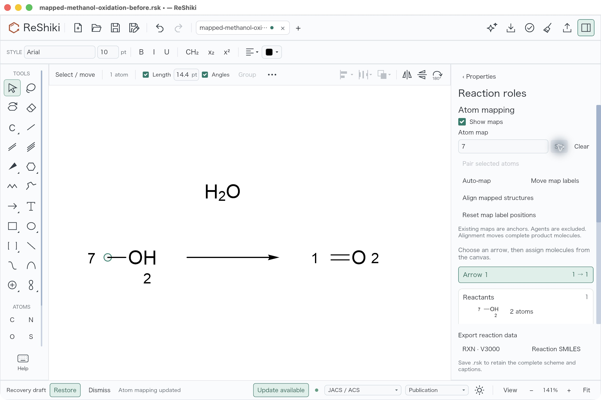
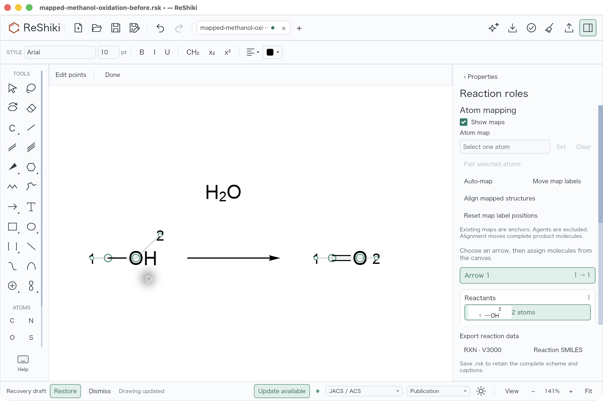
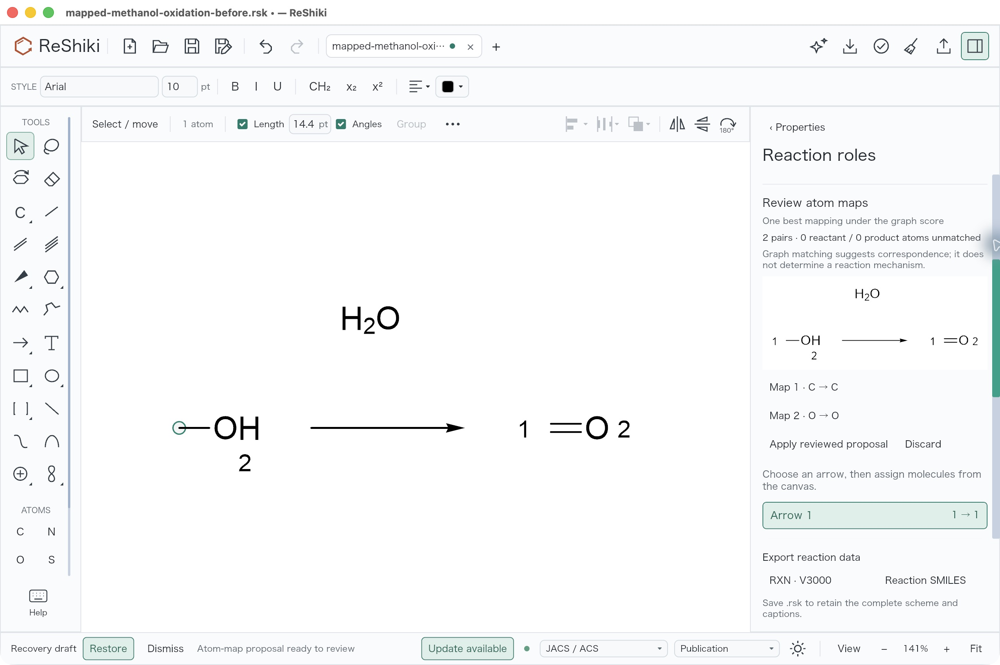
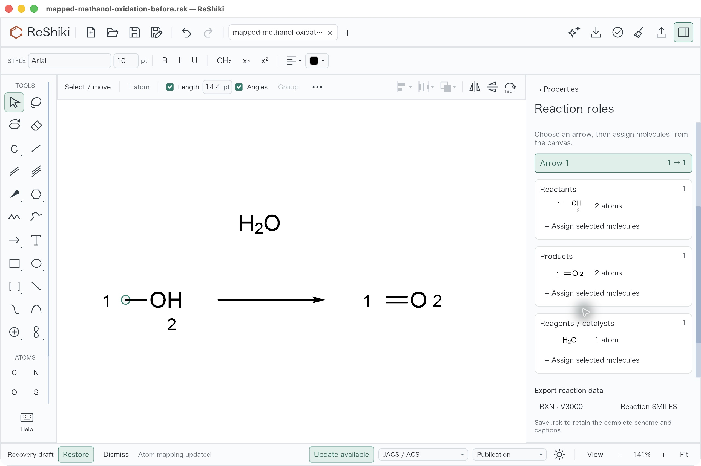
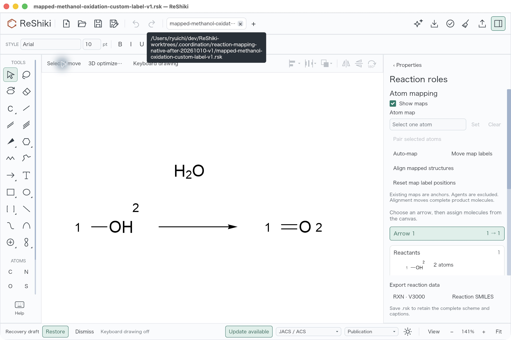
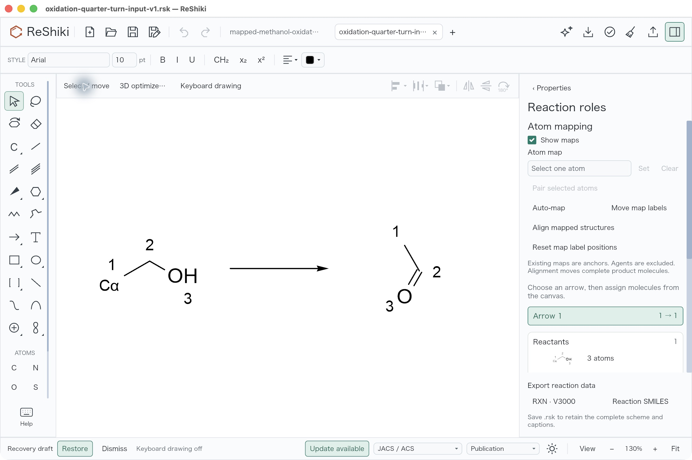
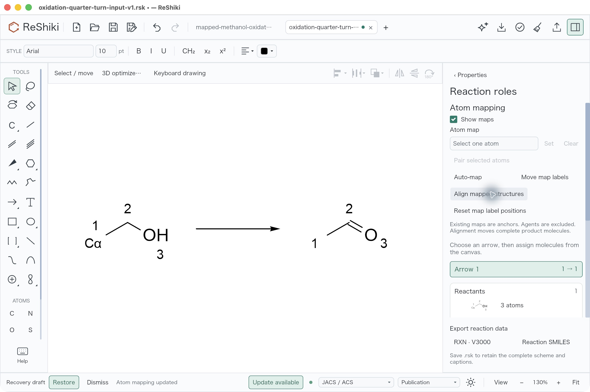

<!-- SPDX-License-Identifier: MIT OR Apache-2.0 -->

# Reaction atom maps: native validation

Imported atom maps were already retained in reaction chemistry, but their
numbers did not appear on the drawing. This change derives visible indicators
from `map_num`, keeps custom atom numbers independent, and adds manual map
editing, reviewed automatic correspondence and a separate rigid alignment
command. See the [usage guide](reactions.md#atom-mapping-and-label-placement).

This record covers the October 10, 2026 native macOS checks and focused tests.
It does not claim general reaction-mechanism inference or comprehensive
mapping accuracy across a reaction database.

## Imported maps: actual before and after

The controlled input is
[`[CH3:1][OH:2]>O>[CH2:1]=[O:2]`](evidence/reaction-atom-mapping/mapped-methanol-oxidation.rsmi).
The old app imported it and saved
[native-before.rsk](evidence/reaction-atom-mapping/native-before.rsk). Its five
atoms, two bonds, one reaction and maps `[0, 1, 1, 2, 2]` were already correct;
the water agent was unmapped. The verified new app opened that exact native
file unchanged, and all four positive maps became visible.

| Historical native import: maps absent from canvas                                                                                    | Verified new app: same saved chemical input                                                                                                               |
| ------------------------------------------------------------------------------------------------------------------------------------ | --------------------------------------------------------------------------------------------------------------------------------------------------------- |
|  |  |

These are unedited native screenshots, not renderer fixtures. The old view is
159% zoom and the new view is 144%, with different framing. They demonstrate
indicator visibility; they are not a pixel-matched geometry comparison. The
native JSON verifies unchanged atom coordinates and chemistry.

The historical before app was **ReShiki Coordination Join Verified**, a
default-feature development snapshot based on `39b25cd` plus its reviewed
shortcut patch. It was not the exact base of this branch. The new candidate
was built from `51fa0991da2507bb00b27c1b420e807468de6423` plus the frozen,
uncommitted mapping implementation on `feat/reaction-atom-mapping`. Mapping
import/model/indicator sources were checked against that base before editing.
[Provenance](evidence/reaction-atom-mapping/provenance.json) records both
executable hashes and the exact capture/build distinctions; no final PR commit
is claimed for this development capture.

## Native editing and proposal review

Starting with the saved old native input, the operator:

1. Tried to set reactant carbon map 1 to 2. The duplicate-side error retained
   the drawing, clean state and empty Undo history.
2. Set that carbon to 7, then used one Undo to restore 1.
3. Cleared its map and ran **Auto-map**. The detached review showed two pairs,
   `C → C` and `O → O`, zero unmatched atoms and one best mapping under the
   graph score. The main canvas carbon stayed unmapped before Apply.
4. Chose **Apply reviewed proposal**. Carbon map 1 returned; one Undo removed
   it and Redo restored it. **Show maps** off/on changed the ink.
5. Dragged reactant oxygen's map 2 handle, used Undo/Redo, and saved the actual
   [custom-label native result](evidence/reaction-atom-mapping/native-custom-label-after.rsk).
   **Reset map label positions** restored automatic placement; Undo restored
   the custom placement. Closing the saved tab and opening its exact path in
   a fresh tab retained the custom offset, with Undo/Redo disabled.

| Manual map edit                                                                                                | Independent map-label placement                                                                                              |
| -------------------------------------------------------------------------------------------------------------- | ---------------------------------------------------------------------------------------------------------------------------- |
|  |  |

| Detached proposal before Apply                                                                                                                   | Main drawing after reviewed Apply                                                                                         |
| ------------------------------------------------------------------------------------------------------------------------------------------------ | ------------------------------------------------------------------------------------------------------------------------- |
|  |  |



The actual custom-label save is 4,581 bytes, SHA-256
`ce1c6c6aa0b00da79eb67226137f446b63584c347bd1010c7f90319d17379cdb`.
Compared with the untouched old native save
`6aa6549fe2f76c0fc3132d10393cf2941a5f27ffe927f133b60566da8e76301b`,
its only raw difference is atom 2's display record. After serde defaults are
normalized, only owner `Mapping(2)` gains offset
`{x: 36.582657, y: -34.99306}`. Every chemical/cache field, map, atom coordinate,
bond, role/coefficient, arrow, custom-number field and document setting is
unchanged. Label text remains derived from map 2; no custom text is substituted.

This was a **same-process fresh-tab reopen**, not a fresh-process restart.
Earlier accessibility captures often reported a diff or no change; only the
fresh-reopen full tree is used to confirm disabled Undo/Redo. A wrong-row Open
attempt produced an invalid-UTF8 error before the successful exact-path
retry; that attempt remains in the private immutable receipts. The map field
retains the previously typed draft `7` after Undo while the canvas map restores
`1`; the draft is not the chemical map value.

## Proper rigid alignment: actual native save

The [authored oxidation fixture](evidence/reaction-atom-mapping/authored-oxidation-after.rsk)
contains `[CH3][CH2][OH]>>[CH3][CH]=O`, maps 1/2/3, and an independent custom
number `Cα`. It is test-writer output, not a native save or external producer
return. The [controlled input](evidence/reaction-atom-mapping/alignment-input.rsk)
changes only product IDs 5/6/7 coordinates by a proper +90° rotation about
their centroid. The verified app opened it, ran **Align mapped structures**,
then Undo/Redo and native Save As.

| Native controlled input, 130% zoom                                                                                                                     | Native Align result, 130% zoom                                                                                                                   |
| ------------------------------------------------------------------------------------------------------------------------------------------------------ | ------------------------------------------------------------------------------------------------------------------------------------------------ |
|  |  |

The [actual native aligned save](evidence/reaction-atom-mapping/alignment-native-after.rsk)
is 4,685 bytes, SHA-256
`d88fb3c0bf83bc0dffa7e68cf5deea447740d626fdc9cb7b58f6d65a0bb49239`.
Against input
`ed9c05c7c90adbae9ec66226c0b8cd59151cdd354724ba4f25fc9e5f7b780f72`,
only those three product positions and document version 15→19 differ.
`Document::file_json()` already serializes `current()` with `VERSION = 19`;
this is existing native-save normalization, not a version bump by this feature.

The fitted product rotation is −89.9999923°, determinant +1, with maximum
rigid-fit residual `5.74×10⁻⁶` and maximum pair-distance change `1.0×10⁻⁵`
drawing units. All three pair distances and oriented-area sign are preserved
within saved-coordinate precision. Mapped product vectors match the reactant
vectors with a common drawing-lane translation. Reactant positions, all
chemical/map/display/custom-number fields, bonds and roles are exact.

The native fixture is achiral and has one three-atom product. It does not
establish native stereocenter or multiple-product coverage. The focused Rust
test separately checks rigid stereo preservation. No alignment reopen in a
fresh process was performed or claimed.

## Portable verification and focused checks

Run from any checkout location, with Python 3.9+ and no additional packages:

```sh
python3 -B docs/evidence/reaction-atom-mapping/verify.py
```

The [verifier](evidence/reaction-atom-mapping/verify.py) checks the hashes of
all 15 copied images/data files, exact authored atoms/H/charge/isotope/maps,
bond orders, roles/coefficient/agent expectations, baseline coordinates,
custom-number ownership/style, the controlled +90° derivative and the native
proper rigid transform. It also rejects 11 semantic negative controls,
including correlated changes to both comparison files, wrong map-label owner,
overwritten `Cα`, a distance-preserving reflection, scaling and bond distortion.
Negative controls use in-memory copies and bypass artifact hashes so they test
semantic checks rather than merely detecting changed bytes. The script writes
no files and launches no application. [Recorded result](evidence/reaction-atom-mapping/verify-results.json).

Focused default-feature checks passed on the frozen implementation:

| Check                                                           | Passed |
| --------------------------------------------------------------- | -----: |
| Model search regressions: dative direction and budget precharge |      2 |
| Mapping integration fixtures                                    |     11 |
| App mapping/history/stale-result regressions                    |      3 |
| Existing atom-label / reaction guards                           |  7 / 3 |
| Explicit disposable fixture writer                              |      1 |

Strict model/IO and app Clippy checks passed with `-D warnings`, as did
`git diff --check`. Integration fixtures cover oxidation/substitution,
omitted coproducts, partial anchors, isotopes/explicit H/agents, symmetry and
budget review, shared-step map/coefficient conflicts, custom labels, native
serde/copy/history, RXN/reaction-SMILES round trips and proper rigid stereo
alignment. These are focused cases, not a general mapping benchmark.

The captured app was a macOS 26.5.1 arm64, default-feature debug build, with
fresh shipping artifacts from its own worktree and an immutable ad-hoc signed
bundle. All nine screenshots are raw 2560×1704 JPEGs. Native actions were
performed by the main session; the artifact audit independently inspected
the captures and data without replaying GUI events. Exact one-step Undo/Redo
counts are operator observations supported by the state captures and app tests.
GPU backend and physical display scale were not measured. The two initial
local setup failures (missing test-worker override and Python 3.9 packaging)
were corrected and rerun; raw attempts remain private.

## Scope and release material

Automatic proposals preserve manual anchors, exclude agents and use bounded
graph matching. Review distinguishes one best result under that score,
equal-best alternatives and a budget-limited feasible proposal with unknown
optimality/uniqueness. No proposal mutates the drawing before explicit Apply.
Atom-map edits check other steps sharing an intermediate. Imported duplicate
map classes remain preserved; the existing same-side export restriction is
unchanged. Gaussian/TS export remains future work. Windows/Linux native GUI,
Office and figure-export workflows were not repeated in this macOS walkthrough.

Reusable release caption: **Imported reaction atom maps now appear on the
canvas, with independent label placement, reviewed Auto-map and rigid alignment
of mapped product structures.** Reuse `imported-maps-visible.jpg` and
`alignment-after.jpg` from `docs/images/reaction-atom-mapping/`.

The new verifier, controlled fixtures, documentation and original application
captures are offered under `MIT OR Apache-2.0`, following
[CONTRIBUTING.md](../CONTRIBUTING.md). No third-party code or data is copied into
this evidence package. Daylight/RDKit documentation links in the usage guide
are references, not bundled implementations or producer outputs.
