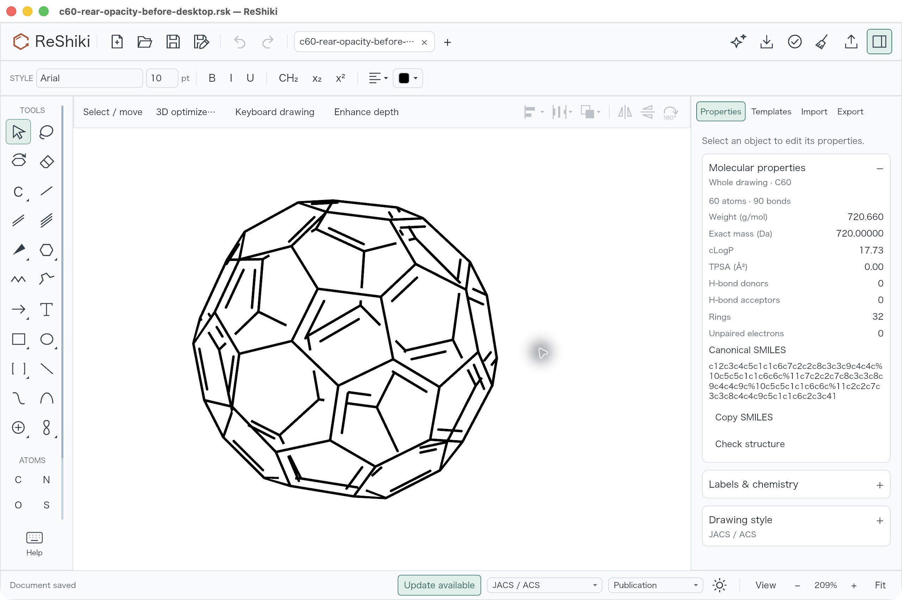
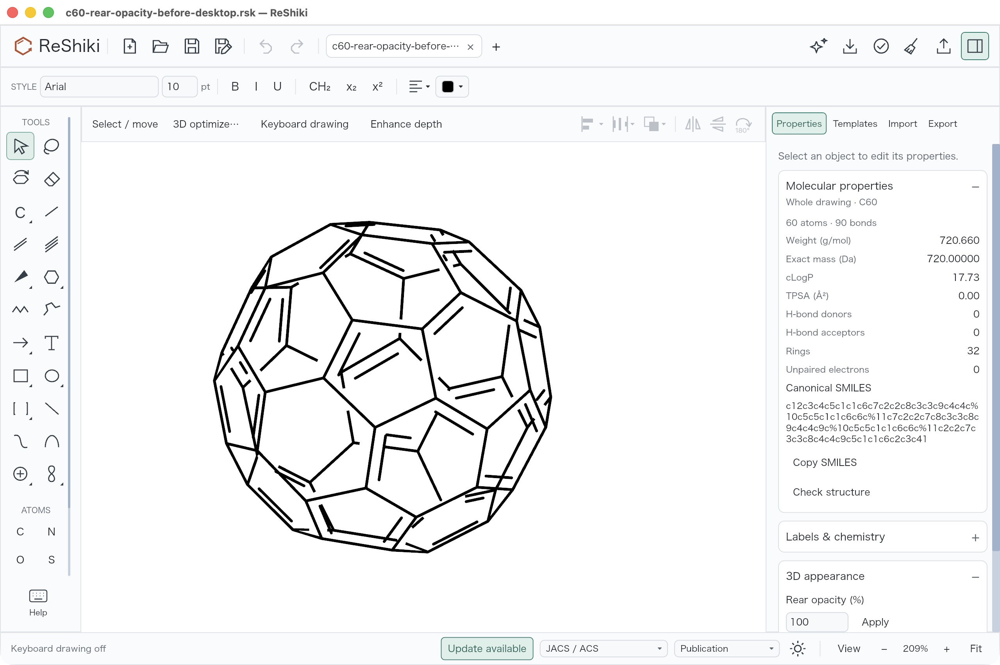
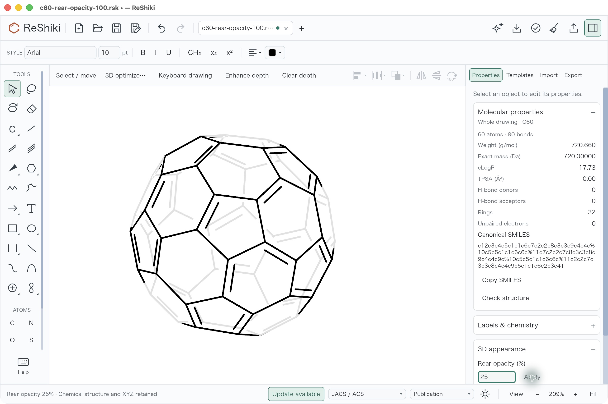
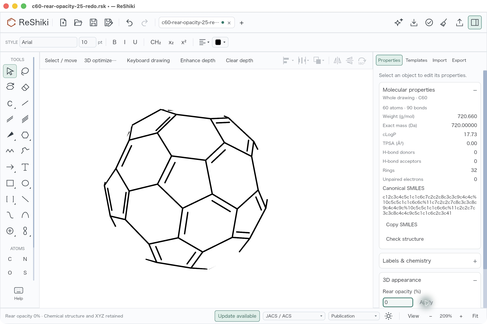
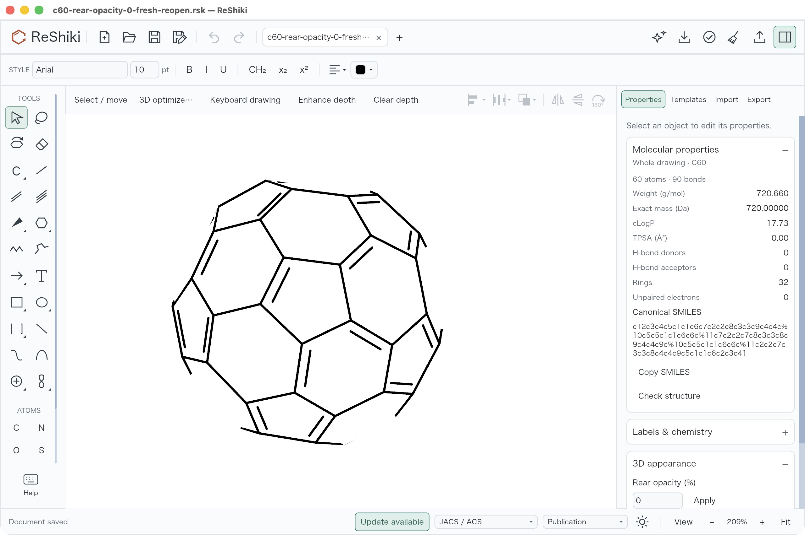
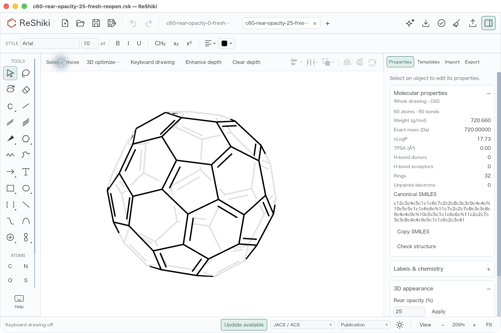

# Rear-side opacity review

Projected molecules previously had RGB depth fading, but no control for true
rear transparency. The new Properties control retains the original opaque
appearance at 100%, makes rear ink lighter at 25%, and removes it at 0% while
preserving front ink, molecular data and XYZ coordinates. This work is under
review, stacked on `fix/projected-double-bonds` ([PR #271](https://github.com/Ameyanagi/ReShiki/pull/271)).

| Parent before: no rear-opacity control                                                                            | Candidate default: 100%                                                                                       |
| ----------------------------------------------------------------------------------------------------------------- | ------------------------------------------------------------------------------------------------------------- |
|  |  |

| 25%: faint rear ink                                                                                    | 0%: transparent rear ink                                                                                          |
| ------------------------------------------------------------------------------------------------------ | ----------------------------------------------------------------------------------------------------------------- |
|  |  |

All four views use the same typed [native input](../tests/fixtures/rear-opacity/c60-rear-opacity-before-desktop.rsk),
209% Fit, light canvas, JACS/ACS, Arial 10 pt, keyboard drawing off, no selection,
and expanded whole-drawing molecular properties on macOS arm64. Each shows C60,
60 atoms, 90 bonds and the same formula, mass and canonical SMILES. The molecule's
position and scale match. The new section changes the Properties panel's visible
contents and scroll position. Pointers, status text and tab titles differ;
the 25% and 0% captures precede Save As and retain the preceding filename and
unsaved indicator. None of the six published captures was cropped, redrawn or
recompressed: they are original 2560 × 1704 native JPEGs copied byte for byte.

The baseline is the Projection app, signed SHA-256
`82a0047bd037f77f063233a284f9f7c7de79f36b1c1e98f6eb673ed514d389c0`,
built from `427d5f4e2bc05456213c0c98b6daa01351666bf2`. Its production source
is identical to this feature's declared base `5dbe5d74`;
the intervening differences are documentation and images. The actual baseline
Save As file is native version 19. Its minimal earlier source fixture underwent
normal default serialization and f64-to-f32 coordinate rounding on first save;
all comparisons here use the actual typed saved baseline, avoiding that mismatch.

The candidate was compiled from `7ec621227bc6fd777d5918efb9b8b6443c207d8e`.
Its signed executable SHA-256 is
`4d35fe616bc9cb1388e4a6ec45312c65cc21aa6b67e42e17b077dd848fcc4043`.
All 1,069 owned Rust/Cargo/build inputs were hash-checked before and after
refreshing their mtimes; all 15 own compiler artifacts were `fresh:false`.
The main dependency file contains only this worktree. Strict ad-hoc codesign
verification passed. Documentation/evidence commits above that source do not
relabel the compiled receipt. The initial CUA session selected the exact app
path; the fresh-reopen session additionally verified kernel PID 46179 against
that signed executable after all prior ReShiki processes had quit.

## Reproduce the desktop checks

Open the typed input, set the capture conditions above and use
**Properties → 3D appearance → Rear opacity (%) → Apply**. Save each result
to a separate file. ROOT performed 100% → 25%, one Undo to 100%, and one Redo
to 25%; then 25% → 0%, one Undo to 25%, and one Redo to 0%. Complete native
documents, including every atom, bond and XYZ value, compare exactly apart from
the version and added depth-appearance scope. The 100% candidate differs from
the typed parent only by version 19 → 22. Native Undo/Redo saves reproduce the
appropriate 100%, 25% and 0% saves byte for byte.

| Fresh process: reopen 0%                                                                                                              | Fresh process: reopen 25%                                                                                                          |
| ------------------------------------------------------------------------------------------------------------------------------------- | ---------------------------------------------------------------------------------------------------------------------------------- |
|  |  |

ROOT quit and reopened the saved 0% drawing in a fresh verified process, then
opened 25% in a second tab. Both views keep 209% Fit and the same style and
properties. The titles identify the fresh saved copies; the 25% view has two
tabs, so these persistence views are separate from the initial matched pair.
Undo and Redo were disabled after each open. Applying 25% again kept both
disabled and preserved the whole native file byte for byte. The retained
native saves prove document equality; ROOT's desktop observations establish
the one-step actions and disabled history. Two earlier fresh captures with
incidental recovery/keyboard UI state are private and excluded from this package.

## Validation and boundaries

Focused model rear tests (15), projected-bond tests (8), export rear tests (5),
depth appearance (9), highlights (6), figure exports (5), app rear tests (3),
and a separately executed ignored native wgpu pixel test passed. Agent
headless (4), MCP transcripts (18), native stdio (14) and tool replay (4)
passed. Workspace all-target/all-feature check, strict Clippy, formatting and
whitespace checks passed. This is a focused record, not a full test-suite claim.

macOS CI for [PR #289](https://github.com/Ameyanagi/ReShiki/pull/289) at
`6075b7be` subsequently failed in `modern_cases_share_one_process`: the stale
malformed-input fixture expected native version 20 to be rejected, although
the current schema is 22 and correctly accepts 20. The
[test-only correction](https://github.com/Ameyanagi/ReShiki/commit/1b1bc6a730403f543ee0dc4fc16d9b4f2ad9460f)
changes that case's name, input and exact error message to version 23, the first
unsupported version, while retaining the same failure expectation. The unchanged
signed app above accepts the original empty version 20 input through
`--cli convert - --from reshiki --to svg` and rejects version 23 with the exact
expected newer-document error. JSON comparison confirms only those three fixture
strings changed; all 1,069 compiled inputs and nine bundle files are unchanged.
The initial `analyze` check reached the empty-molecule analysis error for version
20, so that failed check is supplemental rather than evidence of command success.
The Cargo malformed-input test replay and subsequent CI remain pending.

The first native pixel oracle assumed an encoded 128 for 50% opacity. The
existing wgpu renderer blends in linear light and encodes sRGB: measured rear
ink/filled marks at 50% are 67 darkness on white and 188 intensity on dark,
matching an independently drawn backend alpha reference; front ink remains
fully opaque. Transparent PNG alpha and PDF opacity are checked independently.
Original failed helper-discovery, unavailable tiny-skia, pixel-oracle and test
initializer lint runs remain retained. Validation corrections changed only
test helpers/fixtures; production opacity remains the independently reviewed
`ec1efdd9` implementation. The stereochemical exchange identity test was repeated
using the final signed own-source app as the explicit InChI helper; prior shared
helper runs are supplemental and excluded from that provenance claim.

Automatic rear opacity follows complete covalent molecules, including orders
6 and 7, without crossing coordination or hydrogen contacts. Existing RGB
normalization and frozen ownership are preserved. Regression checks cover
RGB-first and opacity-first toggles, independent coordinated molecules, flat
2D parity, native history/copy, filled marks, highlight layering and hidden
rear crossings. Picking retains the complete chemical graph at 0%.

Automatic figure bounds may tighten when rear ink disappears; this does not
change XYZ or the fixed desktop camera.

The [independent signed-CLI audit](../tests/fixtures/rear-opacity/validation/independent-desktop-verification.json)
passed 17 bounded commands. Analysis is identical at 100%, 25% and 0%, including
SMILES, InChI and InChIKey. Typed-parent SVG/PNG/PDF exports are byte-identical
to 100%. At 25%, every faded SVG primitive has one effective opacity wrapper;
the opaque front primitives match 0% exactly, and PDF retains `/ca 0.25`.
Four representative bond-interior samples from opaque-white-paper CLI PNGs
show rear RGB191 at 25% and white at 0%, with black front ink unchanged. These
are composited colors, distinct from native wgpu measurements and transparent
PNG alpha. The samples were selected after inspecting the output and are not
an exhaustive pixel test. The 0% CLI PNG bounds tighten from 1320 × 1298 to
1313 × 1290 because hidden paint no longer contributes to the bounds.

Desktop evidence is light-canvas C60 only; dark behavior is covered by native
offscreen pixel and export tests. Native version 22 preserves the setting.
SVG/PNG/PDF preserve appearance; chemical exports disclose appearance loss,
editable CDXML/CDX rejects unsupported rear opacity, and explicit external
clipboard conversion reports omitted opacity. Partial-opacity EMF is refused.
Windows print/EMF runtime execution and a passing repository CI rerun remain pending. This
record does not establish every molecule, external application or platform.

[Evidence manifest](../tests/fixtures/rear-opacity/evidence-manifest.json) ·
[Fixture guide and portable checks](../tests/fixtures/rear-opacity/README.md)

Release caption: **Make the back of a projected molecule lighter or transparent
with Rear opacity, while keeping its front and molecular data unchanged.**

Original ReShiki screenshots, fixture data, code and documentation are offered
under MIT OR Apache-2.0. No new third-party material or vendor artwork is added.
