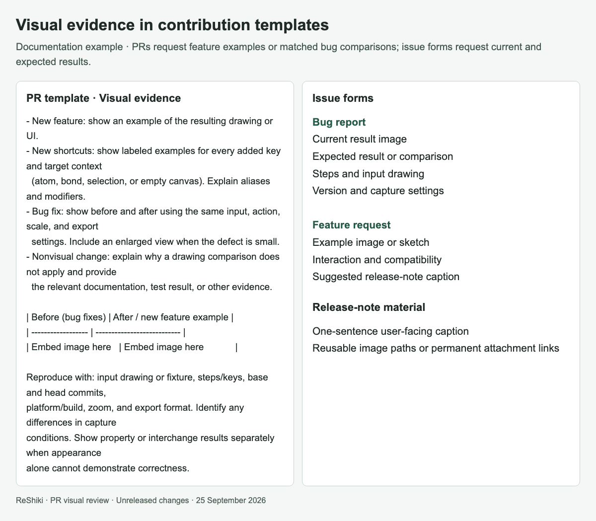

# Visual evidence for changes

Embed images in the PR description so reviewers can assess the result of a
change. Link the input drawing or regression fixture and explain how to
reproduce it. The [PR template](../.github/pull_request_template.md) includes
space for this evidence and a release-note caption.

| Change                      | Evidence to include                                                                                                                                                                                                                                                                 |
| --------------------------- | ----------------------------------------------------------------------------------------------------------------------------------------------------------------------------------------------------------------------------------------------------------------------------------- |
| New drawing or UI feature   | A real example of the resulting drawing or interaction.                                                                                                                                                                                                                             |
| New shortcuts               | Labeled output examples for every added key and target context: atom, bond, selection, or empty canvas. Explain case, modifiers, aliases, and repeated-key behavior. For commands without drawing output, show the affected UI or a command reference alongside the relevant check. |
| Visible bug fix             | Matched before/after images for each visible defect. Use the same input and operation, scale, framing, style, and export settings. Add a close-up when needed.                                                                                                                      |
| Property or interchange fix | Before/after property values or round-trip results as well as the drawing when applicable. A correct-looking figure does not establish correct molecular data.                                                                                                                      |
| Nonvisual change            | Explain why a drawing comparison does not apply. Include the relevant documentation excerpt, test result, or other evidence.                                                                                                                                                        |

## Capture and describe

Use actual application screenshots or output from the application renderer.
Label sketches and expected-result references explicitly. Do not redraw or
retouch a bug away in a screenshot. Keep any annotations outside the drawing
or make them visibly distinct.

Record the input/fixture, exact actions or keys, base and head commits,
platform/build, zoom, and export format. For a stacked PR, compare against its
declared base. If a defect was introduced and fixed within the same PR, label
the earlier implementation commit instead of calling it the base. Disclose
different capture conditions or an unavailable earlier build.

Check the real desktop interaction when a change concerns input, menus,
selection, or file opening. A gallery rendered through a library function
demonstrates output, but does not replace an interaction check. Inspect every
published image at its displayed size for legibility, clipping, and accidental
inclusion of unrelated documents or private information.

## Reuse in release notes

Give each change a short, user-facing caption and useful image alt text. Store
compact images under `docs/images/` or use permanent GitHub attachment links.
Embed them directly in the PR; use immutable commit URLs for images stored on
another branch. Avoid local `/tmp` paths and temporary review-site URLs in
published descriptions.

Keep large scratch galleries, duplicate exports, videos, and build artifacts
outside Git. Reuse each published image in the release changelog rather than
committing another copy. The release entry should link the PR, state the user
benefit, and retain any limit that matters to interpreting the image.

The [current stacked changes](changes/stack-22-30.md) provide examples and
reusable captions. They remain unreleased until the corresponding PRs merge
and a release is published.

## Template example

