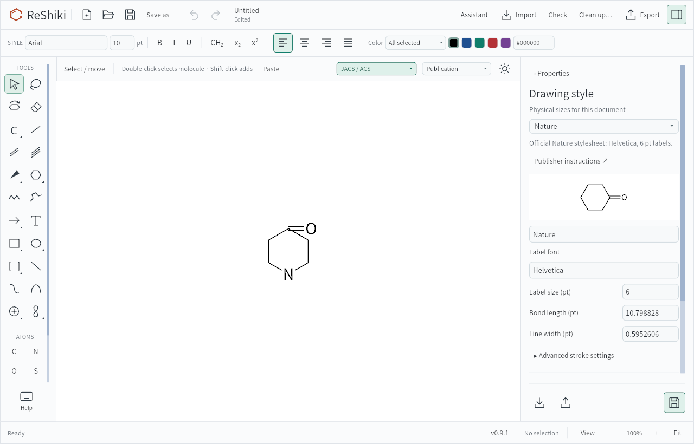
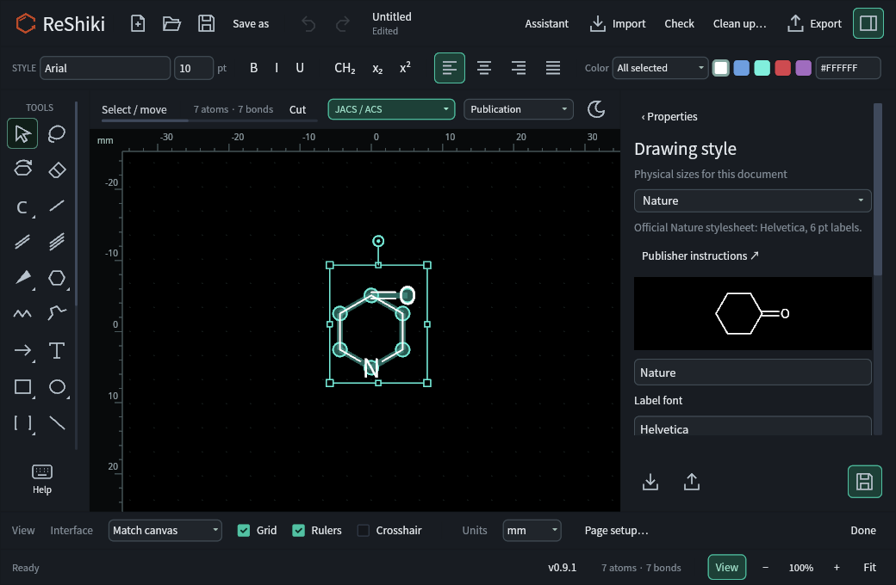

# Windows renderer validation — 2026-09-28

Windows GPU support is restored with a software fallback. This VM should keep
using Tiny Skia: forcing WGPU selects Microsoft's CPU renderer and substantially
increases CPU use during interaction. These measurements do not establish the
performance of a physical Windows GPU.

## Environment and build

- Windows 11 Pro x64, build 26200, QEMU Q35 VM at `192.168.1.51`.
- Eight logical processors, approximately 16 GiB RAM, interactive RDP session.
- Windows reports a Red Hat QXL controller and Microsoft Remote Display Adapter.
- WGPU reports only `Microsoft Basic Render Driver`, `DeviceType::Cpu`, DX12.
  The same result was checked from SSH and the interactive desktop.
- Release build from base commit `0ae0fb6a21c5e5c5b90ae66730458fda4ea2a20d`
  plus the Windows renderer changes in this working tree.
- Test executable:
  `F:\reshiki-gpu-20260928\artifacts\gpu\reshiki.exe`.
- Executable SHA-256:
  `2f1561d18ad9367157a6f798c64bed67a4ef69c16229a83ad926411230c47e2f`.

Microsoft documents WARP as a [software rasterizer exposed through Direct3D](https://learn.microsoft.com/en-us/windows/win32/direct3darticles/directx-warp).
Its presence in adapter enumeration does not establish hardware acceleration.

## Desktop measurements

The checked-in [benchmark script](../scripts/benchmark_windows_renderer.ps1)
opens a fresh copy of the bundled shortcut drawing: 483 atoms, 429 bonds,
132 annotations and one arrow. Only the current viewport is visible. Each trial
uses a 1280 × 820 window at 96 DPI, a separate application data directory and
disabled automatic update checks. Compilation had finished before measurement.

After eight seconds of warmup, the script measures eight seconds idle, followed
by 300 pointer moves with a requested 33 ms pause and 25 alternating Ctrl+wheel
events. It checks the actual editor window's process ID, title and focus.
CPU percentages are process CPU time divided by elapsed time and eight logical
processors; 12.5% corresponds to one fully occupied logical processor.

| Trial | Preference  | Idle CPU | Interaction CPU | Interaction wall time | Process CPU time | Working set |
| ----- | ----------- | -------: | --------------: | --------------------: | ---------------: | ----------: |
| 1     | Tiny Skia   |       0% |          12.47% |               14.23 s |          14.20 s |    43.2 MiB |
| 2     | WGPU / WARP |       0% |          48.06% |               19.41 s |          74.63 s |   119.0 MiB |
| 3     | Automatic   |       0% |          12.43% |               14.22 s |          14.14 s |    43.4 MiB |
| 4     | WGPU / WARP |       0% |          47.90% |               19.59 s |          75.08 s |   119.6 MiB |
| 5     | Tiny Skia   |       0% |          12.48% |               14.16 s |          14.14 s |    40.8 MiB |

Zero idle CPU means no measured process CPU-time increase in this short sample.
These are whole-application input-workload measurements, not frame-rate,
input-latency or identical-frame comparisons. The input loop ran longer under
WARP load, and the final zoom differed between renderers. Desktop captures
confirmed that both renderers displayed the editor, but do not establish pixel
parity or equivalent numbers of presented frames.

The first exploratory run incorrectly selected a temporary WGPU initialization
window. Its WGPU measurements were discarded. The table uses only the corrected
run, whose raw JSON, logs and captures are retained locally under
`artifacts/windows-gpu-20260928/verified/` and on the VM under
`F:\reshiki-gpu-20260928\artifacts\gpu\verified\`.

## Selection and fallback checks

- Both renderers compile into the Windows release. Automatic selection chooses
  Tiny Skia when adapter enumeration finds no adapters or only CPU adapters.
  A non-CPU adapter allows Iced to try WGPU with its initialization fallback.
- `ICED_BACKEND` remains an explicit override; `WGPU_BACKEND` constrains adapter
  discovery. `--graphics-info` reports discovery and the startup preference.
- The automatic desktop trial matched the software renderer's behavior and CPU
  cost. Explicit WGPU launches exercised the WARP path.
- With `ICED_BACKEND=wgpu,tiny-skia` and `WGPU_BACKEND=vulkan`, diagnostics found
  no adapters, but the interactive editor still opened successfully. This
  exercises Iced's actual initialization fallback with an unavailable backend.
- The Windows release build, two renderer-selection unit tests and both
  partial-redraw regression tests passed. The latter cover dropdowns and the
  shortcuts dialog at 100%, 125% and 200% scaling.
- Windows and macOS workspace/all-target Clippy checks passed with warnings
  denied. The macOS compile check, formatting and whitespace checks also passed.

Physical Windows GPU performance, Windows ARM desktop rendering and other
display configurations remain unmeasured. GPU acceleration applies to the
interface and canvas; chemistry and export remain CPU work.

## Physical GPU rendering on the Linux host

The same source was built in an isolated checkout on the VM's Arch Linux host,
`amearch`, with Rust 1.95.0. Vulkan reports an AMD Radeon 780M integrated GPU
(RADV PHOENIX), Mesa 26.1.3, Vulkan 1.4.348. It is the host's only GPU and remains
bound to `amdgpu`; the Windows VM has no PCI GPU passthrough.

The existing `drawing_style_headless_snapshot` test passed with the Radeon Vulkan
driver explicitly selected:

```sh
VK_DRIVER_FILES=/usr/share/vulkan/icd.d/radeon_icd.json \
WGPU_BACKEND=vulkan ICED_BACKEND=wgpu \
cargo +1.95.0 test --locked --bin reshiki drawing_style_headless_snapshot -- --ignored --nocapture
```

This renders 11 application snapshots covering light/dark canvases and interfaces,
compact/desktop layouts, presentation/pastel palettes and selection overlays. It
also checks that the drawing-style save button produces its expected message in
every layout. A second run under `strace -f -e trace=openat` confirmed successful
access to `/dev/dri/renderD128`. The system has only the Radeon Vulkan ICD; the
test used WGPU on that physical GPU. No desktop login or VM configuration change
was needed.

Representative captures were inspected for visible UI, text, molecular bonds and
selection controls:

| Light desktop                                                                                                                                   | Dark compact with selection                                                                                                                    |
| ----------------------------------------------------------------------------------------------------------------------------------------------- | ---------------------------------------------------------------------------------------------------------------------------------------------- |
|  |  |

These are offscreen rendering checks in a debug test build, not measurements of
window presentation, input latency or frame rate. They establish Linux hardware
rendering and do not establish a Windows performance improvement. Captures, the
test log and device trace are retained locally in `artifacts/wgpu-linux-20260928/`.
